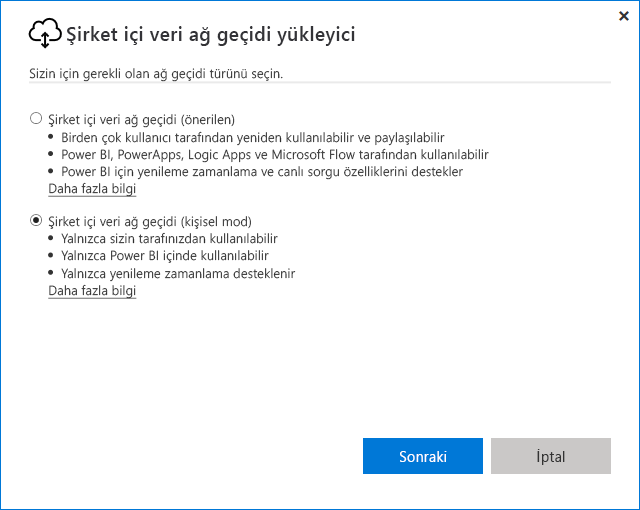
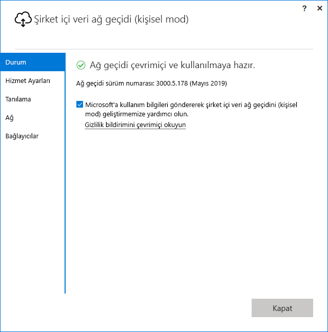

# <a name="use-personal-gateways-in-power-bi"></a>Power BI 'de kişisel ağ geçitleri kullanma

[!INCLUDE [gateway-rewrite](../includes/gateway-rewrite.md)]

Şirket içi veri ağ geçidi (kişisel mod) şirket içi veri ağ geçidinin sadece Power BI ile çalışan bir sürümüdür. Kendi bilgisayarınıza ağ geçidi yüklemek ve şirket içi verilerine erişim kazanmak için kişisel ağ geçidi kullanabilirsiniz.

> [!NOTE]
> Her Power BI kullanıcısı için kişisel modda çalışan tek bir ağ geçidiniz olabilir. Başka bir bilgisayarda bile olsa aynı kullanıcı için ikinci bir kişisel mod ağ geçidi yüklediğinizde en son yapılan yükleme önceki yüklemelerin yerini alır.

## <a name="on-premises-data-gateway-vs-on-premises-data-gateway-personal-mode"></a>Şirket içi veri ağ geçidi ve şirket içi veri ağ geçidi (kişisel mod) karşılaştırması

Aşağıdaki tablo, şirket içi veri ağ geçidi ve şirket içi veri ağ geçidi (kişisel mod) arasındaki farkları açıklanmaktadır.

|   |Şirket içi veri ağ geçidi | Şirket içi veri ağ geçidi (kişisel mod) |
| ---- | ---- | ---- |
|**Desteklenen bulut hizmetleri** |Power BI, PowerApps, Azure Logic Apps, Power Automate, Azure Analysis Services, veri akışları |Power BI |
|**Çalıştırmalar** |Ağ geçidine erişimi olan kullanıcılar tarafından yapılandırıldığı gibi |Windows kimlik doğrulaması için ve diğer kimlik doğrulaması türleri için sizin tarafınızdan yapılandırıldığı gibi |
|**Sadece bilgisayar yöneticisi olarak yüklenebilir** |Evet |Hayır |
|**Merkezi ağ geçidi ve veri kaynağı yönetimi** |Evet |Hayır |
|**Verileri içeri aktar ve yenilemeyi zamanla** |Evet |Evet |
|**DirectQuery desteği** |Evet |Hayır |
|**Analysis Services için LiveConnect desteği** |Evet |Hayır |

## <a name="install-the-on-premises-data-gateway-personal-mode"></a>Şirket içi veri ağ geçidini (kişisel mod) yükleme

Şirket içi veri ağ geçidini (kişisel mod) yüklemek için:

1. [Şirket içi veri ağ geçidini indirin](https://go.microsoft.com/fwlink/?LinkId=820925&clcid=0x409).

2. Yükleyicide, şirket içi veri ağ geçidini (kişisel mod) belirleyip **İleri** 'yi seçin.

   

Ağ geçidi dosyaları _"%localappdata%\Microsoft\On-premises data gateway (personal mode)_ klasörüne yüklenir. Yükleme başarıyla tamamlandıktan ve oturumunuz açıldıktan sonra aşağıdaki ekranı görürsünüz.



## <a name="use-fast-combine-with-the-personal-gateway"></a>Kişisel ağ geçidi ile Hızlı Birleştirmeyi kullanma

Bir kişisel ağ geçidinde Hızlı Birleştirme yapma, sorguları yürütürken belirtilen gizlilik düzeylerini yoksaymanıza olanak tanır. Hızlı Birleştirmenin şirket içi veri ağ geçidiyle (kişisel mod) çalışmasını etkinleştirmek için:

1. Dosya Gezgini'ni kullanarak aşağıdaki dosyayı açın:

   `%localappdata%\Microsoft\On-premises data gateway (personal mode)\Microsoft.PowerBI.DataMovement.Pipeline.GatewayCore.dll.config`

2. Dosyanın alt kısmına aşağıdaki metni ekleyin:

    ```xml
    <setting name="EnableFastCombine" serializeAs="String">
       <value>true</value>
    </setting>
    ```

3. Bu işlem bittikten sonra ayar yaklaşık bir dakika içinde etkinleşir. Düzgün çalışıp çalışmadığını kontrol etmek için Hızlı Birleştirme özelliğinin çalıştığını onaylamak üzere Power BI hizmetinde isteğe bağlı yenileme işlemi yapın.

## <a name="frequently-asked-questions-faq"></a>Sık sorulan sorular (SSS)

**Soru:** Şirket içi veri ağ geçidini (kişisel mod), şirket içi veri ağ geçidi (önceki adıyla ağ geçidinin Kurumsal sürümü) ile yan yana çalıştırabilir miyim?
  
**Cevap:** Evet, iki ağ geçidi de aynı anda çalıştırılabilir.

**Soru:** Şirket içi veri ağ geçidini (kişisel mod) bir hizmet olarak çalıştırabilir miyim?
  
**Cevap:** Hayır. Şirket içi veri ağ geçidi (kişisel mod) yalnızca bir uygulama olarak çalıştırılabilir. Ağ geçidini bir hizmet olarak veya yönetici modda çalıştırmanız gerekirse [şirket içi veri ağ geçidini](/data-integration/gateway/service-gateway-onprem) (önceki adıyla ağ geçidinin Kurumsal sürümü) çalıştırmayı düşünmelisiniz.

**Soru:** Şirket içi veri ağ geçidi (kişisel mod) ne sıklıkta güncelleştirilir?
  
**Cevap:** Kişisel ağ geçidini her ay güncelleştirmeyi planlıyoruz.

**Soru:** Neden kimlik bilgilerimi güncelleştirmem isteniyor?
  
**Cevap:** Birçok durumda kimlik bilgileriniz istenebilir. En yaygın olarak, şirket içi veri ağ geçidini (kişisel mod) Power BI - kişisel ağ geçidinizden farklı bir makinede yeniden yüklediğinizde karşılaşırsınız. Veya veri kaynağında bir sorun olabilir, Power BI bir test bağlantısını gerçekleştirememiş olabilir ya da zaman aşımı veya bir sistem hatası meydana gelmiş olabilir. Power BI hizmetinde kimlik bilgilerinizi güncelleştirmek için dişli simgesini ve **Ayarlar** > **Veri Kümeleri** 'ni seçin. Söz konusu veri kümesini bulun ve **Veri kaynağı kimlik bilgileri** 'ni seçin.

**Soru:** Yükseltme sırasında önceki kişisel ağ geçidim ne kadar süreyle çevrimdışı olacak?
  
**Cevap:** Kişisel ağ geçidinizi yeni sürüme yükseltmek yalnızca birkaç dakika sürer.

**Soru:** R ve Python betiklerini kullanıyorum. Bunlar destekleniyor mu?
  
**Cevap:** R ve Python betikleri kişisel mod için desteklenir.

## <a name="next-steps"></a>Sonraki adımlar

* [Ağ geçidi veri kaynağı ekleme veya kaldırma](service-gateway-data-sources.md)
* [Şirket içi veri ağ geçidi için proxy ayarlarını yapılandırma](/data-integration/gateway/service-gateway-proxy)  

Başka bir sorunuz mu var? [Power BI Topluluğu](https://community.powerbi.com/)'nu deneyin.
