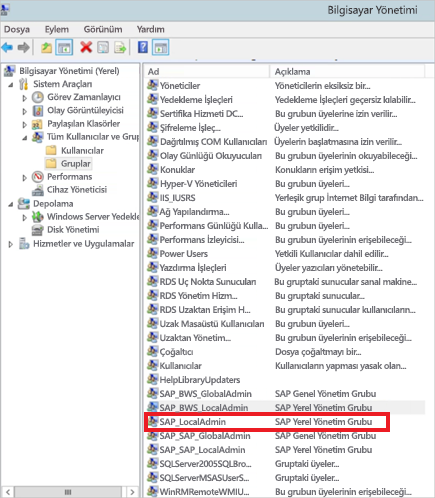
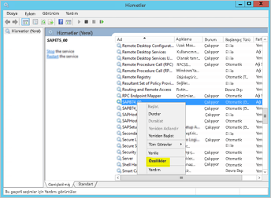
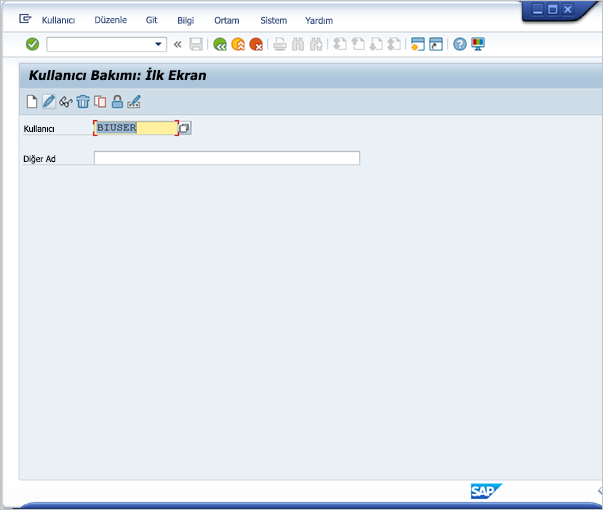
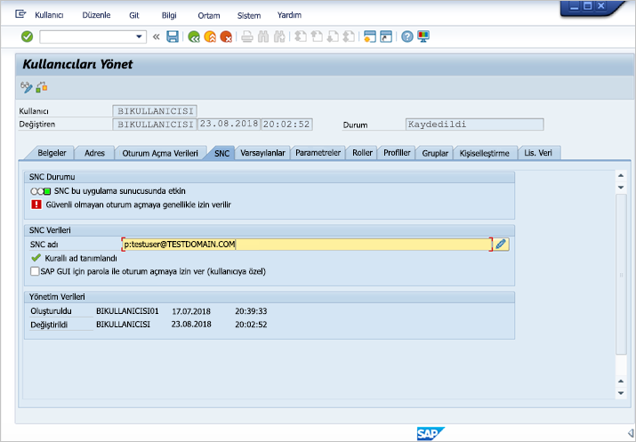
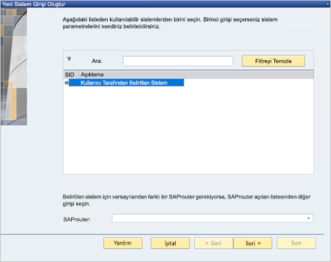
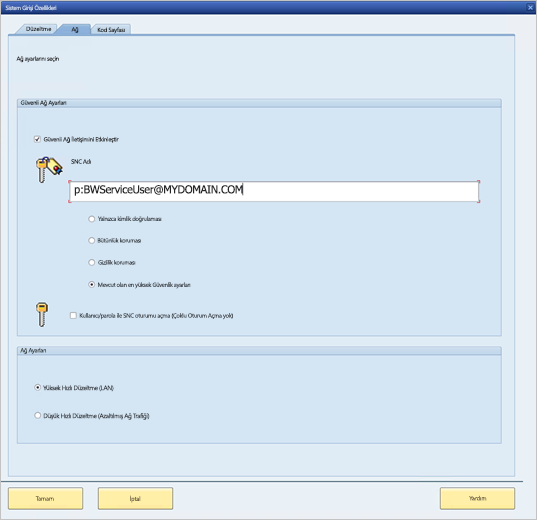
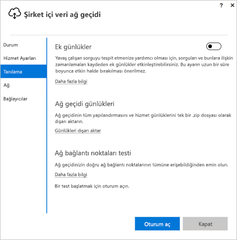

# <a name="use-kerberos-for-single-sign-on-sso-to-sap-bw-using-gx64krb5"></a>gx64krb5 kullanarak SAP BW’da çoklu oturum açma (SSO) için Kerberos'u kullanma

Bu makalede, gx64krb5 kullanılarak Power BI hizmetinden SSO'yu etkinleştirmek için SAP BW veri kaynağınızın nasıl yapılandırılacağı açıklanmaktadır.

> [!IMPORTANT]
> SAP artık gx64krb5 desteği sunmadığından Microsoft da desteğini sonlandırmıştır. Var olan ve yeni bağlantılar 2020'nin sonuna kadar çalışmaya devam edecektir ancak Ocak 2021 itibarıyla devre dışı kalacaktır. Bunun yerine CommonCryptoLib kullanın. 

> [!NOTE]
> Power BI hizmetinde SAP BW Uygulama Sunucusu tabanlı raporlar için SSO tabanlı yenilemeyi etkinleştirmek üzere [Kerberos SSO yapılandırma](service-gateway-sso-kerberos.md) adımlarına ek olarak bu makaledeki adımları tamamlayabilirsiniz. Ancak Microsoft, SNC kitaplığı olarak gx64krb5 değil CommonCryptoLib kullanılmasını önerir. SAP artık gx64krb5 desteği sunmamaktadır ve ağ geçidi için yapılandırmak üzere gereken adımlar CommonCryptoLib ile karşılaştırıldığında çok daha karmaşıktır. CommonCryptoLib kullanarak SSO’yu yapılandırma hakkında bilgi için bkz. [CommonCryptoLib kullanarak SSO için SAP BW’yu yapılandırma](service-gateway-sso-kerberos-sap-bw-commoncryptolib.md). SNC kitaplığı olarak CommonCryptoLib *veya* gx64krb5 kullanın; ikisini birden kullanmayın. Her iki kitaplık için yapılandırma adımlarını tamamlamayın.

Bu kılavuz kapsamlıdır; açıklanan adımlardan bazılarını zaten tamamladıysanız bu adımları atlayabilirsiniz. Örneğin gx64krb5 kullanarak SSO için zaten SAP BW sunucunuzu ayarlamış olabilirsiniz.

## <a name="set-up-gx64krb5-on-the-gateway-machine-and-the-sap-bw-server"></a>Ağ geçidi makinesinde ve SAP BW sunucusunda gx64krb5 ayarlama

> [!NOTE]
> gx64krb5 kitaplığı SAP tarafından artık desteklenmemektedir. Daha fazla bilgi için bkz. [SAP Notu 352295](https://launchpad.support.sap.com/#/notes/352295). gx64krb5’in veri ağ geçidinden SAP BW İleti Sunucularına SSO bağlantıları yapılmasına izin vermediğini, yalnızca SAP BW Uygulama Sunucuları ile bağlantı kurulabileceğini unutmayın. SNC kitaplığı olarak [CommonCryptoLib](service-gateway-sso-kerberos-sap-bw-commoncryptolib.md) kullanıyorsanız bu kısıtlama yoktur. Diğer SNC kitaplıkları BW SSO için de çalışabilse de Microsoft tarafından resmi olarak desteklenmemektedir.

Ağ geçidi aracılığıyla bir SSO bağlantısını tamamlamak için gx64krb5 kitaplığının hem istemci hem de sunucu tarafından kullanılması gerekir. Diğer bir deyişle, hem istemci hem de sunucunun aynı SNC kitaplığını kullanması gerekir.

1. [SAP Note 2115486](https://launchpad.support.sap.com/) sayfasından gx64krb5.dll dosyasını indirin (SAP s-user gerekir). En az 1.0.11.x sürümüne sahip olduğunuzdan emin olun. Ayrıca, ağ geçidi aracılığıyla SSO bağlantısını denemeden önce SSO bağlantısını SAP GUI’sinde test etmek istiyorsanız (önerilir) gsskrb5.dll dosyasını (kitaplığın 32 bit sürümü) indirin. SAP GUI yalnızca 32 bit olduğu için SAP GUI ile test ederken 32 bit sürümü gerekir.

1. Ağ geçidi makinenizde gx64krb5.dll kitaplığını ağ geçidi hizmetinizin kullanıcısı tarafından erişilebilir bir konuma yerleştirin. SAP GUI ile SSO bağlantısını test etmek istiyorsanız makinenize gsskrb5.dll dosyasının bir kopyasını yerleştirin ve **SNC_LIB** ortam değişkenini ona işaret edecek şekilde ayarlayın. Hem ağ geçidi hizmeti kullanıcısı hem de hizmet kullanıcısının kimliğine bürüneceği Active Directory (AD) kullanıcıları gx64krb5.dll dosyasının kopyası için okuma ve yürütme izinlerine ihtiyaç duyar. Kimliği Doğrulanmış Kullanıcılar grubuna .dll dosyalarında izin vermenizi öneririz. Test amacıyla, bu izinleri hem ağ geçidi hizmeti kullanıcısına hem de test edeceğiniz Active Directory kullanıcısına açıkça verebilirsiniz.

1. BW sunucunuz gx64krb5.dll kullanılarak SSO için yapılandırılmadıysa, SAP BW sunucu makinenizde SAP BW sunucusu tarafından erişilebilen bir konuma başka bir .dll kopyası yerleştirin. 

    SAP BW sunucusuyla kullanmak üzere gx64krb5.dll dosyasını yapılandırma hakkında daha fazla bilgi için [SAP belgelerine](https://launchpad.support.sap.com/#/notes/2115486) bakın (SAP s-user gereklidir).

1. İstemci ve sunucu makinelerinde **SNC_LIB** ve **SNC_LIB_64** ortam değişkenlerini ayarlayın: 
    - gsskrb5.dll kullanıyorsanız **SNC_LIB** değişkenini mutlak yoluna ayarlayın. 
    - gx64krb5.dll kullanıyorsanız **SNC_LIB_64** değişkenini mutlak yoluna ayarlayın.

## <a name="configure-an-sap-bw-service-user-and-enable-snc-communication-on-the-bw-server"></a>SAP BW hizmeti kullanıcısı yapılandırma ve BW sunucusunda SNC iletişimini etkinleştirme

gx64krb5 kullanarak SAP BW sunucunuzu SNC iletişimi (örneğin SSO) için henüz yapılandırmadıysanız bu bölümü tamamlayın.

> [!NOTE]
> Bu bölümde, BW için bir hizmet kullanıcısı oluşturduğunuz ve bu kullanıcıya uygun bir SPN bağladığınız (*SAP/* ile başlayan bir ad) varsayılır.

1. Hizmet kullanıcısına, SAP BW Application Server’ınıza yönelik erişim verin:

    1. SAP BW sunucu makinesinde, hizmet kullanıcısını Local Admin grubuna ekleyin. **Bilgisayar Yönetimi** programını açın ve sunucunuzun Local Admin grubunu belirleyin. 

        

    1. Local Admin grubuna çift tıklayın ve **Ekle**'yi seçerek hizmet kullanıcınızı gruba ekleyin. 

    1. Adı doğru girdiğinizden emin olmak için **Adları Denetle**’yi ve sonra **Tamam**’ı seçin.

1. SAP BW sunucusunun hizmet kullanıcısını, SAP BW sunucusu makinesinde SAP BW sunucusu hizmetini başlatan kullanıcı olarak ayarlayın:

    1. **Çalıştır**’ı açın ve **Services.msc** yazın. 

    1. SAP BW Uygulama Sunucusu örneğine karşılık gelen hizmeti bulup sağ tıklayın ve **Özellikler**’i seçin.

        

    1. **Oturum açma** sekmesine geçin ve kullanıcıyı, SAP BW hizmet kullanıcınız olarak değiştirin. 

    1. Kullanıcı parolasını girin ve **Tamam**'ı seçin.

1. SAP Logon uygulamasında, sunucunuzda oturum açın ve RZ10 işlemini kullanarak aşağıdaki profil parametrelerini ayarlayın:

    1. **snc/identity/as** profil parametresini, oluşturduğunuz *p:&lt;SAP BW hizmet kullanıcısına ayarlayın&gt;* . Örneğin, *p:BWServiceUser\@MYDOMAIN.COM*. *p:* ifadesini hizmet kullanıcısı UPN’sinden önce geldiğine, buna karşılık *p:CN=* ifadesinin SNC kitaplığı olarak CommonCryptoLib kullandığınızda UPN’den önce geldiğine dikkat edin.

    1. **snc/gssapi\_lib** profil parametresini *&lt;BW sunucusundaki gx64krb5.dll yoluna&gt;* ayarlayın. Kitaplığı SAP BW Application Server’ın erişebileceği bir konuma yerleştirin.

    1. Aşağıdaki ek profil parametrelerini de ayarlayın ve değerleri ihtiyaçlarınıza uyacak şekilde değiştirin. Son beş seçenek, istemcilerin SNC yapılandırılmadan SAP Logon aracılığıyla SAP BW sunucusuna bağlanmasını sağlar.

        | **Ayar** | **Değer** |
        | --- | --- |
        | snc/data\_protection/max | 3 |
        | snc/data\_protection/min | 1 |
        | snc/data\_protection/use | 9 |
        | snc/accept\_insecure\_cpic | 1 |
        | snc/accept\_insecure\_gui | 1 |
        | snc/accept\_insecure\_r3int\_rfc | 1 |
        | snc/accept\_insecure\_rfc | 1 |
        | snc/permit\_insecure\_start | 1 |

    1. **snc/enable** özelliğini 1 olarak ayarlayın.

1. Bu profil parametrelerini ayarladıktan sonra sunucu makinesinde SAP Management Console uygulamasını açın ve SAP BW örneğini yeniden başlatın. 

   Sunucu başlatılmazsa profil parametrelerini doğru ayarladığınızı doğrulayın. Profil parametresi ayarları hakkında daha fazla bilgi için [SAP belgelerine](https://help.sap.com/saphelp_nw70ehp1/helpdata/en/e6/56f466e99a11d1a5b00000e835363f/frameset.htm) bakın. Ayrıca, bu makaledeki [Sorun giderme](#troubleshooting) bölümüne başvurabilirsiniz.

## <a name="map-an-sap-bw-user-to-an-active-directory-user"></a>SAP BW kullanıcısını Active Directory kullanıcısına eşleme

Henüz yapmadıysanız, bir Active Directory kullanıcısını bir SAP BW Application Server kullanıcısına eşleyin ve SAP Logon ile SSO bağlantısını test edin.

1. SAP Logon ile SAP BW sunucunuzda oturum açın. SU01 işlemini çalıştırın.

1. **Kullanıcı** için, SSO bağlantısını etkinleştirmek istediğiniz SAP BW kullanıcısını girin. SAP Logon penceresinin sol üst köşesindeki **Düzenle** simgesini (kalem simgesi) seçin.

    

1. **SNC** sekmesini seçin. SNC name (SNC adı) giriş kutusuna *p:&lt;Active Directory kullanıcınız&gt;@&lt;etki alanınız&gt;* girin. SNC adı için, Active Directory kullanıcısının UPN değerinden önce *p:* ifadesi gelmelidir. UPN’nin büyük/küçük harfe duyarlı olduğuna dikkat edin.

   Belirttiğiniz Active Directory kullanıcısının SAP BW Application Server için SSO erişimini etkinleştirmek istediğiniz kişiye veya kuruluşa ait olması gerekir. Örneğin testuser\@TESTDOMAIN.COM adlı kullanıcı için SSO erişimini etkinleştirmek istiyorsanız *p:testuser\@TESTDOMAIN.COM* girin.

    

1. Ekranın sol üst köşesindeki **Kaydet** simgesini (disket görüntüsü) seçin.

## <a name="test-sign-in-via-sso"></a>SSO yoluyla oturum açmayı test etme

SSO erişimini etkinleştirmiş olduğunuz Active Directory kullanıcısı olarak SAP Logon kullanarak SSO aracılığıyla sunucuda oturum açabildiğinizi doğrulayın:

1. SSO erişimini etkinleştirmiş olduğunuz Active Directory kullanıcısı olarak etki alanınızda SAP Logon’un yüklü olduğu bir makinede oturum açın. SAP Logon’u başlatın ve yeni bir bağlantı oluşturun.

1. Daha önce indirdiğiniz gsskrb5.dll dosyasını oturum açtığınız makinedeki bir konuma indirin. **SNC_LIB** ortam değişkenini bu konumun mutlak yoluna ayarlayın.

1. SAP Logon’u başlatın ve yeni bir bağlantı oluşturun.

1. **Yeni Sistem Girdisi Oluştur** ekranından **Kullanıcı Tarafından Belirtilen Sistem**'i ve **İleri**'yi seçin.

    

1. Sonraki ekranda, uygulama sunucusu, örnek sayısı ve sistem kimliği gibi gerekli bilgileri girin. Ardından **Son**'u seçin.

1. Yeni bağlantıya sağ tıklayıp **Özellikler**’i ve sonra **Ağ** sekmesini seçin. 

1. **SNC Adı** kutusuna *p:&lt;SAP BW hizmet kullanıcısının UPN’ini girin&gt;* . Örneğin, *p:BWServiceUser\@MYDOMAIN.COM*. **Tamam**’ı seçin.

    

1. Yeni oluşturduğunuz bağlantıya çift tıklayarak SAP BW sunucunuzla bir SSO bağlantısı kurmayı deneyin. 

   Bu bağlantı başarılı olursa bir sonraki bölüme geçin. Aksi takdirde belgenin önceki adımlarını gözden geçirerek doğru şekilde tamamlandığından emin olun veya [Sorun Giderme](#troubleshooting) bölümünü inceleyin. Bu bağlamda SSO ile SAP BW sunucusuna bağlanamıyorsanız ağ geçidi bağlamında da SSO ile SAP BW sunucusuna bağlanamazsınız.

## <a name="add-registry-entries-to-the-gateway-machine"></a>Ağ geçidi makinesine kayıt defteri girişleri ekleme

Hem ağ geçidinin yüklendiği makinenin hem de Power BI Desktop’tan bağlanılması amaçlanan makinelerin kayıt defterine gerekli kayıt defteri girdilerini ekleyin. Bu kayıt defteri girdilerini eklemek için aşağıdaki komutları çalıştırın:

- ```REG ADD HKLM\SOFTWARE\Wow6432Node\SAP\gsskrb5 /v ForceIniCredOK /t REG_DWORD /d 1 /f```

- ```REG ADD HKLM\SOFTWARE\SAP\gsskrb5 /v ForceIniCredOK /t REG_DWORD /d 1 /f```

## <a name="add-a-new-sap-bw-application-server-data-source-to-the-power-bi-service-or-edit-an-existing-one"></a>Power BI hizmetine yeni bir SAP BW Application Server veri kaynağı ekleyin veya var olanı düzenleyin

1. Veri kaynağı yapılandırma penceresinde SAP BW Uygulama Sunucusu’nun **Ana bilgisayar adı**, **Sistem Numarası** ve **İstemci Kimliği** bilgilerini Power BI Desktop'tan SAP BW sunucusunda oturum açar gibi girin.

1. **SNC İş Ortağı Adı** alanına *p:&lt;SAP BW hizmet kullanıcınıza eşlediğiniz SPN'yi girin&gt;* . Örneğin, SPN SAP/BWServiceUser\@MYDOMAIN.COM ise **SNC İş Ortağı Adı** alanına *p:SAP/BWServiceUser\@MYDOMAIN.COM* yazın.

1. SNC Kitaplığı alanında **SNC\_LIB** veya **SNC\_LIB\_64** değerini seçin. Ağ geçidi makinesindeki **SNC\_LIB\_64**’ün gx64krb5.dll dosyasını işaret ettiğinden emin olun. Alternatif olarak, **Özel** seçeneğini belirleyebilir ve ağ geçidi makinesinde gx64krb5.dll dosyasının mutlak yolunu belirtebilirsiniz.

1. **DirectQuery sorguları için Kerberos üzerinden SSO kullanın**’ı ve **Uygula**'yı seçin. Bağlantı testi başarılı olmazsa önceki kurulum ve yapılandırma adımlarının doğru şekilde tamamlandığından emin olun.

1. [Power BI raporu çalıştırma](service-gateway-sso-kerberos.md#run-a-power-bi-report)

## <a name="troubleshooting"></a>Sorun giderme

### <a name="troubleshoot-gx64krb5-configuration"></a>gx64krb5 yapılandırma sorunlarını giderme

Aşağıdaki sorunlardan biriyle karşılaşırsanız gx64krb5 yüklemesinin ve SSO bağlantılarının sorunlarını gidermek için bu adımları izleyin.

* Gx64krb5 kurulum adımlarını tamamladığınızda hatalarla karşılaşıyorsunuz. Örneğin, SAP BW sunucusu profil parametrelerini değiştirdikten sonra başlatılmaz. Bu hataları gidermek için sunucu günlüklerini (sunucu makinesinde …work\dev\_w0) görüntüleyin. 

* Oturum açma hatası nedeniyle SAP BW hizmetini başlatamıyorsunuz. SAP BW *başlat* kullanıcısını ayarlarken yanlış parolayı belirtmiş olabilirsiniz. Active Directory ortamınızdaki bir makinede SAP BW hizmet kullanıcısı olarak oturum açarak parolayı doğrulayın.

* Temel alınan veri kaynağı kimlik bilgileri (örneğin, SQL Server) hakkında sunucunun başlatılmasını engelleyen hatalar alıyorsanız hizmet kullanıcısına SAP BW veritabanı erişiminin verildiğini doğrulayın.

* Aşağıdaki iletiyi alıyorsunuz: *(GSS-API) belirtilen hedef bilinmiyor veya hedefe ulaşılamıyor*. Bu hata genellikle yanlış SNC adı belirttiğiniz anlamına gelir. İstemci uygulamasındaki hizmet kullanıcısı UPN’sinden önce *p:CN=* değil, yalnızca *p:* kullandığınızdan emin olun.

* Aşağıdaki iletiyi alıyorsunuz: *(GSS-API) Geçersiz bir ad belirtildi*. SNC kimlik profili parametre değerinin *p:* olduğundan emin olun.

* Aşağıdaki iletiyi alıyorsunuz: *(SNC hatası) Belirtilen modül bulunamadı*. Bu hata genellikle gx64krb5.dll dosyasının erişim için yükseltilmiş ayrıcalıklar (yönetici hakları) gerektiren bir konuma yerleştirilmesinden kaynaklanır.

### <a name="troubleshoot-gateway-connectivity-issues"></a>Ağ geçidi bağlantı sorunlarını giderme

1. Ağ geçidi günlüklerini kontrol edin. Ağ geçidi yapılandırması uygulamasını açın, **Tanılama Günlükleri**'ni ve **Günlükleri dışarı aktar**'ı seçin. En son hatalar, incelediğiniz günlük dosyalarının sonunda bulunur.

    

1. SAP BW izlemeyi açın ve oluşturulan günlük dosyalarını inceleyin. Birçok farklı SAP BW izleme türü vardır (örneğin, CPIC izlemesi):

   a. CPIC izlemeyi etkinleştirmek için iki ortam değişkeni ayarlayın: **CPIC\_TRACE** ve **CPIC\_TRACE\_DIR**.

      İlk değişken izleme düzeyini, ikinci değişken de izleme dosyası dizinini ayarlar. Dizin, Kimliği Doğrulanmış Kullanıcılar grubunun yazma izninin bulunduğu bir konum olmalıdır. 
 
    b. Set **CPIC\_TRACE** parametresini *3* olarak belirleyip **CPIC\_TRACE\_DIR** parametresini izleme dosyalarının yazılmasını istediğiniz dizine ayarlayın. Örneğin:

      

    c. Sorunları yeniden üretip **CPIC\_TRACE\_DIR** parametresinin izleme dosyalarını içerdiğinden emin olun. 
    
    d. Engelleyici sorunu saptamak için izleme dosyalarının içeriğini inceleyin. Örneğin, gx64krb5.dll dosyasının düzgün yüklenmediğini veya sizin beklediğiniz Active Directory kullanıcısından farklı bir kullanıcının SSO bağlantı girişimini başlattığını bulabilirsiniz.

## <a name="next-steps"></a>Sonraki adımlar

Şirket içi veri ağ geçidi ve DirectQuery hakkında daha fazla bilgi için aşağıdaki kaynaklara bakın:

* [Şirket içi veri ağ geçidi nedir?](/data-integration/gateway/service-gateway-onprem)
* [Power BI'da DirectQuery](desktop-directquery-about.md)
* [DirectQuery tarafından desteklenen veri kaynakları](power-bi-data-sources.md)
* [DirectQuery ve SAP BW](desktop-directquery-sap-bw.md)
* [DirectQuery ve SAP HANA](desktop-directquery-sap-hana.md)
