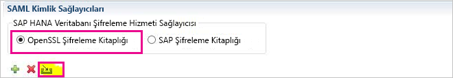
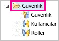
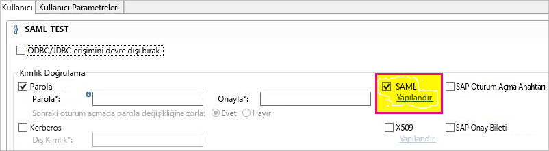
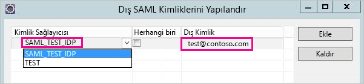
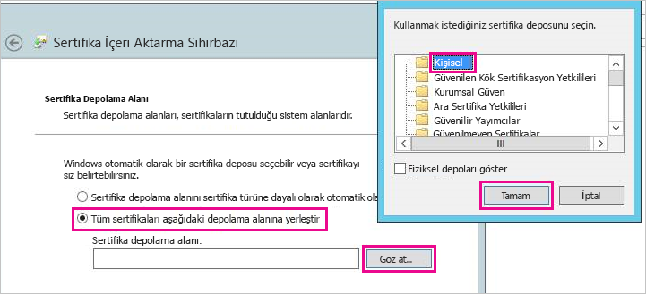
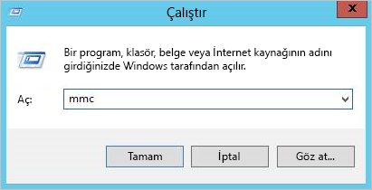
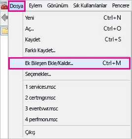
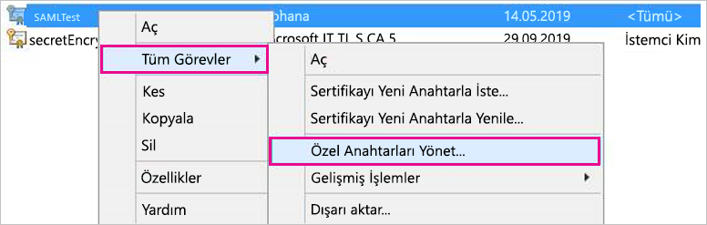
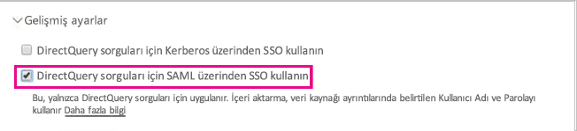

# <a name="use-security-assertion-markup-language-saml-for-sso-from-power-bi-to-on-premises-data-sources"></a>Power BI'dan şirket içi veri kaynaklarına SSO ile erişmek için ağ geçidinizde Security Assertion Markup Language (SAML) protokolünü kullanma

SSO'yu etkinleştirmek, Power BI raporlarının ve panolarının şirket içi kaynaklardan alınan verileri yenilemesini kolaylaştırırken bu kaynaklarda yapılandırılmış kullanıcı düzeyi izinlerine de uyar. Sorunsuz çoklu oturum açma deneyimi için [Security Assertion Markup Language (SAML)](https://www.onelogin.com/pages/saml) protokolünü kullanın. 

## <a name="supported-data-sources"></a>Desteklenen veri kaynakları

Şu anda SAML ile SAP HANA desteği sunuyoruz. SAML kullanarak SAP HANA için çoklu oturum açma ayarlarını ve yapılandırmasını gerçekleştirme hakkında daha fazla bilgi için [BI Platformundan HANA bağlantısı yapmak için SAML SSO](https://wiki.scn.sap.com/wiki/display/SAPHANA/SAML+SSO+for+BI+Platform+to+HANA) konusuna bakın.

[Kerberos](service-gateway-sso-kerberos.md) ile ek veri kaynakları (SAP HANA dahil) için destek sunuyoruz.

SAP HANA için bir SAML SSO bağlantısı kurmadan önce şifrelemeyi etkinleştirmeniz önerilir. Şifrelemeyi etkinleştirmek için HANA sunucusunu şifrelenmiş bağlantıları kabul edecek şekilde yapılandırın, ağ geçidini ise HANA sunucunuzla iletişim kuracak şekilde yapılandırın. HANA ODBC sürücüsü varsayılan olarak SAML onaylamalarını şifreleyemediği için, imzalı SAML onaylaması ağ geçidinden HANA sunucusuna *açıktan* gönderilir ve üçüncü taraflarca durdurulup yeniden kullanılması mümkündür. OpenSSL kitaplığı ile HANA şifrelemesini etkinleştirme hakkında yönergeler için bkz. [SAP HANA için şifrelemeyi etkinleştirme](/power-bi/desktop-sap-hana-encryption).

## <a name="configuring-the-gateway-and-data-source"></a>Ağ geçidini ve veri kaynağını yapılandırma

SAML kullanmak için, SSO’yu etkinleştirmek istediğiniz HANA sunucuları ile ağ geçidi arasında bir güven ilişkisi kurmanız gerekir. Bu senaryoda ağ geçidi, SAML kimlik sağlayıcısı (IdP) görevi görür. Bu ilişkiyi kurmanın ağ geçidi IdP’sinin x509 sertifikasını HANA sunucularının güven merkezine aktarmak veya ağ geçidinin X509 sertifikasını HANA sunucuları tarafından güvenilen bir kök Sertifika Yetkilisine (CA) imzalatmak gibi çeşitli yolları vardır. İkinci yaklaşım bu kılavuzda açıklansa da sizin için daha kullanışlı olan başka bir yaklaşımı kullanabilirsiniz.

Bu kılavuzda HANA sunucusunun şifreleme sağlayıcısı olarak OpenSSL kullanılsa da, SAP tarafından güven ilişkisi kurulurken kurulum adımlarını tamamlamak için OpenSSL yerine SAP Şifreleme Kitaplığı (CommonCryptoLib veya sapcrypto olarak da bilinir) kullanmanız da önerilir. Daha fazla bilgi için resmi SAP belgelerine bakın.

Aşağıdaki adımlarda, HANA sunucusu tarafından güvenilen bir Kök CA ile ağ geçidi IdP’sinin X509 sertifikası imzalanarak bir HANA sunucusu ile ağ geçidi IdP’si arasında güven ilişkisi kurma açıklanmaktadır. Şu Kök CA'yı oluşturacaksınız:

1. Kök CA’nın X509 sertifikasını ve özel anahtarı oluşturun. Örneğin, Kök CA’nın X509 sertifikasını ve özel anahtarı .pem biçiminde oluşturmak için şu komutu girin:

   ```
   openssl req -new -x509 -newkey rsa:2048 -days 3650 -sha256 -keyout CA_Key.pem -out CA_Cert.pem -extensions v3_ca
   ```

    Kök CA'nın özel anahtarının güvenli bir şekilde korunduğundan emin olun. Üçüncü taraf tarafından elde edilmişse, HANA sunucusuna yetkisiz erişim elde etmek için kullanılabilir. 

 1. HANA sunucusunun oluşturduğunuz Kök CA tarafından imzalanan sertifikalara güvenmesi için sertifikayı (örneğin, CA_Cert.pem) HANA sunucusunun güven deposuna ekleyin. 

    HANA sunucunuzun güven deposunun konumunu **ssltruststore** yapılandırma ayarını inceleyerek öğrenebilirsiniz. OpenSSL’yi yapılandırmayı kapsayan SAP belgelerindeki yönergeleri takip ettiyseniz, HANA sunucunuz zaten yeniden kullanabileceğiniz bir Kök CA’ya güveniyor olabilir. Daha fazla bilgi için bkz. [SAP HANA Studio’dan SAP HANA Sunucusuna Open SSL yapılandırma](https://archive.sap.com/documents/docs/DOC-39571). SAML SSO’yu etkinleştirmek istediğiniz birden çok HANA sunucusu varsa, sunucuların her birinin bu Kök CA’ya güvendiğinden emin olun.

1. Ağ geçidi IdP’sinin X509 sertifikasını oluşturun. 

   Örneğin, bir yıl boyunca geçerli bir sertifika imzalama isteği (IdP_Req.pem) ve bir özel anahtar (IdP_Key.pem) oluşturmak için aşağıdaki komutu yürütün:

   ```
   openssl req -newkey rsa:2048 -days 365 -sha256 -keyout IdP_Key.pem -out IdP_Req.pem -nodes
   ```

 1. HANA sunucularınızın güvenmesi için yapılandırdığınız Kök CA’yı kullanarak sertifika imzalama isteğini imzalayın. 

    Örneğin, CA_Cert.pem ve CA_Key.pem dosyalarını (Kök CA sertifikası ve anahtarı) kullanarak IdP_Req.pem dosyasını imzalamak için, aşağıdaki komutu yürütün:

    ```
    openssl x509 -req -days 365 -in IdP_Req.pem -sha256 -extensions usr_cert -CA CA_Cert.pem -CAkey CA_Key.pem -CAcreateserial -out IdP_Cert.pem
    ```

     Sonuçta elde edilen IdP sertifikası bir yıl boyunca geçerli olur (-days seçeneğine bakın). 

Yeni bir SAML Kimlik Sağlayıcısı oluşturmak için HANA Studio’da IdP’nizin sertifikasını içeri aktarın:

1. SAP HANA Studio'da SAP HANA sunucunuzun adına sağ tıklayıp **Güvenlik** &gt; **Güvenlik Konsolunu Aç** &gt; **SAML Kimlik Sağlayıcısı** &gt; **OpenSSL Şifreleme Kitaplığı** yolunu izleyin.

    

1. **İçeri aktar**’ı seçin, IdP_Cert.pem dosyasını bulun ve içeri aktarın.

1. SAP HANA Studio'da **Güvenlik** klasörünü seçin.

    

1. **Kullanıcılar**'ı genişletin ve sonra Power BI kullanıcınızı eşlemek istediğiniz kullanıcıyı seçin.

1. **SAML**’yi ve sonra **Yapılandır**’ı seçin.

    

1. 2\. adımda oluşturduğunuz kimlik sağlayıcısını seçin. **Dış Kimlik** için, Power BI kullanıcısının UPN’sini (bu, genellikle kullanıcının Power BI’da oturum açmak için kullandığı e-posta adresi olur) girip **Ekle**’yi seçin. Ağ geçidinizi *ADUserNameReplacementProperty* yapılandırma seçeneğini kullanması için yapılandırdıysanız, Power BI kullanıcısının asıl UPN’sinin yerini alacak değeri girin. 

   Örneğin, *ADUserNameReplacementProperty* öğesini **SAMAccountName** olarak ayarlarsanız, kullanıcının **SAMAccountName** değerini girmeniz gerekir.

    

Ağ geçidinin sertifikasını ve kimliği yapılandırdıktan sonra sertifikayı pfx biçimine dönüştürüp ağ geçidini sertifikayı kullanacak şekilde yapılandırın:

1. Sertifikayı pfx biçimine dönüştürmek için aşağıdaki komutu çalıştırın. Bu komut, elde edilen .pfx dosyasını samlcert.pfx olarak adlandırır ve parolasını *root* olarak belirler:

    ```
    openssl pkcs12 -export -out samltest.pfx -in IdP_Cert.pem -inkey IdP_Key.pem -passin pass:root -passout pass:root
    ```

1. pfx dosyasını ağ geçidi makinesine kopyalayın:

    1. Samltest.pfx dosyasına çift tıklayıp **Yerel Makine** &gt; **İleri**'yi seçin.

    1. Parolayı girin ve **İleri**'yi seçin.

    1. **Tüm sertifikaları aşağıdaki depolama alanına yerleştir**'i ve sonra **Gözat** &gt; **Kişisel** &gt; **Tamam**’ı seçin.

    1. **İleri**’yi ve ardından **Son**’u seçin.

       

1. Ağ geçidi hizmet hesabına sertifikanın özel anahtarına erişim izni verin:

    1. Ağ geçidi makinesinde Microsoft Yönetim Konsolu'nu (MMC) çalıştırın.

        

    1. **Dosya** menüsünde **Ek Bileşen Ekle/Kaldır**'ı seçin.

        

    1. **Sertifikalar**&gt; **Ekle**'yi ve ardından **Bilgisayar hesabı** &gt; **İleri**'yi seçin.

    1. **Yerel Bilgisayar** &gt; **Son** &gt; **Tamam**'ı seçin.

    1. **Sertifikalar** &gt; **Kişisel** &gt; **Sertifikalar**'ı genişletin ve sertifikayı bulun.

    1. Sertifikaya sağ tıklayın ve **Tüm Görevler** &gt; **Özel Anahtarları Yönet** yolunu izleyin.

        

    1. Ağ geçidi hizmet hesabını listeye ekleyin. Bu hesap varsayılan olarak **NT SERVICE\PBIEgwService** şeklindedir. **services.msc** komutunu çalıştırıp **Şirket içi veri ağ geçidi hizmeti**'ni bularak hangi hesabın Ağ Geçidi hizmetini çalıştırdığını öğrenebilirsiniz.

        

Son olarak aşağıdaki adımları izleyerek sertifika parmak izini ağ geçidi yapılandırmasına ekleyin:

1. Makinenizdeki sertifikaları listelemek için aşağıdaki PowerShell komutunu çalıştırın:

    ```powershell
    Get-ChildItem -path cert:\LocalMachine\My
    ```

1. Oluşturduğunuz sertifikanın parmak izini kopyalayın.

1. Varsayılan olarak C:\Program Files\On-premises data gateway olan ağ geçidi dizinine gidin.

1. PowerBI.DataMovement.Pipeline.GatewayCore.dll.config dosyasını açın ve *SapHanaSAMLCertThumbprint* bölümünü bulun. Kopyaladığınız parmak izini yapıştırın.

1. Ağ geçidi hizmetini yeniden başlatın.

## <a name="running-a-power-bi-report"></a>Power BI raporu çalıştırma

Artık Power BI'daki **Ağ Geçidini Yönet** sayfasını kullanarak SAP HANA veri kaynağını yapılandırabilirsiniz. **Gelişmiş Ayarlar** altında SAML aracılığıyla SSO'yu etkinleştirin. Bunu yaparak, bu veri kaynağında raporları ve veri kümesi bağlamasını yayımlayabilirsiniz.

   

## <a name="troubleshooting"></a>Sorun giderme

SAML tabanlı SSO'yu yapılandırdıktan sonra Power BI portalında şu hatayı görebilirsiniz: *Sağlanan kimlik bilgileri SapHana kaynağı için kullanılamaz.* Bu hata SAML kimlik bilgilerinin SAP HANA tarafından reddedildiğini gösterir.

Sunucu tarafı kimlik doğrulama izlemeleri SAP HANA'da kimlik bilgisi sorunlarını giderme hakkında ayrıntılı bilgi sağlar. SAP HANA sunucunuzda izlemeyi yapılandırmak için şu adımları izleyin:

1. SAP HANA sunucusunda aşağıdaki sorguyu çalıştırarak kimlik doğrulama izlemesini açın:

    ```
    ALTER SYSTEM ALTER CONFIGURATION ('indexserver.ini', 'SYSTEM') set ('trace', 'authentication') = 'debug' with reconfigure 
    ```

1. Sorunu yeniden üretin.

1. HANA Studio'da yönetim konsolunu açın ve **Diagnosis Files** (Tanılama Dosyaları) sekmesini seçin.

1. En son dizin sunucusu izlemesini açın ve *SAMLAuthenticator.cpp* dosyasını arayın.

    Kök nedeni gösteren ayrıntılı bir hata iletisi bulmalısınız, örneğin:

    ```
    [3957]{-1}[-1/-1] 2018-09-11 21:40:23.815797 d Authentication   SAMLAuthenticator.cpp(00091) : Element '{urn:oasis:names:tc:SAML:2.0:assertion}Assertion', attribute 'ID': '123123123123123' is not a valid value of the atomic type 'xs:ID'.
    [3957]{-1}[-1/-1] 2018-09-11 21:40:23.815914 i Authentication   SAMLAuthenticator.cpp(00403) : No valid SAML Assertion or SAML Protocol detected
    ```

1. Sorun giderme işlemi tamamlandıktan sonra, aşağıdaki sorguyu çalıştırarak kimlik doğrulama izlemesini kapatın:

    ```
    ALTER SYSTEM ALTER CONFIGURATION ('indexserver.ini', 'SYSTEM') UNSET ('trace', 'authentication');
    ```

## <a name="next-steps"></a>Sonraki adımlar

Şirket içi veri ağ geçidi ve DirectQuery hakkında daha fazla bilgi için aşağıdaki kaynaklara bakın:

* [Şirket içi veri ağ geçidi nedir?](/data-integration/gateway/service-gateway-onprem)
* [Power BI'da DirectQuery](desktop-directquery-about.md)
* [DirectQuery tarafından desteklenen veri kaynakları](power-bi-data-sources.md)
* [DirectQuery ve SAP BW](desktop-directquery-sap-bw.md)
* [DirectQuery ve SAP HANA](desktop-directquery-sap-hana.md)
