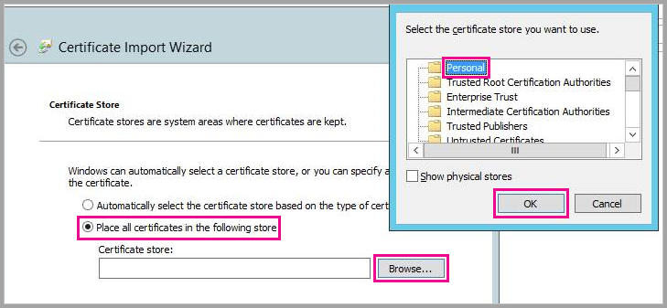

# <a name="use-security-assertion-markup-language-saml-for-sso-from-power-bi-to-on-premises-data-sources"></a>Power BI'dan şirket içi veri kaynaklarına SSO ile erişmek için ağ geçidinizde Security Assertion Markup Language (SAML) protokolünü kullanma

SSO'yu etkinleştirmek, Power BI raporlarının ve panolarının şirket içi kaynaklardan alınan verileri yenilemesini kolaylaştırırken bu kaynaklarda yapılandırılmış kullanıcı düzeyi izinlerine de uyar. Sorunsuz çoklu oturum açma deneyimi için [Security Assertion Markup Language (SAML)](https://www.onelogin.com/pages/saml) protokolünü kullanın. 

## <a name="supported-data-sources"></a>Desteklenen veri kaynakları

Şu anda SAML ile SAP HANA desteği sunuyoruz. SAML kullanarak SAP HANA için çoklu oturum açma ayarlarını ve yapılandırmasını gerçekleştirme hakkında daha fazla bilgi için [BI Platformundan HANA bağlantısı yapmak için SAML SSO](https://blogs.sap.com/2020/03/22/sap-bi-platform-saml-sso-to-hana-database/) konusuna bakın.

[Kerberos](service-gateway-sso-kerberos.md) ile ek veri kaynakları (SAP HANA dahil) için destek sunuyoruz.

SAP HANA için bir SAML SSO bağlantısı kurmadan önce şifrelemeyi etkinleştirmeniz önerilir. Şifrelemeyi etkinleştirmek için HANA sunucusunu şifrelenmiş bağlantıları kabul edecek şekilde yapılandırın, ağ geçidini ise HANA sunucunuzla iletişim kuracak şekilde yapılandırın. HANA ODBC sürücüsü varsayılan olarak SAML onaylamalarını şifreleyemediği için, imzalı SAML onaylaması ağ geçidinden HANA sunucusuna *açıktan* gönderilir ve üçüncü taraflarca durdurulup yeniden kullanılması mümkündür.

> [!IMPORTANT]
> SAP artık OpenSSL desteği sunmadığından Microsoft da desteğini sonlandırmıştır. Var olan ve yeni bağlantılar 2020'nin sonuna kadar çalışmaya devam edecektir ancak 1 Ocak 2021 itibarıyla devre dışı kalacaktır. Bunun yerine CommonCryptoLib kullanın.

## <a name="configuring-the-gateway-and-data-source"></a>Ağ geçidini ve veri kaynağını yapılandırma

SAML kullanmak için, SSO’yu etkinleştirmek istediğiniz HANA sunucuları ile ağ geçidi arasında bir güven ilişkisi kurmanız gerekir. Bu senaryoda ağ geçidi, SAML kimlik sağlayıcısı (IdP) görevi görür. Bu ilişkiyi kurmak için kullanabileceğiniz çeşitli yöntemler vardır. SAP tarafından güven ilişkisi kurulurken kurulum adımlarını tamamlamak için SAP Şifreleme Kitaplığı (CommonCryptoLib veya sapcrypto olarak da bilinir) kullanmanız da önerilir. Daha fazla bilgi için resmi SAP belgelerine bakın.

Aşağıdaki adımlarda, HANA sunucusu tarafından güvenilen bir Kök CA ile ağ geçidi IdP’sinin X509 sertifikası imzalanarak bir HANA sunucusu ile ağ geçidi IdP’si arasında güven ilişkisi kurma açıklanmaktadır. 

### <a name="create-the-certificates"></a>Sertifikaları oluşturma

Sertifikaları oluşturmak için aşağıdaki adımları uygulayın:

1. SAP HANA'yı çalıştıran cihazda sertifikalar için boş bir klasör oluşturun ve o klasöre geçiş yapın.
2. Aşağıdaki komutu kullanarak kök sertifikaları oluşturun:

   ```
   openssl req -new -x509 -newkey rsa:2048 -days 3650 -sha256 -keyout CA_Key.pem -out CA_Cert.pem -extensions v3_ca'''
   ```

    Bu sertifikaları kullanarak diğer sertifikaları imzalamak için parolayı unutmamanız gerekir.
    *CA_Cert.pem* ve *CA_Key.pem* dosyalarının oluşturulduğunu görmeniz gerekir.

   
3. Aşağıdaki komutu kullanarak IdP sertifikalarını oluşturun:
 
    ```
    openssl req -newkey rsa:2048 -days 365 -sha256 -keyout IdP_Key.pem -out IdP_Req.pem -nodes
    ```
    *IdP_Key.pem* ve *IdP_Req.pem* dosyalarının oluşturulduğunu görmeniz gerekir.

4. IdP sertifikalarını kök sertifikalarla imzalayın:

    ```
    openssl x509 -req -days 365 -in IdP_Req.pem -sha256 -extensions usr_cert -CA CA_Cert.pem -CAkey CA_Key.pem -CAcreateserial -out IdP_Cert.pem
    ```
    *CA_Cert.srl* ve *IdP_Cert.pem* dosyalarının oluşturulduğunu görmeniz gerekir.
    Şu an için yalnızca *IdP_Cert.pem* dosyasıyla ilgileniyoruz.    

### <a name="create-saml-identity-provider-certificate-mapping"></a>SAML kimlik sağlayıcısı sertifika eşlemesi oluşturma

Aşağıdaki adımları izleyerek SAML kimlik sağlayıcısı sertifika eşlemesini oluşturun.

1. **SAP HANA Studio**'da SAP HANA sunucunuzun adına sağ tıklayıp **Güvenlik > Güvenlik Konsolunu Aç > SAML Kimlik Sağlayıcısı** yolunu izleyin.
2. SAP Şifreleme Kitaplığı seçili değilse seçin. SAP tarafından kullanım dışı bırakıldığından OpenSSL Şifreleme Kitaplığı'nı (aşağıdaki görüntüde sol taraftaki seçim) *kullanmayın*.

    

3. Aşağıdaki görüntüde gösterilen mavi renkli içeri aktarma düğmesine tıklayarak *IdP_Cert.pem* adlı imzalanan sertifikayı içeri aktarın.

    

*Kimlik Sağlayıcısı Adı* için bir değer belirtmeyi unutmayın.

### <a name="import-and-create-the-signed-certificates-in-hana"></a>HANA'da imzalı sertifikaları içeri aktarma ve oluşturma

Şimdi HANA'da imzalı sertifikaları içeri aktaracak ve oluşturacaksınız. Şu adımları uygulayın:

1. **HANA Studio**'da aşağıdaki sorguyu çalıştırın:

    ```
    CREATE CERTIFICATE FROM '<idp_cert_pem_certificate_content>'
    ```
    
    Aşağıda bir örnek verilmiştir:

    ```
    CREATE CERTIFICATE FROM
    '-----BEGIN CERTIFICATE-----
    MIIDyDCCArCgA...veryLongString...0WkC5deeawTyMje6
    -----END CERTIFICATE-----
    '
    ```

2. PSEwith SAML Purpose girişi yoksa **HANA Studio**'da aşağıdaki sorguyu çalıştırarak bir tane oluşturun:
    
    ```
    CREATE PSE SAMLCOLLECTION;<br>set pse SAMLCOLLECTION purpose SAML;<br>
    ```

3. Aşağıdaki komutla yeni oluşturulan imzalı sertifikayı PSE'ye ekleyin:

    ```
    alter pse SAMLCOLLECTION add CERTIFICATE <certificate_id>;
    ```

    Örneğin:
    ```
    alter pse SAMLCOLLECTION add CERTIFICATE 1978320;
    ```

    Aşağıdaki sorguyla oluşturulan sertifikaların listesini denetleyebilirsiniz:
    ```
    select * from PUBLIC"."CERTIFICATES"
    ```

    Sertifika düzgün yüklenmiş durumda. Onaylamak için aşağıdaki sorguyu çalıştırabilirsiniz:
    ```
    select * from "PUBLIC"."PSE_CERTIFICATES"
    ```

### <a name="map-the-user"></a>Kullanıcıyı eşleme

Kullanıcıyı eşlemek için aşağıdaki adımları izleyin:

1. **SAP HANA Studio**'da **Güvenlik** klasörünü seçin:

    

2. **Kullanıcılar**'ı genişletin ve sonra Power BI kullanıcınızı eşlemek istediğiniz kullanıcıyı seçin.

3. **SAML** onay kutusunu ve ardından aşağıdaki görüntüde vurgulanmış olan **Yapılandır**'ı seçin.

    

4. Bu makalenin [SAML kimlik sağlayıcısı sertifika eşlemesi oluşturma](#create-saml-identity-provider-certificate-mapping) bölümünde oluşturduğunuz kimlik sağlayıcısını seçin. Dış Kimlik için, Power BI kullanıcısının UPN’sini (bu, genellikle kullanıcının Power BI’da oturum açmak için kullandığı e-posta adresi olur) girip **Ekle**’yi seçin.  Aşağıdaki görüntüde seçenekler ve seçimler gösterilmiştir.

    

    Ağ geçidinizi *ADUserNameReplacementProperty* yapılandırma seçeneğini kullanması için yapılandırdıysanız, Power BI kullanıcısının asıl UPN’sinin yerini alacak değeri girin. Örneğin, *ADUserNameReplacementProperty* öğesini *SAMAccountName* olarak ayarlarsanız, kullanıcının *SAMAccountName* değerini girin.

### <a name="configure-the-gateway"></a>Ağ geçidini yapılandırma

Ağ geçidinin sertifikasını ve kimliği yapılandırdıktan sonra aşağıdaki adımları izleyerek sertifikayı pfx biçimine dönüştürüp ağ geçidini sertifikayı kullanacak şekilde yapılandırın.

1. Sertifikayı pfx biçimine dönüştürmek için aşağıdaki komutu çalıştırın. Bu komut, elde edilen .pfx dosyasını samlcert.pfx olarak adlandırır ve parolasını *root* olarak belirler:

    ```
    openssl pkcs12 -export -out samltest.pfx -in IdP_Cert.pem -inkey IdP_Key.pem -passin pass:root -passout pass:root
    ```

2. pfx dosyasını ağ geçidi makinesine kopyalayın:

    1. *samltest.pfx* dosyasına çift tıklayıp **Yerel Makine** > **İleri**'yi seçin.

    2. Parolayı girin ve **İleri**'yi seçin.

    3. **Tüm sertifikaları aşağıdaki depolama alanına yerleştir**'i ve sonra **Gözat** > **Kişisel** > **Tamam**’ı seçin.

    4. **İleri**’yi ve ardından **Son**’u seçin.

       

3. Aşağıdaki adımları izleyerek ağ geçidi hizmet hesabına sertifikanın özel anahtarına erişim izni verin:

    1. Ağ geçidi makinesinde Microsoft Yönetim Konsolu'nu (MMC) çalıştırın.

        

    2. **Dosya** menüsünde **Ek Bileşen Ekle/Kaldır**'ı seçin.

        

    3. **Sertifikalar** > **Ekle**'yi ve ardından **Bilgisayar hesabı** > **İleri**'yi seçin.

    4. **Yerel Bilgisayar** > **Son** > **Tamam**'ı seçin.

    5. **Sertifikalar** > **Kişisel** > **Sertifikalar**'ı genişletin ve sertifikayı bulun.

    6. Sertifikaya sağ tıklayın ve **Tüm Görevler** &gt; **Özel Anahtarları Yönet** yolunu izleyin.

        

    1. Ağ geçidi hizmet hesabını listeye ekleyin. Bu hesap varsayılan olarak **NT SERVICE\PBIEgwService** şeklindedir. **services.msc** komutunu çalıştırıp **Şirket içi veri ağ geçidi hizmeti**'ni bularak hangi hesabın Ağ Geçidi hizmetini çalıştırdığını öğrenebilirsiniz.

        

Son olarak aşağıdaki adımları izleyerek sertifika parmak izini ağ geçidi yapılandırmasına ekleyin:

1. Makinenizdeki sertifikaları listelemek için aşağıdaki PowerShell komutunu çalıştırın:

    ```powershell
    Get-ChildItem -path cert:\LocalMachine\My
    ```

2. Oluşturduğunuz sertifikanın parmak izini kopyalayın.

3. Varsayılan olarak *C:\Program Files\On-premises data gateway* olan ağ geçidi dizinine gidin.

4. *PowerBI.DataMovement.Pipeline.GatewayCore.dll.config* dosyasını açın ve *SapHanaSAMLCertThumbprint* bölümünü bulun. Kopyaladığınız parmak izini yapıştırın.

5. Ağ geçidi hizmetini yeniden başlatın.

## <a name="running-a-power-bi-report"></a>Power BI raporu çalıştırma

Artık Power BI'daki **Ağ Geçidini Yönet** sayfasını kullanarak SAP HANA veri kaynağını yapılandırabilirsiniz. **Gelişmiş Ayarlar** altında SAML aracılığıyla SSO'yu etkinleştirin. Bunu yaparak, bu veri kaynağında raporları ve veri kümesi bağlamasını yayımlayabilirsiniz.

   

## <a name="troubleshooting"></a>Sorun giderme

SAML tabanlı SSO'yu yapılandırdıktan sonra Power BI portalında şu hatayı görebilirsiniz: *Sağlanan kimlik bilgileri SapHana kaynağı için kullanılamaz.* Bu hata SAML kimlik bilgilerinin SAP HANA tarafından reddedildiğini gösterir.

Sunucu tarafı kimlik doğrulama izlemeleri SAP HANA'da kimlik bilgisi sorunlarını giderme hakkında ayrıntılı bilgi sağlar. SAP HANA sunucunuzda izlemeyi yapılandırmak için şu adımları izleyin:

1. SAP HANA sunucusunda aşağıdaki sorguyu çalıştırarak kimlik doğrulama izlemesini açın:

    ```
    ALTER SYSTEM ALTER CONFIGURATION ('indexserver.ini', 'SYSTEM') set ('trace', 'authentication') = 'debug' with reconfigure 
    ```

1. Sorunu yeniden üretin.

1. HANA Studio'da yönetim konsolunu açın ve **Diagnosis Files** (Tanılama Dosyaları) sekmesini seçin.

1. En son dizin sunucusu izlemesini açın ve *SAMLAuthenticator.cpp* dosyasını arayın.

    Kök nedeni gösteren ayrıntılı bir hata iletisi bulmalısınız, örneğin:

    ```
    [3957]{-1}[-1/-1] 2018-09-11 21:40:23.815797 d Authentication   SAMLAuthenticator.cpp(00091) : Element '{urn:oasis:names:tc:SAML:2.0:assertion}Assertion', attribute 'ID': '123123123123123' is not a valid value of the atomic type 'xs:ID'.
    [3957]{-1}[-1/-1] 2018-09-11 21:40:23.815914 i Authentication   SAMLAuthenticator.cpp(00403) : No valid SAML Assertion or SAML Protocol detected
    ```

1. Sorun giderme işlemi tamamlandıktan sonra, aşağıdaki sorguyu çalıştırarak kimlik doğrulama izlemesini kapatın:

    ```
    ALTER SYSTEM ALTER CONFIGURATION ('indexserver.ini', 'SYSTEM') UNSET ('trace', 'authentication');
    ```

## <a name="next-steps"></a>Sonraki adımlar

Şirket içi veri ağ geçidi ve DirectQuery hakkında daha fazla bilgi için aşağıdaki kaynaklara bakın:

* [Şirket içi veri ağ geçidi nedir?](/data-integration/gateway/service-gateway-onprem)
* [Power BI'da DirectQuery](desktop-directquery-about.md)
* [DirectQuery tarafından desteklenen veri kaynakları](power-bi-data-sources.md)
* [DirectQuery ve SAP BW](desktop-directquery-sap-bw.md)
* [DirectQuery ve SAP HANA](desktop-directquery-sap-hana.md)
