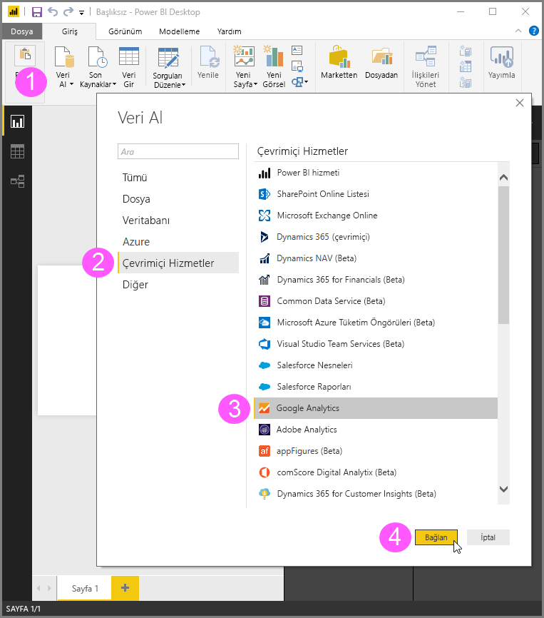
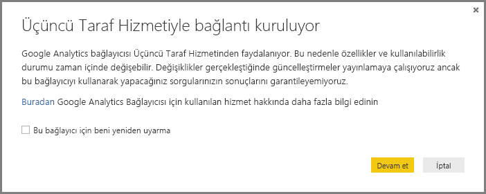
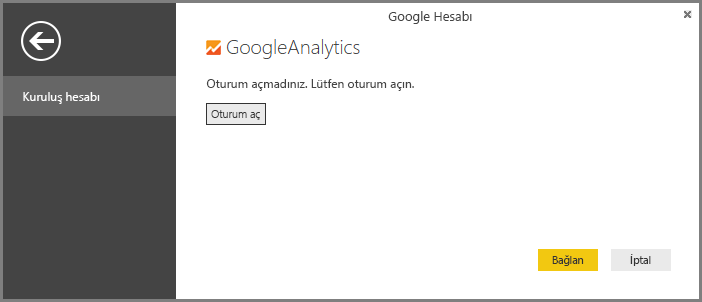
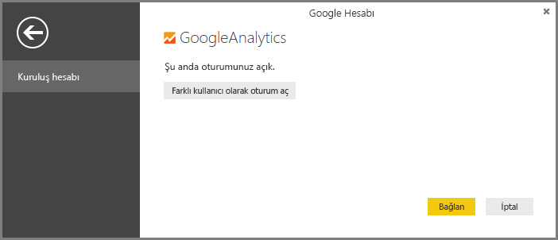
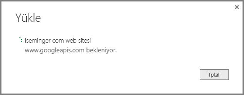

# Power BI Desktop için Google Analytics bağlayıcısını kullanma
> [!NOTE]
> Power BI Desktop'taki Google Analytics içerik paketi ve bağlayıcı, Google Analytics Core Reporting API'sini kullanır. Bu nedenle özellikler ve kullanılabilirlik durumu zaman içinde değişebilir.

**Google Analytics** bağlayıcısını kullanarak Google Analytics verilerine bağlanabilirsiniz. Bağlanmak için şu adımları uygulayın:

1. **Power BI Desktop**'taki **Giriş** şerit sekmesinde **Veri Al**'ı seçin.
2. **Veri Al** penceresinde, sol bölmedeki kategoriler arasından **Online Services**’i seçin.
3. Sağ bölmedeki seçimler arasından **Google Analytics**'i seçin.
4. Pencerenin en altında bulunan **Bağlan**'ı seçin.  
   

Bağlayıcının bir Üçüncü Taraf Hizmet olduğunu açıklayan, özelliklerin ve kullanılabilirliğin zaman içinde değişebileceği konusunda uyarıda bulunan ve başka açıklamalar sağlayan bir iletişim kutusu gösterilir.  

**Devam**'ı seçtiğinizde, Google Analytics'te oturum açmanız istenir.  

Kimlik bilgilerinizi girdiğinizde, Power BI'ın çevrimdışı erişim istediği bildirilir. **Power BI Desktop**'ı kullanarak Google Analytics verilerinize bu şekilde erişirsiniz.  

Kabul ettikten sonra **Power BI Desktop**, şu anda oturum açtığınızı gösterir.  

**Bağlan**'ı seçtiğinizde Google Analytics verileriniz **Power BI Desktop**'a bağlanır ve verileri yükler.  

## API'de yapılan değişiklikler
Değişiklikler doğrultusunda güncelleştirmeler yayımlamaya çalışsak da API'de, oluşturduğumuz sorguların sonuçlarını etkileyecek değişiklikler meydana gelebilir. Belirli durumlarda, bazı sorgular artık desteklenmiyor olabilir. Bu bağımlılık nedeniyle, bu bağlayıcıyı kullandığınızda sorgularınızın sonuçlarını garanti edemeyiz.

Google Analytics API'sindeki değişiklikler hakkında daha fazla bilgiyi kendi [değişiklik günlüğünde](https://developers.google.com/analytics/devguides/changelog) bulabilirsiniz.

