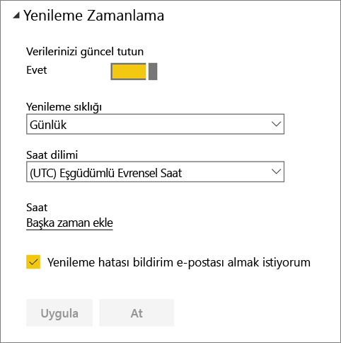

# Yenilemenin başarısız olması halinde Xero içerik paketi kimlik bilgilerinizi yenileme
Xero Power BI içerik paketini kullanıyorsanız yeni bir Power BI hizmet olayı nedeniyle, içerik paketinin günlük olarak yenilenmesi ile ilgili bazı sorunlar yaşamış olabilirsiniz.

Aşağıdaki ekran görüntüsünde gösterildiği gibi, Xero veri kümenizin son yenileme durumunu denetleyerek içerik paketinizin başarıyla yenilenip yenilenmediğini görebilirsiniz.

Yukarıda gösterildiği gibi, yenilemenin başarısız olduğunu görmeniz halinde lütfen içerik paketi kimlik bilgilerinizi yenilemek için aşağıdaki adımları uygulayın.

1. Xero veri kümenizin yanındaki **Diğer seçenekler**’e (...), sonra da **Yenilemeyi zamanla**’ya tıklayın. Xero içerik paketiniz için ayarlar sayfası açılır.
   
    
2. **Ayarlar: Xero** sayfasında, **Veri kaynağı kimlik bilgileri** > **Kimlik bilgilerini düzenle** seçeneğini belirleyin.
   
    
3. Kuruluşunuzun adını girin ve **Sonraki** düğmesine tıklayın.
   
    
4. Xero hesabınızla oturum açın.
   
    
5. Kimlik bilgilerinizi güncelleştirme işlemi tamamlandığına göre; şimdi de yenileme zamanlamasının günlük olarak çalıştırılacak şekilde belirlendiğinden emin olun. Xero veri kümenizin yanındaki **Diğer seçenekler**’e (...) ve sonra tekrar **Yenilemeyi zamanla**’ya tıklayarak bunu denetleyin.
   
    
6. Ayrıca, veri kümesini hemen yenilemeyi de seçebilirsiniz. Xero veri kümenizin yanındaki **Diğer seçenekler**’e (...), ardından **Şimdi yenile**’ye tıklayın.
   
    

Hâlâ yenileme sorunları yaşıyorsanız lütfen [https://support.powerbi.com](https://support.powerbi.com) adresinden bize ulaşın 

Power BI için Xero içerik paketi hakkında daha fazla bilgi edinmek üzere lütfen [Xero içerik paketi yardım sayfasını](service-connect-to-xero.md) ziyaret edin.

### Sonraki adımlar
* Başka bir sorunuz mu var? [Power BI Topluluğu'na başvurun](https://community.powerbi.com/)

