# Kuruluşunuzda şablon uygulamalarını yükleme ve dağıtma

Power BI analisti misiniz? Öyleyse, bu makalede işlerinizi yürütürken kullandığınız Salesforce, Microsoft Dynamics ve Google Analytics gibi birçok hizmete bağlanmak için [şablon uygulamalarını](service-template-apps-overview.md) nasıl yükleyebileceğiniz açıklanmaktadır. Şablon uygulamasının önceden oluşturulmuş panosun ve raporlarını, kuruluşunuzun ihtiyaçlarına uygun şekilde değiştirebilir ve bunları [uygulama](../consumer/end-user-apps.md) olarak iş arkadaşlarınıza dağıtabilirsiniz. 

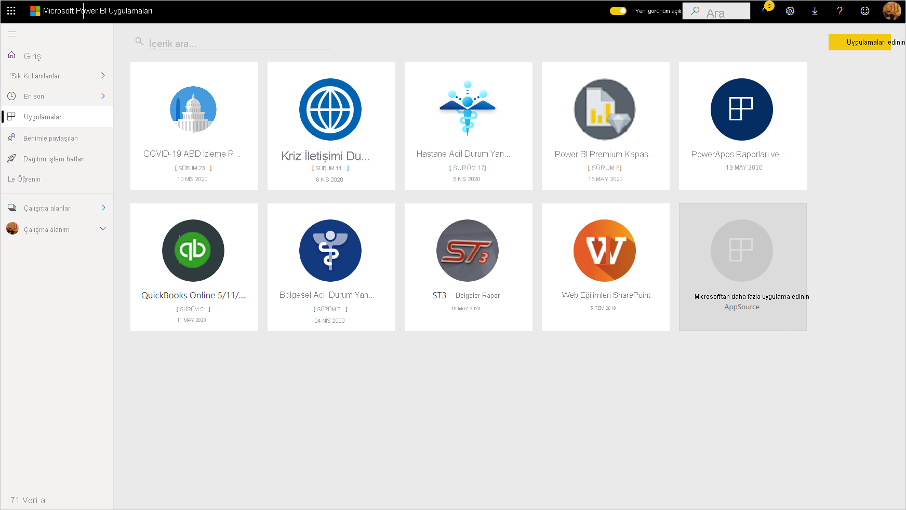

Şablon uygulamalarını kuruluşunuz dışında dağıtım için kendiniz oluşturmak istiyorsanız bkz. [Power BI’da şablon uygulaması oluşturma](service-template-apps-create.md). Power BI iş ortakları çok az kodlamayla veya hiç kodlama kullanmadan Power BI uygulamaları oluşturabilir ve bunları Power BI müşterilerinin kullanımına sunabilir. 

## Önkoşullar  

Bir şablon uygulamasını yüklemek, özelleştirmek ve dağıtmak için şunlar gerekir: 

* [Power BI Pro lisansı](../fundamentals/service-self-service-signup-for-power-bi.md).
* Kiracınızda şablon uygulamalarını yükleme izinleri.
* AppSource’tan veya uygulama oluşturucusundan alacağınız geçerli bir uygulama yükleme bağlantısı.
* [Temel Power BI kavramlarını](../fundamentals/service-basic-concepts.md) iyice tanıma.

## Şablon uygulamasını yükleme

1. Power BI hizmetinin gezinti bölmesinde **Uygulamalar** > **Uygulama edinin**’i seçin.

    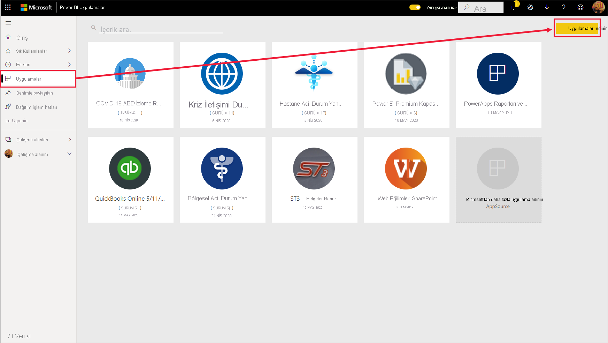

1. Karşınıza çıkan Power BI Uygulamaları marketinde **Şablon uygulamaları**’nı seçin. AppSource’ta kullanılabilir olan tüm şablon uygulamaları gösterilir. Aradığınız şablon uygulamasını bulmak için göz atın veya arama kutusunu kullanarak, filtrelenmiş bir seçim alın. Şablon uygulamasının veya finans, analiz, pazarlama gibi bir kategori adının bir kısmını yazmak, aradığınız öğeyi bulmanızı kolaylaştırır.

    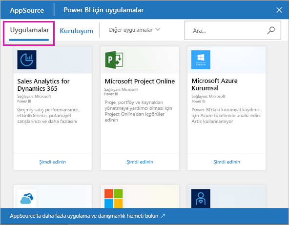

1. Aradığınız şablon uygulamasını bulduğunuzda bu uygulamaya tıklayın. Şablon uygulaması teklifi görüntülenecektir. **ŞİMDİ EDİNİN**’e tıklayın.

   

1. Görüntülenen iletişim kutusunda **Yükle**’yi seçin.

    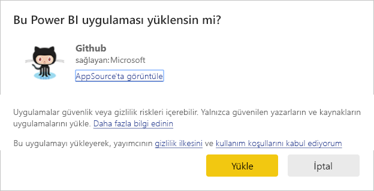
    
    Uygulama, daha fazla [özelleştirme](#customize-and-share-the-app) için gereken tüm yapıtlarıyla birlikte çalışma alanıyla aynı adla yüklenir.

    > [!NOTE]
    > AppSource’ta listelenmeyen bir uygulamanın yükleme bağlantısını kullanıyorsanız bir doğrulama iletişim kutusu, bu tercihinizi doğrulamanızı ister.
    >
    >AppSource’ta listelenmeyen bir şablon uygulaması yükleyebilmek için, yöneticinizden ilgili izinleri istemeniz gerekir. Ayrıntılar için Power BI yönetici portalında [Şablon uygulaması ayarları](../admin/service-admin-portal.md#template-apps-settings)’na bakın.

    Yükleme başarıyla tamamlandığında, yeni uygulamanızın hazır olduğunu bildiren bir bildirim alırsınız.

    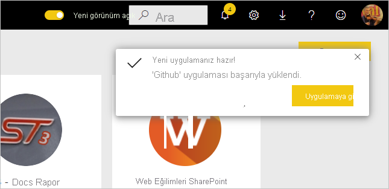

## Verilere bağlanma

1. **Uygulamaya git**’i seçin.

   Uygulama, örnek verileri göstererek açılır.

1. Sayfanın üst kısmındaki başlıkta yer alan **Verilerinize bağlanın** seçeneğini belirleyin.

   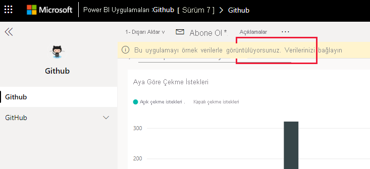

    Bu, örnek verilerin kaynağını kendi veri kaynağınız (bkz. [bilinen sınırlamalar](service-template-apps-overview.md#known-limitations)) olarak değiştirebileceğiniz parametreler iletişim kutusunu açar, ardından kimlik doğrulama yöntemi iletişim kutusu açılır. Bu iletişim kutularındaki değerleri yeniden tanımlamanız gerekebilir. Ayrıntılar için, yüklemekte olduğunuz şablon uygulamasına özgü belgelere göz atın.

   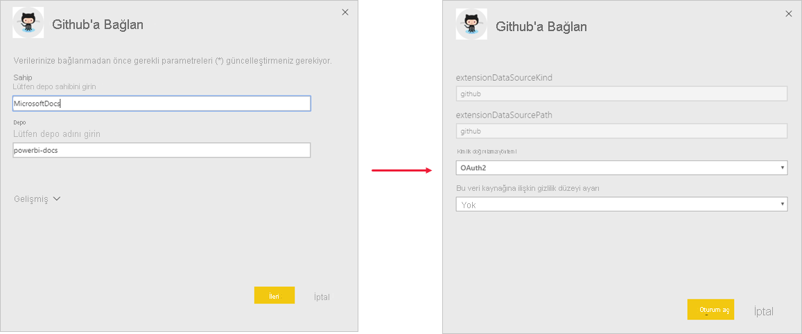

    Bağlantı iletişim kutularını doldurma işlemini tamamlamanızın ardından bağlantı işlemi başlar. Bir başlıkta verilerin yenilenmekte olduğu ve bu arada örnek verilerin görüntülendiği size bildirilir.

    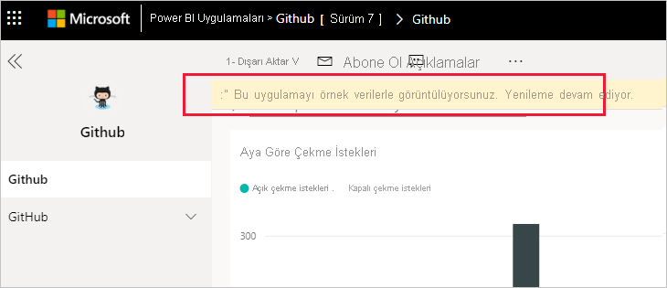

   Oturum açma işlemi sırasında bu ayarı devre dışı bırakmadığınız sürece, rapor verileriniz günde bir kere otomatik olarak yenilenir. Dilerseniz, rapor verilerinizi güncel tutmak için [kendi yenileme zamanlamanızı da ayarlayabilirsiniz](./refresh-scheduled-refresh.md).

## Uygulamayı özelleştirme ve paylaşma

Verilerinize bağlandıktan ve veri yenileme tamamlandıktan sonra, uygulamanın içerdiği tüm raporları ve panoları özelleştirebilir, ayrıca uygulamayı iş arkadaşlarınızla paylaşabilirsiniz. Öte yandan değiştirdiğiniz öğeleri farklı adlarla kaydetmediğiniz sürece, uygulamayı yeni bir sürümle güncelleştirdiğinizde yaptığınız değişikliklerin üzerine yazılacağını unutmayın. [Üzerine yazma ile ilgili ayrıntılara bakın](#overwrite-behavior).

Uygulamanızı özelleştirmek ve paylaşmak için sayfanın sağ üst köşesindeki kalem simgesini seçin.

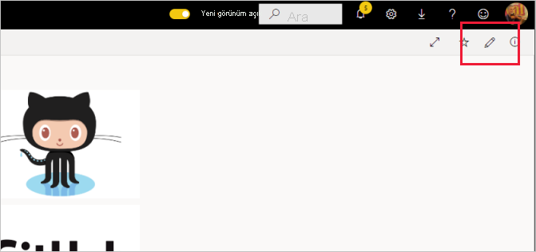

Çalışma alanındaki yapıtları düzenlemeyle ilgili bilgi için bkz.
* [Power BI’da rapor düzenleyicisi turu](../create-reports/service-the-report-editor-take-a-tour.md)
* [Power BI hizmetinde tasarımcılara yönelik temel kavramlar](../fundamentals/service-basic-concepts.md)

Çalışma alanındaki yapıtlara istediğiniz değişiklikleri yapmanızın ardından uygulamayı yayımlamaya ve paylaşmaya hazır olursunuz. Bunun nasıl yapılacağını öğrenmek için bkz. [Uygulamanızı yayımlama](../collaborate-share/service-create-distribute-apps.md#publish-your-app).

## Şablon uygulamasını güncelleştirme

Zaman zaman şablon uygulaması oluşturucuları, şablon uygulamalarının yeni gelişmiş sürümlerini, AppSource, doğrudan bağlantı veya her ikisi aracılığıyla yayınlar.

Uygulamayı başlangıçta AppSource’dan indirdiyseniz, şablon uygulamasının yeni sürümü kullanıma sunulduğunda iki yolla bildirim alırsınız:
* Power BI hizmetinde yeni uygulama sürümünün kullanılabilir olduğunu bildiren bir güncelleştirme başlığı görüntülenir.
  
* Power BI'ın bildirim bölmesinde bir bildirim alırsınız.

  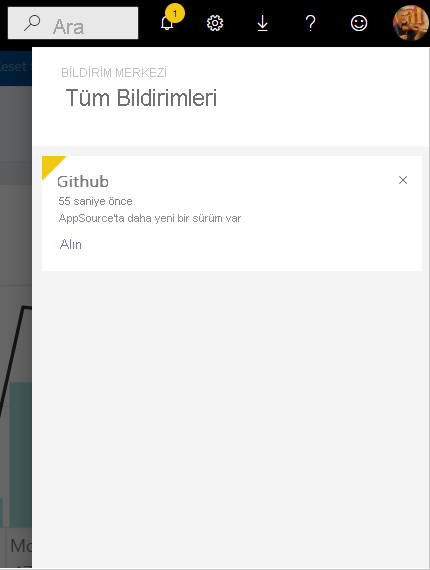

>[!NOTE]
>Uygulamayı ilk olarak AppSource yerine doğrudan bağlantı aracılığıyla aldıysanız, yeni bir sürüm kullanılabilir olduğunda bunu bilmeniz için tek yol, şablon uygulaması oluşturucusuyla iletişim kurmaktır.

  Güncelleştirmeyi yüklemek için bildirim başlığında veya bildirim merkezinde **Edinin** seçeneğine tıklayın veya AppSource’da uygulamayı tekrar bulup **Hemen edinin** seçeneğini belirleyin. Şablon uygulaması oluşturucusundan güncelleştirme için bir doğrudan bağlantı aldıysanız bu bağlantıya tıklamanız yeterlidir.
  
  Geçerli sürümün üzerine mi yazmak yoksa yeni sürümü yeni bir çalışma alanına mı yüklemek istediğiniz sorulur. Varsayılan olarak "üzerine yaz" seçilidir.

  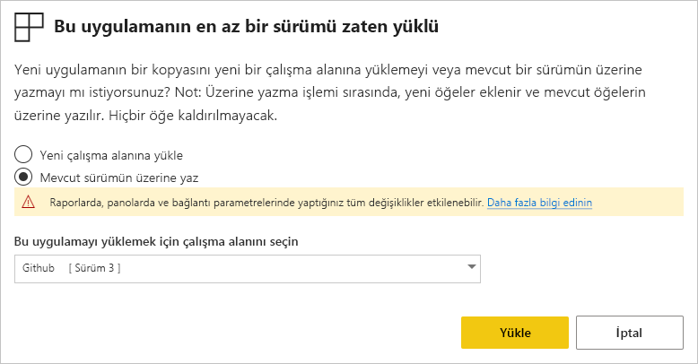

- **Mevcut sürümün üzerine yaz:** Şablon uygulamasının güncelleştirilmiş sürümünü mevcut çalışma alanının üzerine yazar. [Üzerine yazma ile ilgili ayrıntılara bakın](#overwrite-behavior).

- **Yeni bir çalışma alanına yükle:** Yeniden yapılandırmanız (başka bir deyişle, verilere bağlanmanız, gezintiyi ve izinleri tanımlamanız) gereken çalışma alanı ve uygulamanın yeni bir sürümünü yükler.

### Üzerine yazma davranışı

* Üzerine yazmak, uygulamadaki değil çalışma alanı içindeki raporları, panoları ve veri kümesini güncelleştirir. Üzerine yazmak uygulamada gezinme, ayarlama ve izinleri değiştirmez.
* Çalışma alanını güncelleştirdikten sonra **uygulamayı güncelleştirerek çalışma alanında yapılan değişiklikleri uygulamaya uygulamanız gerekir**.
* Üzerine yazmak, yapılandırılmış parametreleri ve kimlik doğrulamasını saklar. Güncelleştirmeden sonra otomatik bir veri kümesi yenilemesi başlar. **Bu yenileme sırasında uygulama, raporlar ve panolar örnek veriler sunar**.

  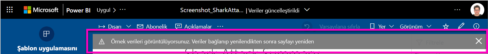

* Üzerine yazma işlemi, yenileme tamamlanana kadar her zaman örnek verileri gösterir. Şablon uygulaması yazarı, veri kümesinde veya parametrelerde değişiklik yaptıysa, çalışma alanı ve uygulama kullanıcıları, yenileme tamamlanıncaya kadar yeni verileri görmez. Bunun yerine, bu süre boyunca örnek verileri görmeye devam eder.
* Üzerine yazma işlemi hiçbir zaman çalışma alanına eklediğiniz yeni raporları veya panoları silmez. Yalnızca özgün yazarın değişikliklerini özgün raporların ve panoların üzerine yazar.

>[!IMPORTANT]
>Kuruluş uygulaması kullanıcılarınız için raporlara ve panolara yapılan değişiklikleri uygulamak için üzerine yazdıktan sonra [uygulamayı güncelleştirmeyi](#customize-and-share-the-app) unutmayın.

## Şablon uygulamasını silme

Yüklü bir şablon uygulaması, uygulamadan ve ilişkili çalışma alanından oluşur. Şablon uygulamasını kaldırmak istiyorsanız iki seçeneğiniz vardır:
* **Uygulamayı ve ilişkili çalışma alanını tamamen kaldırma**: Şablon uygulamasını ve ilişkili çalışma alanını tamamen kaldırmak için Uygulamalar sayfasında uygulama kutucuğuna gidin, çöp kutusu simgesini seçin ve ardından görüntülenen iletişim kutusunda **Sil**'e tıklayın.
* **Uygulamayı yayımdan kaldırma**: Bu seçenek uygulamayı kaldırır ama ilişkili çalışma alanını korur. Örneğin korumak istediğiniz özelleştirmeler yaptıysanız bu seçenek yararlı olur.

    Uygulamayı yayımdan kaldırmak için:
    1. Uygulamayı açın.
    1. Uygulamayı düzenleme kalem simgesine tıklayarak şablon uygulamasının çalışma alanını açın.
    1. Şablon uygulamasının çalışma alanında **Diğer seçenekler (...)** öğesini ve sonra da **Uygulamayı Yayımdan Kaldır**'ı seçin.

        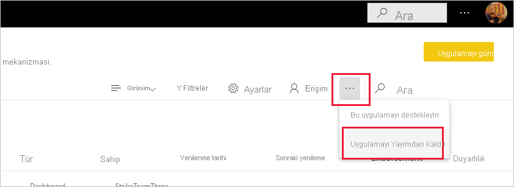

## Sonraki adımlar

[Power BI'da çalışma arkadaşlarınızla çalışma alanları oluşturma](../collaborate-share/service-create-the-new-workspaces.md)
