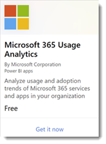
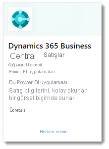

# Power BI şablon uygulamaları nedir?

Yeni Power BI *şablon uygulamaları* Power BI iş ortaklarının çok az kodlamayla veya hiç kodlama kullanmadan Power BI uygulamaları oluşturmasını ve bunları Power BI müşterilerine dağıtmasını sağlar.  Bu makale Power BI şablon uygulaması programına genel bir bakış sağlar.

Bir Power BI iş ortağı olarak, müşterileriniz için kullanıma hazır bir içerik kümesi oluşturur ve bunu kendiniz yayımlarsınız.  

Müşterilerinizin kendi hesaplarıyla bağlanmasına ve örnek oluşturmasına olanak sağlayan şablon uygulamaları oluşturursunuz. Etki alanı uzmanları olarak, işletme kullanıcıları tarafından kolayca tüketilebilecek şekilde verilerin kilidini açabilirler.  

İş ortağı merkezine bir şablon uygulaması gönderirsiniz. Ardından uygulamalar [Power BI Uygulamaları marketinde](https://app.powerbi.com/getdata/services) ve [Microsoft AppSource](https://appsource.microsoft.com/?product=power-bi)'ta genel kullanıma sunulur. Burada genel şablon uygulaması oluşturma deneyimine üst düzey bir bakış sağlanır.

## Power BI Uygulamaları marketi

Power BI Şablon Uygulamaları Power BI Pro veya Power BI Premium kullanıcılarının canlı veri kaynaklarına bağlanabilen önceden paketlenmiş panolar ve raporlar aracılığıyla hemen içgörüler elde edebilmesine olanak tanır. Birçok Power BI Uygulaması zaten [Power BI Uygulamaları marketinde](https://app.powerbi.com/getdata/services) kullanıma sunulmuştur.

:::row:::
    :::column:::
        
    :::column-end:::
    :::column:::
        
    :::column-end:::
    :::column:::
        
    :::column-end:::
    :::column:::
        
    :::column-end:::
:::row-end:::

## İşleme
Şablon uygulaması geliştirmek ve göndermek için kullanılan genel süreç birkaç aşamadan oluşur. Bazı aşamalar aynı anda birden çok etkinlik içerebilir.

| Aşama | Power BI Desktop |  |Power BI hizmeti  |  |İş Ortağı Merkezi  |
|---|--------|--|---------|---------|---------|
| **Bir** | Bir .pbix dosyasında veri modeli ve rapor oluşturma |  | Çalışma alanı oluşturma. .pbix dosyasını içeri aktarma. Tamamlayıcı bir pano oluşturma  |  | İş ortağı olarak kaydetme |
| **İki** |  |  | Test paketi oluşturma ve kuruluş içinde doğrulamayı çalıştırma        |  | |
| **Üç** | |  | Power BI kiracınızın dışında doğrulama için test paketini üretim öncesi aşamaya yükseltme ve AppSource’a gönderme  |  | Üretim öncesi paketinizle bir Power BI şablon uygulaması teklifi oluşturma ve doğrulama sürecini başlatma |
| **Dört** | |  | Üretim öncesi paketi üretime yükseltme |  | Canlı yayına geçme |

## Başlamadan önce

Şablon uygulaması oluşturmak için, bu uygulamayı oluşturma izinleriniz olmalıdır. Ayrıntılar için bkz. Power BI yönetim portalı, Şablon uygulaması ayarları. 

Şablon uygulamasını Power BI hizmetinde ve AppSource’ta yayımlamak için, [İş Ortağı Merkezi Yayımcısı olma](/azure/marketplace/become-publisher) gereksinimlerini karşılamanız gerekir.
 
## Üst düzey adımlar

Üst düzey adımlar aşağıda verilmiştir. 

1. [Gereksinimleri gözden geçirip](#requirements) bunları karşıladığınızdan emin olun. 

2. Power BI Desktop'ta rapor oluşturun. Raporu diğer kişilerin kullanabileceği bir dosya olarak kaydedebilmek için parametreleri kullanın. 

3. Power BI hizmetinde (app.powerbi.com) şablon uygulamanız için kiracınızda bir çalışma alanı oluşturun. 

4. .pbix dosyanızı içeri aktarın ve uygulamanıza içerik, örneğin bir pano ekleyin. 

5. Şablon uygulamasını kuruluşunuzun içinde kendiniz test etmek için bir test paketi oluşturun. 

6. Test uygulamasını üretim öncesi aşamaya yükselterek uygulamayı AppSource’ta doğrulamaya gönderin ve kendi kiracınızın dışında test edin. 

7. İçeriği yayımlanması için [İş ortağı merkezine](/azure/marketplace/partner-center-portal/create-power-bi-app-offer) gönderin. 

8. Teklifinizi AppSource’ta "Canlı Yayına" geçirin ve Power BI’da üretime taşıyın.

9. Artık aynı çalışma alanında, üretim öncesi aşamada bir sonraki sürümü geliştirmeye başlayabilirsiniz. 

## Gereksinimler

Şablon uygulaması oluşturmak için, bu uygulamayı oluşturma izinleriniz olmalıdır. Ayrıntılar için bkz. Power BI [yönetim portalı, Şablon uygulaması ayarları](../admin/service-admin-portal.md#template-apps-settings).

Şablon uygulamasını Power BI hizmetinde ve AppSource’ta yayımlamak için, [İş Ortağı Merkezi Yayımcısı olma](/azure/marketplace/become-publisher) gereksinimlerini karşılamanız gerekir.
 > [!NOTE] 
 > Şablon uygulamaları gönderimleri [İş Ortağı Merkezi](/azure/marketplace/partner-center-portal/create-power-bi-app-offer)’nde yönetilir. Oturum açmak için aynı Microsoft Developer Center kayıt hesabını kullanın. AppSource teklifleriniz için yalnızca bir tane Microsoft hesabınızın olması gerekir. Hesaplar, ayrı hizmetlere veya tekliflere özel olmamalıdır.

## İpuçları 

- Herkesin tek tıklamayla başlayabilmesi için uygulamanıza örnek verilerin eklendiğinden emin olun. 
- Uygulamanızı kiracınıza ve ikinci bir kiracıya yükleyerek dikkatle inceleyin. Müşterilerin yalnızca onlara göstermek istediklerinizi gördüğünden emin olun. 
- Uygulamanızı barındırmak için çevrimiçi deponuz olarak AppSource’u kullanın. Bu şekilde Power BI kullanan herkesi uygulamanızı bulabilir. 
- Ayrı benzersiz senaryolar için birden fazla şablon uygulaması sunmayı göz önüne alın. 
- Veri özelleştirmesini etkinleştirin, örneğin yükleyicinin özel bağlantısını ve parametre yapılandırmasını destekleyin.

Diğer öneriler için bkz. [Power BI’da şablon uygulaması yazma ipuçları](service-template-apps-tips.md).

## Bilinen sınırlamalar

| Özellik | Bilinen Sınırlama |
|---------|---------|
|İçerik:  Veri kümeleri   | Tam olarak bir veri kümesi bulunmalıdır. Yalnızca Power BI Desktop’ta oluşturulan veri kümelerine (.pbix dosyaları) izin verilir.  Desteklenmez: Diğer şablon uygulamalarından veri kümeleri, çalışma alanları arası veri kümeleri, sayfalandırılmış raporlar (.rdl dosyaları), Excel çalışma kitapları |
|İçerik: Panolar | Gerçek zamanlı kutucuklara izin verilmez (diğer bir deyişle, veri kümelerini gönderme veya akış sağlama desteği yok) |
|İçerik: Veri akışları | Desteklenmez: Veri akışları |
|Dosyaların içeriği | Yalnızca PBIX dosyalarına izin verilir.  Desteklenmez: .rdl dosyaları (sayfalandırılmış raporlar), Excel çalışma kitapları   |
| Veri kaynakları | Bulutta Zamanlanmış Veri yenileme için desteklenen veri kaynaklarına izin verilir.  Desteklenmez: <li>Canlı bağlantılar (Azure AS yok)</li> <li>Şirket içi veri kaynakları (kişisel ve kurumsal ağ geçitleri desteklenmez)</li> <li>Gerçek zamanlı (gönderim veri kümesi desteği yok)</li> <li>Bileşik modeller</li></ul> |
| Veri kümesi: çalışma alanları arası | Çalışma alanları arası veri kümelerine izin verilmez  |
| Sorgu parametreleri | Desteklenmez: “Any”, “Date” veya “Binary” türündeki parametreler veri kümesi için yenileme işlemini engeller |
| Power BI görselleri | Yalnızca genel kullanıma açık Power BI görselleri desteklenir. [Power BI kuruluş görselleri](../developer/visuals/power-bi-custom-visuals-organization.md) desteklenmez |
| Bağımsız bulutlar | Şablon uygulamaları bağımsız bulutlarda kullanılamaz |

## Destek
Geliştirme sırasında destek almak için [https://powerbi.microsoft.com/support](https://powerbi.microsoft.com/support) adresine gidin. Bu siteyi etkin bir şekilde izliyor ve yönetiyoruz. Müşteri olayları hızla ilgili ekibe aktarılmaktadır.

## Sonraki adımlar

[Şablon uygulaması oluşturma](service-template-apps-create.md)