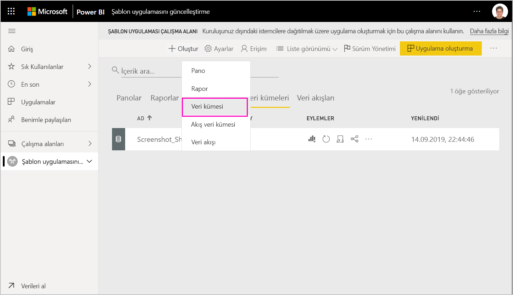
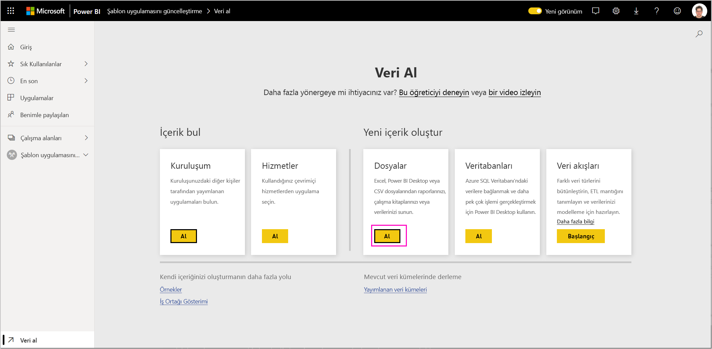
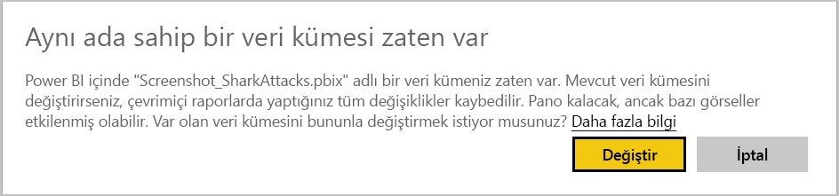
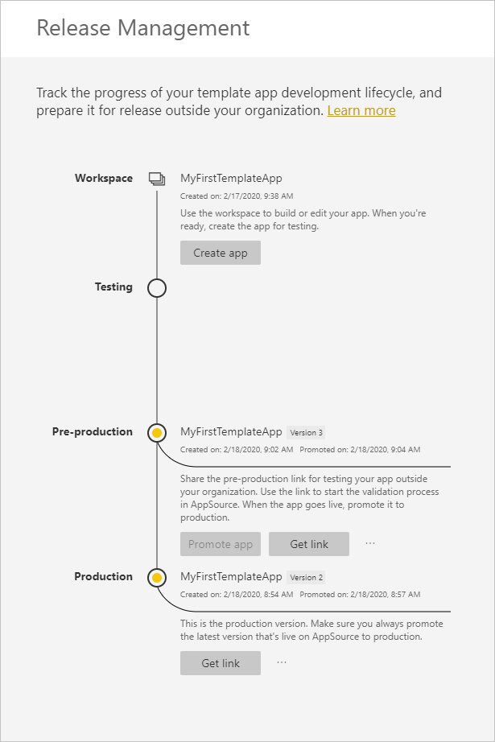
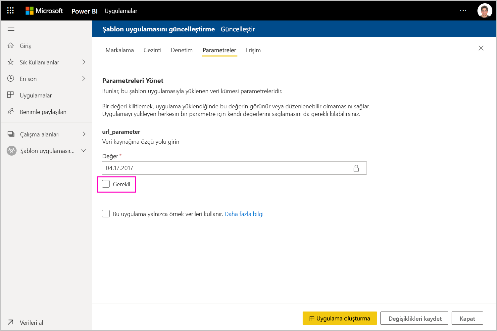
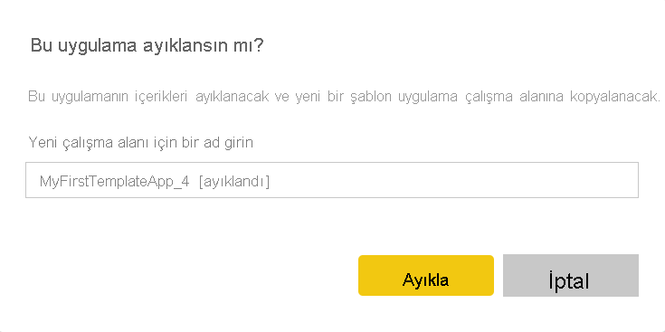
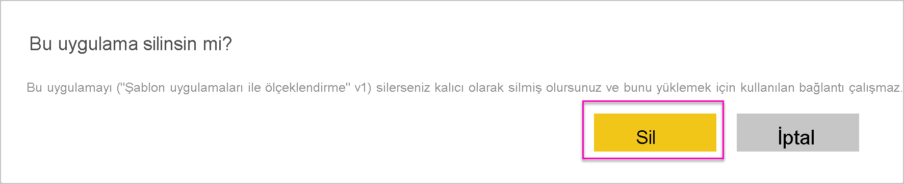

# Şablon uygulamasını güncelleştirme, silme ve ayıklama

Uygulamanız artık üretim ortamında olduğundan, üretimdeki uygulamaya müdahale etmeden test aşamasının üzerinden geçebilirsiniz.
## Uygulamanızı güncelleştirme

Power BI Desktop’ta değişiklikler yaptıysanız (1). adımdan başlayın. Power BI Desktop’ta değişiklikler yapmadıysanız (4). adımdan başlayın.

1. Güncelleştirilmiş veri kümesini karşıya yükleyin ve mevcut veri kümesinin üzerine yazın. **Tam olarak aynı veri kümesi adını kullandığınızdan emin olun**. Farklı bir ad kullanmak, uygulamayı güncelleştiren kullanıcılar için yeni bir veri kümesi oluşturur.

1. Pbix dosyasını bilgisayarınızdan içeri aktarın.

1. Üzerine yazmayı onaylayın.

1. **Sürüm yönetimi** bölmesinde **Uygulama oluştur**’u seçin.
1. Uygulama oluşturma sürecine en baştan yeniden başlayın.
1. **Markalama**, **İçerik**, **Denetim** ve **Erişim**’i ayarladıktan sonra tekrar **Uygulama oluştur**’u seçin.
1. **Kapat**’ı seçin ve **Sürüm yönetimi**’ne dönün.

   Şimdi iki sürümünüz olduğunu görürsünüz: üretimdeki sürüm ve test aşamasındaki yeni sürüm.

    

1. Uygulamanızı kiracınızın dışında test etmek amacıyla üretim öncesi aşamaya yükseltmek için, Sürüm Yönetimi bölmesine dönün ve **Test**’in yanındaki **Uygulamayı yükselt**’i seçin.

   Artık biri üretim, biri de üretim öncesi olmak üzere iki sürüme sahipsiniz.

   

   Bağlantınız artık canlıdır. **Üretim öncesi aşamada Uygulamayı yükselt düğmesinin gri olduğuna dikkat edin**. Bunun amacı, Bulut İş Ortağı Portalı yeni uygulama sürümünü doğrulayıp onaylamadan önce geçerli uygulama sürümünün canlı üretim bağlantısının yanlışlıkla üzerine yazmasını engellemektir.

1. [Power BI Uygulama teklifi güncelleştirmesi](/azure/marketplace/cloud-partner-portal/power-bi/cpp-update-existing-offer) altındaki adımları izleyerek bağlantınızı yeniden Bulut İş Ortağı Portalı'na (CPP) gönderin. Bulut İş Ortağı Portalı’nda teklifinizi tekrar **yayımlamanız** ve doğrulatıp onaylatmanız gerekir.

   Teklifiniz onaylandığında Uygulamayı yükselt düğmesi yeniden etkin olur. 
1. Uygulamanızı üretim aşamasına yükseltin.
   
### Güncelleştirme davranışı

1. Uygulamanın güncelleştirilmesi, şablon uygulaması yükleyicisinin bağlantı yapılandırmasını kaybetmeden zaten yüklü olan çalışma alanında [Şablon uygulamasını güncelleştirmesine](service-template-apps-install-distribute.md#update-a-template-app) olanak tanır.
1. Veri kümesindeki değişikliklerin yüklü şablon uygulamasını nasıl etkilediğini öğrenmek için yükleyicinin [üzerine yazma davranışına](service-template-apps-install-distribute.md#overwrite-behavior) bakın.
1. Bir şablon uygulaması güncelleştirilirken (üzerine yazılırken) ilk olarak örnek verilere geri döner ve kullanıcı yapılandırmasıyla (parametreler ve kimlik doğrulaması) otomatik olarak yeniden bağlanır. Yenileme tamamlanana kadar raporlar, panolar ve kuruluş uygulaması, örnek veri başlığını sunar.
1. Kullanıcı girişi gerektiren güncelleştirilmiş veri kümesine yeni bir sorgu parametresi eklediyseniz, *gerekli* onay kutusunu işaretlemeniz gerekir. Bu işlem, uygulamayı güncelleştirdikten sonra yükleyiciye bağlantı dizesini sorar.
 

## Çalışma alanını ayıklama
Ayıklama özelliği sayesinde artık bir şablon uygulamasını önceki sürümüne geri almak hiç olmadığı kadar kolaylaştı. Aşağıdaki adımlar, çeşitli yayın aşamalarındaki belirli bir uygulama sürümünü yeni çalışma alanına ayıklayacaktır:

1. Yayın yönetimi bölmesinde diğer simgesine **(...)** ve ardından **Ayıkla**’ya basın.

     
2. İletişim kutusunda, ayıklanan çalışma alanının adını girin. yeni bir çalışma alanı eklenir.

Yeni çalışma alanı sürümünüz sıfırlanır ve şablon uygulamasını yeni ayıklanan çalışma alanından geliştirmeye ve dağıtmaya devam edebilirsiniz.

## Şablon uygulaması sürümünü silme
Şablon çalışma alanı, etkin bir dağıtılmış şablon uygulamasının kaynağıdır. Şablon uygulaması kullanıcılarını korumak için, bir çalışma alanını, çalışma alanında oluşturulan tüm uygulama sürümlerini kaldırmadan silmek mümkün değildir.
Bir uygulama sürümü silindiğinde, artık çalışmayan uygulama url’si de silinir.

1. Yayın yönetimi bölmesinde üç noktaya **(...)** ve ardından **Sil**’e basın.
 
 

>[!NOTE]
>Müşteriler veya **AppSource** tarafından kullanılan uygulama sürümünü silmemeye özen gösterin. Aksi takdirde uygulama çalışmayacaktır.

## Sonraki adımlar

Müşterilerinizin şablon uygulamanızla nasıl etkileşim kurduğunu görmek için bkz. [Kuruluşunuzda şablon uygulamalarını yükleme, özelleştirme ve dağıtma](service-template-apps-install-distribute.md).

Uygulamanızı dağıtma işleminin ayrıntıları için bkz. [Power BI Uygulama teklifi](/azure/marketplace/cloud-partner-portal/power-bi/cpp-power-bi-offer).