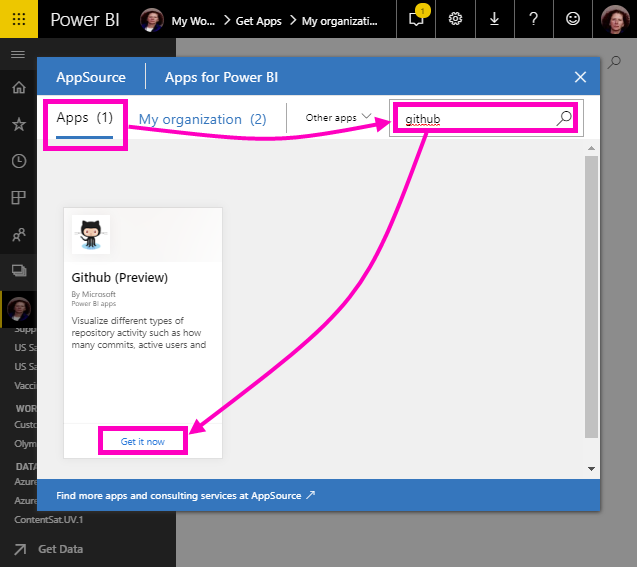

# Öğretici: Power BI ile bir GitHub deposuna bağlanma
Bu öğreticide, Power BI ile GitHub hizmetindeki gerçek verilere bağlanırsınız ve Power BI otomatik olarak panolar ve raporlar oluşturur. Power BI içerik genel deposuna (*depo* olarak da bilinir) bağlanır ve şunlar gibi soruların cevaplarını görürsünüz: Power BI genel içeriğine kaç kişi katkıda bulunuyor? En çok kim katkıda bulunuyor? En çok haftanın hangi gününde katkıda bulunuluyor? Ve diğer sorular. 

Bu öğreticide aşağıdaki adımları tamamlarsınız:

> [!div class="checklist"]
> * Bir GitHub hesabınız yoksa, GitHub hesabına kaydolma 
> * Power BI hesabınızda oturum açma veya Power BI hesabınız yoksa, Power BI hesabına kaydolma
> * Power BI hizmetini açma
> * GitHub uygulamasını bulma
> * Power BI genel GitHub deposu için bilgileri girme
> * GitHub verileriyle panoyu ve raporu görüntüleme
> * Uygulamayı silerek kaynakları temizleme

Power BI’ya kaydolmadıysanız başlamadan önce [ücretsiz deneme için kaydolun](https://app.powerbi.com/signupredirect?pbi_source=web).

## Önkoşullar

Bu öğreticiyi tamamlamak için, bir GitHub hesabınız yoksa GitHub hesabınız olması gerekir. 

- [GitHub hesabına](https://docs.microsoft.com/contribute/get-started-setup-github) kaydolun.

## Bağlanma
1. Power BI hizmetinde (`https://app.powerbi.com`) oturum açın. 
2. Gezinti bölmesinde **Uygulamalar** seçeneğini ve ardından **Uygulamaları edinin** seçeneğini belirleyin.
   
    

3. **Uygulamalar**’ı seçin, arama kutusuna **GitHub** yazın > **Hemen edinin**’e tıklayın.
   
    

4. **Bu Power BI uygulaması yüklensin mi?** iletişim kutusunda **Yükle**’yi seçin.
5. **Yeni uygulamanız hazır** alanında **Uygulamaya gidin** seçeneğini belirleyin.
6. **Yeni uygulamanızı kullanmaya başlayın** alanında **Bağlan** seçeneğini belirleyin.

    

7. Depo adını ve sahibini girin. Bu depodaki URL https://github.com/MicrosoftDocs/powerbi-docs olduğundan, **Depo Sahibi** **MicrosoftDocs** ve **Depo** da **powerbi-docs**’tur. 
   
    

5. Oluşturduğunuz GitHub kimlik bilgilerini girin. Önceden tarayıcınızda GitHub’da oturum açtıysanız Power BI bu adımı atlayabilir. 

6. **Kimlik Doğrulama Yöntemi** için **OAuth2** seçimini koruyun ve \>**Oturum Açın**.

7. GitHub kimlik doğrulaması ekranlarındaki yönergeleri uygulayın. Power BI’a GitHub verileri için izin verin.
   
   Şimdi Power BI, GitHub ile bağlantı kurup verilere bağlanabilir.  Veriler, günde bir kez yenilenir.

8. Power BI verileri içeri aktardıktan sonra yeni GitHub çalışma alanınızın içeriklerini görürsünüz. 
9. Gezinti bölmesinde çalışma alanı adının yanındaki oku seçin. Çalışma alanının bir pano ve rapor içerdiğini görürsünüz. 

    

10. Pano adının yanındaki **Diğer seçenekler** (...) > **Yeniden adlandır**’ı seçin ve **GitHub panosu** yazın.
 
     

8. Daha fazla alan kazanmak için genel gezinti simgesini seçerek gezinti bölmesini simge durumuna küçültün.

    

10. GitHub panonuzu seçin.
    
    GitHub panosu canlı veriler içerir. Bu nedenle gördüğünüz değerler farklı olabilir.

    

    

## Soru sorun

1. İmlecinizi **Verileriniz hakkında soru sorun** bölümüne yerleştirin. Power BI, **kullanmaya başlamaya yönelik sorular** sunar. 

1. **Kaç kullanıcı bulunduğunu** seçin.
 
    

13. **Kaç** ve **kullanıcı bulunuyor** sorularına benzer biçimde **çekme isteği başına kaç kullanıcı bulunuyor** yazın. 

     Power BI, kişi başına isteği sayısını gösteren bir çubuk grafik oluşturur.

    

13. Panonuza sabitlemek için sabitleme iğnesini seçin ve **Soru-Cevap'tan çıkın**.

## GitHub raporunu görüntüleme 

1. GitHub panosunda **Aya Göre Çekme İstekleri** adlı sütun grafiğini seçerek ilgili raporu açın.

    

2. **Kullanıcılara göre toplam çekme isteği** grafiğinde bir kullanıcı adı seçin. Bu örnekte, çalışma saatlerinin çoğunluğunun Şubat’ta olduğunu görüyoruz.

    

3. **Delikli Kart** sekmesini seçerek raporda sonraki sayfayı görüntüleyin. 
 
    

    Görünüşe göre Salı günleri saat 15:00, insanların işlerine giriş yaptığı haftanın en yoğun *yürütme* günü ve saatidir.

## Kaynakları temizleme

Öğreticiyi bitirdiğinize göre şimdi GitHub uygulamasını silebilirsiniz. 

1. Gezinti bölmesinde **Uygulamalar**’ı seçin.
2. İmleci GitHub kutucuğunun üzerine getirin ve **Sil** çöp kutusunu seçin.

    

## Sonraki adımlar

Bu öğreticide, bir GitHub genel deposuna bağlandınız ve Power BI’ın biçimlendirdiği verileri bir panoda ve raporda aldınız. Pano ve raporu keşfederek veriler hakkında bazı soruları yanıtladınız. Şimdi Salesforce, Microsoft Dynamics ve Google Analytics gibi diğer hizmetlere bağlanma hakkında daha fazla bilgi edinebilirsiniz. 
 
> [!div class="nextstepaction"]
> [Kullandığınız çevrimiçi hizmetlere bağlanma](service-connect-to-services.md)

