# <a name="tutorial-use-cognitive-services-in-power-bi"></a>Öğretici: Power BI’da Bilişsel Hizmetler’i kullanma

Power BI, Veri Akışları için self servis veri hazırlığında verilerinizi zenginleştirmek için Azure Bilişsel Hizmetler'den bir dizi işleve erişim sağlar. Bugün desteklenen hizmetler [Yaklaşım Analizi](/azure/cognitive-services/text-analytics/how-tos/text-analytics-how-to-sentiment-analysis), [Anahtar İfade Ayıklama](/azure/cognitive-services/text-analytics/how-tos/text-analytics-how-to-keyword-extraction), [Dil Algılama](/azure/cognitive-services/text-analytics/how-tos/text-analytics-how-to-language-detection) ve [Resim Etiketleme](/azure/cognitive-services/computer-vision/concept-tagging-images)'dir. Dönüştürmeler Power BI hizmetinde yürütülür ve Azure Bilişsel Hizmetler aboneliği gerekmez. Bu özellik için Power BI Premium gerekir.

Bilişsel Hizmetler dönüştürmeleri, [veri akışları için Self Servis Veri Hazırlığında](https://powerbi.microsoft.com/blog/introducing-power-bi-data-prep-wtih-dataflows/) desteklenir. Başlangıç olarak metin analizi ve resim etiketleme için aşağıdaki adım adım örnekleri kullanın.

Bu öğreticide aşağıdakilerin nasıl yapılacağını öğreneceksiniz:

> [!div class="checklist"]
> * Veri akışına veri aktarma
> * Veri akışındaki bir metin sütununda yaklaşım puanlama ve anahtar ifadeleri ayıklama
> * Power BI Desktop'tan sonuçlara bağlanma


## <a name="prerequisites"></a>Önkoşullar

Bu öğreticiyi tamamlamak için aşağıdakiler gerekir: 

- Power BI hesabı. Power BI’ya kaydolmadıysanız başlamadan önce [ücretsiz deneme için kaydolun](https://app.powerbi.com/signupredirect?pbi_source=web).
- AI iş yükünün etkinleştirildiği Power BI Premium capacity kapasiteye erişin. Önizleme sırasında bu iş yükü varsayılan olarak kapalı olacaktır. Premium kapasitedeyseniz ve AI İçgörüler gösterilmiyorsa, yönetim portalında AI iş yükünü etkinleştirmek için Premium kapasite yöneticinize başvurun.

## <a name="text-analytics"></a>Metin analizi

Öğreticinin metin analizi kısmını tamamlamak için bu bölümdeki adımları izleyin.

### <a name="step-1-apply-sentiment-scoring-in-power-bi-service"></a>1\. Adım: Power BI Hizmetine yaklaşım puanlaması uygulama

Başlangıç olarak Premium kapasiteye sahip Power BI çalışma alanına gidin ve ekranın sağ üst kısmındaki **Oluştur** düğmesini kullanarak yeni bir veri akışı oluşturun.

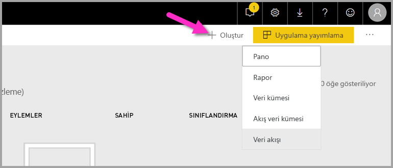

Veri akışı iletişim kutusunda size yeni veri akışı oluşturma seçenekleri gösterilir; **Yeni varlıklar ekle** 'yi seçin. Ardından, veri kaynakları menüsünde **Metin/CSV** 'yi seçin.

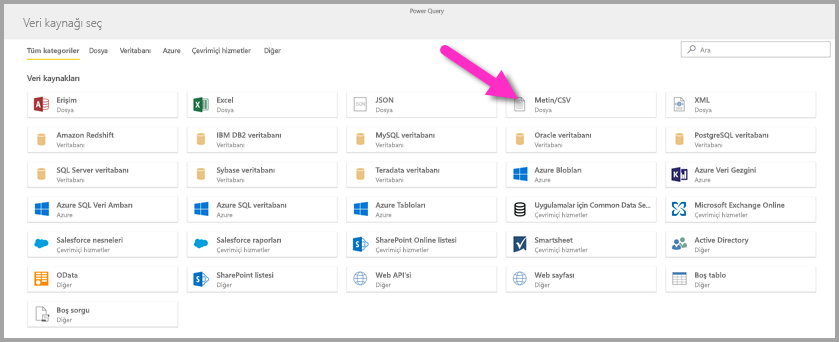

Bu URL'yi URL alanına yapıştırın: [https://pbiaitutorials.blob.core.windows.net/textanalytics/FabrikamComments.csv](https://pbiaitutorials.blob.core.windows.net/textanalytics/FabrikamComments.csv) ve **İleri** 'ye tıklayın.


Veriler artık metin analizinde kullanılmaya hazırdır ve müşteri yorumları sütununda Yaklaşım Puanlaması'nı ve Anahtar İfade Ayıklama'yı kullanabiliriz.

Power Query Düzenleyicisi'nde **AI İçgörüler** 'i seçin

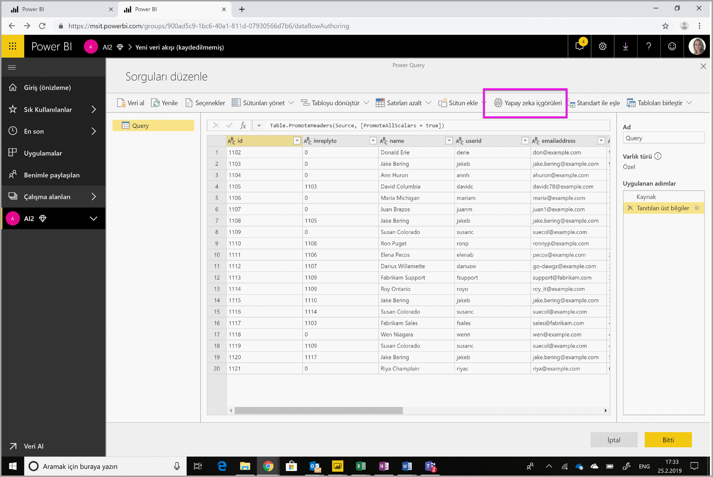

**Bilişsel Hizmetler** klasörünü genişletin ve kullanmak istediğiniz işlevi seçin. Bu örnekte yorum sütununun yaklaşımı puanlanır ama aynı adımları izleyerek Dil Algılama'yı ve Anahtar İfade Ayıklama'yı da deneyebilirsiniz.

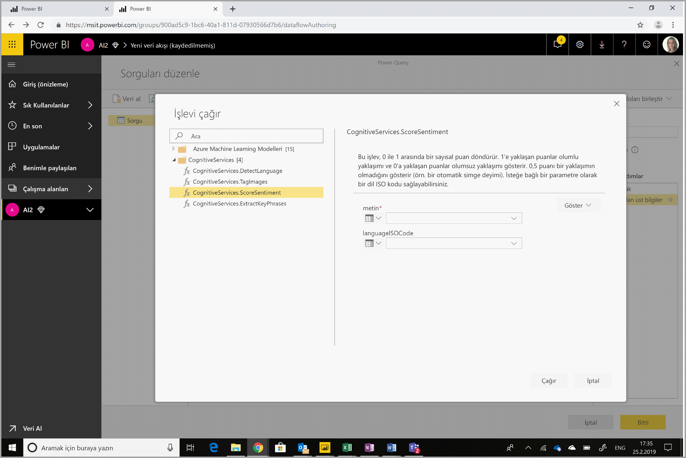

İşlev seçildikten sonra gerekli ve isteğe bağlı alanlar gösterilir. Örnek incelemelerin yaklaşımını puanlamak için, metin girişi olarak incelemeler sütununu seçin. Kültür bilgisi isteğe bağlı bir giriştir ve ISO biçimi gerektirir. Örneğin, metnin Türkçe olarak kabul edilmesini istiyorsanız 'tr' girin. Alan boş bırakılırsa, Power BI yaklaşımı puanlama işlemi yapmadan önce giriş değerinin dilini algılar.

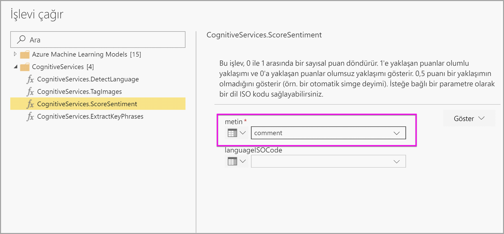

Şimdi **Çağır** 'ı işlevi çalıştırın. Tabloya her satırın yaklaşım puanını içeren yeni bir sütun eklenir. **AI içgörüler** 'e dönüp aynı yöntemle inceleme metninin anahtar ifadelerini ayıklayabilirsiniz.

Dönüştürmeleri tamamladıktan sonra sorgu adını 'Customer comments' olarak değiştirin ve **Bitti** 'yi seçin.

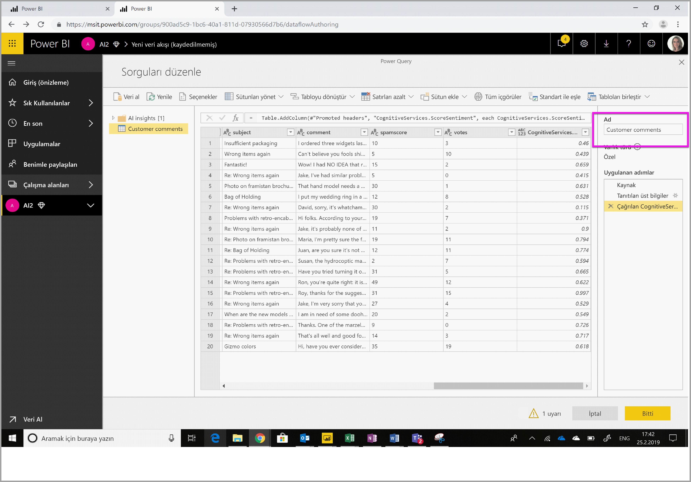

Ardından veri akışını **Kaydedin** ve Fabrikam olarak adlandırın. Veri akışı kaydedildikten sonra açılan **Şimdi Yenile** düğmesini seçin.

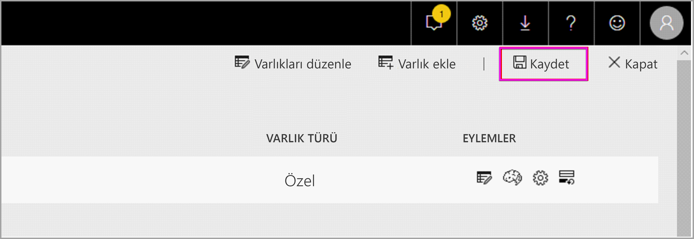

Veri akışı kaydedildikten ve yenilendikten sonra, bu veri akışını Power BI raporlarında kullanabilirsiniz.

### <a name="step-2-connect-from-power-bi-desktop"></a>2\. Adım: Power BI Desktop'tan bağlanma

Power BI Desktop'ı açın. Giriş şeridinde **Veri Al** 'ı seçin.

Power BI bölümünde **Power BI veri akışları (Beta** ) öğesine gidin ve **Bağlan** 'ı seçin.

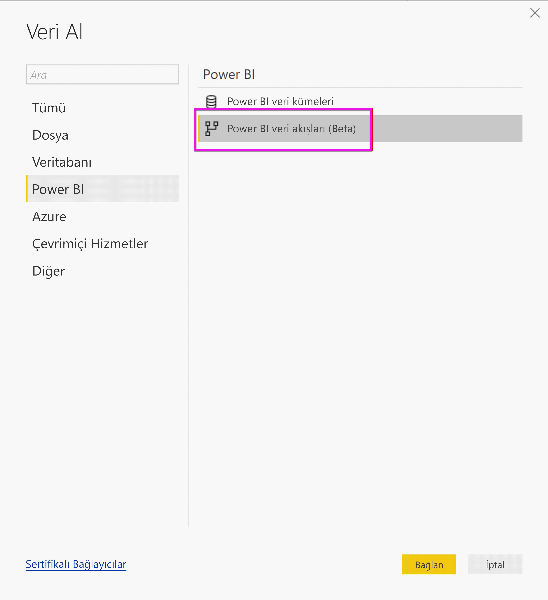

Bu bir önizleme özelliği olduğundan, bağlayıcı önizleme koşullarını kabul etmenizi isteyecektir. Bu koşulları kabul ettikten sonra kuruluş hesabınızla oturum açın.

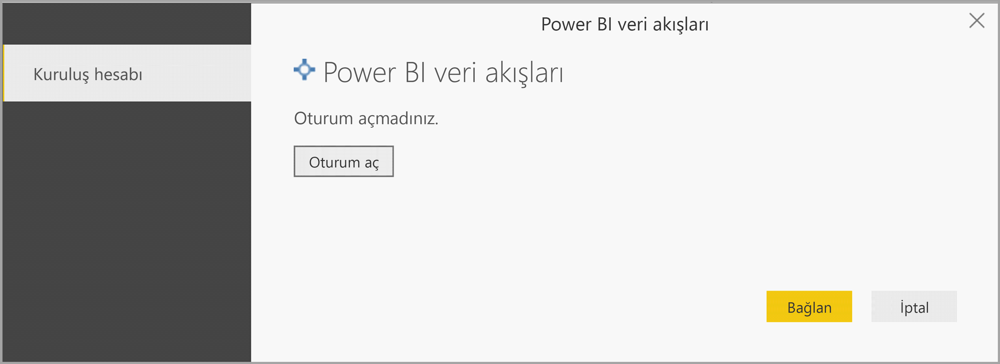

Az önce oluşturduğunuz veri akışını seçin. Müşteri yorumları tablosuna gidin ve **Yükle** 'ye tıklayın.

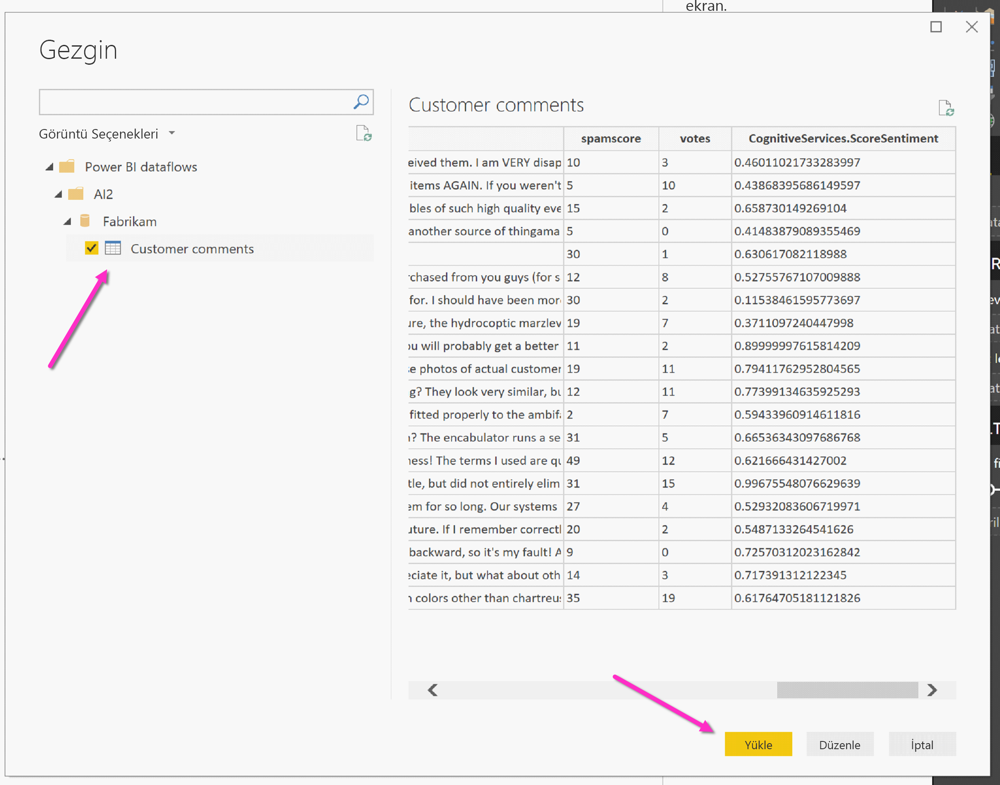

Artık veriler yüklendiğine göre raporu oluşturmaya başlayabilirsiniz.

## <a name="image-tagging"></a>Resim etiketleme

Premium kapasiteye sahip Power BI çalışma alanına gidin. Ekranın sağ üst kısmındaki **Oluştur** düğmesini kullanarak yeni bir veri akışı oluşturun.

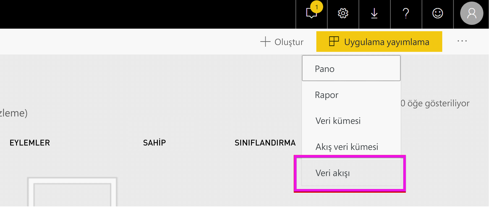

**Yeni varlıklar ekle** 'yi seçin.

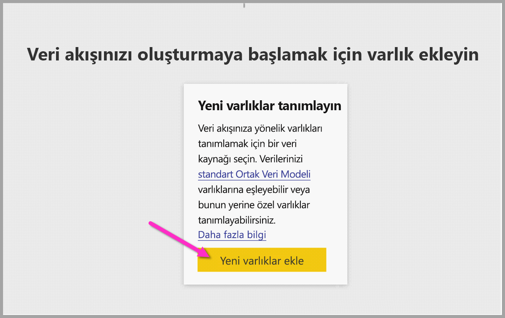

Veri kaynağı seçmeniz istendiğinde **Boş sorgu** 'yu seçin.

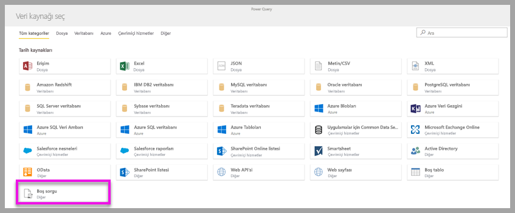

Aşağıdaki sorguyu sorgu düzenleyicisine kopyalayın ve İleri'ye tıklayın. Aşağıdaki URL yollarını başka resimlerle değiştirebilir veya daha fazla satır ekleyebilirsiniz. *Web.Contents* işlevi, resim URL'sini ikili olarak içeri aktarır. İkili dosya olarak depolanmış resimler içeren bir veri kaynağınız varsa, doğrudan bunu da kullanabilirsiniz.


```python
let
  Source = Table.FromRows({
  { Web.Contents("https://images.pexels.com/photos/87452/flowers-background-butterflies-beautiful-87452.jpeg") },
  { Web.Contents("https://upload.wikimedia.org/wikipedia/commons/5/53/Colosseum_in_Rome%2C_Italy_-_April_2007.jpg") }}, { "Image" })
in
  Source
```

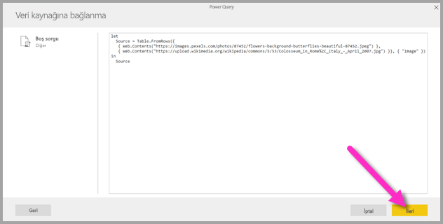

Kimlik bilgileri istendiğinde *Anonim* 'i seçin.

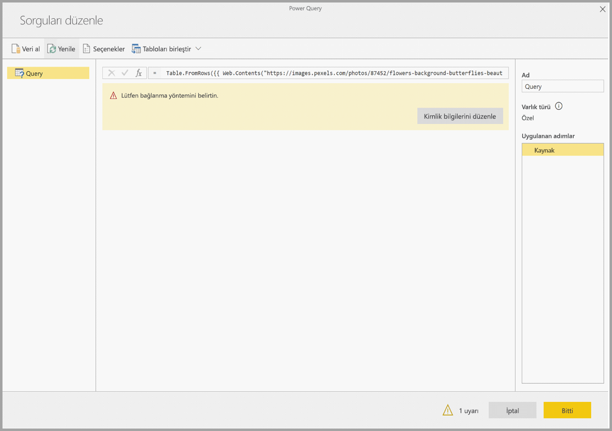

Aşağıdaki resmi görürsünüz.

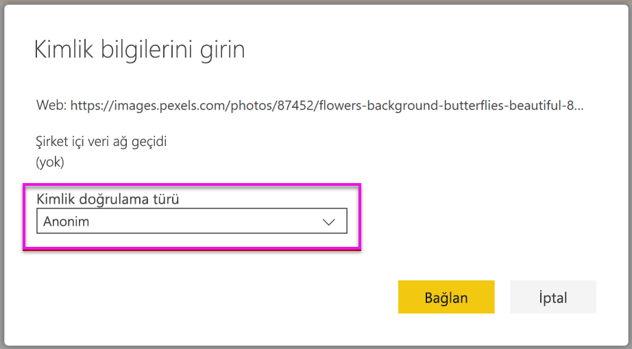

Tek tek her web sayfası için kimlik bilgileri sağlamanız istenir.

Sorgu düzenleyicisinde **AI İçgörüler** 'i seçin.

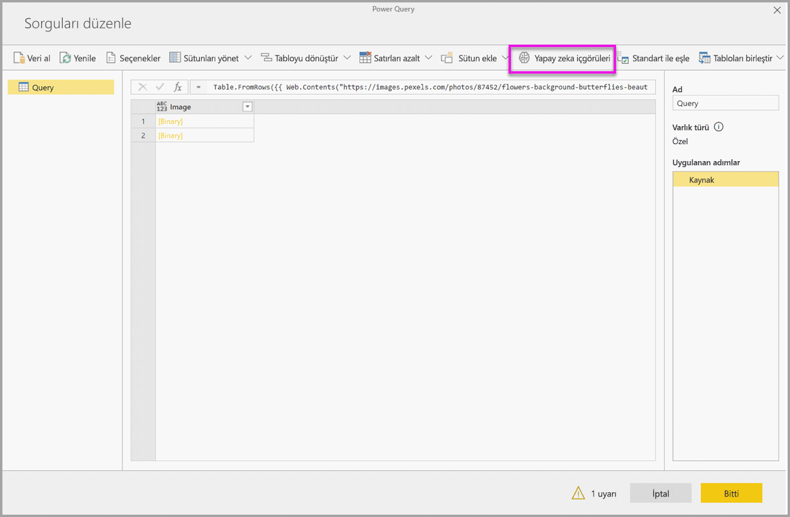

Ardından **kuruluş hesabınızla** oturum açın.

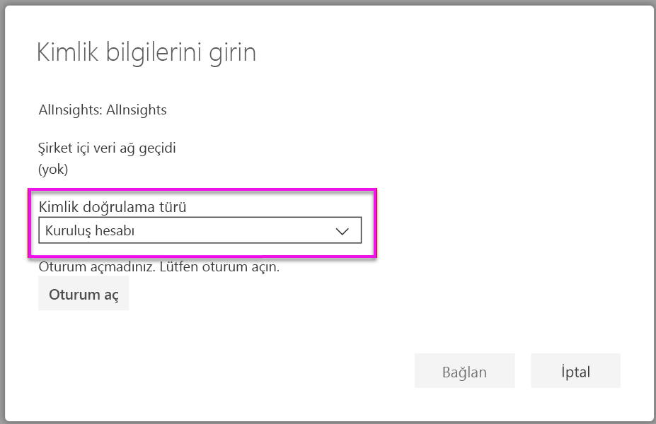

Tag Images işlevini seçin, sütun alanına _[Binary]_ ve kültür bilgisi alanına _en_ girin. 

> [!NOTE]
> Şu anda açılan listeyi kullanarak sütun seçemiyorsunuz; bu sorun özel önizleme sırasında en kısa zamanda çözülecektir.

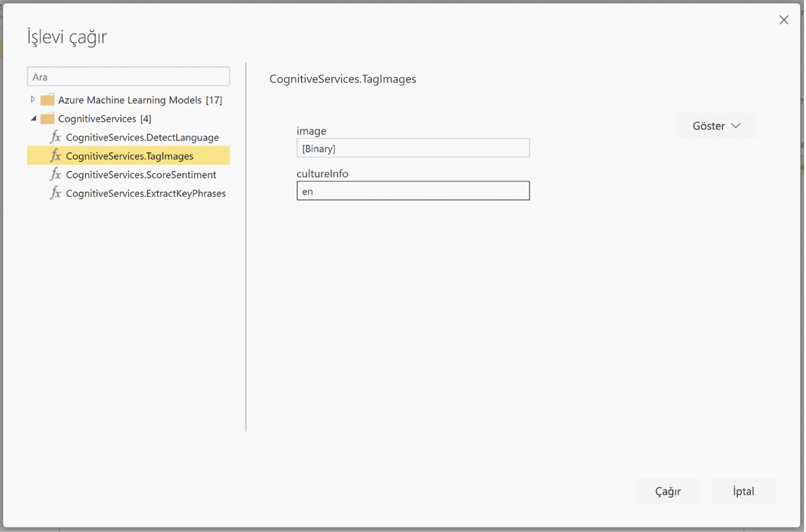

İşlev düzenleyicisinde, sütun adının çevresindeki tırnak işaretlerini kaldırın. 

> [!NOTE]
> Tırnak işaretlerinin kaldırılması geçici bir çözümdür; bu sorun önizleme sırasında en kısa zamanda çözülecektir.

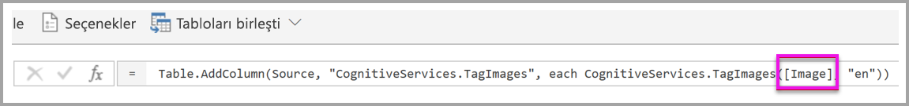

İşlem hem virgülle ayrılmış biçimde hem de json kaydı olarak etiketleri içeren bir kayıt döndürür. Birini veya her ikisini de tabloya eklemek için genişletme düğmesini seçin.

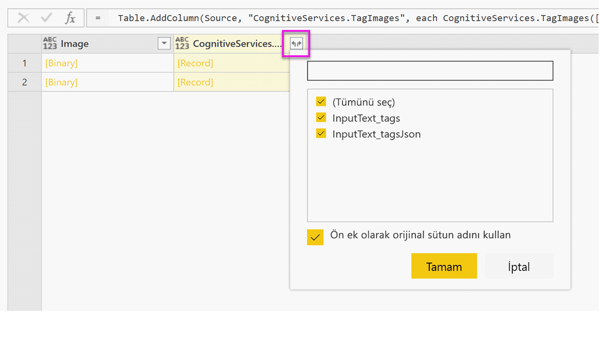

**Bitti** 'yi seçin ve veri akışını kaydedin. Veri akışını yeniledikten sonra, Power BI Desktop'tan Veri Akışları bağlayıcısını kullanarak bu veri akışına bağlanabilirsiniz. (Bu belgenin 5. sayfasındaki adımlara bakın.)

## <a name="clean-up-resources"></a>Kaynakları temizleme

Artık ihtiyacınız kalmadığında Power Query düzenleyicisinde sorgu adına sağ tıklayıp **Sil** 'i seçerek sorguyu silin.

## <a name="next-steps"></a>Sonraki adımlar

Bu öğreticide Power BI veri akışına yaklaşım puanlaması ve resim etiketleme işlevlerini uyguladınız. Power BI'da Bilişsel Hizmetler hakkında daha fazla bilgi edinmek için aşağıdaki makaleleri okuyun.

* [Azure'da Bilişsel Hizmetler](/azure/cognitive-services/)
* [Veri akışlarında self servis veri hazırlığına](../transform-model/dataflows/dataflows-introduction-self-service.md) başlama
* [Power BI Premium](https://powerbi.microsoft.com/power-bi-premium/) ile ilgili daha fazla bilgi edinin

Aşağıdaki makaleler de ilginizi çekebilir.

* [Öğretici: Power BI'da Machine Learning Studio (klasik) modelini çağırma (Önizleme)](service-tutorial-invoke-machine-learning-model.md)
* [Power BI'da Azure Machine Learning tümleştirmesi (Önizleme)](../transform-model/dataflows/dataflows-machine-learning-integration.md)
* [Power BI’da Bilişsel Hizmetler (Önizleme)](../transform-model/dataflows/dataflows-machine-learning-integration.md)