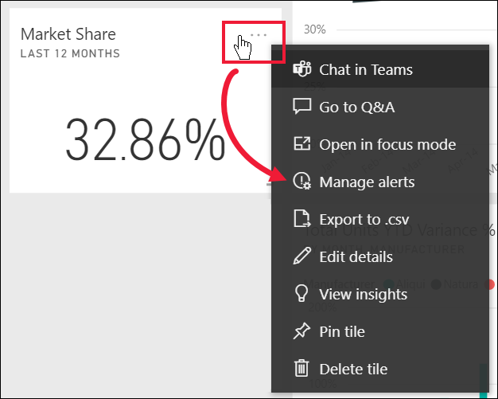
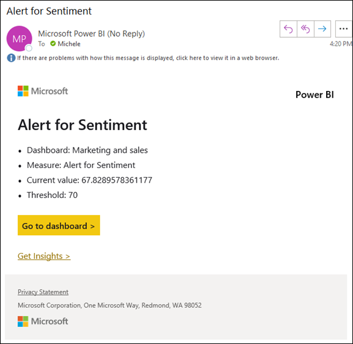

# Öğretici: Power BI panolarında uyarı ayarlama

[!INCLUDE[consumer-appliesto-yynn](../includes/consumer-appliesto-yynn.md)]

Power BI hizmetinde, panonuzdaki veriler belirlediğiniz sınırları aşacak veya sınırların altında kalacak şekilde değiştiğinde bunu size bildirecek uyarılar ayarlayın. Uyarılar yalnızca rapor görsellerinden sabitlenmiş olan kutucuklarda ve yalnızca ölçekler, KPI'ler ve kartlar için ayarlanabilir. 

Şu panolar üzerinde uyarılar oluşturulabilir:
- **Çalışma alanımda** oluşturup kaydettiğiniz
- [Premium kapasitede](end-user-license.md) sizinle paylaşılmış olan. 
- Power BI Pro lisansınız varsa, erişebileceğiniz herhangi bir çalışma alanında.    

Uyarılar yalnızca yenilenen verilerde çalışır. Veriler yenilendiğinde Power BI bu veriler için bir uyarı ayarlanıp ayarlanmadığını kontrol eder. Veriler bir uyarı eşiğine ulaştığında bir uyarı tetiklenir. 

Bu özellik hala geliştirilmektedir. Bu nedenle, [aşağıdaki İpuçları ve sorun giderme](#tips-and-troubleshooting) bölümüne bakın.

Panonuzu paylaşsanız dahi ayarladığınız uyarıları yalnızca siz görebilirsiniz. Veri uyarıları platformlar arasında tamamen eşitlenir. Veri uyarılarını [Power BI mobil uygulamalarında](mobile/mobile-set-data-alerts-in-the-mobile-apps.md) ve Power BI hizmetinde ayarlayıp görüntüleyebilirsiniz. 

> [!WARNING]
> Bu uyarılar verileriniz hakkında bilgi sağlar. Power BI verilerini bir mobil cihazda görüntülüyorsanız ve cihazınız çalınırsa, Power BI hizmetini kullanarak tüm uyarıları devre dışı bırakmanızı öneririz.
> 

Bu öğretici aşağıdakileri ele almaktadır.
> [!div class="checklist"]
> * Kimler uyarı koyabilir
> * Hangi görseller uyarıları destekler
> * Uyarılarımı kimler görebilir
> * Uyarılar Power BI Desktop'ta ve mobilde çalışır mı
> * Uyarı nasıl oluşturulur?
> * Uyarılarımı nereden alacağım

## Ön koşullar

Power BI’ya kaydolmadıysanız başlamadan önce [ücretsiz deneme için kaydolun](https://app.powerbi.com/signupredirect?pbi_source=web).

1. Bu örnek, Satış ve Pazarlama örneğindeki bir pano kartı kutucuğunu kullanır. Power BI hizmetini (app.powerbi.com) açın, oturum açın ve **Çalışma Alanım** bölümünüzü açın.    
    

2. Sol alt köşedeki **Veri Al** seçeneğini belirleyin.

    

3. Görüntülenen Veri Al sayfasında **Örnekler**’i seçin.

4. Satış ve Pazarlama Örneği’ni ve ardından **Bağlan**’ı seçin.

    

5. Power BI örneğe bağlandıktan sonra görüntülenen iletişim kutusundan **Panoya git**’i seçin.     
    

## Bir pano kutucuğuna uyarı ekleme

1. Panodaki bir ölçek, KPI veya kart kutucuğunda üç nokta simgesini seçin.
   
   

2. Uyarı simgesini  veya **Uyarıları yönet**’i seçerek **Pazar payı** kartı için bir veya daha fazla uyarı ekleyin.

   

   
1. **Uyarıları yönet** bölmesinde **+ Uyarı kuralı ekle**'yi seçin.  Kaydırıcının **Açık** konumda olduğundan emin olun ve uyarınıza bir ad verin. Başlıklar, uyarılarınızı kolayca ayırt etmenizi sağlar.
   
   
4. Sayfayı aşağı kaydırıp uyarıyla ilgili ayrıntıları girin.  Bu örnekte, pazar payımız 40’a veya daha üzerine çıktığında bizi günde bir kez bilgilendiren bir uyarı oluşturacağız. Uyarılar, [Bildirim merkezimizde](end-user-notification-center.md) görüntülenecek. Ayrıca Power BI bize bir e-posta da gönderecek.
   
   

5. **Kaydet ve kapat**’ı seçin.
 

   > 

## Uyarı alma
Takip edilen veriler belirlediğiniz eşiklerden birine ulaşırsa birkaç şey gerçekleşir. Öncelikle Power BI (belirlediğiniz seçeneğe bağlı olarak) son uyarının gönderilmesinin üzerinden bir saat veya 24 saat geçip geçmediğini kontrol eder. Veriler eşiği geçtiği sürece uyarı gönderilir.

Ardından, Power BI, Bildirim merkezinize ve isteğe bağlı olarak gelen kutunuza uyarı gönderir. Uyarılarda doğrudan verilerinize ulaşabileceğiniz bir bağlantı da bulunur. İlgili kutucuğu görmek için bağlantıyı seçin.  

1. Uyarının e-posta gönderme ayarını etkinleştirdiyseniz, Gelen Kutunuzda aşağıdakine benzer bir ileti görürsünüz. Bu, **Yaklaşım** kartı için ayarladığımız bir uyarıdır.
   
   
2. Power BI, **Bildirim merkezinize** de bir ileti ekler.
   
   
3. Uyarıyla ilgili ayrıntılı bilgileri görmek için Bildirim merkezinizi açın.
   
    
   
  

## Uyarıları yönetme

Uyarılarınızı yönetmek için kullanabileceğiniz birçok farklı yöntem vardır: Pano kutucuğunun kendisinden, Power BI Ayarlar menüsünden, [iPhone’daki Power BI mobil uygulaması](mobile/mobile-set-data-alerts-in-the-mobile-apps.md) veya [Windows 10 için Power BI mobil uygulamasında](mobile/mobile-set-data-alerts-in-the-mobile-apps.md) yer alan kutucuktan.

### Kutucuğun kendisinden

1. Kutucuklara ilişkin uyarıları değiştirmek veya kaldırmak için uyarı simgesini  seçerek **Uyarıları yönet** penceresini yeniden açın. İlgili kutucuk için ayarladığınız tüm uyarılar görüntülenir.
   
    .
2. Bir uyarıyı değiştirmek için adının sol tarafındaki oku seçin.
   
    .
3. Bir uyarıyı silmek için adının sağ tarafındaki çöp kutusunu seçin.
   
      

### Power BI Ayarlar menüsünden

1. Power BI menü çubuğundaki dişli simgesini seçin.
   
    .
2. **Ayarlar** bölümünden **Uyarılar**'ı seçin.
   
    
3. Bu sayfadan uyarıları etkinleştirebilir ve devre dışı bırakabilir, **Uyarıları yönet** penceresini açarak değişiklik yapabilir veya uyarıları silebilirsiniz.

## İpuçları ve sorun giderme 

* Bir ölçer, KPI veya kart için uyarı ayarlayamıyorsanız yardım için Power BI yöneticinize veya BT yardım masanıza başvurun. Uyarılar, bazen panolarınız veya belirli türden pano kutucukları için kapatılır veya kullanılamaz.
* Uyarılar yalnızca yenilenen verilerde çalışır. Sabit veriler üzerinde çalışmazlar. Microsoft tarafından sağlanan örneklerin çoğu statiktir. 
* Paylaşılan içeriği almak ve görüntülemek için Power BI Pro veya Premium lisansı gerekir. Daha fazla bilgi için bkz. [Hangi lisansa sahibim?](end-user-license.md)
* Bir rapordan panoya sabitlenmiş olan akış veri kümelerinden oluşturulan görseller üzerinde uyarılar ayarlanabilir. **Kutucuk ekle** > **Özel akış verileri** kullanılarak doğrudan pano üzerinde oluşturulan akış kutucukları üzerinde uyarılar ayarlanamaz.

## Kaynakları temizleme
Uyarıları silmek yönergeleri yukarıda açıklanmıştır. Kısaca, Power BI menü çubuğundaki dişli simgesini seçin. **Ayarlar**'ın altından **Uyarılar**'ı seçin ve uyarıyı silin.

> [!div class="nextstepaction"]
> [Mobil cihazınızda veri uyarısı oluşturma](mobile/mobile-set-data-alerts-in-the-mobile-apps.md)

