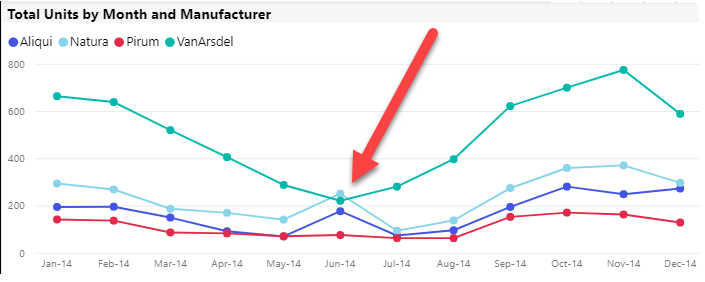
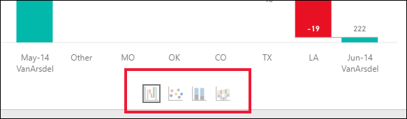

# Rapor görsellerindeki dalgalanmaları açıklamak için Analiz özelliğini kullanma

[!INCLUDE[consumer-appliesto-yynn](../includes/consumer-appliesto-yynn.md)]

Genellikle rapor görsellerindeki değerlerde büyük bir artış ve ardından sert bir düşüş görürsünüz. Bu dalgalanmaların nedenini merak ediyor olabilirsiniz. **Power BI hizmetindeki** **Analiz** sayesinde nedeni birkaç tıklamayla bulabilirsiniz.

Örneğin, *Toplam birimleri* *Ay* ve *Üretici*’ye göre gösteren aşağıdaki görseli ele alalım. VanArsdel rakiplerine kıyasla çok daha üstün durumdaydı ancak Haziran 2014’te derin bir batışa geçti. Bu gibi durumlarda oluşan değişikliğin nedenini açıklamaya yardımcı olması için verileri keşfedebilirsiniz. 

Power BI görsellerdeki hizmetinden artışları, düşüşleri ve olağandışı dağıtımları açıklamasını isteyip verileriniz hakkında hızlı, otomatikleştirilmiş, bilgiye dayalı analiz alabilirsiniz. Bir veri noktasına sağ tıklayıp **Analiz > Düşüşü açıkla**’yı (veya önceki değer daha düşükse artışı) veya **Analiz > Bu dağıtımın nerede farklı olduğunu bul**’u seçin. İçgörü, kullanışlı bir pencerede gösterilir.

Analiz özelliği bağlamsaldır ve bir önceki veri noktasını (bir önceki çubuk veya sütun gibi) temel alır.

> [!NOTE]
> Bu özellik önizleme sürümündedir ve değişikliğe tabidir. İçgörü özelliği varsayılan olarak etkin ve açıktır. (Etkinleştirmek için Önizleme kutusunu işaretlemeniz gerekmez.)

### Seçilen faktörler ve kategoriler

Farklı sütunlar incelendikten sonra Power BI, göreli katkıda en yüksek değişikliği gösteren bu faktörleri seçip görüntüler. Katkı açısından en önemli değişikliğe sahip olan değerler açıklamada vurgulanır. Ayrıca en büyük gerçek artış ve düşüşlerin olduğu değerler de vurgulanır.

Power BI tarafından oluşturulan tüm içgörüleri görmek için kaydırma çubuğunu kullanın. Sıra, ilk olarak en önemli katkıda bulunanın gösterildiği şekilde derecelendirilir. 

## Öngörüleri kullanma
Görsellerde görünen eğilimleri açıklamak amacıyla içgörüleri kullanmak için bir çubuk veya çizgi grafiğindeki herhangi bir veri noktasına sağ tıklayıp **Analiz Et**’i seçin. Daha sonra, karşınıza gelen seçeneği belirleyin: **artışı açıkla**, **düşüşü açıkla** veya **farkı açıkla**.

Power BI, verileri makine öğrenimi algoritmalarından geçirerek pencerede bir görselin yanı sıra artışa veya düşüşe ya da farka en çok etki eden kategorileri belirten bir açıklama görüntüler.  Bu örnekte, ilk içgörü bir şelale grafiğidir.

Şelale görselinin en altında bulunan küçük simgeleri seçerek öngörülerin dağılım grafiği, yığılmış sütun grafik veya şerit grafik şeklinde görüntülenmesini sağlayabilirsiniz.

Sayfanın en üstündeki *başparmak yukarı* ve *başparmak aşağı* simgelerini kullanarak görsel ve özellik hakkında geri bildirimde bulunabilirsiniz.  

İçgörüleri, okuma veya görüntüleme modunda kullanabilir, bu sayede hem verileri analiz edebilir hem de raporlarınıza kolayca ekleyebileceğiniz görseller oluşturabilirsiniz. Raporu Düzenleme görünümünde açtıysanız başparmak simgelerinin yanında bir artı simgesi görürsünüz. Yeni bir görsel olarak raporunuza içgörü eklemek için artı simgesini seçin. 

## Döndürülen sonuçların ayrıntıları

İçgörüler tarafından döndürülen ayrıntıların amacı, iki dönem arasındaki farkı vurgulayarak değişikliğin kaynağını anlamanıza yardımcı olmaktır.  

Algoritmanın yaptığı işlemler modeldeki diğer tüm sütunları alma ve zaman dönemi *öncesinde* ve *sonrasında* bu sütuna göre dökümü hesaplama, bu dökümde gerçekleşen değişiklik miktarını belirleme ve ardından en büyük değişikliğin olduğu sütunları döndürme olarak ifade edilebilir. Örneğin, yukarıdaki şelale içgörüsünde *Eyalet* seçili. Louisiana, Texas ve Colorado eyaletlerinn yaptığı katkı Haziran’dan Temmuz’a %13’ten %19’a düştüğünden, *Toplam birimlerde* en çok düşüşe katkıda bulunmuş oldular.  

Döndürülen her içgörü için gösterilebilecek dört görsel vardır. Bu görsellerin üçü, dönemler arasındaki katkı değişikliğini vurgulamak için kullanılmıştır. Buna örnek olarak *2. üç aylık dönem* ile *3. üç aylık dönem* arasındaki artışın açıklaması verilebilir. Şerit grafiğinde, seçili veri noktasının hem öncesi hem de sonrasındaki değişimler gösterilir.

### Dağılım

Dağılım görseli, sütundaki (bu örnekte *Eyalet*) her bir değer için ölçünün birinci dönemdeki değerini (x ekseni değeri) ölçünün ikinci dönemdeki değeriyle (y ekseni) karşılaştırır. Değerin artması durumunda veri noktaları yeşil bölgede, azalması durumunda ise kırmızı bölgede olur. 

Kesik çizgi en iyi eşleşmeyi gösterir ve bu çizginin üzerindeki veri noktalarının genel eğilime göre daha fazla, altındakilerin ise daha az artmış olduğunu gösterir.  

Dönemlerden birinde boş değere sahip olan veri öğeleri dağılımda görünmez.

### %100 yığılmış sütun grafik

%100 yığılmış sütun grafik görseli, seçili veri noktası ve önceki veri noktası için toplama (%100) yapılan katkının değerini gösterir. Bu da her veri noktasına yapılan katkının yan yana karşılaştırılmasını sağlar. Bu örnekte araç ipucu, seçilen değer olan Texas için gerçek katkıyı gösterir. Eyaletleri listesi uzun olduğundan, araç ipuçları ayrıntıları görmenize yardımcı olur. Araç ipuçlarını kullanarak Texas’ın toplam birimlere (%31 ve %32) yaklaşık olarak aynı yüzdeyle katkıda bulunduğunu, ancak toplam birimlerin gerçek sayısı 89’dan 71’e düştüğünü görüyoruz. Y ekseninin bir toplam değil yüzde olduğunu, her sütun bandının değer değil yüzde olduğunu unutmayın. 

### Şerit grafik

Şerit grafik görseli ölçünün önceki ve sonraki değerini gösterir. Katkıda bulunanların *sıralaması* değiştiğinde (örneğin, *LA* iki numaralı katkıda bulunandan on bir numaralıya düşmüş) katkıda bulunanlardaki değişiklikleri göstermek için özellikle faydalıdır.  *TX*, üstünde önceki ve sonraki en önemli katkıda bulunan olduğunu belirten geniş bir şeritle temsil edildiğinden düşüş, katkı değerinin hem seçili dönemde hem de sonrasında düştüğünü gösterir.

### Şelale grafiği

Dördüncü görsel, dönemler arasındaki artışları veya düşüşleri gösteren bir şelale grafiğidir. Bu görsel, Haziran 2014’te bir önemli katkıda bulunanın net bir şekilde düşüşe geçtiğini (bu durumda **Eyalet**) gösteriyor. **Eyalet**’in toplam birimler üzerindeki etkisinin önemi Louisiana, Texas ve Colorado’daki düşüşlerin en önemli rolü oynadığını göstermesidir.      

 

## Önemli noktalar ve sınırlamalar
Bu içgörüler bir önceki veri noktasına göre gerçekleşen değişimi temel aldığından, görseldeki ilk veri noktasını seçtiğinizde bu özellik etkin değildir. 

**Analiz** tüm görsel türlerinde kullanılamaz. 

**Analiz - Artış/düşüş/fark açıklamaları** için desteklenmeyen senaryoların listesi aşağıda verilmiştir:

* Üst N filtreleri
* Ekle/dışla filtreleri
* Ölçü filtreleri
* Sayısal olmayan ölçüler
* "Değeri farklı göster" özelliğinin kullanımı
* Filtrelenmiş ölçüler: Filtrelenmiş ölçüler, belirli bir filtrenin uygulanmış olduğu görsel düzeyinde hesaplamalardır (örneğin: *Fransa için Toplam Satış*) ve içgörüler özelliği tarafından oluşturulan bazı görsellerde kullanılır
* Skaler sıralama ölçütü tanımlamayan X ekseni üzerindeki kategorik sütunlar. Hiyerarşi kullanıyorsanız etkin hiyerarşideki tüm sütunların bu koşula uygun olması gerekir

## Sonraki adımlar
[Şelale grafikleri](../visuals/power-bi-visualization-waterfall-charts.md)    
[Dağılım grafikleri](../visuals/power-bi-visualization-scatter.md)    
[Sütun grafikleri](../visuals/power-bi-report-visualizations.md)    
[Şerit grafikler](../visuals/desktop-ribbon-charts.md)
