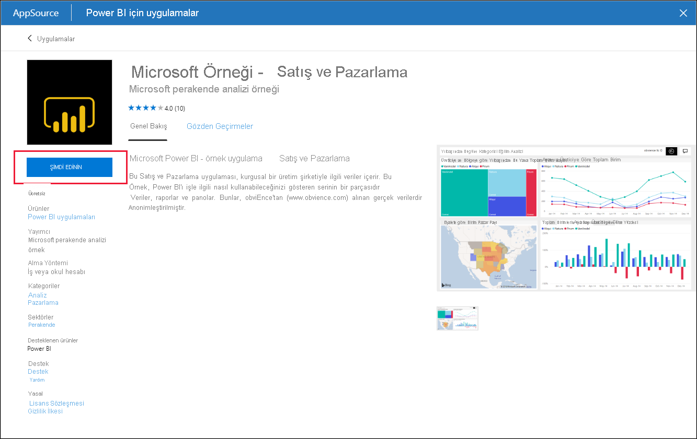
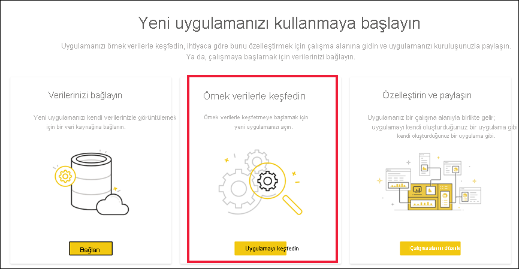

# Power BI hizmetinde örnek Satış ve Pazarlama uygulamasını yükleme ve kullanma

[!INCLUDE[consumer-appliesto-yyny](../includes/consumer-appliesto-yyny.md)]

Artık [Power BI içeriğini almayı temelde anladığınıza](end-user-app-view.md) göre şimdi de Pazarlama ve Satış uygulamasını almak için Microsoft AppSource’u kullanalım. 

## Uygulamayı Microsoft AppSource'tan alma

1. [https://appsource.microsoft.com](https://appsource.microsoft.com) sayfasını açın.

   

1. Arama kutusuna **Pazarlama** yazın ve **Ürüne göre daralt > Power BI uygulamaları**’nın yanına bir onay işareti koyun. 

    

1. **Microsoft örneği - Satış ve Pazarlama** uygulama kutucuğunu seçin. İsteğe bağlı olarak, genel bakışları ve incelemeleri okuyup resimlere göz atın.  Ardından, **Şimdi al**’ı seçin.

   

1. Bu uygulamayı yüklemek istediğinizi onaylayın.

   

5. Uygulama yüklendikten sonra, Power BI hizmeti yükleme başarılı iletisi gösterir. Uygulamayı açmak için **Uygulamaya git** seçeneğini belirleyin. Tasarımcının uygulamayı nasıl oluşturduğuna bağlı olarak uygulama panosu veya uygulama raporu görüntülenir.

    

    **Uygulamalar**’ı ve ardından **Satış ve Pazarlama** uygulama kutucuğunu seçerek, uygulamayı uygulama içerikleri listenizden doğrudan da açabilirsiniz.

    

6. Kendi verilerinizi bağlama, örnek verilerle keşfetme veya yeni uygulamanızı özelleştirip paylaşma seçeneklerinden birini belirleyin. Microsoft örnek uygulamasını seçtiğimiz için keşfetme ile başlayalım. 

    

7.  Yeni uygulamanız bir pano ile açılır. Uygulama *tasarımcısı*, uygulamayı bir raporu açacak şekilde ayarlamış da olabilir.  

    

## Uygulamadaki panolarla ve raporlarla etkileşim kurma
Zaman ayırıp uygulamayı oluşturan pano ve raporlardaki verileri keşfedin. Filtreleme, vurgulama, sıralama ve detaya gitme gibi tüm standart Power BI etkileşimlerine erişiminiz bulunur.  Panolar ve raporlar arasındaki fark hala kafanızı mı karıştırıyor?  [Panolar hakkındaki makaleyi](end-user-dashboards.md) ve [raporlar hakkındaki makaleyi](end-user-reports.md) okuyun.  

## Sonraki adımlar
* [Uygulamalara genel bakışa dönme](end-user-apps.md)    
* [Power BI raporu görüntüleme](end-user-report-open.md)    
* [İçeriğin sizinle paylaşılmasını sağlayan diğer yöntemler](end-user-shared-with-me.md)
