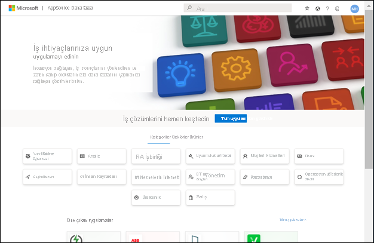

# Power BI hizmetinde örnek Satış ve Pazarlama uygulamasını yükleme ve kullanma

[!INCLUDE[consumer-appliesto-yyny](../includes/consumer-appliesto-yyny.md)]

Artık [Power BI içeriğini almayı temelde anladığınıza](end-user-app-view.md) göre şimdi de Pazarlama ve Satış şablonu uygulamasını almak için Microsoft AppSource’u kullanalım. Pazarlama ve Satış şablonu uygulaması, Power BI hizmetini incelemek için kullanabileceğiniz örnek veriler içerir. Bu özel uygulamanın tek panosu ve birkaç rapor sayfası vardır. 

> [!IMPORTANT]
> Microsoft AppSource'tan bu uygulamayı yüklemek için **Power BI Pro** lisansınızın olması gerekir.  Daha fazla bilgi için bkz. [Lisanslar](end-user-license.md).

## Uygulamayı Microsoft AppSource'tan alma

1. [https://appsource.microsoft.com](https://appsource.microsoft.com) sayfasını açın.

   

1. Arama kutusuna **Microsoft örneği** girin ve **Microsoft örneği - Satış ve Pazarlama** öğesini seçin. 

    

1. İsteğe bağlı olarak, genel bakışları ve incelemeleri okuyup resimlere göz atın.  Ardından, **Şimdi al**’ı seçin.

   

1. Bu uygulamayı yüklemek istediğinizi onaylayın.

   

5. Uygulama yüklendikten sonra, Power BI hizmeti yükleme başarılı iletisi gösterir. **Uygulamaya gidin**'i seçin. İsterseniz **Uygulamalar** tuvalinden uygulamanın kendisini de seçebilirsiniz. Tasarımcının uygulamayı nasıl oluşturduğuna bağlı olarak uygulama panosu veya uygulama raporu görüntülenir.

    

7.  Bu şablon uygulaması panoda açılacak şekilde ayarlanmıştır. Uygulama *tasarımcısı* bunun yerine uygulamayı rapor sayfalarından birinde açılacak şekilde ayarlamış da olabilir.  

    

## Uygulamadaki panolarla ve raporlarla etkileşim kurma
Zaman ayırıp uygulamayı oluşturan pano ve raporlardaki verileri keşfedin. Filtreleme, vurgulama, sıralama ve detaya gitme gibi tüm standart Power BI etkileşimlerine erişiminiz bulunur.  Panolar ve raporlar arasındaki fark hala kafanızı mı karıştırıyor?  [Panolar hakkındaki makaleyi](end-user-dashboards.md) ve [raporlar hakkındaki makaleyi](end-user-reports.md) okuyun.  

## Sonraki adımlar
* [Uygulamalara genel bakışa dönme](end-user-apps.md)    
* [Power BI raporu görüntüleme](end-user-report-open.md)    
* [İçeriğin sizinle paylaşılmasını sağlayan diğer yöntemler](end-user-shared-with-me.md)
