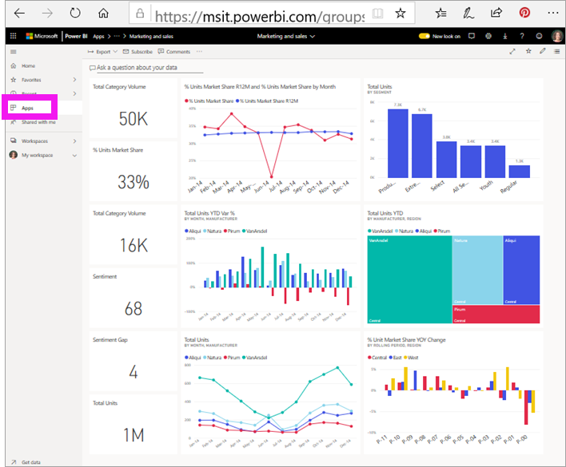

# Power BI hizmetinde örnek Satış ve Pazarlama uygulamasını yükleme ve kullanma

[!INCLUDE[consumer-appliesto-yyny](../includes/consumer-appliesto-yyny.md)]

Artık [Power BI içeriğini almayı temelde anladığınıza](end-user-app-view.md) göre şimdi de Microsoft AppSource'tan (appsource.com) Pazarlama ve Satış uygulamasını alalım. 

## Uygulamayı Power BI Uygulamaları marketinden alma

1. Henüz yapmadıysanız [Power BI hizmetinde oturum açın](./end-user-sign-in.md). 

1. Power BI’da oturum açtıktan sonra **Uygulamaları > Uygulamaları al**’ı seçin. 

    

1. Power BI Uygulamaları marketi açılır. Satış ve Pazarlama uygulamasını bulun. Bu uygulamayı görmüyorsanız arama kutusuna “Satış” yazmayı deneyin.

    

1. Uygulama kutucuğuna tıklayın. AppSource’daki uygulama teklifi açılır. **ŞİMDİ EDİNİN**’e tıklayın.

   

1. Bu uygulamayı yüklemek istediğinizi onaylayın.

   

5. Uygulama yüklendikten sonra, Power BI hizmeti yükleme başarılı iletisi gösterir. Uygulamayı açmak için **Uygulamaya git** seçeneğini belirleyin. Tasarımcının uygulamayı nasıl oluşturduğuna bağlı olarak uygulama panosu veya uygulama raporu görüntülenir.

    

    **Uygulamalar**’ı ve ardından **Satış ve Pazarlama**’yı seçerek, uygulamayı uygulama içerikleri listenizden doğrudan da açabilirsiniz.

    

6. Yeni uygulamanızı keşfetmek mi yoksa özelleştirip paylaşmak mı istediğinizi belirtin. Microsoft örnek uygulamasını seçtiğimiz için keşfetme ile başlayalım. 

    

7.  Yeni uygulamanız bir pano ile açılır. Uygulama *tasarımcısı*, uygulamayı bir raporu açacak şekilde ayarlamış da olabilir.  

    

## Uygulamadaki panolarla ve raporlarla etkileşim kurma
Zaman ayırıp uygulamayı oluşturan pano ve raporlardaki verileri keşfedin. Filtreleme, vurgulama, sıralama ve detaya gitme gibi tüm standart Power BI etkileşimlerine erişiminiz bulunur.  Panolar ve raporlar arasındaki fark hala kafanızı mı karıştırıyor?  [Panolar hakkındaki makaleyi](end-user-dashboards.md) ve [raporlar hakkındaki makaleyi](end-user-reports.md) okuyun.  

## Sonraki adımlar
* [Uygulamalara genel bakışa dönme](end-user-apps.md)
* [Power BI raporu görüntüleme](end-user-report-open.md)
* [İçeriğin sizinle paylaşılmasını sağlayan diğer yöntemler](end-user-shared-with-me.md)
