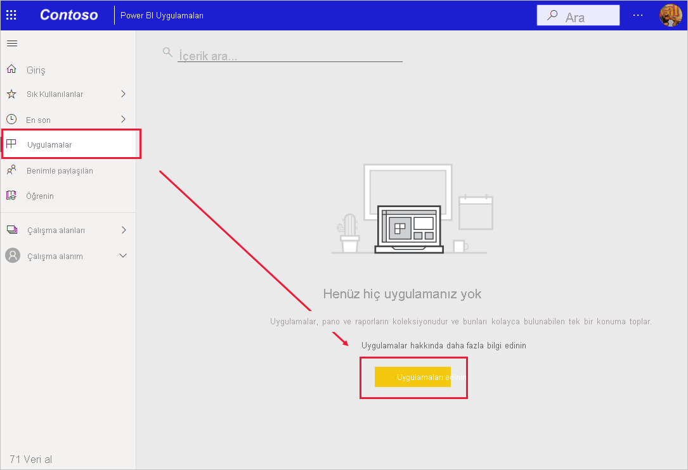
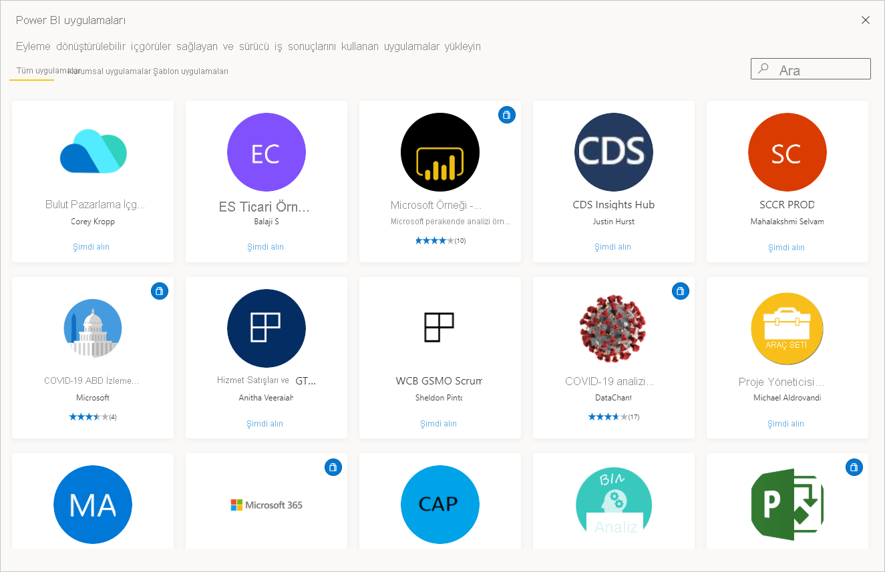

# Power BI'da panolar ve raporlar içeren uygulamalar yükleme ve bunları kullanma

[!INCLUDE[consumer-appliesto-ynny](../includes/consumer-appliesto-ynny.md)]

[!INCLUDE [power-bi-service-new-look-include](../includes/power-bi-service-new-look-include.md)]

[Uygulamalar hakkında temel bilgileri](end-user-apps.md) öğrendiğinize göre, şimdi uygulamaları açmayı ve uygulamalarla etkileşim kurmayı öğrenelim. 

## Yeni bir uygulama alma yolları
Yeni bir uygulama almanın birkaç yolu vardır:
* Power BI’daki Power BI Uygulama marketinden alabilirsiniz.
* Uygulama oluşturucusundan aldığınız doğrudan uygulama bağlantısını kullanabilirsiniz. 
* Kuruluşunuzdaki bir rapor tasarımcısı, uygulamayı otomatik olarak Power BI hesabınıza yükleyebilir.

Power BI mobil uygulamanızda doğrudan bağlantı ile uygulama yükleyebilirsiniz. Uygulama tasarımcısı uygulamayı otomatik olarak yüklerse uygulamalar listenizde bu uygulamayı görürsünüz.

## Uygulamalar ve lisanslar
Uygulamaları her Power BI kullanıcısı görüntüleyemez veya bunlarla etkileşim kuramaz. 
- Ücretsiz lisansınız varsa sizinle paylaşılan ve Premium kapasitedeki bir çalışma alanında depolanan uygulamaları açabilirsiniz.
- Pro lisansınız varsa sizinle paylaşılan uygulamaları açabilirsiniz.

## Uygulamayı Power BI Uygulamaları marketinden alma

Power BI Uygulamaları marketinden uygulamaları bulup yükleyebilirsiniz. Uygulamalar marketinden hem kuruluş uygulamalarını hem de şablon uygulamalarını alabilirsiniz.

1. Henüz yapmadıysanız [Power BI hizmetinde oturum açın](./end-user-sign-in.md). 

1. Power BI’da oturum açtıktan sonra **Uygulamaları > Uygulamaları al**’ı seçin. 

    

1. Power BI Uygulamaları marketi açılır.

   

   Kullanabileceğiniz üç sekme mevcuttur:
   * **Tüm uygulamalar** - Kullanımınıza sunulmuş şablon uygulamalarına ve tüm kuruluş uygulamalarına göz atın. Şablon uygulamaları, kutucuklarının sağ üst köşesindeki alışveriş çantası simgesiyle ayırt edilir.
   * **Kuruluş uygulamaları** - Sizinle paylaşılan kuruluş uygulamalarına göz atın. 
   * **Şablon uygulamaları** - AppSource’da barındırılan şablon uygulamalarına göz atın.

   Alternatif olarak, uygulamaların filtrelenmiş bir seçimini almak için arama kutusunu kullanabilirsiniz. Uygulamanın veya finans, analiz, pazarlama gibi bir kategori adının bir kısmını yazmak, aradığınız öğeyi bulmanızı kolaylaştırır. 

   Arama kutusu, açık olan sekmenize karşı duyarlıdır. Yalnızca seçili türdeki uygulamalar döndürülür. **Tüm uygulamalar** sekmesi açıksa hem kuruluş hem de şablon uygulamaları döndürülür. Bir kuruluş ve şablon uygulaması aynı ada sahipse bu kafa karıştırıcı olabilir. Şablon uygulaması kutucuklarının sağ üst köşesinde alışveriş çantası simgesi olduğunu unutmayın.

İstediğiniz uygulamayı bulduğunuzda yüklemek için **Şimdi al**’a tıklayın.
* Kuruluş uygulaması yüklüyorsanız uygulama listenize hemen eklenir.
* Şablon uygulaması yüklüyorsanız AppSource’daki şablon uygulaması teklifine yönlendirilirsiniz. Power BI Uygulamaları marketinden örnek bir şablon uygulaması indirip yüklemeye ilişkin [bir örneğe](end-user-app-marketing.md) göz atın. 

   > [!NOTE]
   > Ücretsiz kullanıcı lisansı kullanıyorsanız uygulamaları indirebilir ancak Power BI Pro hesabına yükseltene veya uygulama Premium kapasitede depolanana kadar görüntüleyemezsiniz. Daha fazla bilgi için bkz. [tüketici lisansları](end-user-license.md).

## Doğrudan bağlantı ile uygulama yükleme
Ayrıca, uygulama tasarımcısının e-posta ile gönderdiği doğrudan bağlantıyı kullanarak da bir kuruluş uygulaması yükleyebilirsiniz.  

**Bilgisayarınızda** 

E-postadaki bağlantıyı seçtiğiniz zaman, Power BI hizmeti ([https://powerbi.com](https://powerbi.com)) uygulamayı tarayıcınızda açar. 

**iOS veya Android mobil cihazınızda** 

Mobil cihazınızda e-postadaki bağlantıyı seçtiğiniz zaman, uygulama otomatik olarak yüklenir ve mobil uygulamada açılır. Önce oturum açmanız gerekebilir. 

## Uygulamadaki panolarla ve raporlarla etkileşim kurma
Zaman ayırıp uygulamayı oluşturan pano ve raporlardaki verileri keşfedin. Filtreleme, vurgulama, sıralama ve detaya gitme gibi tüm standart Power BI etkileşimlerine erişiminiz bulunur.  Panolar ve raporlar arasındaki fark hala kafanızı mı karıştırıyor?  [Panolar hakkındaki makaleyi](end-user-dashboards.md) ve [raporlar hakkındaki makaleyi](end-user-reports.md) okuyun.  

## Uygulama güncelleştirme 

Zaman zaman uygulama oluşturucuları uygulamalarının yeni sürümlerini kullanıma sunabilir. Yeni sürümü nasıl alacağınız özgün sürümü nasıl aldığınıza bağlıdır. 

* Uygulamayı kuruluşunuzdan aldıysanız, yeni sürüme güncelleştirme tamamen saydam olarak gerçekleştirilir; sizin hiçbir şey yapmanız gerekmez. 

* Uygulamayı AppSource'tan aldıysanız, uygulamayı bir sonraki açışınızda bir bildirim başlığı görürsünüz. Bildirimde size yeni sürümün kullanıma sunulduğu haberi iletilir. 

    1. Güncelleştirmek için **Alın** düğmesini seçin.  

        <!-- -->

    2. Güncelleştirilmiş uygulamayı yüklemeniz istendiğinde **Yükle**'yi seçin. 

         

    3. Zaten bu uygulamanın bir sürümü sizde yüklü olduğunuzdan, mevcut sürümün değiştirilmesini mi yoksa güncelleştirilmiş uygulamanın yeni bir çalışma alanına yüklenmesini mi istediğinize karar verir.   

         

    > [!NOTE] 
    > Yeni bir sürüm yüklendiğinde, rapor ve panolarda yapmış olabileceğiniz değişikliklerin üzerine yazılır. Güncelleştirilmiş rapor ve panolarınızı tutmak için, yüklemeden önce bunları farklı bir adla veya farklı bir konuma kaydedebilirsiniz. 

    4. Güncelleştirilmiş sürümü yükledikten sonra, güncelleştirme işlemini tamamlamak için **Uygulamayı güncelleştir**’i seçin. 

## Sonraki adımlar
* [Uygulamalara genel bakışa dönme](end-user-apps.md)
* [Power BI raporu görüntüleme](end-user-report-open.md)
* [İçeriğin sizinle paylaşılmasını sağlayan diğer yöntemler](end-user-shared-with-me.md)

