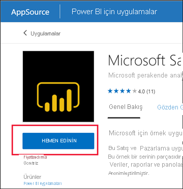
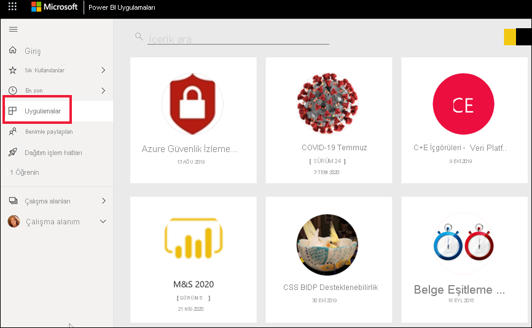
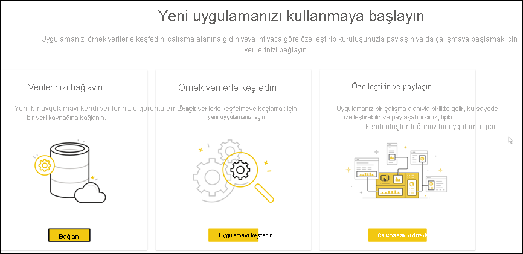
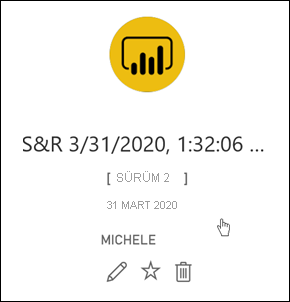
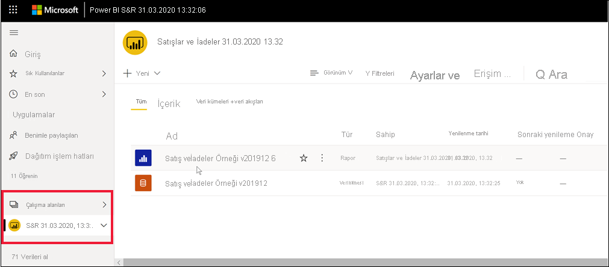

# Power BI'da panolar ve raporlar içeren uygulamalar yükleme ve bunları kullanma

[!INCLUDE[consumer-appliesto-ynny](../includes/consumer-appliesto-ynny.md)]

[!INCLUDE [power-bi-service-new-look-include](../includes/power-bi-service-new-look-include.md)]

[Uygulamalar hakkında temel bilgileri](end-user-apps.md) öğrendiğinize göre, şimdi uygulamaları açmayı ve uygulamalarla etkileşim kurmayı öğrenelim. 

## Yeni bir uygulama alma yolları
Yeni bir uygulama almanın birkaç yolu vardır:
* Power BI hizmetinde sunulan Power BI Uygulama marketinden bunu edinebilirsiniz.
* Uygulama tasarımcısından aldığınız doğrudan uygulama bağlantısını kullanabilirsiniz. 
* Kuruluşunuzdaki bir uygulama tasarımcısı, uygulamayı otomatik olarak Power BI hesabınıza yükleyebilir.

Power BI mobil ile bir uygulamayı yalnızca doğrudan bağlantı aracılığıyla yükleyebilirsiniz. Uygulama tasarımcısı uygulamayı otomatik olarak yüklerse uygulamalar listenizde bu uygulamayı görürsünüz.

## Uygulamalar ve lisanslar
Uygulamaları her Power BI kullanıcısı görüntüleyemez veya bunlarla etkileşim kuramaz. 
- Ücretsiz lisansınız varsa Premium kapasitede depolanan ve sizinle paylaşılan uygulamaları açabilirsiniz.  
- Pro lisansınız varsa sizinle paylaşılan uygulamaları açabilirsiniz.

Uygulamaları açamıyorsanız yöneticinize veya yardım masasına ulaşın. Lisanslama hakkında bilgi edinmek için bkz. [Power BI lisanslaması](end-user-license.md).

## Uygulamayı Power BI Uygulamaları marketinden alma

Power BI Uygulamaları marketinden uygulamaları bulup yükleyebilirsiniz. Uygulamalar marketinden hem kuruluş uygulamalarını hem de şablon uygulamalarını alabilirsiniz.

- *Kurumsal uygulama*, kuruluşunuzdaki Power BI kullanıcılarına sunulur. Bu uygulamalar, olduğu gibi kullanabileceğiniz veya özelleştirip paylaşabileceğiniz önceden oluşturulmuş panolar ve raporlar da içerir. Kuruluşunuzun satışları izleme, performansı ölçme ve işe alma başarısını analiz etmeye yönelik uygulamaları olabilir.
- *Şablon uygulaması*, işlerinizi yürütürken kullandığınız Salesforce, Microsoft Dynamics ve Google Analytics gibi birçok hizmete bağlanmak için kullanabileceğiniz önceden oluşturulmuş panolar ve raporlar içerir.

1. Henüz yapmadıysanız [Power BI hizmetinde oturum açın](./end-user-sign-in.md). 

1. Power BI hizmeti açıldıktan sonra **Uygulamalar > Uygulamaları al**’ı seçin. 

    

1. Power BI Uygulamaları marketi açılır.

   

   Kullanabileceğiniz üç sekme mevcuttur:
   * **Tüm uygulamalar** - Kullanımınıza sunulmuş şablon uygulamalarına ve tüm kuruluş uygulamalarına göz atın. Şablon uygulamaları, kutucuklarının sağ üst köşesindeki alışveriş çantası simgesiyle ayırt edilir.
   * **Kuruluş uygulamaları** - Sizinle paylaşılan kuruluş uygulamalarına göz atın. 
   * **Şablon uygulamaları** - AppSource’da barındırılan şablon uygulamalarına göz atın.

   Alternatif olarak, uygulamaların filtrelenmiş bir seçimini almak için arama kutusunu kullanabilirsiniz. Uygulamanın veya finans, analiz, pazarlama gibi bir kategori adının bir kısmını yazmak, aradığınız öğeyi bulmanızı kolaylaştırır. 

   Arama kutusu, açık olan sekmenize karşı duyarlıdır. Yalnızca seçili türdeki uygulamalar döndürülür. **Tüm uygulamalar** sekmesi açıksa hem kuruluş hem de şablon uygulamaları döndürülür. Bir kuruluş ve şablon uygulaması aynı ada sahipse bu kafa karıştırıcı olabilir. Şablon uygulaması kutucuklarının sağ üst köşesinde alışveriş çantası simgesi olduğunu unutmayın.

İstediğiniz uygulamayı bulduğunuzda yüklemek için **Şimdi al**’ı seçin.

   

* Kuruluş uygulaması yüklüyorsanız uygulama listenize hemen eklenir.
* Şablon uygulaması yüklüyorsanız AppSource’daki şablon uygulaması teklifine yönlendirilirsiniz. Power BI Uygulamaları marketinden örnek bir şablon uygulaması indirip yüklemeye ilişkin [bir örneğe](end-user-app-marketing.md) göz atın. Uygulama, aynı ada sahip bir çalışma alanıyla birlikte yüklenir.

   > [!NOTE]
   > Ücretsiz bir kullanıcı lisansı kullanıyorsanız uygulamaları indirebilir, ancak görüntüleyemezsiniz. Görüntüleyebilmeniz için bir Power BI Pro hesabına yükseltmeniz veya uygulamanın paylaşılan bir Premium kapasitede depolanması gerekir. Daha fazla bilgi için bkz. [iş kullanıcılar için lisanslar](end-user-license.md).

## Doğrudan bağlantı ile uygulama yükleme
Ayrıca, uygulama tasarımcısının e-posta ile gönderdiği doğrudan bağlantıyı kullanarak da bir kuruluş uygulaması yükleyebilirsiniz.  

**Bilgisayarınızda** 

E-postadaki bağlantıyı seçtiğiniz zaman, Power BI hizmeti ([https://app.powerbi.com](https://app.powerbi.com)) uygulamayı tarayıcınızda açar. 

**iOS veya Android mobil cihazınızda** 

Mobil cihazınızda e-postadaki bağlantıyı seçtiğiniz zaman, uygulama otomatik olarak yüklenir ve mobil uygulamada açılır. Önce oturum açmanız gerekebilir. 

## Uygulamadaki panolarla ve raporlarla etkileşim kurma
Zaman ayırıp uygulamayı oluşturan pano ve raporlardaki verileri keşfedin. Filtreleme, vurgulama, sıralama ve detaya gitme gibi tüm standart Power BI etkileşimlerine erişiminiz bulunur.  Panolar ve raporlar arasındaki fark hala kafanızı mı karıştırıyor?  [Panolar hakkındaki makaleyi](end-user-dashboards.md) ve [raporlar hakkındaki makaleyi](end-user-reports.md) okuyun.  

### Uygulamayı açma

Uygulama yüklediniz veya bir iş arkadaşınızdan uygulama aldınız. Bu uygulamayı görüntülemek için gezinti bölmesinden **Uygulamalar**’ı seçerek Uygulamalar içerik listenizi açın.

Uygulamanın üzerine gelip seçerek uygulamayı açın. Uygulamaya bağlı olarak aşağıdakine benzer bir istem görebilirsiniz:

Belirlenecek seçeneğe ilişkin kılavuz için bkz. [Şablon uygulamalarını yükleme](../connect-data/service-template-apps-install-distribute.md).

Ayrıntıları görmek için uygulamanın üzerine gelin ve uygulamayı açmak için uygulama kartını seçin.

Uygulama açılır. Her uygulama düzen, görseller, renkler ve seçenekler bakımından farklı görünür. Ancak tüm uygulamalarda ortak bazı özellikler de vardır.

1. Uygulamanın adı ve son güncelleştirme zamanı. Sahibi görmek ve Yardıma başvurmak için aşağı ok tuşunu seçin.
1. [Giriş](end-user-home.md) ekranına dönmek için **Power BI**’ı seçin.
1. Eylem çubuğunuz. 
1. Rapor sayfası tuvali.
1. Uygulama gezinti bölmesi.  Uygulamanın adının altında rapor sayfalarının listesi yer alır. Açmak için bir rapor sayfası adı seçin. Şu anda *İade oranı* sayfası açık. 
1. **Filtreler** bölmesini genişletmek için oku seçin.

İlişkili çalışma alanını da keşfedebilirsiniz. [Çalışma alanları hakkında bilgi edinin](end-user-workspaces.md) **Giriş**’e dönmek için **Power BI**’ı (2 numara) seçin ve **Çalışma Alanları** seçeneğini belirleyin. 

## Uygulama güncelleştirme 

Zaman zaman uygulama tasarımcıları, uygulamalarının yeni sürümlerini kullanıma sunabilir. Yeni sürümü nasıl alacağınız özgün sürümü nasıl aldığınıza bağlıdır. 

* Uygulamayı kuruluşunuzdan aldıysanız, yeni sürüme güncelleştirme tamamen saydam olarak gerçekleştirilir; sizin hiçbir şey yapmanız gerekmez. 

* Uygulamayı AppSource'tan aldıysanız, uygulamayı bir sonraki açışınızda bir bildirim başlığı görürsünüz. Bildirimde size yeni sürümün kullanıma sunulduğu haberi iletilir. 

    1. Güncelleştirmek için **Alın** düğmesini seçin.  

        <!-- -->

    2. Güncelleştirilmiş uygulamayı yüklemeniz istendiğinde **Yükle**'yi seçin. 

         

    3. Zaten bu uygulamanın bir sürümü sizde yüklü olduğunuzdan, mevcut sürümün değiştirilmesini mi yoksa güncelleştirilmiş uygulamanın yeni bir çalışma alanına yüklenmesini mi istediğinize karar verir.   

         

     > [!NOTE] 
     > Yeni bir sürüm yüklendiğinde, rapor ve panolarda yapmış olabileceğiniz değişikliklerin üzerine yazılır. Güncelleştirilmiş rapor ve panolarınızı tutmak için, yüklemeden önce bunları farklı bir adla veya farklı bir konuma kaydedebilirsiniz. 

    4. Güncelleştirilmiş sürümü yükledikten sonra, güncelleştirme işlemini tamamlamak için **Uygulamayı güncelleştir**’i seçin. 

## Önemli noktalar ve sorun giderme

- Uygulamaları yükleme özelliği, Power BI yöneticiniz tarafından açılıp kapatılabilir. Bu özelliğin etkinleştirilmesi gerekiyorsa BT departmanınıza veya yardım masanıza başvurun.    
- Uygulamaların kullanılması için bir Pro lisansı edinilmesi veya uygulamanın bir Premium paylaşılan kapasitede depolanması gerekir. [Lisanslar hakkında bilgi edinin](end-user-license.md).

## Sonraki adımlar
* [Uygulamalara genel bakışa dönme](end-user-apps.md)
* [Power BI raporu görüntüleme](end-user-report-open.md)
* [İçeriğin sizinle paylaşılmasını sağlayan diğer yöntemler](end-user-shared-with-me.md)

