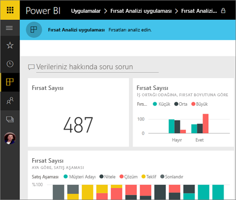
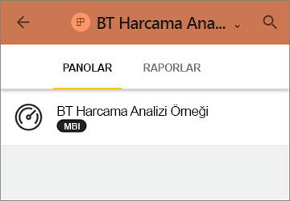
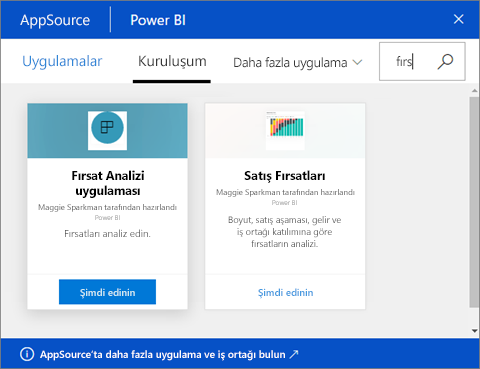
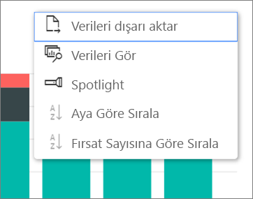

# Power BI'da panolar ve raporlar içeren uygulamalar yükleme ve bunları kullanma
[Uygulamalar hakkında temel bilgileri](end-user-apps.md) öğrendiğinize göre, şimdi uygulamaları açmayı ve uygulamalarla etkileşim kurmayı öğrenelim. 

## Yeni bir uygulama alma yolları
Yeni bir uygulama almanın birkaç yolu olduğunu unutmayın. Rapor tasarımcısı olan bir iş arkadaşınız uygulamayı Power BI hesabınıza otomatik olarak yükleyebilir veya size uygulamanın doğrudan bağlantısını gönderebilir. AppSource’a giderek şirketiniz içindeki ve dışındaki uygulamalar içinden kullanabileceğiniz uygulamaları arayabilirsiniz. 

Mobil cihazınızdaki Power BI'da, uygulamaları AppSource'tan değil, yalnızca bir doğrudan bağlantı ile yükleyebilirsiniz. Uygulama yazarı uygulamayı otomatik olarak yüklerse uygulamalar listenizde bu uygulamayı görürsünüz.

## Doğrudan bağlantı ile uygulama yükleme
Yeni bir uygulamayı yüklemenizin en kolay yolu, uygulama yazarından e-posta ile bir doğrudan bağlantı almaktır.  

**Bilgisayarınızda** 

E-postadaki bağlantıyı seçtiğiniz zaman Power BI hizmeti ([https://powerbi.com](https://powerbi.com)) bir tarayıcıda açılır. Uygulamayı yüklemek istediğinizi onayladığınızda Power BI uygulama giriş sayfasını açar.

**iOS veya Android mobil cihazınızda** 

Mobil cihazınızda e-postadaki bağlantıyı seçtiğiniz zaman uygulama otomatik olarak yüklenir ve mobil uygulamada uygulama içerik listesini açar. 

## Uygulamayı Microsoft AppSource'tan alma
Uygulamaları Microsoft AppSource’tan da bulabilir ve yükleyebilirsiniz. Yalnızca erişiminiz olan uygulamalar (yani uygulama yazarının size veya herkese izin verdiği uygulamalar) görüntülenir.

1. **Uygulamalar**  > **Uygulama edinin**'i seçin. 
   
     
2. AppSource'ta **Kuruluşum** altında, sonuçları daraltmak ve aradığınız uygulamayı bulmak için arama yapabilirsiniz.
   
     
3. Uygulamalar içerik listenize eklemek için **Şimdi edinin**'i seçin. 

## Uygulamadaki panolarla ve raporlarla etkileşim kurma
Artık uygulamadaki panolar ve raporlarda bulunan verileri araştırabilirsiniz. Filtreleme, vurgulama, sıralama ve detaya gitme gibi tüm standart Power BI etkileşimlerine erişebilirsiniz. Ayrıca rapordaki tablodan veya başka bir görselden [verileri Excel'e aktarabilirsiniz](end-user-export-data.md). [Power BI'da raporlarla etkileşim kurma](end-user-reading-view.md) ile ilgili bilgi edinin. 

## Sonraki adımlar
* [Dış hizmetler için Power BI uygulamaları](end-user-connect-to-services.md)
* Sorularınız mı var? [Power BI Topluluğu'na sorun](http://community.powerbi.com/)

