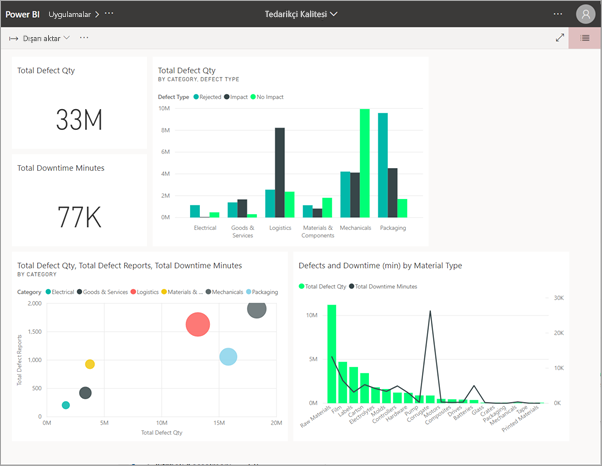
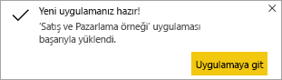

# Power BI'da panolar ve raporlar içeren uygulamalar yükleme ve bunları kullanma

[!INCLUDE[consumer-appliesto-ynny](../includes/consumer-appliesto-ynny.md)]

[!INCLUDE [power-bi-service-new-look-include](../includes/power-bi-service-new-look-include.md)]

[Uygulamalar hakkında temel bilgileri](end-user-apps.md) öğrendiğinize göre, şimdi uygulamaları açmayı ve uygulamalarla etkileşim kurmayı öğrenelim. 

## Yeni bir uygulama alma yolları
Yeni bir uygulama almanın birkaç yolu vardır. Rapor tasarımcısı olan bir iş arkadaşınız uygulamayı Power BI hesabınıza otomatik olarak yükleyebilir veya size uygulamanın doğrudan bağlantısını gönderebilir. AppSource’a giderek şirketinizin hem içindeki hem de dışındaki uygulama tasarımcılarının sunduğu uygulamalar arayabilirsiniz. 

Mobil cihazınızdaki Power BI'da, uygulamaları AppSource'tan değil, yalnızca bir doğrudan bağlantı ile yükleyebilirsiniz. Uygulama tasarımcısı uygulamayı otomatik olarak yüklerse uygulamalar listenizde bu uygulamayı görürsünüz.

## Doğrudan bağlantı ile uygulama yükleme
Yeni bir uygulamayı yüklemenizin en kolay yolu, uygulama tasarımcısından e-posta ile bir doğrudan bağlantı almaktır.  

**Bilgisayarınızda** 

E-postadaki bağlantıyı seçtiğiniz zaman, Power BI hizmeti ([https://powerbi.com](https://powerbi.com)) uygulamayı tarayıcınızda açar. 

**iOS veya Android mobil cihazınızda** 

Mobil cihazınızda e-postadaki bağlantıyı seçtiğiniz zaman, uygulama otomatik olarak yüklenir ve mobil uygulamada açılır. Önce oturum açmanız gerekebilir. 

## Uygulamayı Microsoft AppSource'tan alma
Uygulamaları Microsoft AppSource’tan da bulabilir ve yükleyebilirsiniz. Yalnızca erişiminiz olan uygulamalar (yani uygulama yazarının size veya herkese izin verdiği uygulamalar) görüntülenir.

1. **Uygulamalar**  > **Uygulama edinin** seçeneğini belirleyin. 
   
        
2. AppSource'ta **Kuruluşum** altında, sonuçları daraltmak ve aradığınız uygulamayı bulmak için arama yapabilirsiniz.
   
    
3. Uygulamalar içerik listenize eklemek için **Şimdi edinin**'i seçin. 

## Microsoft AppSource web sitesinden bir uygulama edinme 

Bu örnekte, Microsoft’un örnek uygulamalarının birini açacağız. AppSource’ta, işlerinizi yürütmek için kullandığınız çoğu hizmete yönelik uygulamalar bulabilirsiniz.  Salesforce, Microsoft Dynamics, Google Analytics, GitHub, Zendesk, Marketo, ve daha fazlası gibi hizmetler. Daha fazla bilgi edinmek için [Power BI ile kullandığınız hizmetlere yönelik uygulamalar](../service-connect-to-services.md) bölümünü ziyaret edin. 

1. Tarayıcıda [https://appsource.microsoft.com](https://appsource.microsoft.com) bağlantısını açın ve **Power BI uygulamaları**’nı seçin.

    

2. AppSource’ta şu anda kullanılabilir olan tüm Power BI uygulamalarının listesini görüntülemek için **Tümünü gör** seçeneğini belirleyin. Kaydırın veya **Microsoft Örneği - Satış ve Pazarlama** adlı uygulamayı arayın.

    

3. **Hemen edinin**’e tıklayıp kullanım koşullarını kabul edin.

    

4. Bu uygulamayı yüklemek istediğinizi onaylayın.

    

5. Uygulama yüklendikten sonra, Power BI hizmeti yükleme başarılı iletisi gösterir. Uygulamayı açmak için **Uygulamaya git** seçeneğini belirleyin. Tasarımcının uygulamayı nasıl oluşturduğuna bağlı olarak uygulama panosu veya uygulama raporu görüntülenir.

    

    **Uygulamalar**’ı ve ardından **Satış ve Pazarlama**’yı seçerek, uygulamayı uygulama içerikleri listenizden doğrudan da açabilirsiniz.

    

6. Yeni uygulamanızı keşfetmek mi yoksa özelleştirip paylaşmak mı istediğinizi belirtin. Microsoft örnek uygulamasını seçtiğimiz için keşfetme ile başlayalım. 

    

7.  Yeni uygulamanız bir pano ile açılır. Uygulama *tasarımcısı*, uygulamayı bir raporu açacak şekilde ayarlamış olabilir.  

    

## Uygulamadaki panolarla ve raporlarla etkileşim kurma
Zaman ayırıp uygulamayı oluşturan pano ve raporlardaki verileri keşfedin. Filtreleme, vurgulama, sıralama ve detaya gitme gibi tüm standart Power BI etkileşimlerine erişiminiz bulunur.  Panolar ve raporlar arasındaki fark hala kafanızı mı karıştırıyor?  [Panolar hakkındaki makaleyi](end-user-dashboards.md) ve [raporlar hakkındaki makaleyi](end-user-reports.md) okuyun.  

## Uygulama güncelleştirme 

Zaman zaman uygulama oluşturucuları uygulamalarının yeni sürümlerini kullanıma sunabilir. Yeni sürümü nasıl alacağınız özgün sürümü nasıl aldığınıza bağlıdır. 

* Uygulamayı kuruluşunuzdan aldıysanız, yeni sürüme güncelleştirme tamamen saydam olarak gerçekleştirilir; sizin hiçbir şey yapmanız gerekmez. 

* Uygulamayı AppSource'tan aldıysanız, uygulamayı bir sonraki açışınızda bir bildirim başlığı görürsünüz. Bildirimde size yeni sürümün kullanıma sunulduğu haberi iletilir. 

    1. Güncelleştirmek için **Alın** düğmesini seçin.  

        <!-- -->

    2. Güncelleştirilmiş uygulamayı yüklemeniz istendiğinde **Yükle**'yi seçin. 

         

    3. Zaten bu uygulamanın bir sürümü sizde yüklü olduğunuzdan, mevcut sürümün değiştirilmesini mi yoksa güncelleştirilmiş uygulamanın yeni bir çalışma alanına yüklenmesini mi istediğinize karar verir.   

         

    > [!NOTE] 
    > Yeni bir sürüm yüklendiğinde, rapor ve panolarda yapmış olabileceğiniz değişikliklerin üzerine yazılır. Güncelleştirilmiş rapor ve panolarınızı tutmak için, yüklemeden önce bunları farklı bir adla veya farklı bir konuma kaydedebilirsiniz. 

    4. Güncelleştirilmiş sürümü yükledikten sonra, güncelleştirme işlemini tamamlamak için **Uygulamayı güncelleştir**'i seçin. 

    <!-- -->

## Sonraki adımlar
* [Uygulamalara genel bakışa dönme](end-user-apps.md)
* [Power BI raporu görüntüleme](end-user-report-open.md)
* [İçeriğin sizinle paylaşılmasını sağlayan diğer yöntemler](end-user-shared-with-me.md)
