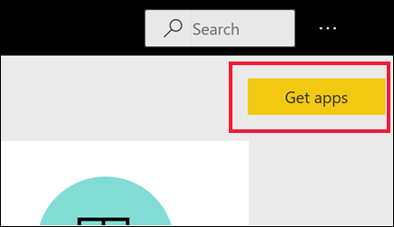
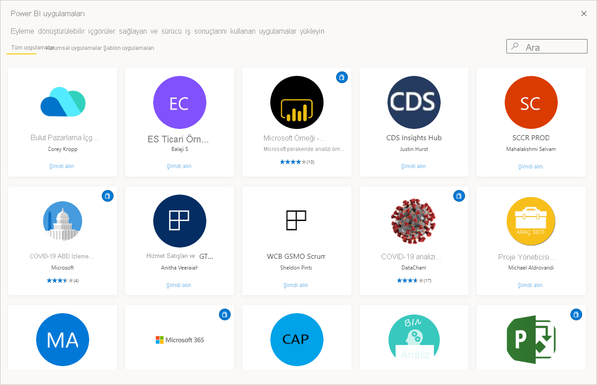
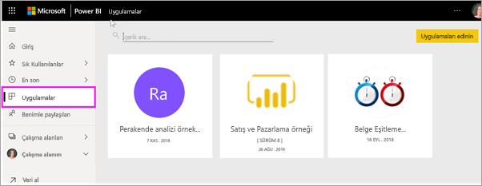

# Power BI'daki uygulamalar

[!INCLUDE[consumer-appliesto-ynny](../includes/consumer-appliesto-ynny.md)]

[!INCLUDE [power-bi-service-new-look-include](../includes/power-bi-service-new-look-include.md)]

## Power BI uygulamaları nedir?
*Uygulama*, ilgili panoları ve raporları bir araya getiren bir Power BI içerik türüdür. Bir uygulamada bir veya daha fazla pano ve bir veya daha fazla rapor bir arada bulunabilir. Uygulamalar Power BI *tasarımcıları* tarafından oluşturulur ve bu tasarımcıların iş arkadaşlarına dağıtılarak paylaşılır. *Tasarımcının* uygulama paylaşmasına yönelik birçok farklı yol vardır. Daha fazla bilgi edinmek için aşağıdaki **Yeni uygulama alma** bölümüne bakın. 

## Uygulama *tasarımcıları* ve uygulama *kullanıcıları*
İş rolünüze bağlı olarak, kendi kullanımınız veya iş arkadaşlarınızla paylaşmak için uygulama oluşturan biri (*tasarımcı*) olabilirsiniz. Alternatif olarak, başkaları tarafından oluşturulan uygulamaları alan ve indiren biri (*iş kullanıcısı*) olabilirsiniz. Bu makale, *iş kullanıcılarına* yöneliktir.

Bir uygulamayı görmek ve açmak için bazı izinler gerekir. Alıcının bir Power BI Pro lisansına sahip olması veya uygulamanın **Premium kapasite** adlı özel bir bulut depolaması türünde alıcıyla paylaşılması gerekir. Lisanslar ve Premium kapasite hakkında daha fazla bilgi edinmek için bkz. [Power BI hizmet lisansları](end-user-license.md).

## Uygulamaların avantajları
Uygulamalar, *tasarımcılar* için farklı türden içeriği tek tek paylaşmanın kolay yoludur. Uygulama *tasarımcıları*, panoları ve raporları oluşturup bunları bir uygulamada paketler. Ardından, *tasarımcılar* uygulamayı sizin (*iş kullanıcısının*) erişebileceğiniz bir konumda paylaşır veya yayımlar. İlgili pano ve raporlar paketlendiği için, bunu Power BI hizmetinde ([https://powerbi.com](https://powerbi.com)) ve mobil cihazınızda bulup yüklemeniz daha kolay olur. Bir uygulamayı yükledikten sonra, pano ve raporlar tek uygulamada, tarayıcınızda veya mobil cihazınızda birlikte bulunduğu için çok sayıda farklı pano ve raporun adını hatırlamak zorunda kalmazsınız.

Uygulamaları kullanırken, uygulama yazarı her güncelleştirme yayımladığında bir bildirim alır veya değişiklikleri otomatik olarak görürsünüz. Yazar ayrıca verilerin yenileme zamanlamasının sıklığını da denetler, bu sayede uygulamayı güncel tutma konusunda endişelenmezsiniz. 

<!-- add conceptual art -->
## Yeni bir uygulama alma
Yeni bir uygulama almanın birkaç farklı yolu vardır. Uygulamaları arayabilir, bulabilir ve yükleyebilirsiniz, uygulama tasarımcıları da sizinle uygulamalar paylaşabilir. 

### Power BI Uygulamaları marketinden uygulamaları bulup yükleme
Uygulamaları bulmanın bir yolu, Power BI **Uygulamaları** ekranından **Uygulamayı al**’ı seçmektir. 

Yükleyeceğiniz uygulamayı bulana kadar Power BI Uygulamaları marketindeki uygulamalar listesine göz atın. Yalnızca şirketinizdeki kişiler tarafından kullanılabilen **Kuruluş uygulamalarını** veya tüm Power BI kullanıcılarının yükleyebilmesi için Microsoft ve topluluk tarafından yayımlanan **Şablon uygulamalarını** seçin. 

Uygulamaları almanın farklı birkaç yolu daha vardır. Bu yollardan bazıları aşağıda listelenmiştir. Bir uygulamayı edinme ve keşfetmeye yönelik ayrıntılı, adım adım ilerleyen yönergeler için bkz. [Bir uygulamayı açma ve uygulamayla etkileşim kurma](end-user-app-view.md).

* Uygulamanın tasarımcısı uygulamayı Power BI hesabınızda otomatik olarak yükleyebilir ve Power BI hizmetini bir sonraki açışınızda yeni uygulamayı **Uygulamalar** içerik listenizde görebilirsiniz. 
* Uygulama tasarımcısı, uygulamanın doğrudan bağlantısını size e-posta olarak gönderebilir. Bağlantıyı seçmek, uygulamayı Power BI hizmetinde açar.
* Mobil cihazınızdaki Power BI'da, uygulamaları Uygulamalar marketinden değil, yalnızca bir doğrudan bağlantı ile yükleyebilirsiniz. Uygulama yazarı uygulamayı otomatik olarak yüklerse uygulamalar listenizde bu uygulamayı görürsünüz. 

Uygulamalarınız **Uygulamalar** içerik listesinde düzenlenir. Uygulamalarınızı görüntülemek için **Uygulamalar**’ı seçmeniz yeterlidir. Uygulamanın sahibini ve son güncelleştirme tarihini görmek için imlecinizi bir uygulamanın üzerine getirin. 

## Sonraki adımlar
* [Uygulama açma ve uygulamayla etkileşim kurma](end-user-app-view.md)
* [İçerik paylaşmanın diğer yolları](end-user-shared-with-me.md)

