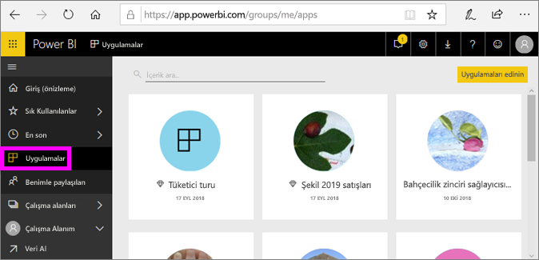
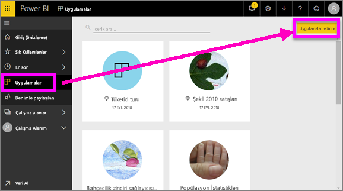
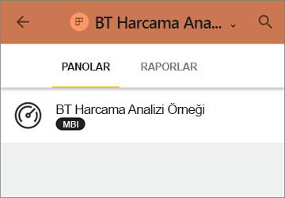
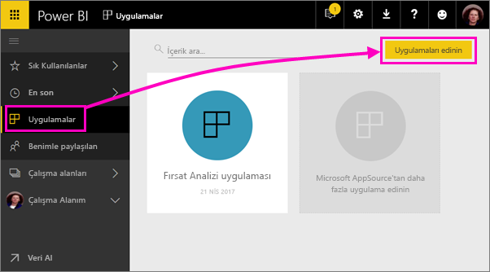
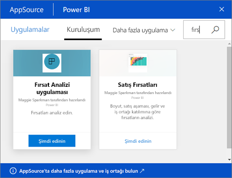
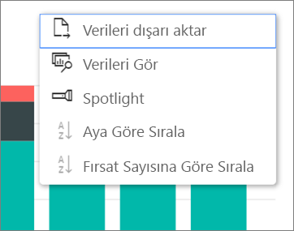

# Power BI'da panolar ve raporlar içeren uygulamalar yükleme ve bunları kullanma
Power BI'da *uygulamalar*, ilişkili panoları ve raporları tek bir yerde bir araya getirir. Kuruluşunuzdaki kişiler önemli iş bilgileri içeren uygulamalar oluşturur ve dağıtır. Google Analytics ve Microsoft Dynamics CRM gibi zaten kullanıyor olabileceğiniz [dış hizmetler](../service-connect-to-services.md) de Power BI uygulamaları sunar. 

Power BI hizmetinde ve mobil cihazınızda uygulamaları kolayca bulabilir ve yükleyebilirsiniz. Bir uygulamayı yükledikten sonra, panolar tek uygulamada, tarayıcınızda veya mobil cihazınızda birlikte bulunduğu için çok sayıda farklı panonun adını hatırlamak zorunda kalmazsınız.

Uygulamaları kullanırken, uygulama yazarı her güncelleştirme yayımladığında değişiklikleri otomatik olarak görürsünüz. Yazar ayrıca verilerin yenileme zamanlamasının sıklığını da denetler, bu sayede uygulamayı güncel tutma konusunda endişelenmezsiniz. 

## Yeni bir uygulama alma
Uygulamaları birkaç farklı yolla alabilirsiniz. Uygulama yazarı Power BI hesabınıza uygulamayı otomatik olarak yükleyebilir veya size bir uygulamanın doğrudan bağlantısını gönderebilir, alternatif olarak erişiminiz olan tüm uygulamaları gördüğünüz AppSource'ta uygulamayı arayabilirsiniz. Mobil cihazınızdaki Power BI'da, uygulamaları AppSource'tan değil, yalnızca bir doğrudan bağlantı ile yükleyebilirsiniz. Uygulama yazarı uygulamayı otomatik olarak yüklerse uygulamalar listenizde bu uygulamayı görürsünüz.

### Doğrudan bağlantı ile uygulama yükleme
Yeni bir uygulamayı yüklemenizin en kolay yolu, uygulama yazarından bir doğrudan bağlantı almaktır. Power BI, yazarın size gönderebileceği bir yükleme bağlantısı oluşturur.

**Bilgisayarınızda** 

E-postadaki bağlantıyı seçerek Power BI hizmetini ([https://powerbi.com](https://powerbi.com)) bir tarayıcıda açın. Uygulamayı yüklemek istediğinizi onayladığınızda uygulama giriş sayfası açılır.

**iOS veya Android mobil cihazınızda** 

Mobil cihazınızda e-postadaki bağlantıyı seçtiğiniz zaman uygulama otomatik olarak yüklenir ve mobil uygulamada uygulama içerik listesini açar. 

### Uygulamayı Microsoft AppSource'tan alma
Ayrıca, erişiminiz olan tüm uygulamaları Microsoft AppSource'ta bulabilir ve buradan yükleyebilirsiniz. 

1. **Uygulamalar**  > **Uygulama edinin**'i seçin. 
   
     
2. AppSource'ta **Kuruluşum** altında, sonuçları daraltmak ve aradığınız uygulamayı bulmak için arama yapabilirsiniz.
   
     
3. Uygulamalar sayfanıza eklemek için **Şimdi edinin**'i seçin. 

## Uygulamadaki panolarla ve raporlarla etkileşim kurma
Artık uygulamadaki panolar ve raporlarda bulunan verileri araştırabilirsiniz. Filtreleme, vurgulama, sıralama ve detaya gitme gibi tüm standart Power BI etkileşimlerine erişebilirsiniz. [Power BI'da raporlarla etkileşim kurma](end-user-reading-view.md) ile ilgili bilgi edinin. 

## Sonraki adımlar
[Dış hizmetler için Power BI uygulamaları](../service-connect-to-services.md)

