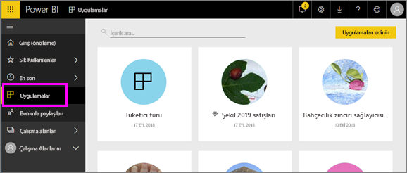

# Power BI'daki uygulamalar
## Power BI uygulamaları nedir?
*Uygulama*, ilgili panoları ve raporları bir araya getiren bir Power BI içerik türüdür. Bir uygulamada bir veya daha fazla pano ve bir veya daha fazla rapor bir arada bulunabilir. Uygulamalar Power BI *tasarımcıları* tarafından oluşturulur ve sizin gibi *tüketicilere* dağıtılarak paylaşılır. 

Uygulamalarınız **Uygulamalar** içerik listesinde düzenlenir.

## Uygulama ***tasarımcıları*** ve uygulama ***tüketicileri***
İş rolünüze bağlı olarak, kendi kullanımınız veya iş arkadaşlarınızla paylaşmak için uygulama oluşturan biri (tasarımcı) olabilirsiniz. Alternatif olarak, başkaları tarafından oluşturulan uygulamaları alan ve indiren biri (tüketici) olabilirsiniz. Bu makale uygulama *tüketicileri* içindir.

## Uygulamaların avantajları
Power BI hizmetinde ([https://powerbi.com](https://powerbi.com)) ve mobil cihazınızda uygulamaları kolayca bulabilir ve yükleyebilirsiniz. Bir uygulamayı yükledikten sonra, panolar tek uygulamada, tarayıcınızda veya mobil cihazınızda birlikte bulunduğu için çok sayıda farklı panonun adını hatırlamak zorunda kalmazsınız.

Uygulamaları kullanırken, uygulama yazarı her güncelleştirme yayımladığında değişiklikleri otomatik olarak görürsünüz. Yazar ayrıca verilerin yenileme zamanlamasının sıklığını da denetler, bu sayede uygulamayı güncel tutma konusunda endişelenmezsiniz. 

<!-- add conceptual art -->
## Yeni bir uygulama alma
Uygulamaları birkaç farklı yolla alabilirsiniz. 
- Uygulamanın yazarı uygulamayı Power BI hesabınızda otomatik olarak yükleyebilir ve Power BI’ı bir sonraki açışınızda yeni uygulamayı **Uygulamalar** içerik listenizde görebilirsiniz. 
- Uygulamanın yazarı uygulamaya doğrudan bir bağlantıyı e-posta ile gönderebilir. Bağlantıyı seçmek, uygulamayı Power BI’da açar.
- Erişiminiz olan tüm uygulamaları görebileceğiniz AppSource içinde uygulamaları arayabilirsiniz. AppSource şirketinizin içindeki ve dışındaki rapor tasarımcıları tarafından yayımlanan uygulamaları içerir. Örneğin, AppSource’ta Google Analytics, GitHub veya Microsoft Dynamics gibi zaten kullandığınız bir hizmet için uygulamalar bulabilirsiniz. 
- Mobil cihazınızdaki Power BI'da, uygulamaları AppSource'tan değil, yalnızca bir doğrudan bağlantı ile yükleyebilirsiniz. Uygulama yazarı uygulamayı otomatik olarak yüklerse uygulamalar listenizde bu uygulamayı görürsünüz.

## Sonraki adım
* [Uygulama açma ve uygulamayla etkileşim kurma](end-user-app-view.md)

