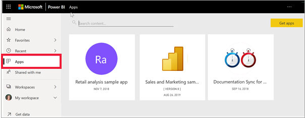

# Power BI'daki uygulamalar

[!INCLUDE[consumer-appliesto-ynny](../includes/consumer-appliesto-ynny.md)]

[!INCLUDE [power-bi-service-new-look-include](../includes/power-bi-service-new-look-include.md)]

## Power BI uygulamaları nedir?
*Uygulama*, ilgili panoları ve raporları bir araya getiren bir Power BI içerik türüdür. Bir uygulamada bir veya daha fazla pano ve bir veya daha fazla rapor bir arada bulunabilir. Uygulamalar Power BI *tasarımcıları* tarafından oluşturulur ve sizin gibi *tüketicilere* dağıtılarak paylaşılır. 

Uygulamalarınız **Uygulamalar** içerik listesinde düzenlenir. Uygulamalarınızı görüntülemek için **Uygulamalar**’ı seçmeniz yeterlidir. Uygulamanın sahibini ve son güncelleştirme tarihini görmek için imlecinizi bir uygulamanın üzerine getirin. 

Uygulamaların özelliğinin kullanılması için bir Power BI Pro lisansı veya uygulamanın Premium kapasitede depolanması gerekir. Lisanslar ve Premium kapasite hakkında daha fazla bilgi edinmek için bkz. [Tüketici lisansları](end-user-license.md).

## Uygulama *tasarımcıları* ve uygulama *tüketicileri*
İş rolünüze bağlı olarak, kendi kullanımınız veya iş arkadaşlarınızla paylaşmak için uygulama oluşturan biri (*tasarımcı*) olabilirsiniz. Alternatif olarak, başkaları tarafından oluşturulan uygulamaları alan ve indiren biri (*tüketici*) olabilirsiniz. Bu makale uygulama *tüketicileri* içindir.

## Uygulamaların avantajları
Uygulamalar, farklı türden içeriği tek tek paylaşmanın kolay yoludur. Uygulama *tasarımcıları*, panoları ve raporları oluşturup bunları bir uygulamada paketler. Ardından, *tasarımcılar* uygulamayı sizin (*tüketicinin*) erişebileceğiniz bir konumda paylaşır veya yayımlar. İlgili pano ve raporlar paketlendiği için, bunu Power BI hizmetinde ([https://powerbi.com](https://powerbi.com)) ve mobil cihazınızda bulup yüklemeniz daha kolay olur. Bir uygulamayı yükledikten sonra, pano ve raporlar tek uygulamada, tarayıcınızda veya mobil cihazınızda birlikte bulunduğu için çok sayıda farklı pano ve raporun adını hatırlamak zorunda kalmazsınız.

Uygulamaları kullanırken, uygulama yazarı her güncelleştirme yayımladığında değişiklikleri otomatik olarak görürsünüz. Yazar ayrıca verilerin yenileme zamanlamasının sıklığını da denetler, bu sayede uygulamayı güncel tutma konusunda endişelenmezsiniz. 

<!-- add conceptual art -->
## Yeni bir uygulama alma
Uygulamaları birkaç farklı yolla alabilirsiniz. Bazı yollar aşağıda listelenmiştir.  Bir uygulamayı edinme ve keşfetmeye yönelik ayrıntılı, adım adım ilerleyen yönergeler için bkz. [Bir uygulamayı açma ve uygulamayla etkileşim kurma](end-user-app-view.md).

- Uygulamanın tasarımcısı uygulamayı Power BI hesabınızda otomatik olarak yükleyebilir ve Power BI hizmetini bir sonraki açışınızda yeni uygulamayı **Uygulamalar** içerik listenizde görebilirsiniz. 
- Uygulama tasarımcısı, uygulamanın doğrudan bağlantısını size e-posta olarak gönderebilir. Bağlantıyı seçmek, uygulamayı Power BI hizmetinde açar.
- Mobil cihazınızdaki Power BI'da, uygulamaları AppSource'tan değil, yalnızca bir doğrudan bağlantı ile yükleyebilirsiniz. Uygulama yazarı uygulamayı otomatik olarak yüklerse uygulamalar listenizde bu uygulamayı görürsünüz.
- [AppSource](https://appsource.microsoft.com)’ta uygulama araması yapabilirsiniz. AppSource şirketinizin içindeki ve dışındaki rapor tasarımcıları tarafından yayımlanan uygulamaları içerir. Örneğin, AppSource’ta Google Analytics, GitHub veya Microsoft Dynamics gibi zaten kullandığınız bir hizmet için uygulamalar bulabilirsiniz. Power BI’ı öğrenmek amacıyla kullanabileceğiniz örnekler olan uygulamaları da bulabilirsiniz.  

## Sonraki adım
* [Uygulama açma ve uygulamayla etkileşim kurma](end-user-app-view.md)
* [İçerik paylaşmanın diğer yolları](end-user-shared-with-me.md)

