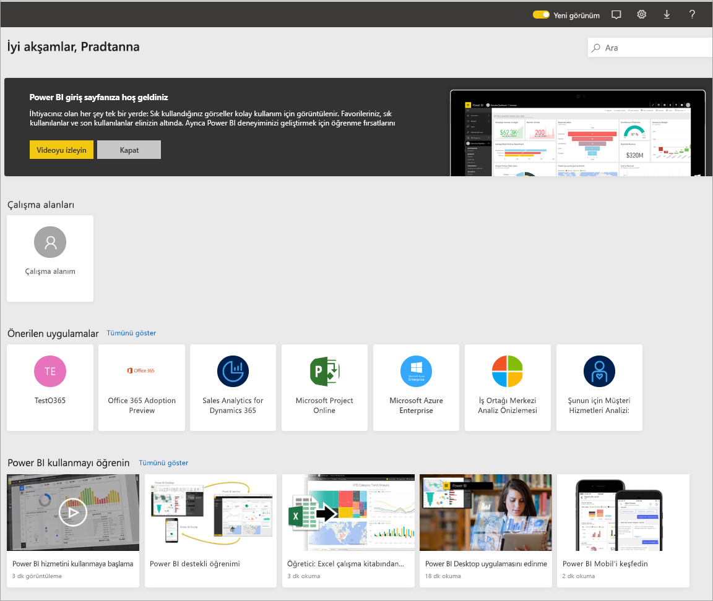
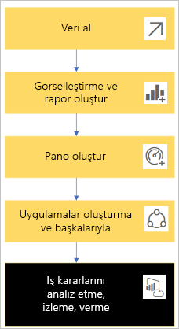
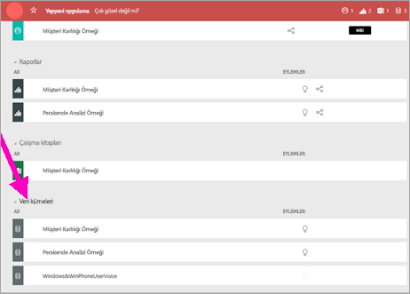
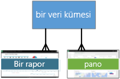
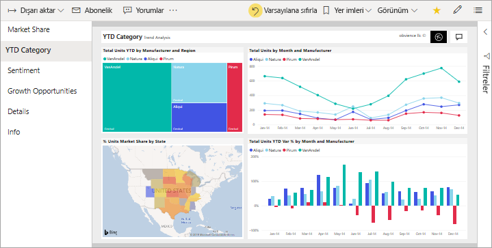
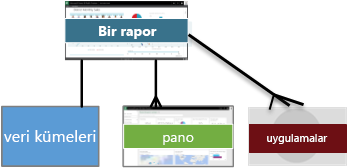
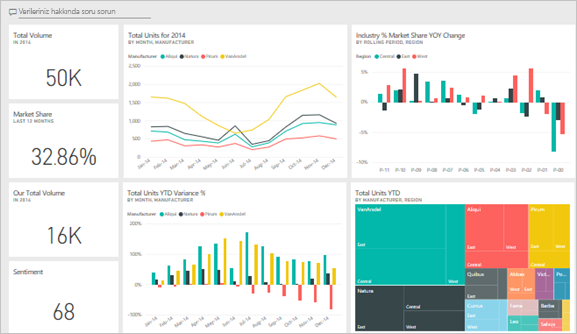
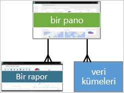
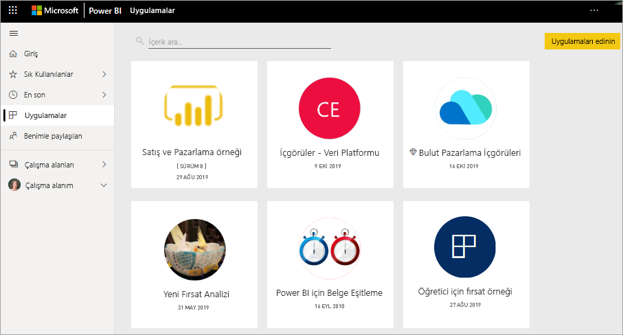
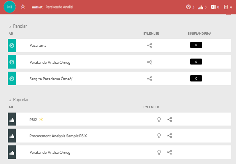

# Power BI hizmeti müşterilerine yönelik temel kavramlar

[!INCLUDE [power-bi-service-new-look-include](../includes/power-bi-service-new-look-include.md)]

Bu makalede [Power BI genel bakış](../fundamentals/power-bi-overview.md) sayfasını okuduğunuz ve bir [Power BI ***tüketicisi***](end-user-consumer.md) olduğunuza karar verdiğiniz varsayılmaktadır. Tüketiciler, iş arkadaşlarından panolar veya raporlar gibi Power BI içerikleri alan kullanıcılardır. Tüketiciler, Power BI'ın web sitesi tabanlı sürümü olan Power BI hizmetini kullanır.

"Power BI Desktop" veya yalnızca "Desktop" terimini mutlaka duyacaksınız. Bu, panolar ve raporları oluşturup sizinle paylaşan *tasarımcıların* kullandığı tek başına bir araçtır. Başka Power BI araçları da olduğunu bilmeniz önemlidir. Tüketici olduğunuz sürece yalnızca Power BI hizmetiyle çalışırsınız. Bu makale yalnızca Power BI hizmeti için geçerlidir.

## Terimler ve kavramlar

Bu makale Power BI için görsel tur veya uygulamalı öğretici niteliğinde değildir. Yalnızca Power BI terimlerine ve kavramlarına aşina olmanıza yardımcı olacak bir genel bakış makalesidir. Hizmeti kullanırken kendinizi yabancı hissetmemenizi sağlayacak bilgilere yer verilmiştir. Power BI hizmetinde ve gezintisinde tur atmak için [Hızlı Başlangıç - Power BI hizmetinde dolaşma](end-user-experience.md) seçeneğine gidin.

## Power BI hizmetini ilk kez açma

Power BI tüketicilerinin çoğu, Power BI hizmetine 1) şirketleri lisans satın aldığı için ve 2) bir yönetici lisansları sizin gibi çalışanlara atadığı için sahip olur.

Başlamak için bir tarayıcı penceresi açın ve **app.powerbi.com** adresini girin. Power BI hizmetini ilk kez açtığınızda aşağıdakine benzer bir ekranla karşılaşırsınız:

Power BI hizmetini kullandıkça web sitesini açtığınızda gösterilecek öğeleri kişiselleştirmiş olursunuz. Örneğin bazı kullanıcılar Power BI hizmetinin **Giriş** sayfasıyla açılmasını isterken bazıları ilk sayfada sık kullandıkları bir panoyu görmek ister. Sorun değil; bu makalede deneyiminizi nasıl kişiselleştirebileceğinizi öğreneceksiniz.

- [Power BI Giriş Sayfası ve Genel Aramasına Giriş](https://powerbi.microsoft.com/blog/introducing-power-bi-home-and-global-search)

- [Power BI hizmetindeki öne çıkan panolar](end-user-featured.md)

Ayrıntılara girmeden önce Power BI hizmetini oluşturan temel yapılardan bahsedelim.

_______________________________________________________

## Power BI içeriği

### Yapı taşlarına giriş

Bir Power BI tüketicisi için beş yapı taşı şunlardır: ***görselleştirmeler***, ***panolar***, ***raporlar***, ***uygulamalar*** ve ***veri kümeleri***. Bunlar bazen *Power BI* ***içeriği*** olarak da anılır. *İçerik*, ***çalışma alanlarında*** bulunur. Tipik bir iş akışı yapı taşlarının hepsini içerir: Power BI *tasarımcısı* (aşağıdaki diyagramda sarı ile gösterilmiştir) *veri kümelerinden* veri toplar, analiz etmek üzere Power BI'a getirir, ilgi çekici olguları ve içgörüleri vurgulayan *görselleştirmelerle* dolu *raporlar* oluşturur, raporlardaki görselleştirmeleri bir panoya sabitler ve raporlarla görselleştirmeleri sizin gibi *tüketicilerle* (aşağıdaki diyagramda siyah ile gösterilmiştir) paylaşır. *Tasarımcı* bunları *uygulamalar* biçiminde veya başka türlerde paylaşılan içerik olarak paylaşır.

En basit anlamıyla:

-  ***Görselleştirme*** (veya *görsel*), Power BI *tasarımcıları* tarafından oluşturulan bir grafik türüdür. Görsellerde *raporlar* ve *veri kümelerinden* veriler görüntülenir. *Tasarımcılar* görselleri genellikle Power BI Desktop'ta oluşturur.

    Daha fazla bilgi için bkz. [Raporlarda, panolarda ve uygulamalardaki Görsellerle etkileşimli çalışma](end-user-visualizations.md).

-  *Veri kümesi* veriler için bir kapsayıcıdır. Örneğin bu Dünya Sağlık Örgütü'nün bir Excel dosyası olabilir. Ayrıca şirketin sahip olduğu müşteri veritabanı veya Salesforce dosyası da olabilir.  

-  *Pano* etkileşimli görsellerin, metinlerin ve grafiklerin bulunduğu tek bir ekrandır. Pano, bir hikaye anlatmak veya bir soruyu yanıtlamak için en önemli ölçümlerinizi tek bir ekranda toplar. Pano içeriği bir veya daha fazla rapordan ve bir veya daha fazla veri kümesinden alınır.

    Daha fazla bilgi için bkz. [Power BI hizmeti tüketicileri için panolar](end-user-dashboards.md).

-  *Rapor* görsel, metin ve grafik içeren ve hepsi birlikte tek bir rapor oluşturan bir veya daha fazla sayfalık bir belgedir. Power BI bir raporda tek bir veri kümesini temel alır. Hizmet raporları genellikle belirli bir ilgi alanına hitap edecek veya tek bir soruyu yanıtlayacak şekilde düzenler.

    Daha fazla bilgi için bkz. [Power BI'da raporlar](end-user-reports.md).

-  *Uygulama*, *tasarımcıların* ilgili panoları ve raporları paket haline getirip paylaşmasını sağlayan bir yöntemdir. *Tüketiciler* bazı uygulamaları otomatik olarak alır ancak iş arkadaşları veya topluluk tarafından oluşturulan diğer uygulamalar için arama yapabilir. Örneğin Google Analytics ve Microsoft Dynamics CRM gibi zaten kullanıyor olabileceğiniz dış hizmetler Power BI uygulamaları sunar.

Yeni bir kullanıcıysanız ve Power BI'da ilk kez oturum açıyorsanız henüz hiçbir pano, uygulama veya rapor görmezsiniz.

_______________________________________________________

## Veri kümeleri

*Veri kümesi*, *tasarımcıların* içeri aktardıktan veya bağlantı kurduktan sonra rapor ve pano oluşturmak için kullandığı veri koleksiyonudur. Tüketici olarak veri kümeleriyle doğrudan etkileşim kurmazsınız ancak büyük resimdeki yerlerini öğrenmeniz faydalı olacaktır.  

Her veri kümesi tek bir veri kaynağını temsil eder. Örneğin kaynak OneDrive'daki bir Excel çalışma kitabı, şirket içi SQL Server Analysis Services tablolu veri kümesi veya Salesforce veri kümesi olabilir. Power BI birçok farklı veri kaynağını destekler.

Bir tasarımcı sizinle bir uygulama paylaştığında tasarımcının bu uygulamaya dahil ettiği veri kümelerini görebilirsiniz.

Bir veri kümesi...

- Rapor tasarımcısı tarafından panolar ve raporlar oluşturmak için tekrar tekrar kullanılabilir

- Birçok farklı rapor oluşturmak için kullanılabilir

- Söz konusu veri kümesindeki görseller farklı birçok panoda gösterilebilir

  

Bir sonraki yapı taşı, görselleştirmelerdir.

_______________________________________________________

## Görselleştirmeler

Görselleştirmeler (görseller olarak da bilinir) Power BI'ın verilerden elde ettiği içgörüleri görüntüler. Görselleştirmeler, içgörüyü daha kolay yorumlamamızı sağlar. Bunun nedeni, beynimizin bir resmi sayılarla dolu bir sayfadan daha hızlı kavrayabilmesidir.

Power BI'da karşılaşacağınız görsellerin bazıları şunlardır: şelale, şerit, ağaç haritası, pasta, huni, kart, dağılım ve ölçer:

   

Bkz. [Power BI'da bulunan görselleştirmelerin tam listesi](../power-bi-visualization-types-for-reports-and-q-and-a.md).

*Özel görseller* olarak adlandırılan görselleştirmeler topluluktan da sağlanabilir. Raporda tanımadığınız bir görsel varsa bu muhtemelen özel bir görseldir. Özel görseli yorumlama konusunda yardıma ihtiyacınız varsa rapor veya pano *tasarımcısının* adını bulun ve kendisiyle iletişime geçin.

Rapordaki tek bir görselleştirme...

- Aynı raporda birden çok kez gösterilebilir

- Birçok farklı panoda gösterilebilir

_______________________________________________________

## Raporlar

Power BI raporu görselleştirme, grafik ve metin içeren bir veya birden fazla sayfadan oluşur. Bir rapordaki görselleştirmelerin tümü tek bir veri kümesinden gelir. *Tasarımcılar*, raporları *tüketiciler* ile paylaşır ve onlar da [raporlarla *Okuma görünümünde* etkileşim kurar](end-user-reading-view.md).

Bir rapor...

- Birden fazla panoyla ilişkilendirilebilir (söz konusu rapordan sabitlenen kutucuklar birden fazla panoda görünebilir).

- Tek bir veri kümesindeki veriler kullanılarak oluşturulabilir.  

- Birden çok uygulamanın parçası olabilir.

  

_______________________________________________________

## Panolar

Bir pano, temel alınan veri kümelerinin belirli bir alt kümesine ilişkin özelleştirilmiş bir görünümü temsil eder. *Tasarımcılar* oluşturdukları panoları tek başına veya bir uygulama kapsamında *tüketicilerle* paylaşır. Pano *kutucuk*, grafik ve metin içeren tek bir tuvaldir.

  

Kutucuk, bir *tasarımcının* *sabitlediği* bir görseldir. Örnek olarak bir raporda bulunan görsel bir panoya sabitlenebilir. Sabitlenen her kutucuk, bir tasarımcının veri kümesinden oluşturduğu ve panoya sabitlediği bir [görselleştirme](end-user-visualizations.md) görüntüler. Bir kutucuk, bir rapor sayfasının tamamını da içerebilir. Bir kutucukta ayrıca canlı akış verileri veya video da bulunabilir. *Tasarımcılar* panolara birçok yolla kutucuk ekleyebilir. Bu yollar bu genel bakış makalesinin kapsamına alınamayacak kadar çoktur. Daha fazla bilgi edinmek için bkz. [Power BI'daki pano kutucukları](end-user-tiles.md).

Tüketiciler panoları düzenleyemez. Ancak yorum ekleyebilir, ilgili verileri görüntüleyebilir, sık kullanılanlara ekleyebilir, abone olabilir ve daha birçok işlem gerçekleştirebilirsiniz.

Panoların kullanım amaçlarından bazıları nelerdir?  Birkaç tanesi aşağıda verilmiştir:

- karar vermek için gereken tüm bilgileri bir bakışta görmek

- işinizle ilgili en önemli bilgileri izlemek

- tüm iş arkadaşlarının aynı doğrultuda ilerlediğinden, aynı bilgileri görüntülediğinden ve kullandığından emin olmak

- bir işletme, ürün, iş birimi veya pazarlama kampanyası için durumu izlemek

- geniş bir panonun kişiselleştirilmiş bir görünümünü (sizin için önemli olan tüm ölçümleri içeren) oluşturmak

**BİR** pano...

- birçok farklı veri kümesindeki görselleştirmeleri görüntüleyebilir

- birçok farklı rapordaki görselleştirmeleri görüntüleyebilir

- diğer araçlardan (örneğin, Excel) sabitlenen görselleştirmeleri görüntüleyebilir

  

_______________________________________________________

## Uygulamalar

Bu pano ve rapor koleksiyonları, ilgili içeriği tek bir paket halinde düzenler. Power BI *tasarımcıları* uygulamaları oluşturur ve kişiler, gruplar, kuruluşun tamamı veya herkes ile paylaşır. Tüketici olarak iş arkadaşlarınızla birlikte aynı veriler üzerinde çalıştığınızdan ve verilerde çelişki olmadığından emin olmuş olursunuz.

[Power BI hizmetinde](https://powerbi.com) ve mobil cihazınızda uygulamaları kolayca bulabilir ve yükleyebilirsiniz. Uygulamayı yükledikten sonra birçok farklı panonun adını anımsamanız gerekmez. Bunların tümü tarayıcınızda veya mobil cihazınızda kullanılabilen tek bir uygulamada bir araya getirilmiştir.

Bu uygulama üç ilgili pano ve üç ilgili rapordan oluşmaktadır.

Uygulamaları kullanırken, uygulama yazarı her güncelleştirme yayımladığında değişiklikleri otomatik olarak görürsünüz. Yazar ayrıca Power BI'ın verileri ne sıklıkta yenileyeceğini gösteren zamanlamayı da denetler. Bunları güncel tutma konusunda endişelenmeniz gerekmez.

Uygulamaları birkaç farklı yolla alabilirsiniz:

- Uygulama tasarımcısı uygulamayı Power BI hesabınıza otomatik olarak yükleyebilir.

- Uygulama tasarımcısı uygulamanın doğrudan bağlantısını size gönderebilir.

- Kullanabileceğiniz tüm uygulamaları gördüğünüz [Microsoft AppSource](https://appsource.microsoft.com/marketplace/apps?product=power-bi) içinde uygulamaları arayabilirsiniz.

Mobil cihazınızdaki Power BI'da, uygulamaları AppSource'tan değil, yalnızca bir doğrudan bağlantı ile yükleyebilirsiniz. Uygulama tasarımcısı uygulamayı otomatik olarak yüklerse uygulamalar listenizde bu uygulamayı görürsünüz.

Uygulamayı yükledikten sonra Uygulamalar listenizden seçebilir ve ilk olarak açmak istediğiniz panoyu veya raporu belirleyebilirsiniz.

Bu makalenin tüketiciler için Power BI hizmetini oluşturan yapı taşları konusunda bilgi sahibi olmanızı sağladığını umuyoruz.

## Sonraki adımlar

- [Sözlüğü](end-user-glossary.md) inceleyin ve yer işaretlerinize ekleyin

- [Power BI hizmetinde bir tura](end-user-experience.md) katılın

- [Tüketiciler için yazılmış olan Power BI genel bakışını](end-user-consumer.md) inceleyin

- Will'in temel kavramları incelediği ve Power BI hizmetinde bir tura çıkardığı videoyu izleyin.

    <iframe width="560" height="315" src="https://www.youtube.com/embed/B2vd4MQrz4M" frameborder="0" allowfullscreen></iframe>
