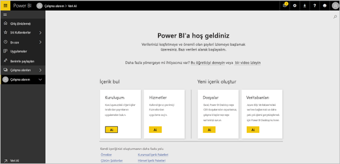
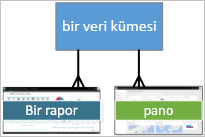
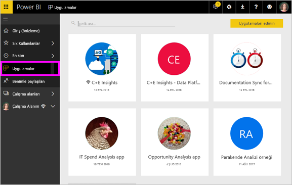

# Power BI - Power BI hizmeti ***tüketicileri*** için temel kavramlar

## Power BI *tüketicileri* ve *tasarımcıları*
Bu makalede [Power BI genel bakış](../power-bi-overview.md) sayfasını okuduğunuz ve bir Power BI ***tüketicisi*** olduğunuza karar verdiğiniz kabul edilmektedir. Tüketiciler, iş arkadaşlarından panolar veya raporlar gibi Power BI içerikleri alan kullanıcılardır. Tüketiciler, Power BI'ın web sitesi tabanlı sürümü olan Power BI hizmetini kullanır. 

Muhtemelen "Power BI Desktop" veya yalnızca "Desktop" terimini daha önceden duymuşsunuzdur. Bu terim, pano ve rapor oluşturup dizinle paylaşan *tasarımcılar* tarafından kullanılan bağımsız bir aracı nitelemek için kullanılmaktadır. Tüketici olarak yalnızca Power BI hizmetiyle çalışacak olsanız da başka Power BI araçlarının da mevcut olduğunu bilmenizde fayda vardır. Bu makale yalnızca Power BI hizmeti için geçerlidir. 

## Terimler ve kavramlar
Bu makale Power BI için görsel tur veya uygulamalı öğretici niteliğinde değildir. Yalnızca Power BI terimlerine ve kavramlarına aşina olmanıza yardımcı olacağını umduğumuz bir genel bakış makalesidir. Hizmeti kullanırken kendinizi yabancı hissetmemenizi sağlayacak bilgilere yer verilmiştir. Power BI hizmeti ve gezinti özellikleri hakkında genel bilgi için [Tura katılın](end-user-experience.md).

## Power BI hizmetini ilk kez açma
Power BI tüketicilerinin çoğu, Power BI hizmetine 1) şirketleri lisans satın aldığı için ve 2) bir yönetici bu lisansları sizin gibi çalışanlara atadığı için sahip olur. 

Başlamak için bir tarayıcı penceresi açın ve **app.powerbi.com** adresine gidin. Power BI hizmetini ilk kez açtığınızda aşağıdakine benzer bir ekranla karşılaşırsınız.

Power BI hizmetini kullandıkça web sitesini açtığınızda gösterilecek öğeleri kişiselleştirmiş olursunuz.  Örneğin bazı kullanıcılar Power BI hizmetinin Giriş sayfasıyla açılmasını isterken bazıları ilk sayfada sık kullandıkları bir panoyu görmek ister. Endişelenmeyin, bunu nasıl yapacağınızı size göstereceğiz. 
- [Giriş önizlemesi](https://powerbi.microsoft.com/en-us/blog/introducing-power-bi-home-and-global-search)    
- [İçeriği **öne çıkanlar** olarak ayarlama](end-user-featured.md) 

Ayrıntılara girmeden önce Power BI hizmetini oluşturan temel yapılardan bahsedelim.

## Power BI ***içeriği***
### Yapı taşlarına giriş
Bir Power BI tüketicisi için 5 yapı taşı şunlardır: ***görselleştirmeler***, ***panolar***, ***raporlar***, ***uygulamalar*** ve ***veri kümeleri***. Bunlar bazen *Power BI* ***içeriği*** olarak da anılır. *İçerik*, ***çalışma alanlarında*** bulunur. Tipik bir iş akışı şu yapı taşlarının tümünü içerir: Bir Power BI *tasarımcısı* (aşağıdaki diyagramda sarı ile gösterilmiştir) *veri kümelerinden* veri toplar, analiz etmek üzere Power BI'a getirir, ilgi çekici olguları ve içgörüleri vurgulayan *görselleştirmelerle* dolu *raporlar* oluşturur, raporlardaki görselleştirmeleri bir panoya sabitler ve raporlarla görselleştirmeleri sizin gibi *tüketicilerle* (aşağıdaki diyagramda siyah ile gösterilmiştir) *uygulamalar* veya diğer paylaşılan içerikler şeklinde paylaşır. 

En basit anlamıyla 
*  ***görselleştirme*** (veya *görsel*), Power BI *tasarımcılarının* *raporlardaki* ve *veri kümelerindeki* verileri kullanarak oluşturdukları bir grafik türüdür. *Tasarımcılar* görselleri genellikle Power BI Desktop'ta oluşturur. 

    Daha fazla bilgi için bkz. [Power BI *tüketicileri* için görselleştirmeler](end-user-visualizations.md)

*  *Veri kümesi*, veri içeren bir kapsayıcıdır. Bu Dünya Sağlık Örgütü ile ilgili verileri içeren bir Excel dosyası, bir şirketin müşterilerinin bulunduğu veritabanı veya bir Salesforce dosyası olabilir.  

*  *Pano* etkileşimli görsellerin, metinlerin ve grafiklerin bulunduğu tek bir ekrandır. Pano, bir hikaye anlatmak veya bir soruyu yanıtlamak için en önemli ölçümlerinizi tek bir ekranda toplar. Pano içeriği bir veya daha fazla rapordan ve bir veya daha fazla veri kümesinden alınır.

    Daha fazla bilgi için bkz. [Power BI *tüketicileri* için panolar](end-user-dashboards.md)

*  *Rapor* görsel, metin ve grafik içeren bir veya daha fazla sayfadan meydana gelen bir belgedir. Bir rapor, tek bir veri kümesini temel alır. Raporlar genellikle belirli bir ilgi alanına hitap edecek veya tek bir soruyu yanıtlayacak şekilde düzenlenir.

    Daha fazla bilgi için bkz. [Power BI *tüketicileri* için raporlar](end-user-reports.md)

*  *Uygulama*, *tasarımcıların* ilgili panoları ve raporları paket haline getirip paylaşmasını sağlayan bir yöntemdir. *Tüketiciler* bazı uygulamaları otomatik olarak alır ancak iş arkadaşları veya topluluk tarafından oluşturulan diğer uygulamalar için arama yapabilir. Örneğin Google Analytics ve Microsoft Dynamics CRM gibi zaten kullanıyor olabileceğiniz dış hizmetler Power BI uygulamaları sunar.

Yeni bir kullanıcıysanız ve Power BI'da ilk kez oturum açıyorsanız herhangi bir pano, uygulama veya rapora sahip olmazsınız. 
_______________________________________________________

## Veri kümeleri
*Veri kümesi*, *tasarımcıların* içeri aktardıktan veya bağlantı kurduktan sonra rapor ve pano oluşturmak için kullandığı veri koleksiyonudur. Tüketici olarak veri kümeleriyle doğrudan etkileşim kurmazsınız ancak büyük resimdeki yerlerini anlamanız faydalı olacaktır.  

Her bir veri kümesi tek bir veri kaynağını (örneğin; OneDrive'daki bir Excel çalışma kitabı, tablosal bir şirket içi SSAS veri kümesi veya bir Salesforce veri kümesi) temsil eder. Desteklenen birçok farklı veri kaynağı vardır.

Bir tasarımcı sizinle bir uygulama paylaştığında bu uygulamaya dahil edilen veri kümelerini görebilirsiniz. 

**BİR** veri kümesi...

* tekrar tekrar kullanılabilir
* birçok farklı raporda kullanılabilir
* Söz konusu veri kümesindeki görselleştirmeler farklı birçok panoda görüntülenebilir
  
  

Bir sonraki yapı taşı, görselleştirmelerdir.
__________________________________________________________

## Görselleştirmeler
Görselleştirmeler (başka bir deyişle görseller) verilerden elde edilen öngörüleri görüntüler. Görselleştirmeler, içgörüyü daha kolay yorumlamamızı sağlar. Bunun nedeni, beynimizin bir resmi sayılarla dolu bir sayfadan daha hızlı kavrayabilmesidir.

Power BI'da karşılaşacağınız görsellerin bazıları şunlardır: şelale, şerit, ağaç haritası, pasta, huni, kart, dağılım ve ölçer. Bkz. [Power BI'da bulunan görselleştirmelerin tam listesi](../power-bi-visualization-types-for-reports-and-q-and-a.md).

   

Görselleştirmeler, topluluk tarafından da sağlanır ve bunlar *özel görseller* olarak adlandırılır. Raporda tanımadığınız bir görsel varsa bu muhtemelen özel bir görseldir. Özel görseli yorumlama konusunda yardıma ihtiyacınız varsa <!--[look up the name of the report or dashboard *designer*](end-user-owner.md)-->rapor veya pano *tasarımcısının* adını bulun ve kendisiyle iletişime geçin.

Bir raporda yer alan **BİR** görselleştirme...

* kopyala/yapıştır yöntemiyle aynı raporda tekrar tekrar kullanılabilir.
* birçok farklı panoda kullanılabilir
__________________________________________________
## Raporlar
Power BI raporu görselleştirme, grafik ve metin içeren bir veya birden fazla sayfadan oluşur. Bir rapordaki görselleştirmelerin tümü tek bir veri kümesinden gelir. *Tasarımcılar*, raporları *tüketiciler* ile paylaşır ve onlar da [raporlarla *Okuma görünümünde* etkileşim kurar](end-user-reading-view.md).

**BİR** rapor...

* birden fazla panoyla ilişkilendirilebilir (söz konusu rapordan sabitlenen kutucuklar birden fazla panoda görünebilir).
* yalnızca bir veri kümesindeki veriler kullanılarak oluşturulur.  
* birden fazla uygulamaya ait olabilir
  
  

________________________________________________

## Panolar
Bir pano, temel alınan veri kümelerinin belirli bir alt kümesine ilişkin özelleştirilmiş bir görünümü temsil eder. *Tasarımcılar* oluşturdukları panoları tek başına veya bir uygulama kapsamında *tüketicilerle* paylaşır. Pano *kutucuk*, grafik ve metin içeren tek bir tuvaldir. 

  

Kutucuk, bir *tasarımcının* *sabitlediği* bir görseldir. Örnek olarak bir raporda bulunan görsel bir panoya sabitlenebilir.  Sabitlenen her bir kutucuk, veri kümesinden oluşturulmuş ve panoya sabitlenmiş bir [görselleştirme](end-user-visualizations.md) görüntüler. Bir kutucuk, bir rapor sayfasının tamamını da içerebilir. Bir kutucukta ayrıca canlı akış verileri veya video da bulunabilir. *Tasarımcılar*, panonuza bu genel bakış konusunda ele alınamayacak kadar fazla sayıda yöntemle kutucuk ekleyebilir. Daha fazla bilgi edinmek için bkz. [Power BI'daki pano kutucukları](end-user-tiles.md). 

Tüketici olarak panoları düzenleyemezsiniz. Ancak yorum ekleyebilir, ilgili verileri görüntüleyebilir, sık kullanılanlara ekleyebilir, abone olabilir ve daha birçok işlem gerçekleştirebilirsiniz. 

Panoların kullanım amaçlarından bazıları nelerdir?  Birkaç tanesi aşağıda verilmiştir:

* karar vermek için gereken tüm bilgileri tek bir bakışta görmek
* işinizle ilgili en önemli bilgileri izlemek
* tüm iş arkadaşlarının aynı doğrultuda ilerlediğinden, aynı bilgileri görüntülediğinden ve kullandığından emin olmak
* bir işletme, ürün, iş birimi veya pazarlama kampanyası vb. için durumu izlemesi yapmak
* geniş bir panonun kişiselleştirilmiş bir görünümünü (sizin için önemli olan tüm ölçümleri içeren) oluşturmak

**BİR** pano...

* birçok farklı veri kümesindeki görselleştirmeleri görüntüleyebilir
* birçok farklı rapordaki görselleştirmeleri görüntüleyebilir
* diğer araçlardan (ör. Excel) sabitlenen görselleştirmeleri görüntüleyebilir
  
  

________________________________________________

## Uygulamalar
Bu pano ve rapor koleksiyonları, ilgili içeriği tek bir paket halinde düzenler. Power BI *tasarımcıları* uygulamaları oluşturur ve kişiler, gruplar, kuruluşun tamamı veya herkes ile paylaşır. Tüketici olarak iş arkadaşlarınızla birlikte aynı veriler üzerinde çalıştığınızdan ve verilerde çelişki olmadığından emin olmuş olursunuz. 

Power BI hizmetinde (https://powerbi.com)) ve mobil cihazınızda uygulamaları kolayca bulabilir ve yükleyebilirsiniz. Bir uygulamayı yükledikten sonra, panolar tek uygulamada, tarayıcınızda veya mobil cihazınızda birlikte bulunduğu için çok sayıda farklı panonun adını hatırlamak zorunda kalmazsınız. 

Bu uygulama üç ilgili pano ve üç ilgili rapordan oluşmaktadır.

Uygulamaları kullanırken, uygulama yazarı her güncelleştirme yayımladığında değişiklikleri otomatik olarak görürsünüz. Yazar ayrıca verilerin yenileme zamanlamasının sıklığını da denetler, bu sayede uygulamayı güncel tutma konusunda endişelenmezsiniz.

Uygulamaları birkaç farklı yolla alabilirsiniz. Uygulama tasarımcısı Power BI hesabınıza uygulamayı otomatik olarak yükleyebilir veya size bir uygulamanın doğrudan bağlantısını gönderebilir, alternatif olarak erişiminiz olan tüm uygulamaları gördüğünüz Microsoft AppSource'ta uygulamayı arayabilirsiniz. Mobil cihazınızdaki Power BI'da, uygulamaları AppSource'tan değil, yalnızca bir doğrudan bağlantı ile yükleyebilirsiniz. Uygulama tasarımcısı uygulamayı otomatik olarak yüklerse uygulamalar listenizde bu uygulamayı görürsünüz.

Uygulama yüklendikten sonra Uygulamalar listenizden seçebilir ve ilk olarak açmak istediğiniz panoyu veya raporu belirleyebilirsiniz.   

Bu makalenin tüketiciler için Power BI hizmetini oluşturan yapı taşları konusunda bilgi sahibi olmanızı sağladığını umuyoruz. 

## Sonraki adımlar
- [Sözlüğü](end-user-glossary.md) inceleyin ve yer işaretlerinize ekleyin    
- [Power BI hizmeti turuna](end-user-experience.md) katılın
- [Tüketiciler için yazılmış olan Power BI genel bakışını](end-user-consumer.md) inceleyin    
- Will'in temel kavramları incelediği ve Power BI hizmetinde bir tura çıkardığı videoyu izleyin. <iframe width="560" height="315" src="https://www.youtube.com/embed/B2vd4MQrz4M" frameborder="0" allowfullscreen></iframe>