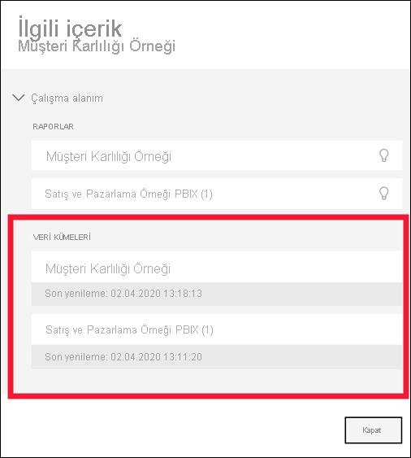
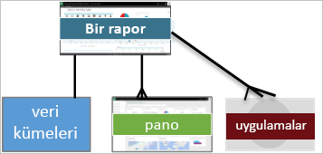

# Power BI hizmeti müşterilerine yönelik temel kavramlar

[!INCLUDE[consumer-appliesto-ynnm](../includes/consumer-appliesto-ynnm.md)]

[!INCLUDE [power-bi-service-new-look-include](../includes/power-bi-service-new-look-include.md)]

Bu makalede, [Power BI’a genel bakış](../fundamentals/power-bi-overview.md) sayfasını okuduğunuz ve kendinizi [Power BI işletme kullanıcısı](end-user-consumer.md) olarak tanımladığınız varsayılır. *İşletme kullanıcıları*, iş arkadaşlarından panolar, raporlar veya uygulamalar gibi Power BI içerikleri alan kullanıcılardır. *İşletme kullanıcıları*, Power BI'ın web tabanlı sürümü olan Power BI hizmetini (app.powerbi.com) kullanır.

Başkalarından içerik alabilmek için aşağıdakilerden birine sahip olmanız gerekir:
- Power BI Pro lisansı
- Kuruluşunuzun Power BI Premium aboneliğine sahip olması ve içeriğin Power BI Premium kapasiteden paylaşılması gerekir. [Sahip olduğunuz lisans ve abonelik türlerini öğrenin](end-user-license.md).

"Power BI Desktop" veya yalnızca "Desktop" terimini mutlaka duyacaksınız. Bu, panolar ve raporları oluşturup sizinle paylaşan *tasarımcıların* kullandığı tek başına bir araçtır. Başka Power BI araçları da olduğunu bilmeniz önemlidir. İşletme kullanıcısı** olduğunuz sürece yalnızca Power BI hizmetiyle çalışırsınız. Bu makale yalnızca Power BI hizmeti için geçerlidir.

## Terimler ve kavramlar

Bu makale Power BI için görsel tur veya uygulamalı öğretici niteliğinde değildir. Yalnızca Power BI terimlerine ve kavramlarına aşina olmanıza yardımcı olacak bir genel bakış makalesidir. Hizmeti kullanırken kendinizi yabancı hissetmemenizi sağlayacak bilgilere yer verilmiştir. Power BI hizmetinde ve gezintisinde tur atmak için [Hızlı Başlangıç - Power BI hizmetinde dolaşma](end-user-experience.md) seçeneğine gidin.

## Power BI hizmetini ilk kez açma

Power BI *işletme kullanıcılarının* çoğu, Power BI hizmetine 1) şirketleri lisans satın aldığı için ve 2) bir yönetici lisansları çalışanlara atadığı için sahip olur.

Başlamak için bir tarayıcı penceresi açın ve **app.powerbi.com** adresini girin. Power BI hizmetini ilk kez açtığınızda aşağıdakine benzer bir ekranla karşılaşırsınız:

Power BI hizmetini kullandıkça web sitesini açtığınızda gösterilecek öğeleri kişiselleştirmiş olursunuz. Örneğin bazı kullanıcılar Power BI hizmetinin **Giriş** ile açılmasını isterken bazıları ilk sayfada sık kullandıkları bir panoyu görmek ister. Sorun değil; bu iki makalede deneyiminizi nasıl kişiselleştirebileceğinizi öğreneceksiniz.

- [Power BI Giriş Sayfası ve Genel Aramasına Giriş](https://powerbi.microsoft.com/blog/introducing-power-bi-home-and-global-search)

- [Power BI hizmetindeki öne çıkan panolar](end-user-featured.md)

Ayrıntılara girmeden önce Power BI hizmetini oluşturan temel yapılardan bahsedelim.

_______________________________________________________

## Power BI içeriği

### Yapı taşlarına giriş

Power BI *işletme kullanıcıları* için beş yapı taşı şunlardır: **_görselleştirmeler_**, **_panolar_**, **_raporlar_**, **_uygulamalar_** ve **_veri kümeleri_** . Bunlar bazen *Power BI* **_içeriği_** olarak da anılır. *İçerik*, **_çalışma alanlarında_** yer alır. Tipik bir iş akışı yapı taşlarının hepsini içerir: Power BI *tasarımcıları* (aşağıdaki diyagramda sarı ile gösterilmiştir) *veri kümelerinden* veri toplar, analiz etmek üzere Power BI'a getirir, ilgi çekici olguları ve içgörüleri vurgulayan *görselleştirmelerle* dolu *raporlar* oluşturur, raporlardaki görselleştirmeleri *panolara* sabitler ve raporlarla panoları sizin gibi *işletme kullanıcılarıyla* (aşağıdaki diyagramda siyah ile gösterilmiştir) paylaşır. *Tasarımcı*, bunları panolar, raporlar ve uygulamalar şeklinde paylaşır.

En basit anlamıyla:

-  **_Görselleştirme_** (veya *görsel*), Power BI *tasarımcıları* tarafından oluşturulan bir grafik türüdür. Görsellerde *raporlar* ve *veri kümelerinden* veriler görüntülenir. *Tasarımcılar* görselleri genellikle Power BI Desktop'ta oluşturur.

    Daha fazla bilgi için bkz. [Raporlarda, panolarda ve uygulamalardaki Görsellerle etkileşimli çalışma](end-user-visualizations.md).

-  *Veri kümesi* veriler için bir kapsayıcıdır. Örneğin bu Dünya Sağlık Örgütü'nün bir Excel dosyası olabilir. Ayrıca şirketin sahip olduğu müşteri veritabanı veya Salesforce dosyası da olabilir. Veri kümeleri *tasarımcılar* tarafından yönetilir.

-  *Pano* etkileşimli görsellerin, metinlerin ve grafiklerin bulunduğu tek bir ekrandır. Pano, bir hikaye anlatmak veya bir soruyu yanıtlamak için en önemli ölçümlerinizi tek bir ekranda toplar. Pano içeriği bir veya daha fazla rapordan ve bir veya daha fazla veri kümesinden alınır.

    Daha fazla bilgi için bkz. [Power BI hizmeti işletme kullanıcıları için panolar](end-user-dashboards.md).

-  *Rapor* görsel, metin ve grafik içeren ve hepsi birlikte tek bir rapor oluşturan bir veya daha fazla sayfalık bir belgedir. Power BI bir raporda tek bir veri kümesini temel alır. *Tasarımcı*, raporları genellikle belirli bir ilgi alanına hitap edecek veya tek bir soruyu yanıtlayacak şekilde düzenler.

    Daha fazla bilgi için bkz. [Power BI'da raporlar](end-user-reports.md).

-  *Uygulama*, *tasarımcıların* ilgili panoları ve raporları paket haline getirip paylaşmasını sağlayan bir yöntemdir. *İşletme kullanıcıları* bazı uygulamaları otomatik olarak alır ancak iş arkadaşları veya topluluk tarafından oluşturulan diğer uygulamalar için arama yapabilir. Örneğin Google Analytics ve Microsoft Dynamics CRM gibi zaten kullanıyor olabileceğiniz dış hizmetler için kullanıma hazır uygulamalar sunulur.

Yeni bir kullanıcıysanız ve Power BI hizmetinde ilk kez oturum açıyorsanız muhtemelen herhangi bir paylaşılan pano, uygulama veya rapor görmezsiniz.

_______________________________________________________

## Veri kümeleri

*Veri kümesi*, *tasarımcıların* içeri aktardıktan veya bağlantı kurduktan sonra rapor ve pano oluşturmak için kullandığı veri koleksiyonudur. *İşletme kullanıcısı* olarak veri kümeleriyle doğrudan etkileşim kurmazsınız ancak büyük resimdeki yerlerini öğrenmeniz faydalı olacaktır.  

Her veri kümesi tek bir veri kaynağını temsil eder. Örneğin kaynak OneDrive'daki bir Excel çalışma kitabı, şirket içi SQL Server Analysis Services tablolu veri kümesi veya Salesforce veri kümesi olabilir. Power BI birçok farklı veri kaynağını destekler.

Tasarımcı sizinle bir uygulama paylaştığında **İlişkili içerik** görünümünü açarak kullanılan veri kümelerini görüntüleyebilirsiniz.  Veri kümesinde ekleme veya değişiklik yapamazsınız. Ancak tasarımcının izin vermesi durumunda raporu indirebilir, [verilerdeki içgörüleri](end-user-insights.md) keşfedebilir ve hatta veri kümesini temel alan [kendi raporunuzu oluşturabilirsiniz](../create-reports/service-report-create-new.md).  

Bir veri kümesi...

- Rapor tasarımcısı tarafından panolar ve raporlar oluşturmak için tekrar tekrar kullanılabilir

- Birçok farklı rapor oluşturmak için kullanılabilir

- Söz konusu veri kümesindeki görseller farklı birçok panoda gösterilebilir

  

Bir sonraki yapı taşı, görselleştirmelerdir.

_______________________________________________________

## Görsel öğeler

Görselleştirmeler (görseller olarak da bilinir) Power BI'ın verilerden elde ettiği içgörüleri görüntüler. Görselleştirmeler, içgörüyü daha kolay yorumlamamızı sağlar. Bunun nedeni, beynimizin bir resmi sayılarla dolu bir sayfadan daha hızlı kavrayabilmesidir.

Power BI'da karşılaşacağınız görsellerin bazıları şunlardır: şelale, şerit, ağaç haritası, pasta, huni, kart, dağılım ve ölçer.

   

Bkz. [Power BI'da bulunan görselleştirmelerin tam listesi](end-user-visual-type.md).

Topluluk tarafından sağlanan ve *özel görseller* olarak adlandırılan özel görselleştirmeler de kullanılabilir. Raporda tanımadığınız bir görsel varsa bu muhtemelen özel bir görseldir. Özel görseli yorumlama konusunda yardıma ihtiyacınız varsa rapor veya pano *tasarımcısının* adını bulun ve kendisiyle iletişime geçin. İletişim bilgilerine ulaşmak için üst menü çubuğundan başlığı seçmeniz yeterlidir.

Rapordaki tek bir görselleştirme...

- Aynı raporda birden çok kez gösterilebilir

- Birçok farklı panoda gösterilebilir

_______________________________________________________

## Raporlar

Power BI raporu görselleştirme, grafik ve metin içeren bir veya birden fazla sayfadan oluşur. Bir rapordaki görselleştirmelerin tümü tek bir veri kümesinden gelir. *Tasarımcılar* oluşturdukları raporları tek başına veya bir uygulama kapsamında diğer kullanıcılarla paylaşır.  Genellikle *İşletme kullanıcıları* [raporla etkileşim kurmak için*Okuma görünümünü*](end-user-reading-view.md) kullanır.

Bir rapor...

- Birden fazla panoyla ilişkilendirilebilir (söz konusu rapordan sabitlenen kutucuklar birden fazla panoda görünebilir).

- Tek bir veri kümesindeki veriler kullanılarak oluşturulabilir.  

- Birden çok uygulamanın parçası olabilir.

  

_______________________________________________________

## Panolar

Bir pano, temel alınan veri kümelerinin belirli bir alt kümesine ilişkin özelleştirilmiş bir grafik görünümünü temsil eder. *Tasarımcılar* oluşturdukları panoları tek başına veya bir uygulama kapsamında *işletme kullanıcılarıyla* paylaşır. Pano *kutucuk*, grafik ve metin içeren tek bir tuvaldir.

  

Kutucuk, bir *tasarımcının* *sabitlediği* bir görseldir. Örneğin, bir raporda bulunan görsel bir panoya sabitlenebilir. Sabitlenen her kutucuk, bir tasarımcının veri kümesinden oluşturduğu ve panoya sabitlediği bir [görselleştirme](end-user-visualizations.md) görüntüler. Bir kutucuk, bir rapor sayfasının tamamını da içerebilir. Bir kutucukta ayrıca canlı akış verileri veya video da bulunabilir. *Tasarımcılar*, panonuza bu genel bakış makalesinde ele alınamayacak kadar fazla sayıda yöntemle kutucuk ekleyebilir. Daha fazla bilgi edinmek için bkz. [Power BI'daki pano kutucukları](end-user-tiles.md).

*İşletme kullanıcıları* panoları düzenleyemez. Ancak yorum ekleyebilir, ilgili verileri görüntüleyebilir, sık kullanılanlara ekleyebilir, abone olabilir ve daha birçok işlem gerçekleştirebilirsiniz.

Panoların kullanım amaçlarından bazıları nelerdir?  İşte bunlardan yalnızca birkaçı:

- karar vermek için gereken tüm bilgileri tek bir bakışta görmek

- işinizle ilgili en önemli bilgileri izlemek

- tüm iş arkadaşlarının aynı doğrultuda ilerlediğinden, aynı bilgileri görüntülediğinden ve kullandığından emin olmak

- bir işletme, ürün, iş birimi veya pazarlama kampanyası için durumu izlemek

- geniş bir panonun kişiselleştirilmiş bir görünümünü (sizin için önemli olan tüm ölçümleri içeren) oluşturmak

**BİR** pano...

- birçok farklı veri kümesindeki görselleştirmeleri görüntüleyebilir

- birçok farklı rapordaki görselleştirmeleri görüntüleyebilir

- diğer araçlardan (örneğin, Excel) sabitlenen görselleştirmeleri görüntüleyebilir

  

_______________________________________________________

## Uygulamalar

Bu pano ve rapor koleksiyonları, ilgili içeriği tek bir paket halinde düzenler. Power BI *tasarımcıları* uygulamaları çalışma alanında oluşturur ve kişiler, gruplar, kuruluşun tamamı veya herkes ile paylaşır. *İşletme kullanıcısı* olarak iş arkadaşlarınızla birlikte aynı bilgiler üzerinde çalıştığınızdan ve verilerde çelişki olmadığından emin olmuş olursunuz.

Bazen uygulamanın çalışma alanı da paylaşılır ve hem çalışma alanı hem de uygulama üzerinde işbirliği yapıp ikisini de güncelleştiren çok sayıda kullanıcı olabilir. Bir uygulamayla yapabilecekleriniz, sahip olduğunuz izinlere ve erişim kapsamına bağlıdır.

> [!NOTE]
> Uygulamaların kullanılması için bir Power BI Pro lisansı veya uygulamanın çalışma alanının Premium kapasitede depolanması gerekir. [Lisanslar hakkında bilgi edinin](end-user-license.md).

[Power BI hizmetinde](https://powerbi.com) ve mobil cihazınızda uygulamaları kolayca bulabilir ve yükleyebilirsiniz. Uygulamayı yükledikten sonra birçok farklı panonun ve raporun adını anımsamanız gerekmez. Bunların tümü tarayıcınızda veya mobil cihazınızda kullanılabilen tek bir uygulamada bir araya getirilmiştir.

Bu uygulama iki pano ve iki rapordan oluşmaktadır. Rapor adının sağ tarafındaki oku seçtiğinizde raporu oluşturan sayfaların listesi açılır.

Uygulama her güncelleştirildiğinde yapılan değişiklikler otomatik olarak uygulanır. Tasarımcı ayrıca Power BI'ın verileri ne sıklıkta yenileyeceğini gösteren zamanlamayı da denetler. Bunları güncel tutma konusunda endişelenmeniz gerekmez.

Uygulamaları birkaç farklı yolla alabilirsiniz:

- Uygulama tasarımcısı uygulamayı Power BI hesabınıza otomatik olarak yükleyebilir.

- Uygulama tasarımcısı uygulamanın doğrudan bağlantısını size gönderebilir.

- Power BI hizmetinde arama yaparak kuruluşunuz veya topluluk tarafından kullanıma sunulan uygulamaları keşfedebilirsiniz. Kullanabileceğiniz tüm uygulamaları görebileceğiniz [Microsoft AppSource](https://appsource.microsoft.com/marketplace/apps?product=power-bi) sayfasını da ziyaret edebilirsiniz.

Mobil cihazınızdaki Power BI'da, uygulamaları AppSource'tan değil, yalnızca bir doğrudan bağlantı ile yükleyebilirsiniz. Uygulama tasarımcısı uygulamayı otomatik olarak yüklerse uygulamalar listenizde bu uygulamayı görürsünüz.

Uygulamayı yükledikten sonra Uygulamalar listenizden seçebilir ve ilk olarak açmak istediğiniz panoyu veya raporu belirleyebilirsiniz.

Bu makalenin işletme kullanıcıları için Power BI hizmetini oluşturan yapı taşları konusunda bilgi sahibi olmanızı sağladığını umuyoruz.

## Sonraki adımlar

- [Sözlüğü](end-user-glossary.md) inceleyin ve yer işaretlerinize ekleyin

- [Power BI hizmetinde bir tura](end-user-experience.md) katılın

- [İşletme kullanıcıları için yazılmış olan Power BI genel bakışını](end-user-consumer.md) inceleyin

- Will'in temel kavramları incelediği ve Power BI hizmetinde bir tura çıkardığı videoyu izleyin.

    <iframe width="560" height="315" src="https://www.youtube.com/embed/B2vd4MQrz4M" frameborder="0" allowfullscreen></iframe>
