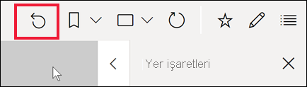
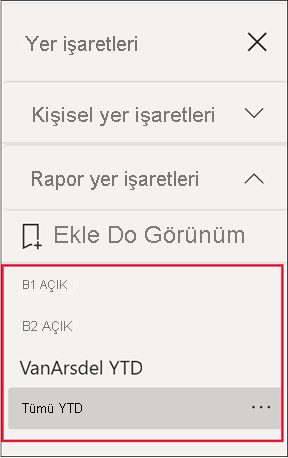
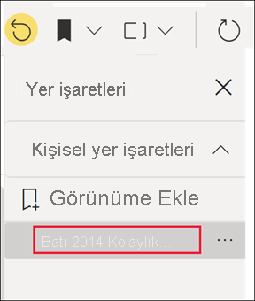
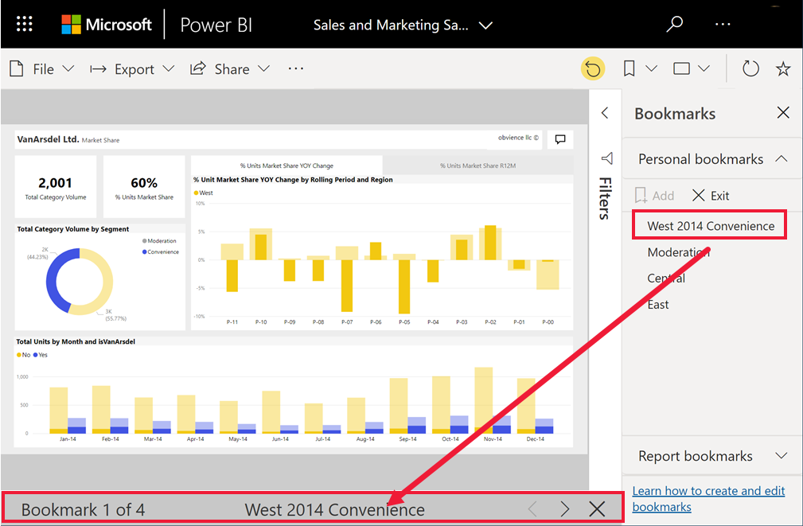

# Yer işaretleri nedir?

[!INCLUDE[consumer-appliesto-ynnm](../includes/consumer-appliesto-ynnm.md)]

Yer işaretleri; filtreler, dilimleyiciler ve görsellerin durumu da dahil olmak üzere rapor sayfasının mevcut yapılandırılmış görünümünü yakalar. Bir yer işaretini seçtiğinizde, Power BI sizi o görünüme geri götürür. Sizin oluşturduklarınız ve rapor *tasarımcıları* tarafından oluşturulanlar olmak üzere iki tür yer işareti bulunur. Tüm Power BI kullanıcıları kişisel yer işaretleri oluşturabilir. Ancak başkaları tarafından oluşturulan yer işaretlerini kullanabilmek için Power BI Pro veya Premium lisansı gerekir. [Hangi lisansa sahibim?](end-user-license.md)

## Power BI’da öngörü paylaşmak ve hikayeler oluşturmak için yer işaretlerini kullanma 
Yer işaretlerinin birçok kullanımı vardır. İlgi çekici bir içgörü keşfettiğinizi ve bunu saklamak istediğinizi düşünün. Buna daha sonra geri dönmek için bir yer işareti oluşturabilirsiniz. İşin başından ayrılmanız gerekiyor ve çalışmalarınızı korumak mı istiyorsunuz? Bir yer işareti oluşturun. Raporun varsayılan görünümüne yer işaretini ekleyebilirsiniz. Böylece, her geri döndüğünüzde ilk olarak raporun bu görünümü açılır. 

Ayrıca, bir yer işareti koleksiyonu oluşturabilir, bu yer işaretlerinin sırasını istediğiniz gibi düzenleyebilir ve birbiriyle ilişkili bir dizi içgörüyü vurgulamak için sunu sırasında her bir yer işareti üzerinden ilerleyebilirsiniz.  

Yer işareti eklediğiniz raporu, aynı raporda okuma erişimine sahip olan iş arkadaşlarınızla paylaşabilirsiniz. Raporun yer işareti eklenmiş görünümü, tasarımcının özgün raporunun üzerine yazılmaz.  Okuma erişimine sahip olmayan iş arkadaşlarınızla paylaşmak için yeniden paylaşma iznine sahip olmanız gerekir. Raporun görünümünü paylaşamıyorsanız rapor sahibiyle iletişime geçerek yeniden paylaşma izni isteyin.  

### Değişiklikleri paylaşma 
Okuma ve yeniden paylaşma izinleriniz varsa, raporu paylaşırken değişikliklerinizi eklemeyi seçebilirsiniz.

:::image type="content" source="media/end-user-bookmarks/power-bi-personalize-share-changes.png" alt-text="Değişiklikleri paylaşma":::
 

## Yer işaretlerini açın
Yer İşaretleri bölmesini açmak için menü çubuğundan **Yer işaretleri** > **Daha fazla yer işareti göster**’i seçin. 

Raporun yayımlanan özgün görünümüne dönmek için **sıfırla** simgesini seçin.

### Rapor yer işaretleri
Rapor *tasarımcısı* rapor yer işaretleri eklediyse, bunları **Rapor yer işaretleri** başlığının altında bulabilirsiniz. Bu rapor sayfasında dört yer işareti var: B1, B2, VanArsdel YTD ve All YTD. Şu anda **All YTD** seçili durumda.

> [!NOTE]
> Paylaşılan raporları görüntülemek için Power BI Pro veya Premium lisansına ihtiyacınız olacaktır. 

Bu rapor görünümüne geçmek için ilgili yer işaretini seçin. 

### Kişisel yer işaretleri

Bir raporu görüntüleyebiliyorsanız kişisel yer işaretleri ekleyebilirsiniz.  Bir yer işareti oluşturduğunuzda aşağıdaki öğeler, bu yer işareti ile birlikte kaydedilir:

* Geçerli sayfa
* Filtreler
* Dilimleyici türü (açılan menü veya liste) ve dilimleyici durumu dahil olmak üzere dilimleyiciler
* Görsel seçim durumu (çapraz vurgulama filtreleri gibi)
* Sıralama düzeni
* Detay konumu
* Görünürlük (**Seçim** bölmesi kullanıldığında, bir nesnenin görünürlüğü)
* Herhangi bir görünür nesnenin odak veya **Spotlight** modları

Bir rapor sayfasını yer işaretinde görünmesini istediğiniz şekilde yapılandırın. Bu örnekte:

1. **Filtreler** bölmesindeki mevcut Tarih filtresini değiştirdik,
1. **Filtreler** bölmesindeki mevcut Bölgeler filtresini değiştirdik
1.  ve halka grafik görselindeki veri noktalarını seçerek rapor tuvalinde çapraz filtreleme ve çapraz vurgulama yaptık. 

Rapor sayfanızı ve görsellerinizi istediğiniz şekilde düzenledikten sonra yer işareti eklemek için **Yer İşaretleri** bölmesinden **Ekle**'yi seçin. 

**Power BI** kişisel bir yer işareti oluşturur ve yer işaretine genel bir ad veya sizin belirlediğiniz adı verir. Bir yer işaretini, yer işareti adının yanındaki üç nokta simgesini seçip görüntülenen menüden ilgili eylemi seçerek *yeniden adlandırabilir*, *silebilir* veya *güncelleştirebilirsiniz*.

Yer işaretinizi oluşturduktan sonra, **Yer İşaretleri** bölmesinden seçerek görüntüleyebilirsiniz. 

<!--
## Arranging bookmarks
As you create bookmarks, you might find that the order in which you create them isn't necessarily the same order you'd like to present them to your audience. No problem, you can easily rearrange the order of bookmarks.

In the **Bookmarks** pane, simply drag-and-drop bookmarks to change their order, as shown in the following image. The yellow bar between bookmarks designates where the dragged bookmark will be placed.

The order of your bookmarks can become important when you use the **View** feature of bookmarks, as described in the next section. 

-->

## Slayt gösterisi olarak yer işaretleri
Yer işaretlerinin sunumunu yapmak veya bunları sırayla görüntülemek için **Yer işaretleri** bölmesinden **Görünüm**’ü seçip bir slayt gösterisi başlatın.

**Görünüm** modunda dikkat edilmesi gereken birkaç özellik vardır:

- Yer işaretinin adı, tuvalin alt tarafında görüntülenen yer işareti başlık çubuğunda görünür.
- Yer işareti başlık çubuğu, önceki ve sonraki yer işaretine gitmenize olanak sağlayan oklar içerir.
- **Görünüm** modundan çıkmak için **Yer İşaretleri** bölmesindeki **Çıkış**’ı veya yer işareti başlık çubuğundaki **X** işaretini seçebilirsiniz.

**Görünüm** modundayken sunumunuz için daha fazla alan sağlamak üzere **Yer İşaretleri** bölmesini kapatabilirsiniz (bölmedeki X işaretine tıklayarak). **Görünüm** modundayken tüm görseller etkileşimlidir ve normalde olduğu gibi çapraz vurgulama için kullanılabilir. 

<!--
## Visibility - using the Selection pane
With the release of bookmarks, the new **Selection** pane is also introduced. The **Selection** pane provides a list of all objects on the current page and allows you to select the object and specify whether a given object is visible. 

You can select an object using the **Selection** pane. Also, you can toggle whether the object is currently visible by clicking the eye icon to the right of the visual. 

When a bookmark is added, the visible status of each object is also saved based on its setting in the **Selection** pane. 

It's important to note that **slicers** continue to filter a report page, regardless of whether they are visible. As such, you can create many different bookmarks, with different slicer settings, and make a single report page appear very different (and highlight different insights) in various bookmarks.

## Bookmarks for shapes and images
You can also link shapes and images to bookmarks. With this feature, when you click on an object, it will show the bookmark associated with that object. This can be especially useful when working with buttons; you can learn more by reading the article about [using buttons in Power BI](../create-reports/desktop-buttons.md). 

To assign a bookmark to an object, select the object, then expand the **Action** section from the **Format Shape** pane, as shown in the following image.

Once you turn the **Action** slider to **On** you can select whether the object is a back button, a bookmark, or a Q&A command. If you select bookmark, you can then select which of your bookmarks the object is linked to.

There are all sorts of interesting things you can do with object-linked bookmarking. You can create a visual table of contents on your report page, or you can provide different views (such as visual types) of the same information, just by clicking on an object.

When you are in editing mode you can use ctrl+click to follow the link, and when not in edit mode, simply click the object to follow the link. 

## Bookmark groups

Beginning with the August 2018 release of **Power BI Desktop**, you can create and use bookmark groups. A bookmark group is a collection of bookmarks that you specify, which can be shown and organized as a group. 

To create a bookmark group, hold down the CTRL key and select the bookmarks you want to include in the group, then click the ellipses beside any of the selected bookmarks, and select **Group** from the menu that appears.

**Power BI Desktop** automatically names the group *Group 1*. Fortunately, you can just double-click on the name and rename it to whatever you want.

With any bookmark group, clicking on the bookmark group's name only expands or collapses the group of bookmarks, and does not represent a bookmark by itself. 

When using the **View** feature of bookmarks, the following applies:

* If the selected bookmark is in a group when you select **View** from bookmarks, only the bookmarks *in that group* are shown in the viewing session. 

* If the selected bookmark is not in a group, or is on the top level (such as the name of a bookmark group), then all bookmarks for the entire report are played, including bookmarks in any group. 

To ungroup bookmarks, just select any bookmark in a group, click the ellipses, and then select **Ungroup** from the menu that appears. 

Note that selecting **Ungroup** for any bookmark from a group takes all bookmarks out of the group (it deletes the group, but not the bookmarks themselves). So to remove a single bookmark from a group, you need to **Ungroup** any member from that group, which deletes the grouping, then select the members you want in the new group (using CTRL and clicking each bookmark), and select **Group** again. 
-->

### Raporda yaptığınız tüm değişiklikleri sıfırlama

Rapor tuvalinizin sağ üst köşesinden **Varsayılana sıfırla**'yı seçin. Bunu yaptığınızda raporda yaptığınız tüm değişiklikler sıfırlanır ve rapor yeniden yazarın son kaydettiği görünüme ayarlanır.

:::image type="content" source="media/end-user-bookmarks/power-bi-personalize-reset-all.png" alt-text="Tüm değişiklikleri sıfırlama":::

## Sınırlamalar ve önemli noktalar
**Yer işaretlerinin** bu sürümünde dikkat etmeniz gereken bazı sınırlamalar ve önemli noktalar bulunmaktadır.

* Çoğu Power BI özel görselinin yer işareti eklemeyle iyi çalışması gerekir. Yer işareti eklemeyle ve Power BI özel görselleriyle ilgili bir sorunla karşılaşırsanız, bu görseli oluşturan kişiye başvurun ve yer işareti desteği eklemesini isteyin.    
* Yer işareti oluşturduktan sonra rapor sayfasına bir görsel eklerseniz bu görsel, varsayılan durumunda görüntülenir. Bu, önceden yer işaretleri oluşturduğunuz bir sayfaya dilimleyici eklediğinizde dilimleyicinin varsayılan durumunda davranış göstereceği anlamına da gelir.
* Genellikle, rapor *tasarımcısı* raporu güncelleştirdiğinde veya yeniden yayımladığında yer işaretleriniz etkilenmez. Ancak, tasarımcı bir yer işareti tarafından kullanılan alanları kaldırma gibi önemli değişikleri rapora uygularsa, ilgili yer işaretini bir sonraki açışınızda hata iletisi alırsınız. 
* Bu özellik, iOS ve Android tabletler için Power BI mobil uygulamalarında ve Power BI Windows uygulamasında desteklenir; telefonlar için Power BI mobil uygulamalarında desteklenmez. Bununla birlikte, Power BI hizmetindeyken kişisel yer işaretine kayıtlı bir görselde yapılan değişiklikler, tüm Power BI mobil uygulamalarında dikkate alınır.

## Sonraki adımlar
[Rapordaki görselleri kişiselleştirme](end-user-personalize-visuals.md)
