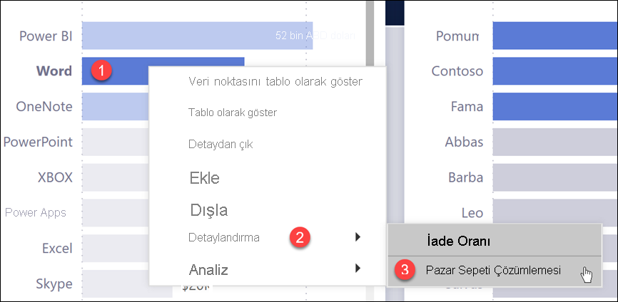
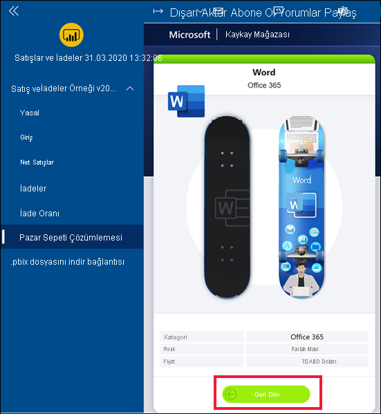
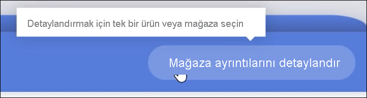
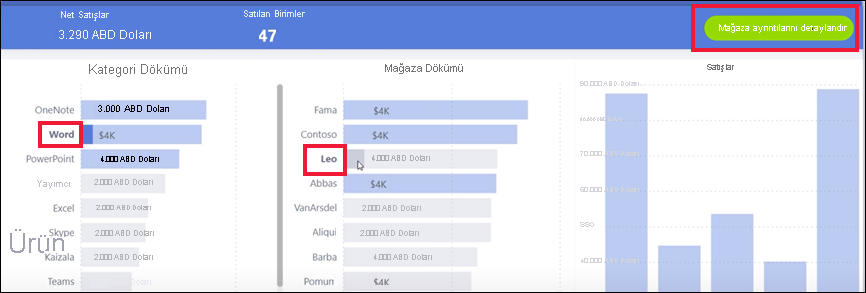
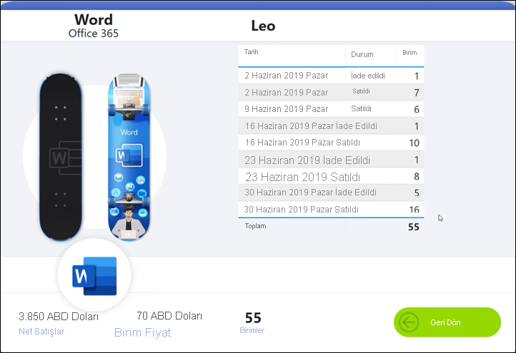
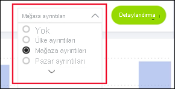
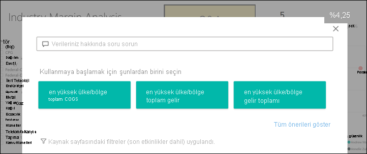
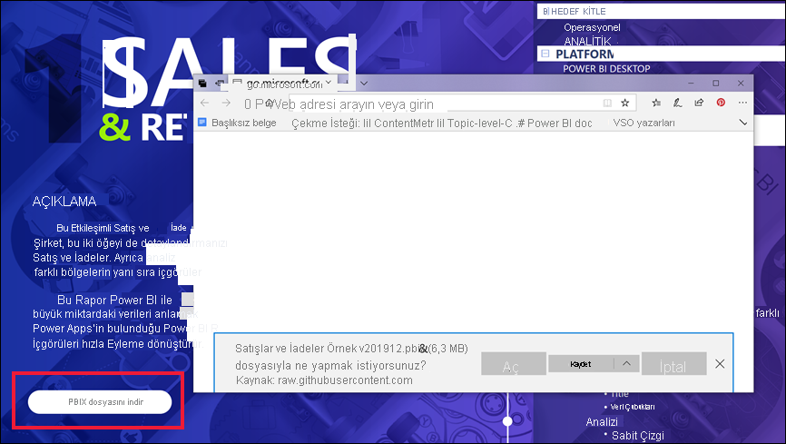

# Power BI hizmetindeki düğmeler
İş arkadaşlarınızın gönderdiği raporlardaki düğmeleri fark etmiş ve bunların nasıl kullanılacağını öğrenmek istemiş olabilirsiniz. Bu düğmelerin bazılarının üzerinde sözcükler, bazılarında oklar, diğerlerinde ise grafikler ve hatta açılan menüler bulunur. Bu makale, düğmeleri tespit etme ve gerçekleştirdikleri işlemleri öğrenme konusunda size yol gösterecektir.

## Düğmeleri tanıma
Düğmeler, rapor sayfasındaki şekillere, görüntülere veya simgelere benzer olabilir. Ancak seçtiğinizde (tıkladığınızda) bir eylem gerçekleştiriliyorsa bu muhtemelen bir düğmedir.

## Düğmelerin türleri
Rapora oluşturucuları, gezinti ve keşif konusunda yardımcı olması için raporlara düğmeler ekler. Düğme türleri şunlardır: **Geri**, **Yer işareti**, **Detaylandır**, **Sayfa gezintisi**, **Soru-Cevap** ve **Web URL'si**. 

### Geri düğmeleri 
Geri düğmesinin üzerinde bir ok olabilir ve bu düğmeyi seçtiğinizde Power BI bir önceki sayfayı açar.  Geri düğmeleri genellikle detaylandırmayla birlikte kullanılır. Aşağıda detaylandırma ile birlikte kullanılan Geri düğmelerine bir örnek verilmiştir.

1. Çubuk grafikte **Sözcük**'ü seçin.
1. **Detaylandır**'ı ve ardından **Pazar sepeti çözümlemesi**'ni seçin.

    

    **Pazar sepeti çözümlemesi**'ni seçtiğinizde Power BI, *Pazar sepeti çözümlemesi* rapor sayfasını açar ve kaynak sayfada yapılan seçimleri kullanarak hedef sayfada gösterilen içeriği filtreler.

    

    Sözcük için filtrelenmiş olan **Pazar sepeti çözümlemesi** rapor sayfasına ulaşmış olursunuz. Önceki sayfaya geri dönmek için Geri düğmesini seçin. 

## Yer işareti düğmeleri
Rapor tasarımcıları, raporlarına genellikle yer işaretleri ekler. Sağ üst köşeden **Görünüm** > **Yer İşaretleri**'ni seçerek rapordaki yer işaretlerinin listesini görüntüleyebilirsiniz. Rapor tasarımcısının eklediği yer işareti *düğmesi*, ilgili yer işaretiyle ilişkilendirilmiş olan rapor sayfasına ulaşmak için alternatif bir yöntem sunar. Sayfada yer işaretine kaydedilmiş olan filtreler ve ayarlar uygulanmış olur. [Power BI’daki yer işaretleri hakkında daha fazla bilgi edinin](end-user-bookmarks.md). 

Bu örnekte düğme üzerinde bir yer işareti simgesi ve yer işaretinin adı bulunur: *Kentsel*. 

Yer işareti düğmesini seçtiğinizde Power BI, ilgili yer işareti için tanımlanmış olan konumu ve ayarları uygular.  Bu örnekte yer işareti, raporun *Büyüme fırsatları* sayfasındadır ve ilgili sayfaya **Kentsel** çapraz filtresi uygulanmıştır.

## Detaylandır düğmeleri
Power BI hizmetinde detaylandırmak için kullanabileceğiniz iki yöntem vardır. Detaylandırma sizi farklı bir rapor sayfasına götürür ve hedef sayfadaki veriler, kaynak sayfada belirlediğiniz filtrelere ve seçimlere göre sunulur.

Rapor verilerini detaylandırma yöntemlerinden biri, görseldeki veri noktalarından birine sağ tıklayıp **Detaylandır**'ı ve ardından hedefi seçmektir. Bu yöntem yukarıdaki **Geri düğmesi** başlıklı bölümde anlatılmıştır. Ancak rapor tasarımcıları bazen eylemi daha belirgin hale getirmek ve önemli içgörülere dikkat çekmek için detaylandırma *düğmesi* kullanır.  

Detaylandırma düğmelerinde birden fazla önkoşul olabilir. Tüm önkoşulları yerine getirmediğinizde düğme çalışmaz. Bir örneğe göz atalım.

Aşağıda bizi *Mağaza ayrıntıları* sayfasına götürecek olan bir detaylandırma düğmesi gösterilmiştir. Düğmenin üzerine geldiğinizde mağaza ve ürün seçmemiz gerektiğini bildiren bir araç ipucu görüntülenir. İki seçimi de yapana kadar düğmeyi seçemezsiniz.

Bir ürün (**Sözcük**) ve bir mağaza (**Leo**) seçtiğimize göre düğmenin rengi değişir ve düğme etkin duruma gelir.

Detaylandırma düğmesini seçtiğinizde *Mağaza* rapor sayfası açılır. *Mağaza* sayfası **Sözcük** ve **Leo** seçimlerinize göre filtrelenir.

Detaylandırma düğmelerinde hedef seçeneği sunan açılan menüler de bulunabilir. Kaynak rapor sayfasında gerekli seçimleri yaptıktan sonra detaylandırmak istediğiniz hedef rapor sayfasını seçebilirsiniz. Aşağıdaki örnekte detaylandırma seçimimizi *Pazar ayrıntıları* rapor sayfası olarak değiştiriyoruz. 

## Sayfa gezintisi

Sayfa gezintisi düğmeleri sizi aynı rapordaki farklı bir sayfaya götürür. Rapor tasarımcıları gezinti düğmelerini genellikle bir hikaye anlatmak veya rapor içgörüleri arasında gezinti yapmanızı sağlamak için oluşturur. Aşağıdaki örnekte rapor tasarımcısı, raporun her sayfasına eklediği düğmeyle sizi ilk sayfa olan üst düzey özet sayfasına yönlendirmektedir. Bu raporda çok fazla sayfa bulunduğundan bu sayfa gezinti düğmesi yararlıdır.

## Soru-Cevap düğmeleri 
Bir Soru-Cevap düğmesini seçtiğinizde Power BI Soru-Cevap Gezgini penceresi açılır. Soru-Cevap penceresi rapor sayfasının en üstünde görüntülenir ve X simgesinden kapatılabilir. [Soru-Cevap hakkında bilgi edinin](end-user-q-and-a.md)

## Web URL'si
Web URL'si düğmeleri yeni bir tarayıcı penceresi açar. Rapor tasarımcıları bu tür düğmeleri başvuru kaynağı sunmak, kuruluşun web sitesine bağlantı vermek veya farklı bir rapora ya da panoya bağlantı sağlamak için ekleyebilir. Aşağıdaki örnekte bulunan Web URL'si düğmesi, raporun kaynak dosyasını indirmenizi sağlar. 

Sayfa ayrı bir pencerede açıldığından Power BI raporuna dönmek için pencereyi kapatabilir veya Power BI sekmenizi seçebilirsiniz.

## Sonraki adımlar
[Yer işaretleri](end-user-bookmarks.md)    
[Detaydan çıkma, detaya gitme](end-user-drill.md)
