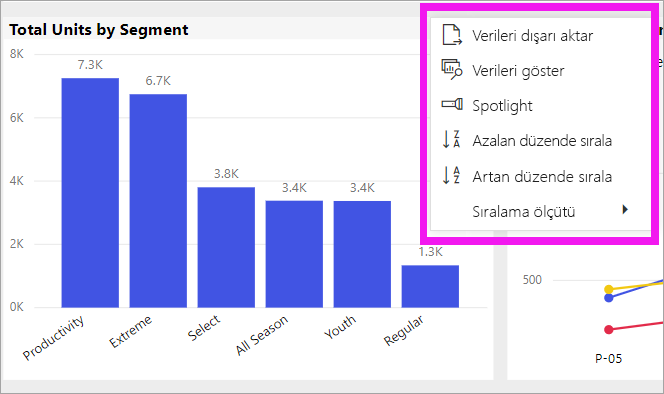
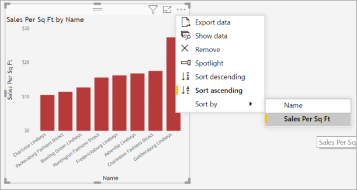
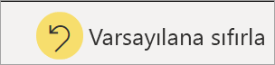
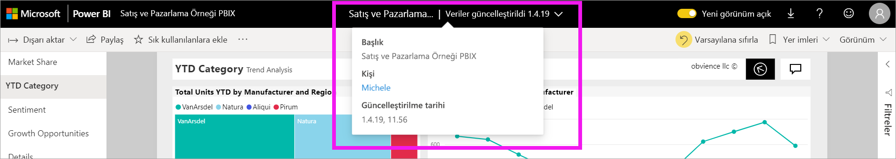

# Power BI raporlarında grafiklerin sıralanma biçimini değiştirme

[!INCLUDE [power-bi-service-new-look-include](../includes/power-bi-service-new-look-include.md)]

> [!IMPORTANT]
> **Bu makale rapor veya veri kümesi üzerinde düzenleme izinleri olmayan Power BI kullanıcılarına yöneliktir. Daha ayrıntılı sıralama yönergeleri için [Power BI Desktop'ta sütuna göre sıralama](../desktop-sort-by-column.md)** konusunu okuyun.

Power BI hizmetinde farklı veri alanlarına göre sıralayarak bir görselin görüntülenme şeklini değiştirebilirsiniz. Görseli sıralama ölçütünü değiştirerek iletmek istediğiniz bilgileri vurgulayabilirsiniz.

Pano üzerindeki görseller sıralanamaz ama Power BI raporunda görselleştirmelerin çoğunu sıralayabilirsiniz 

İster sayısal veriler (satış rakamları gibi) ister metin verileri (eyalet adları gibi) kullanıyor olun, görselleştirmelerinizi istediğiniz gibi sıralayabilirsiniz. Power BI, sıralama için kullanabileceğiniz birçok seçenek ve hızlı menüler sunmaktadır. 

## Kullanmaya başlayın

Başlangıç olarak herhangi bir görseli seçin ve sonra da **Diğer eylemler** (...) öğesini seçin.  Üç sıralama seçeneği vardır: **Azalan düzende sırala**, **Artan düzende sırala** ve **Sıralama ölçütü**. 
    

### Alfabetik veya sayısal olarak sıralama

Görseller, görseldeki kategorilerin adlarına göre alfabetik şekilde veya kategorilerin sayısal değerlerine göre sıralanabilir. Örneğin, bu grafik X ekseni mağaza **Adı** kategorisine göre alfabetik olarak sıralanmıştır.

Sıralama ölçütünü kategoriden (store name) değere (sales per square feet) dönüştürebilirsiniz. **Diğer eylemler** (...) ve **Sıralama ölçütü** öğelerini seçin. Görselde kullanılan bir sayısal değeri seçin.  Bu örnekte biz **Sales Per Sq Ft** değerini seçtik.

Gerekirse artan ve azalan sıralama düzenleri arasında geçiş yapın.  **Diğer eylemler**’i (...) tekrar seçip **Azalan düzende sırala**’yı veya **Artan düzende sırala**'yı seçin. Sıralamak için kullanılan alan kalın yazı tipindedir ve sarı bir çubuğa sahiptir.

   

> [!NOTE]
> Her görsel sıralanamaz. Örneğin, şu görselleri sıralamak mümkün değildir: ağaç haritası, harita, kartogram, dağılım, ölçer, kart, şelale.

## Sıralama düzeninde yaptığınız değişiklikleri kaydetme
Power BI raporları, yaptığınız filtre, dilimleyici, sıralama ve diğer veri görünümü değişikliklerini korur. Bu nedenle, bir rapordan çıkıp daha sonra geri dönerseniz sıralama değişiklikleriniz kaydedilir.  Değişikliklerinizi rapor tasarımcısının ayarlarına geri döndürmek isterseniz üst menü çubuğundan **Varsayılana sıfırla**’yı seçin. 

Ancak, **Varsayılana sıfırla** düğmesi griyse, bu durum rapor *tasarımcısının* değişikliklerinizi kaydetme (kalıcı hale getirme) özelliğini devre dışı bıraktığı anlamına gelir.

## Önemli noktalar ve sorun giderme

### Diğer ölçütleri kullanarak sıralama
Bazı durumlarda görselinizi farklı bir alana (görsele dahil olmayan) veya ölçüte göre sıralamak isteyebilirsiniz.  Örneğin, sıralı bir şekilde aya göre (alfabetik sırada değil) veya tek basamak yerine sayının tamamına göre (ör. 0, 1, 20, 9 değil 0, 1, 9, 20 şeklinde) sıralama yapmak isteyebilirsiniz.  Yalnızca raporu tasarlayan kişi sizin için bu değişiklikleri yapabilir. *Tasarımcının* iletişim bilgileri başlık çubuğundan rapor adı seçilerek bulunabilir.

## Sonraki adımlar
[Power BI raporlarındaki görselleştirmeler](end-user-visualizations.md) hakkında daha fazla bilgi.

[Power BI - Temel Kavramlar](end-user-basic-concepts.md)
