# Panolara ve raporlara açıklama ekleme
Kişisel bir açıklama ekleyin veya iş arkadaşlarınızla bir pano ya da rapor hakkında bir konuşma başlatın. **Açıklama** özelliği, *tüketicinin* diğer kişilerle işbirliği yaparak çalışma yollarından yalnızca biridir. 

## Açıklamalar özelliğini kullanma
Açıklamalar tüm bir panoya, bir panodaki ayrı ayrı görsellere, bir rapor sayfasına ve bir rapor sayfasında ayrı ayrı görsellere eklenebilir. Genel bir açıklama veya belirli iş arkadaşlarınızı hedefleyen bir açıklama ekleyin.  

Rapora bir açıklama eklediğinizde Power BI geçerli filtre ve dilimleyici değerlerini yakalar. Bu, bir açıklamayı seçtiğinizde veya yanıtladığınızda, rapor sayfası veya rapor görselinin açıklama ilk eklendiğinde etkin olan filtre ve dilimleyici seçimlerini göstermek için değişebildiği anlamına gelir.  

Bu neden önemlidir? Bir iş arkadaşınızın ekip ile paylaşmak istediği ilginç bir içgörüyü gösteren bir filtre uyguladığını varsayalım. Bu filtre seçili olmadığında açıklama anlamlı olmayabilir. 

### Panoya veya rapora genel bir açıklama ekleme
Bir panoya veya rapora açıklama ekleme işlemi benzerdir. Bu örnekte pano seçeneğini kullanıyoruz. 

1. Bir Power BI panosunu veya raporunu açın ve **Açıklamalar** simgesini seçin. Bu Açıklamalar iletişim kutusunu açar.

    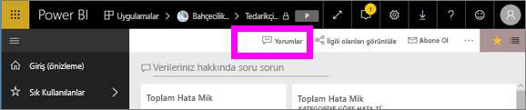

    Burada pano oluşturucusunun zaten genel bir açıklama eklediğini görürsünüz.  Bu panoya erişimi olan herkes bu açıklamayı görebilir.

    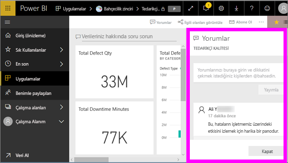

2. Yanıtlamak için, **Yanıtla**’yı seçin, yanıtınızı yazın ve **Gönder**’i seçin.  

    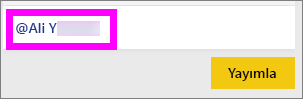

    Varsayılan olarak, Power BI yanıtınızı açıklama yazışmasını başlatan kişiye yönlendirir (bu durumda Aaron F). 

    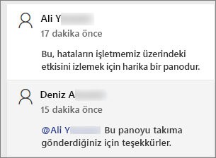

 3. Mevcut yazışmanın bir parçası olmayan bir açıklama eklemek istiyorsanız, açıklamanızı üstteki metin alanına girin.

    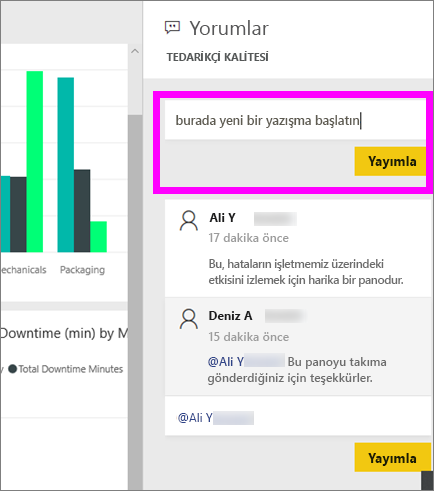

    Bu pano için açıklamalar aşağıdaki gibi görünür.

    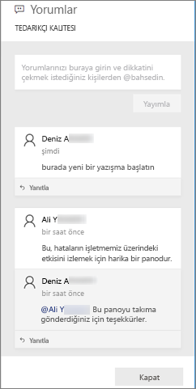

### Belirli bir pano veya rapor görseline açıklama ekleme
Bir panonun tamamına veya bütün bir rapor sayfasına açıklama eklemenin yanı sıra, açıklamaları ayrı pano kutucuklarına ve bireysel rapor görsellerine de ekleyebilirsiniz. Süreçler benzerdir, biz bu örnekte bir rapor kullanıyoruz.

1. Görselin üzerine gelin ve üç noktayı (...) seçin.    
2. Açılan listeden **Açıklama ekle**'yi seçin.

    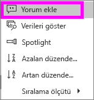  

3.  **Açıklamalar** iletişim kutusu açılır ve sayfadaki diğer görseller gri renkte gösterilir. Bu görselde henüz açıklama yok. 

    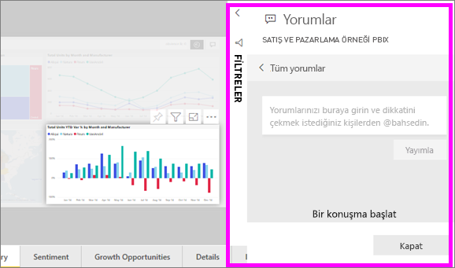  

4. Açıklamanızı yazın ve **Gönder**'i seçin.

    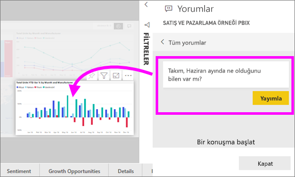  

    - Bir rapor sayfasında, görselde yapılan bir açıklamayı seçmek görseli vurgular (yukarıya bakın).

    - Panoda, grafik simgesi  bir açıklamanın belirli bir görselle ilişkili olduğunu belirtir. Tüm pano için uygulanan açıklamaların özel bir simgesi yoktur. Grafik simgesini seçtiğinizde panoda ilgili görsel vurgulanır.

        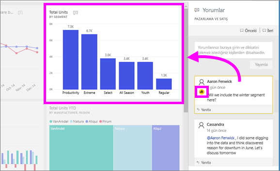

5. Panoya veya rapora dönmek için **Kapat**’ı seçin.

### @ işaretini kullanarak iş arkadaşlarınızın dikkatini çekme
Pano, rapor, kutucuk veya görsel açıklaması oluştururken, "\@" sembolünü kullanarak iş arkadaşlarınızın dikkatini çekebilirsiniz.  "\@" sembolünü yazdığınızda, Power BI kuruluşunuzdan kişileri arayıp seçebileceğiniz bir açılır menü görüntüler. Önüne "\@" sembolü eklenen doğrulanmış adlar mavi yazı tipiyle gösterilir. 

Burada görselleştirme *tasarımcısı* ile yaptığım konuşma gösteriliyor. Açıklamayı gördüğümden emin olmak için @ sembolünü kullanıyor. Bu açıklamanın benim için olduğunu biliyorum. Power BI'da bu uygulama panosunu açtığımda, üst bilgiden **Açıklamalar**'ı seçiyorum. **Açıklamalar** bölmesinde konuşmamız görüntüleniyor.

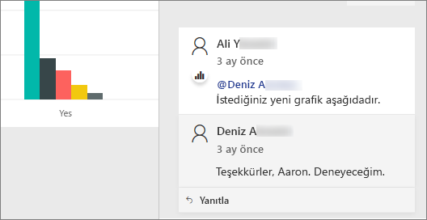  

## Sonraki adımlar
[Tüketiciler için görselleştirmeler](end-user-visualizations.md)   konusuna dönün  
<!--[Select a visualization to open a report](end-user-open-report.md)-->
