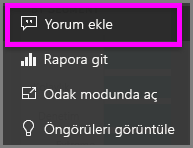
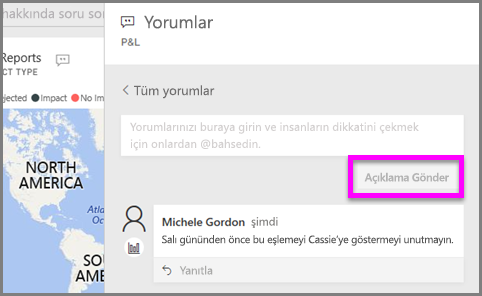
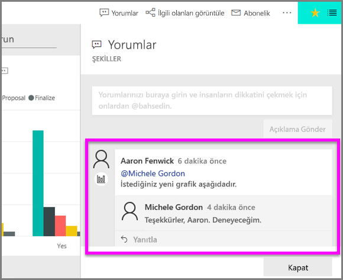

# Görselleştirmeye açıklama ekleme
Kişisel bir açıklama ekleyin veya iş arkadaşlarınızla görselleştirme hakkında bir konuşma başlatın. **Açıklama** özelliği, *tüketicinin* görselleştirmeyle etkileşimli çalışma yollarından yalnızca biridir. 

## Açıklama özelliğini kullanma

1. Görselleştirmenin üzerine gelin ve üç noktayı (...) seçin.    
2. Açılan listeden **Açıklama ekle**'yi seçin.

      

3.  Açıklamanızı yazın ve **Açıklama gönder**'i seçin. Bu, yazım hataları içeren, kendime yazdığım bir açıklamadır.

      

4. Burada görselleştirme *tasarımcısı* ile yaptığım konuşma gösteriliyor. Açıklamayı gördüğümden emin olmak için @ sembolünü kullanıyor. Bu açıklamanın benim için olduğunu biliyorum. Power BI'da bu uygulama panosunu açtığımda, üst bilgiden **Açıklamalar**'ı seçiyorum. **Açıklamalar** bölmesinde konuşmamız görüntüleniyor. 

      

5. Panoya veya rapora dönmek için **Kapat**'a tıklayın.

## Sonraki adımlar
[Tüketiciler için görselleştirmeler](end-user-visualizations.md)   konusuna dönün  
<!--[Select a visualization to open a report](end-user-open-report.md)-->