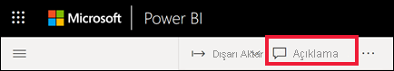

# Panoya açıklama ekleme
Kişisel bir açıklama ekleyin veya iş arkadaşlarınızla pano hakkında bir konuşma başlatın. **Açıklama** özelliği, *tüketicinin* diğer kişilerle işbirliği yaparak çalışma yollarından yalnızca biridir. 

## Açıklamalar özelliğini kullanma
Açıklamalar bir panonun tamamına veya bir panodaki ayrı görsellere eklenebilir. Genel bir açıklama veya belirli iş arkadaşlarınızı hedefleyen bir açıklama ekleyin.  

### Genel bir pano açıklaması ekleme
1. Bir Power BI panosunu açın ve **Açıklamalar** simgesini seçin. Bu Açıklamalar iletişim kutusunu açar.

    

    Burada pano oluşturucusunun zaten genel bir açıklama eklediğini görürsünüz.  Bu panoya erişimi olan herkes bu açıklamayı görebilir.

    

2. Yanıtlamak için, **Yanıtla**’yı seçin, yanıtınızı yazın ve **Gönder**’i seçin.  

    

    Varsayılan olarak, Power BI yanıtınızı açıklama yazışmasını başlatan kişiye yönlendirir (bu durumda Aaron F). 

    

 3. Mevcut yazışmanın bir parçası olmayan bir pano açıklaması eklemek istiyorsanız, açıklamanızı üstteki metin alanına girin.

    

    Bu pano için açıklamalar aşağıdaki gibi görünür.

    

### Belirli bir pano görseline açıklama ekleme
1. Görselin üzerine gelin ve üç noktayı (...) seçin.    
2. Açılan listeden **Açıklama ekle**'yi seçin.

      

3.  **Açıklamalar** iletişim kutusu açılır. Bu görselde henüz açıklama yok. 

      

4. Açıklamanızı yazın ve **Gönder**'i seçin.

      

    Grafik simgesi  bu açıklamanın belirli bir görselle ilişkili olduğunu belirtir. Panoda ilgili görseli vurgulamak için simgeyi seçin.

    

5. Panoya veya rapora dönmek için **Kapat**’ı seçin.

### @ işaretini kullanarak iş arkadaşlarınızın dikkatini çekme
Pano açıklaması oluştururken veya belirli bir görsele açıklama eklerken, “@” sembolünü kullanarak iş arkadaşlarınızın dikkatini çekebilirsiniz.  “@” sembolünü yazdığınızda Power BI, kuruluşunuzdan kişileri arayıp seçebileceğiniz bir açılır menü görüntüler. Önüne “@” sembolü eklenen doğrulanmış adlar mavi yazı tipi ile gösterilir. 

Burada görselleştirme *tasarımcısı* ile yaptığım konuşma gösteriliyor. Açıklamayı gördüğümden emin olmak için @ sembolünü kullanıyor. Bu açıklamanın benim için olduğunu biliyorum. Power BI'da bu uygulama panosunu açtığımda, üst bilgiden **Açıklamalar**'ı seçiyorum. **Açıklamalar** bölmesinde konuşmamız görüntüleniyor.

  

## Sonraki adımlar
[Tüketiciler için görselleştirmeler](end-user-visualizations.md)   konusuna dönün  
<!--[Select a visualization to open a report](end-user-open-report.md)-->