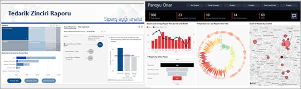
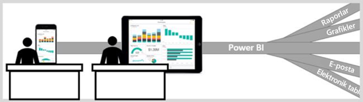

# Tüketiciler için Power BI hizmeti

[!INCLUDE[consumer-appliesto-ynny](../includes/consumer-appliesto-ynny.md)]

İşe ilişkin kararların görüşlerden ziyade olgulara dayanarak alındığı bir veri kültüründe yaşıyorsunuz. Bu kararları almak için size veri gerekir ve bu verileri de iş arkadaşlarınız sağlar.     
 
Size her türden rapor, elektronik tablo, grafik içeren e-posta ve hatta basılı materyaller gönderirler. Veriler biriktikçe, ihtiyacınız olan şeyi hızla bulmanız zorlaşır. Ayrıca, kullandığınız bilgilerin güncel olup olmadığından da şüphe etmeye başlarsınız.  
 

## *Tüketiciler* için Power BI hizmeti

Power BI işinizi hem kolaylaştırır hem de daha etkili hale getirir. Tüm bunlar, verilerinizin görselleştirildiği grafiklere dönüşür. Veri içgörüleriniz, uzun listelerin veya sayılardan ve kelimelerden oluşan tabloların yerine verilerinizdeki içgörülerin hikayesini anlatan renkli, ilgi çekici ve ***güzel*** görsellerden oluşur. 

 
Power BI hizmetini bir tarayıcı ya da mobil cihazda açmanız yeterlidir. İş arkadaşlarınızla birlikte, her zaman en güncel içeriklerle çalışmanız için otomatik olarak güncelleştirilip yenilenen, güvenilir pano ve raporlarda çalışırsınız.   

İçerik statik olmadığından eğilimleri, içgörüleri ve diğer iş zekası verilerini aramak için ayrıntılı incelemeler yapabilirsiniz. İçeriği ayrıntılı olarak inceleyin ve kendi cümlelerinizi kullanarak soru sorun. Dilerseniz arkanıza yaslanıp verilerinizin sizin için ilgi çekici içgörüleri keşfetmesini, veriler değişince sizi bilgilendirmesini ve ayarladığınız bir zamanlamada raporları size e-posta olarak göndermesini bekleyebilirsiniz. Verilerinize buluttan veya şirket içinden, herhangi bir cihazı kullanarak istediğiniz her zaman erişin. Bunlar yalnızca başlangıç. Power BI çok daha fazlasını yapabilir. 

## Bir Power BI *tüketicisi miyim*?

Power BI ile etkileşime girme şekliniz işteki rolünüze bağlı olacaktır. Bir son kullanıcı veya *tüketici* olarak iş arkadaşlarınızdan içerik (panolar, raporlar ve uygulamalar) alan kişi olursunuz. Power BI’ın, Power BI hizmeti adı verilen çevrimiçi veya mobil sürümünde çalışıp bu içerikleri inceler, bunlarla etkileşime geçer ya da iş kararları alırsınız. 
   
Tüketici olarak Power BI’ın tüm olanaklarına erişemezsiniz, ancak işiniz pano ve rapor oluşturmak olmadığı için bu soruna yol açmaz. Siz Power BI hizmetini analiz, izleme, keşif ve karar alma amaçları doğrultusunda kullanırsınız. 

Muhtemelen "Power BI Desktop" veya yalnızca "Desktop" terimini daha önceden duymuşsunuzdur. Bu terim, pano ve rapor oluşturup dizinle paylaşan *tasarımcılar* tarafından kullanılan bağımsız bir aracı nitelemek için kullanılır.  Tüketici olarak yalnızca Power BI hizmetiyle çalışacak olsanız da başka Power BI araçları da olduğunu bilmenizde fayda vardır. 

*Paylaşılan* içerikle çalıştığınızdan ve **Premium** kapasitenin kullanıldığı bir kuruluşta çalıştığınız için standart **ücretsiz** bir lisans yeterlidir. [Hangi lisansa sahibim?](end-user-license.md)

## İçerikle güvenli etkileşim kurma 
Filtreme, dilimleme, abone olma ve dışarı aktarma işlemleri yaparken endişelenmeyin. yaptığınız işlemler, temel alınan veri kümesini veya paylaşılan özgün içeriği (pano, raporlar ve uygulamalar) etkilemez.  

Verilerinize zarar vermeniz mümkün değildir.  Power BI, herhangi bir şeyi "bozma" korkusu duymadan deneyip keşfetmeniz için harika bir yerdir.  
 
Bu, değişikliklerinizi kaydedemeyeceğiniz anlamına gelmez; kaydedebilirsiniz. Ancak bu değişiklikler yalnızca sizin içeriği nasıl göreceğinizi etkiler. Varsayılan özgün görünüme geri dönmek de bir düğmeye tıklamak kadar kolaydır.  

## Sonraki adımlar

[Tüketiciler için Power BI hizmetinde bir tura katılın](end-user-reading-view.md)    
[Tüketiciler için Power BI hizmeti eğitimi](https://docs.microsoft.com/learn/paths/consume-data-with-power-bi/)    
[Power BI *tüketicileri* için terimler ve kavramlar](end-user-basic-concepts.md)    

