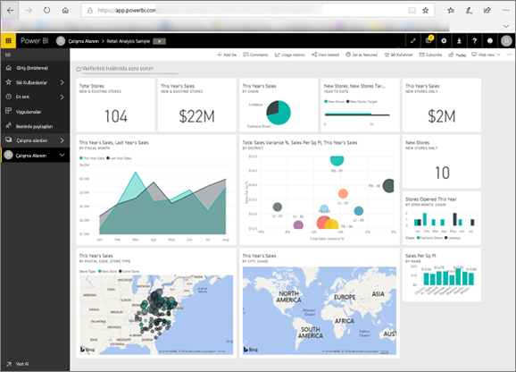

# Kullanıcılar için Power BI
Power BI ile etkileşime girme şekliniz işteki rolünüze bağlı olacaktır. Bir *son kullanıcı* veya *tüketici* olarak iş arkadaşlarınızdan pano, rapor ve uygulama alan kişi olursunuz. İş kararları almak üzere bu içeriği incelemek ve içerikle etkileşmek için ***Power BI hizmetinde*** çalışırsınız.

Power BI'da yeniyseniz, önce [Power BI genel bakışı](../power-bi-overview.md) okumanızı öneririz. Burada Power BI'daki araç kümesi hakkında bilgi edineceksiniz.

Tüketici olarak Power BI'nın tüm olanaklarına erişemezsiniz, ancak işiniz pano ve rapor oluşturmak olmadığı için bu sorun oluşturmaz. İşiniz Power BI'yı analiz, izleme, keşif ve karar alma için kullanmaktır.

Tüketicilere yönelik makaleleri okurken terminolojiyi öğrenecek, Power BI hizmetinde gezinecek, içerikte nasıl dolaşacağınızı anlayacak, ardından bu içerikle nasıl etkileşeceğinizi öğreneceksiniz.  Haydi başlayalım!

## Sonraki adımlar

[Power BI *tüketicileri* için terimler ve kavramlar](end-user-basic-concepts.md)

<!-- [Get started guide for *consumers*] -->
[Power BI hizmetini kullanmaya başlama](../service-get-started.md)

