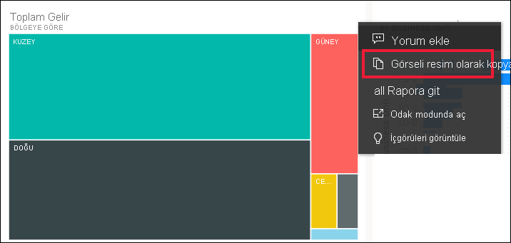
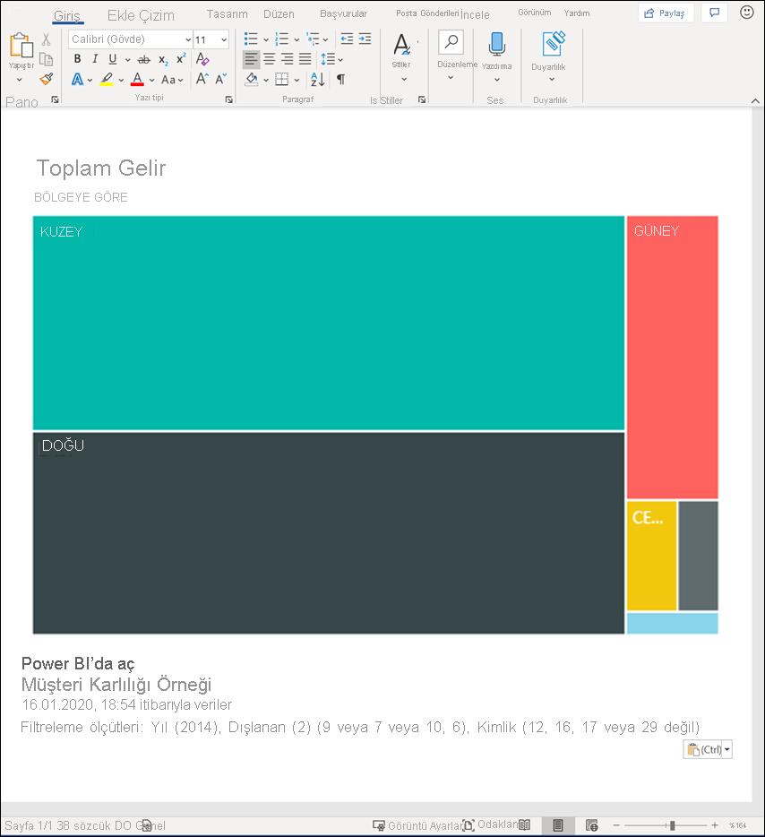
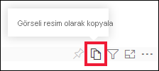
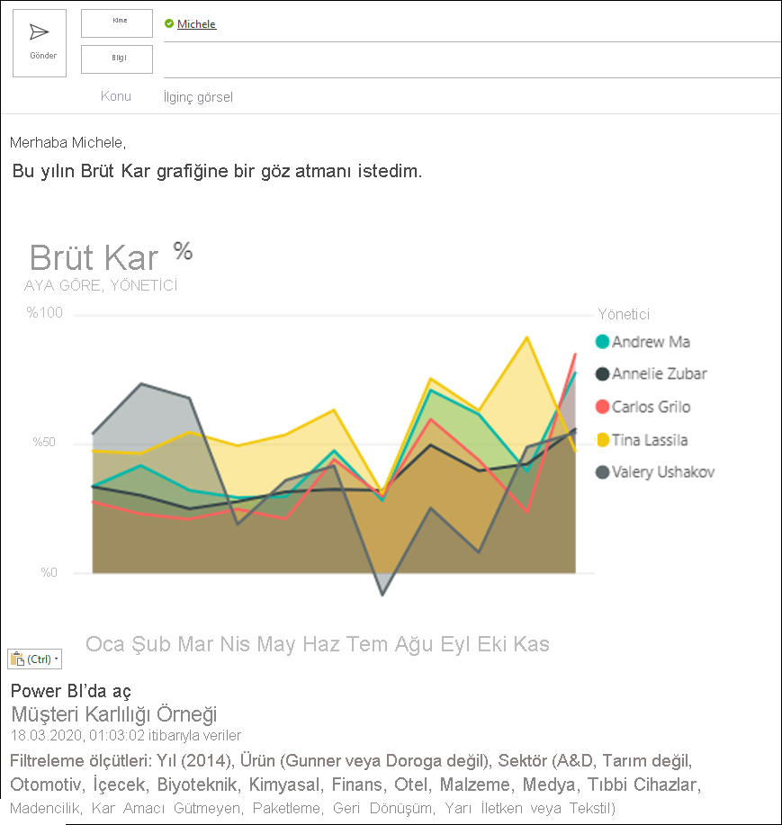
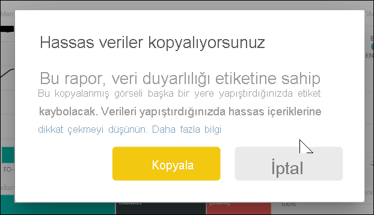
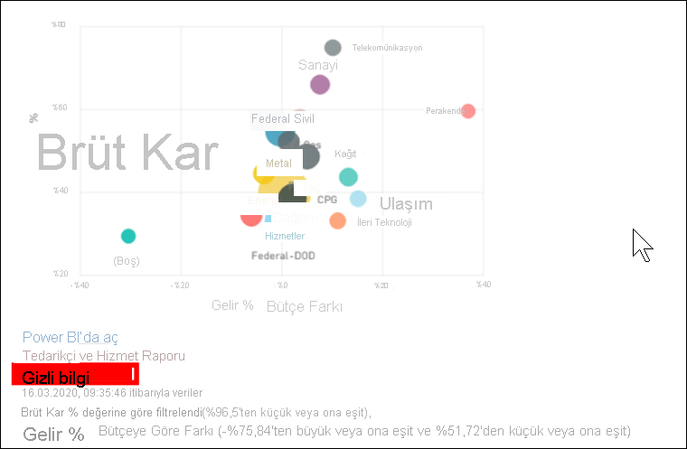
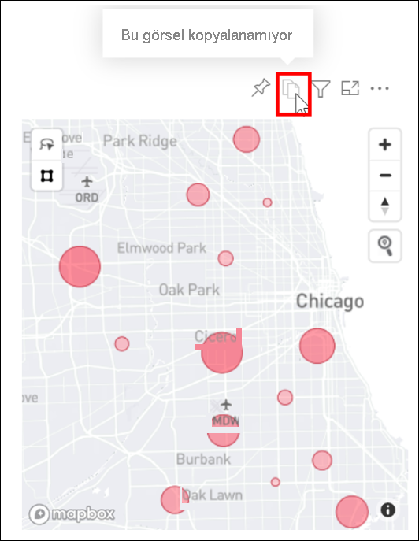

# Bir görseli görüntü olarak panonuza kopyalama

[!INCLUDE[consumer-appliesto-yyyn](../includes/consumer-appliesto-yyyn.md)]

Power BI raporundan veya panosundan bir görüntü paylaşmak istediğiniz oldu mu? Artık görseli kopyalayabilir ve yapıştırmayı destekleyen başka bir uygulamaya yapıştırabilirsiniz. 

Görselin statik bir görüntüsünü kopyaladığınızda, meta verilerle birlikte görselin bir kopyasını alırsınız. Buna aşağıdakiler dahildir:
* Power BI raporuna veya panosuna geri dönen bağlantı
* raporun veya panonun başlığı
* görüntünün gizli bilgiler içerip içermediğiyle ilgili uyarı
* Son güncellenme zaman damgası
* görsele uygulanan filtreler

### Pano kutucuğundaki kopya

1. Kopyalamak istediğiniz panoya gidin.

2. Görselin sağ üst köşesinden **Diğer eylemler (...)** ve ardından **Görseli görüntü olarak kopyala**’yı seçin. 

    

3. **Görselinizi kopyalamaya hazır** iletişim kutusu göründüğünde **Panoya kopyala**'yı seçin.

    

4. Görseliniz kopyalandığında, **Ctrl + V** kullanarak veya sağ tıklayıp > Yapıştır’ı seçerek başka bir uygulamaya yapıştırın. Aşağıdaki ekran görüntüsünde görseli Microsoft Word'e yapıştırdık. 

    

### Rapor görselindeki kopya 

1. Kopyalamak istediğiniz rapora gidin.

2. Görselin sağ üst köşesinden **Görseli görüntü olarak kopyala** simgesini seçin. 

    

3. **Görselinizi kopyalamaya hazır** iletişim kutusu göründüğünde **Panoya kopyala**'yı seçin.

    

4. Görseliniz kopyalandığında, **Ctrl + V** kullanarak veya sağ tıklayıp > Yapıştır’ı seçerek başka bir uygulamaya yapıştırın. Aşağıdaki ekran görüntüsünde görseli bir e-postaya yapıştırdık.

    

5. Rapora uygulanmış bir veri duyarlılığı etiketi varsa, kopyala simgesini seçtiğinizde bir uyarı alırsınız.  

    

    Yapıştırılan görselin altındaki meta verilere bir duyarlılık etiketi eklenir. 

    

## Önemli noktalar ve sorun giderme

   

S: Kopyala simgesi neden bir görselde devre dışıdır?    
Y: Şu anda yerel Power BI görsellerini ve onaylı özel görselleri destekliyoruz. Aşağıdakiler dahil belirli görseller için sınırlı destek vardır: 
- ESRI ve diğer Harita görselleri 
- Python görselleri 
- R görselleri 
- PowerApps    

Y: Bir görseli kopyalama özelliği, BT departmanınız veya Power BI yöneticiniz tarafından kapatılabilir.

S: Görselim neden doğru şekilde yapıştırmıyor?    
Y: Özel görseller ve animasyonlu görseller için sınırlamalar vardır. 

## Sonraki adımlar
[Power BI raporlarındaki görselleştirmeler](end-user-visual-type.md) hakkında daha fazla bilgi

Başka bir sorunuz mu var? [Power BI Topluluğu'na başvurun](https://community.powerbi.com/)

