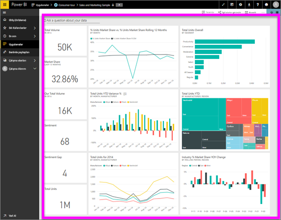

# Pano görüntüleme
Power BI tüketicileri pano görüntülemeye oldukça çok vakit harcamaktadır. Panolar, bağlı raporlardaki ve veri kümelerindeki belirli bilgileri vurgulayacak şekilde tasarlanmıştır. Power BI tüketicileri de bu bilgileri veri temelli iş kararları almak için takip etme, izleme, soru yanıtlama, test etme ve daha birçok süreç için kullanmaktadır.

Hem pano paylaşmak hem de paylaşılan bir panoyu görüntülemek için Power BI Pro gerekir.

## Bir panoyu açma

|              |         |
|------------|--------------------------------|
|      |Panolar, Power BI hizmetinin birçok farklı konumundan açılabilir.   Bu pano simgesini aramanız yeterlidir. Bir  panoyu tanımladıktan sonra açmak kolaydır. Seçtiğinizde pano  Power BI tuvalinizi doldurur. |
|                    |          |

Panoları sol gezinti çubuğundaki tüm kapsayıcılarda bulabilirsiniz. 
- **Giriş** (Önizleme)
- **Sık Kullanılanlar** - [bir panoyu Sık Kullanılanlara eklediyseniz](end-user-favorite.md)
- **Son görüntülenen** - kısa süre önce bir panoyu ziyaret ettiyseniz
- **Uygulamalar** - çoğu uygulama hem pano hem de rapor içerir
- **Benimle paylaşılan** - iş arkadaşlarınız [sizinle bir pano paylaştıysa](end-user-shared-with-me.md)
- **Çalışma alanım** - [Power BI örneklerinden](../sample-datasets.md) birini indirdiyseniz

## Sonraki adımlar
* Panoları daha rahat kullanmak için [örnek panolarımızdan](../sample-tutorial-connect-to-the-samples.md) birine ilişkin tura katılın.
* [Pano kutucukları](end-user-tiles.md) ve bunlardan birini seçtiğinizde gerçekleşecekler hakkında bilgi edinin.