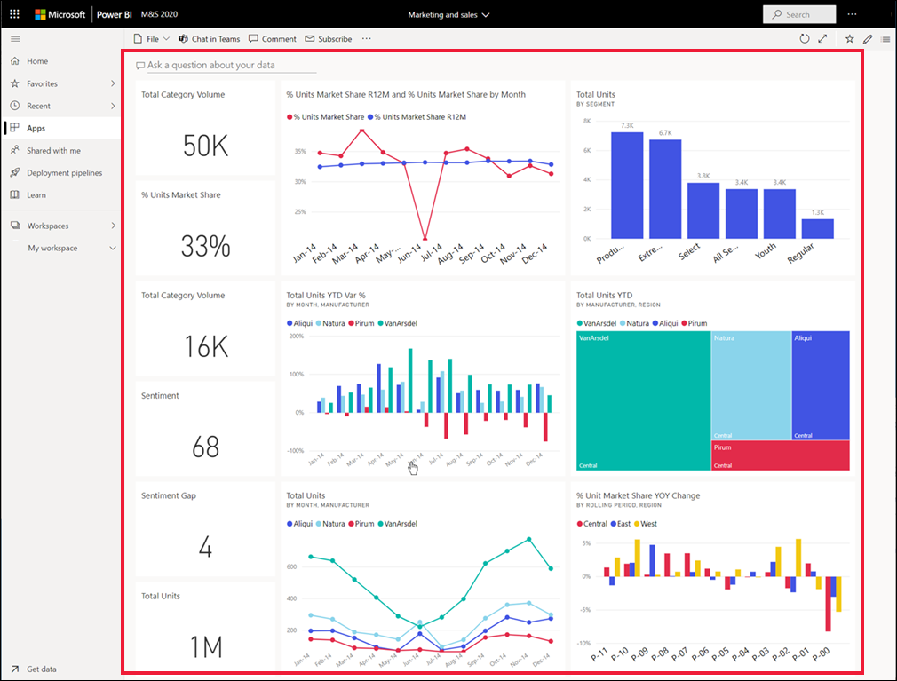

# Pano görüntüleme

[!INCLUDE[consumer-appliesto-ynny](../includes/consumer-appliesto-ynny.md)]

[!INCLUDE [power-bi-service-new-look-include](../includes/power-bi-service-new-look-include.md)]

Power BI *iş kullanıcıları*, pano görüntülemeye oldukça fazla vakit harcar. Panolar, bağlı raporlardaki ve veri kümelerindeki belirli bilgileri vurgulayacak şekilde tasarlanmıştır. Power BI iş kullanıcıları da bu bilgileri veri temelli iş kararları almak için takip etme, izleme, soru yanıtlama, test etme ve daha birçok süreç için kullanmaktadır.

Hem pano paylaşmak hem de paylaşılan bir panoyu görüntülemek için Power BI Pro veya Premium lisansı gerekir. [Hangi lisansa sahibim?](end-user-license.md) 

## Bir panoyu açma

|              |         |
|------------|--------------------------------|
|      |Panolar, Power BI hizmetinin birçok farklı konumundan açılabilir.   Bu pano simgesini aramanız yeterlidir. Bir  pano gördüğünüzde seçerek Power BI tuvalinizi doldurmasını sağlayabilirsiniz. |
|                    |          |

Panoları gezinti bölmesindeki tüm kapsayıcılarda bulabilirsiniz. 

- **Giriş Ekranı** 
- **Sık Kullanılanlar** - [bir panoyu Sık Kullanılanlara eklediyseniz](end-user-favorite.md)
- **Son görüntülenen** - kısa süre önce bir panoyu ziyaret ettiyseniz
- **Uygulamalar** - çoğu uygulama hem pano hem de rapor içerir
- **Benimle paylaşılan** - iş arkadaşlarınız [sizinle bir pano paylaştıysa](end-user-shared-with-me.md)
- **Çalışma alanım** - [Power BI örneklerinden](../create-reports/sample-datasets.md) birini indirdiyseniz

## Sonraki adımlar
* [Panoya genel bakışa](end-user-dashboards.md) dönün

* Panoları daha rahat kullanmak için [örnek panolarımızdan](../create-reports/sample-tutorial-connect-to-the-samples.md) birine ilişkin tura katılın.    
* [Pano kutucukları](end-user-tiles.md) ve bunlardan birini seçtiğinizde gerçekleşecekler hakkında bilgi edinin.
