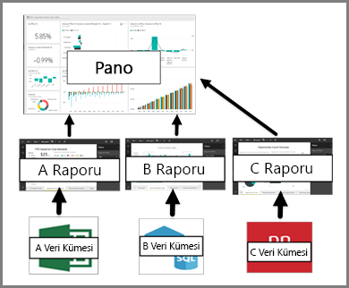

# Panoların Power BI hizmeti tüketicileri için anlamı

Power BI ***panosu***, görselleştirmeler kullanarak bir hikaye anlatan ve genellikle tuval olarak adlandırılan tek bir sayfadır. Tek sayfayla sınırlı olduğundan, iyi tasarlanmış bir panoda yalnızca hikayenin en önemli parçaları yer alır.

Panoda gördüğünüz görselleştirmeler adlı *kutucukları* ve *sabitlenmiş* raporu panoya *tasarımcıları*. Çoğu durumda, bir kutucuğu seçtiğinizde rapor sayfasına görselleştirmeyi oluşturulduğu açılır. Power BI'ı kullanmaya yeni başladıysanız [Power BI temel kavramlarını](end-user-basic-concepts.md) okuyarak sağlam bir temel oluşturabilirsiniz.

> [!NOTE]
> Panolar [mobil cihazlarda görüntülenebilir ve paylaşılabilir](mobile/mobile-apps-view-dashboard.md).
>
> Sizinle paylaşılan bir panoyu görüntülemek için Power BI Pro gereklidir.
> 

Panodaki görselleştirmeler raporlardan gelir ve her rapor bir veri kümesini temel alır. Panoları, bağlantılı raporlara ve temel alınan veri kümelerine giriş noktası olarak düşünebilirsiniz. Görselleştirmelerden birini seçtiğinizde bunu oluşturmak için kullanılan rapor (ve veri kümesi) açılır.

## Panoların avantajları
Panolar işlerinizi izlemek, yanıtlar aramak ve en önemli ölçümlerinizi bir bakışta görmek için harikadır. Panolardaki görselleştirmeler, bir veya daha fazla temel alınan veri kümesinden ve bağlantılı rapordan oluşabilir. Panoda şirket içi ve bulut verileri bir arada kullanılabilir ve verilerin konumundan bağımsız olarak tümleşik bir görünüm oluşturulabilir.

Bir Pano güzel bir resim değil; etkileşimli ve temel alınan veriler değiştikçe kutucuklar da güncelleştirilir.

## Power BI ***kullanıcıları*** için panolarla raporları karşılaştırma
Raporlar, görselleştirmelerle dolu tuvaller olduklarından sıklıkla panolarla karıştırılır. Ama Power BI *kullanıcıları* açısından bazı önemli farklılıklar bulunur.

| **Özellik** | **Panolar** | **Raporlar** |
| --- | --- | --- |
| Sayfalar |Bir sayfa |Bir veya daha fazla sayfa |
| Veri kaynakları |Pano başına bir veya daha fazla rapor ve bir veya daha fazla veri kümesi |Rapor başına tek bir veri kümesi |
| Filtreleme |Filtreleme veya dilimleme yapamazsınız |Filtreleme, vurgulama ve dilimleme için birçok farklı yol vardır |
| Uyarı ayarlama |Belirli koşullar karşılandığında size e-posta gönderilmesini sağlamak üzere uyarılar oluşturabilirsiniz |Hayır |
| Öne çıkanlar |Bir panoyu "öne çıkan" panonuz olarak ayarlayabilirsiniz |Öne çıkan bir rapor oluşturamazsınız |
| Temel alınan veri kümesi tablolarını ve alanlarını görme |Hayır. Verileri dışarı aktarabilir ancak tabloları ve alanları panonun kendisinde göremezsiniz. |Evet. Veri kümesi tablolarını, alanlarını ve değerlerini görebilirsiniz. |

## Pano oluşturucuları ve kullanıcıları
Bir Power BI ***kullanıcısı*** olarak, *oluşturuculardan* pano alabilirsiniz. Aşağıdaki konularla panoları öğrenmeye devam edin:

* [Pano görüntüleme](end-user-dashboard-open.md)
* [Pano kutucukları](end-user-tiles.md) ve bunlardan birini seçtiğinizde gerçekleşecekler hakkında bilgi edinin.
* Tek bir pano kutucuğunu izlemek ve belirli bir eşiğe ulaştığında e-posta almak mı istiyorsunuz? [Kutucuklar için uyarılar oluşturun](end-user-alerts.md).
* Panolarınıza sorular sormanın keyfini çıkarın. Verileriniz hakkında soru sormak ve görselleştirme şeklinde yanıt almak için [Power BI Soru-Cevap](end-user-q-and-a.md) özelliğini kullanmayı öğrenin.

> [!TIP]
> Aradığınızı burada bulamadıysanız sol taraftaki İçindekiler bölümünü kullanın.
> 

## Sonraki adımlar
[Pano görüntüleme](end-user-dashboard-open.md) 