# Power BI’daki görselleştirmelerde ayrıntı modu

## Detay bir hiyerarşi gerektirir
Bir görselde hiyerarşi varsa ek ayrıntıları açığa çıkarmak için detaya gidebilirsiniz. Örneğin, Olimpiyat madalyası sayısına spor, disiplin ve etkinlik açısından bakan bir görselleştirmeniz olabilir. Görselleştirme varsayılan olarak madalya sayısını sporlara göre (jimnastik, kayak, su sporları vb.) gösterir. Ancak bir hiyerarşiye sahip olduğundan, görsel öğelerden (bir çubuk, çizgi veya kabarcık) biri seçildiğinde giderek daha ayrıntılı hale gelen bir resim görüntülenir. Yüzme, atlama ve su topu ile ilgili verileri görmek için **su sporları** öğesini seçin.  Tramplen, kule ve senkronize atlama etkinlikleri ile ilgili ayrıntıları görmek için **atlama** öğesini seçin.

Size ait raporlara hiyerarşiler ekleyebilirsiniz ancak sizinle paylaşılan raporlara ekleyemezsiniz.
Hangi Power BI görselleştirmelerinin bir hiyerarşi içerdiğinden emin değil misiniz?  Bir görselleştirmenin üzerine geldiğinizde üst köşelerde bu detay denetimlerini görüyorsanız görselleştirmenizde hiyerarşi bulunuyor demektir.

    
   

Tarih, benzersiz bir hiyerarşi türüdür. Görselleştirmeye bir tarih alanı eklediğinizde Power BI otomatik olarak yıl, üç ay, ay ve gün içeren bir zaman hiyerarşisi ekler. Daha fazla bilgi için [Görsel hiyerarşiler ve detaya gitme davranışı](../guided-learning/visualizations.yml?tutorial-step=18) makalesine bakın veya aşağıdaki videoyu izleyin.

  <iframe width="560" height="315" src="https://www.youtube.com/embed/MNAaHw4PxzE?list=PL1N57mwBHtN0JFoKSR0n-tBkUJHeMP2cP" frameborder="0" allowfullscreen></iframe>

> [!NOTE]
> Power BI Desktop'ı kullanarak hiyerarşi oluşturmayı öğrenmek için [How to create and add hierarchies (Hiyerarşi oluşturma ve ekleme)](https://youtu.be/q8WDUAiTGeU) videosunu seyredin
> 

## Önkoşullar

1. Power BI hizmeti veya Desktop’ta detay için hiyerarşiye sahip bir görselleştirme gerekir. 
   
2. Birlikte ilerlemek için [Perakende Analizi örneğini açın](../sample-datasets.md) ve **Total Units This Year** (Bu Yıla Ait Birimlerin Toplamı) (Değerler) özelliğine **Territory** (Bölge), **City** (Şehir), **Postal Code** (Posta Kodu) ve **Name** (Ad) (Grup) açısından bakan bir ağaç haritası oluşturun.  Ağaç haritasında bölge, şehir, posta kodu ve şehir adından oluşan bir hiyerarşi bulunur. Her bölgede bir veya daha fazla şehir, her şehirde bir veya daha fazla posta kodu bulunur ve bu şekilde devam eder. Varsayılan olarak, listede ilk sırada *Territory* göründüğü için görselleştirme yalnızca bölge verilerini görüntüler.
   
   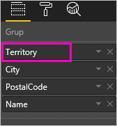

2. Çeşitli detay simgelerinin birlikte nasıl çalıştığını anlamak kafa karıştırıcı olabilir. Bu nedenle ağaç haritasını küçük bölgelerin yalnızca 2 tanesini gösterecek şekilde filtreleyelim: **KY** ve **TN**. Ağaç haritasını seçin ve **Görsel düzeyi filtreleri** altında **Territory**’yi genişletip **KY** ve **TN**’yi seçin.

    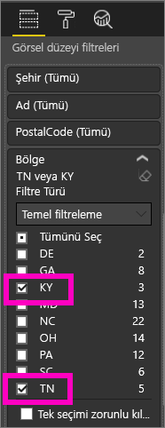    

   Şimdi ağaç haritasında yalnızca iki bölge gösterilir.

   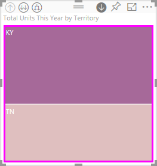

## Detay özelliklerine erişmek için üç yol
Hiyerarşisi olan görselleştirmeler için detaya gitme, detaydan çıkma ve genişletme özelliklerine erişmeye yönelik birkaç seçeneğiniz vardır. Bu makalede aşağıdaki birinci seçeneğin nasıl kullanılacağı gösterilmiştir. Detaya gitme ve genişletme temel bilgilerini anladıktan sonra bu yöntemlerin üçü de aynı işlemi gerçekleştirir. Bunları deneyin ve en çok keyif aldığınız seçeneği belirleyin.

- Simgeleri görmek ve kullanmak için bir görselleştirmenin üzerine gelin.  

    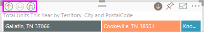

- Menüyü ortaya çıkarmak ve kullanmak için bir görselleştirmeye sağ tıklayın.
    
    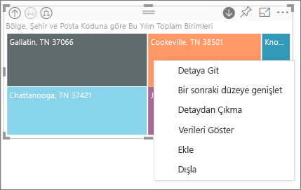

- Power BI menü çubuğundan **Araştır** düğmesini seçin.

   

## Detay yolları
### Detaya gitme
Görselleştirmenizi detaylandırmanın birkaç yolu vardır. ***Detaya gitme***, sizi hiyerarşide sonraki düzeye götürür. Bu nedenle, **Territory** düzeyine bakıyorsanız şehir düzeyine, sonra posta kodu ve son olarak ad düzeyine gidebilirsiniz. Yoldaki her bir adım size yeni bilgiler gösterir.

### Genişlet

***Genişletme***, geçerli görünüme ilave bir hiyerarşi düzeyi ekler. Bu nedenle, **Territory** düzeyine bakıyorsanız ağaç haritanızı genişletip şehir, posta kodu ve ad ayrıntısını ekleyebilirsiniz. Yoldaki her adım size aynı bilgileri gösterir ve bir düzey yeni bilgi ekler.

Ayrıca tek seferde bir alanda veya aynı anda tüm alanlarda detaya gitmeyi ya da genişletmeyi seçebilirsiniz. 

## Aynı anda tüm alanlarda detaya gitme

1. Ağaç haritasının KY ve TN verilerini gösteren en üst düzeyinden başlayın. Tanıtıcılardan birini seçip sağa sürükleyerek ağaç haritanızı genişletin. 

    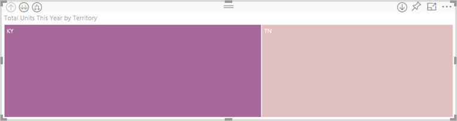 geçin.

2. ***Tüm alanlarda aynı anda*** detaya gitmek için görselleştirmenin sol üst köşesindeki çift oku  seçin. Ağaç haritanızda şimdi Kentucky ve Tennessee şehir verileri gösterilir. 

    
   
5. Hiyerarşinin posta kodu düzeyine ulaşmak için bir kez daha detaya gidin.

    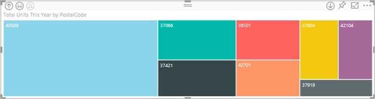

3. Yeniden detaydan çıkmak için görselleştirmenin sol üst köşesindeki yukarı oku seçin geçin.

## Bir kerede tek bir alanda detaya gitme
Bu yöntemde görselleştirmenin sağ üst köşesinde görünen detaya gitme simgesi kullanılır. 

1. Detaya gitme simgesini seçerek açın . Şimdi ***aynı anda tek alanda*** detaya gitme seçeneği sunulur. 
   
   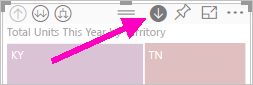

   Detaya gitmeyi açmazsanız bir görsel öğe (çubuk, kabarcık ya da yaprak gibi) seçildiğinde detaya gidilmez, bunun yerine rapor sayfasındaki diğer grafiklere çapraz filtreleme uygulanır.

2. **TN** için *yaprak* öğesini seçin. Ağaç haritanızda şimdi Tennessee’de bulunan ve bir mağaza olan tüm şehirler gösterilir. 

    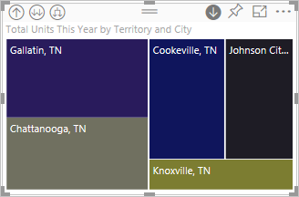

2. Bu noktada Tennesee için detaya gitmeye devam edebilir veya belirli bir Tennesee şehri için detaya gidebilir ya da bunun yerine genişletebilirsiniz (aşağıdaki **Aynı anda tüm alanları genişletme** bölümüne bakın). Aynı anda tek bir alanda detaya gitme konusuna devam edelim.  **Knoxville, TN** öğesini seçin. Ağaç haritanız şimdi Knoxville’deki mağazanızın posta kodunu gösterir. 

   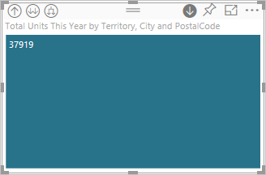

    Detaya gittiğinizde ve detaydan çıktığınızda başlığın değiştiğine dikkat edin.  

## Aynı anda tüm alanları ve tek bir alanı genişletme
Yalnızca posta kodu gösteren bir ağaç haritası pek bilgi vermez.  Bu nedenle hiyerarşide bir düzey aşağıya genişletelim.  

1. Ağaç haritası etkinken *aşağıya genişletme* simgesini  seçin. Ağaç haritanız şimdi hiyerarşimizin iki düzeyini gösterir: posta kodu ve mağaza adı. 

    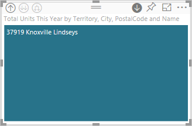

2. Tennesee’nin dört hiyerarşi düzeyinin tamamını görmek için ikinci düzeye ulaşana kadar ağaç haritanızın detaydan çıkma okunu seçin (**Bölge ve şehre göre bu yılki toplam birim sayısı**). 

    

3. Detaya gitme seçeneğinin hala etkin olduğundan  emin olun ve *aşağıya genişletme* simgesini  seçin. Ağaç haritasında şimdi bazı ek ayrıntılar gösterilir; yalnızca şehir ve eyalet yerine posta kodu da gösterilir. 

    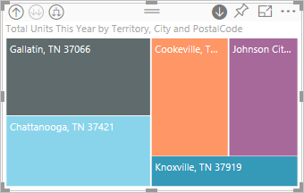

4. Ağaç haritanızda Tennesee’nin dört hiyerarşi düzeyinin tamamını görüntülemek için *aşağıya genişletme* simgesini bir kez daha seçin. Daha fazla ayrıntı görmek için bir yaprağın üzerine gelin.

   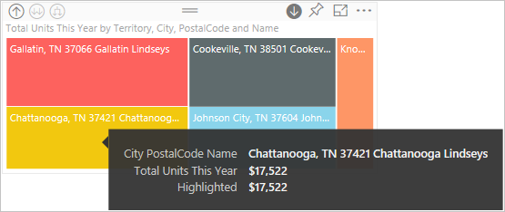

## Diğer görsel delme filtreleri
Detay modunda çalışırken detaya gitme ve genişletme özelliklerinin sayfadaki diğer görselleştirmeleri nasıl etkilediğine karar verirsiniz. 

Varsayılan olarak, detaylandırma özelliği bir rapordaki diğer görselleri filtrelemez. Ancak bu özellik, Power BI Desktop ve Power BI hizmetinde etkinleştirilebilir. 

1. Desktop’ta **Biçim** sekmesini ve **Diğer görsel delme filtreleri** onay kutusunu seçin.

    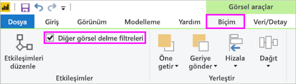

2. Şimdi hiyerarşideki bir görselde detaya gittiğinizde (veya detaydan çıktığınızda ya da genişlettiğinizde), bu eylem sayfadaki diğer görselleri filtreler. 

    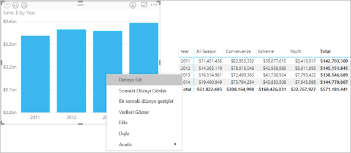

    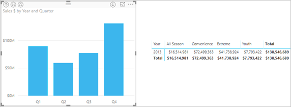

> [!NOTE]
> Power BI hizmetinde bu özelliği etkinleştirmek için, üst menü çubuğundan **Görsel etkileşimler > Diğer görsel delme filtreleri**’ni seçin.
>
> 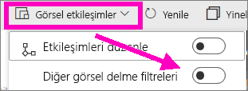

## Hiyerarşi eksenini ve hiyerarşi grubunu anlama
Hiyerarşi eksenini ve hiyerarşi grubunu, görüntülemek istediğiniz verilerin ayrıntı düzeyini artırmak ve azaltmak için kullanabileceğiniz mekanizmalar olarak düşünebilirsiniz. Kategoriler ve alt kategoriler halinde düzenlenebilen tüm veriler bir hiyerarşiye sahip olmaya uygundur. Doğal olarak, buna tarihler ve saatler de dahildir.

**Değerler** kutusunda veri alanları olarak araştırmak istediğiniz verilerin yanı sıra **Eksen** kutusuna veya **Grup** kutusuna eklenecek bir ya da daha fazla veri alanını seçerek hiyerarşi elde etmek için Power BI’da bir görselleştirme oluşturabilirsiniz. Görselleştirmenizin sol üst ve sağ köşelerinde *Ayrıntı modu* simgelerinin görünmesi, verilerinizin hiyerarşik olduğu anlamına gelir. 

Hiyerarşik verilerin temel olarak iki türü olduğu söylenebilir:
- Tarih ve saat verileri - Bir DateTime veri türünün bulunduğu bir veri alanınız varsa bu, hiyerarşik verilere zaten sahip olduğunuz anlamına gelir. Power BI, değerleri bir [DateTime](https://msdn.microsoft.com/library/system.datetime.aspx) yapısına ayrıştırılabilen herhangi bir veri alanı için otomatik olarak hiyerarşi oluşturur. **Eksen** veya **Grup** kutusuna yalnızca bir DateTime alanı eklemeniz gerekir.
- Kategorik veriler - Verileriniz, alt koleksiyonlar içeren veya ortak değerlerin bulunduğu veri satırlarına sahip koleksiyonlardan türetilmişse bu, hiyerarşik verilere sahip olduğunuz anlamına gelir.

Power BI bir alt ağ veya tüm alt ağlara kadar genişletmenize olanak tanır. Her düzeyde tek bir alt kümeyi veya her düzeyde aynı anda tüm alt kümeleri görebileceğiniz şekilde verilerinizde detaya gidebilirsiniz. Örneğin, belirli bir yılın ayrıntısına gidebilir veya hiyerarşinin ayrıntılarına indikçe her bir yılın tüm sonuçlarını görebilirsiniz. Diğer taraftan, aynı şekilde detaydan çıkabilirsiniz.

Aşağıdaki bölümlerde en yüksek görünümden, orta görünümden ve en düşük görünümden detaya gitme açıklanmaktadır.

### Hiyerarşik veriler ve zaman verileri
Bu örnekte, [Perakende Analizi örneğiyle](../sample-datasets.md) birlikte ilerleyin ve **Ay**’ı (Eksen) **Toplam Satış**’a (Değerler) göre gösteren yığılmış bir grafik görselleştirmesi oluşturun.  

Eksen veri alanı **Ay** olsa da **Eksen** kutusunda yine de bir **Yıl** kategorisi oluşturur. Bunun nedeni Power BI’ın, okuduğu tüm değerler için tam DateTime yapısını sağlamasıdır. Hiyerarşinin üst tarafında yıla ait veriler gösterilir.

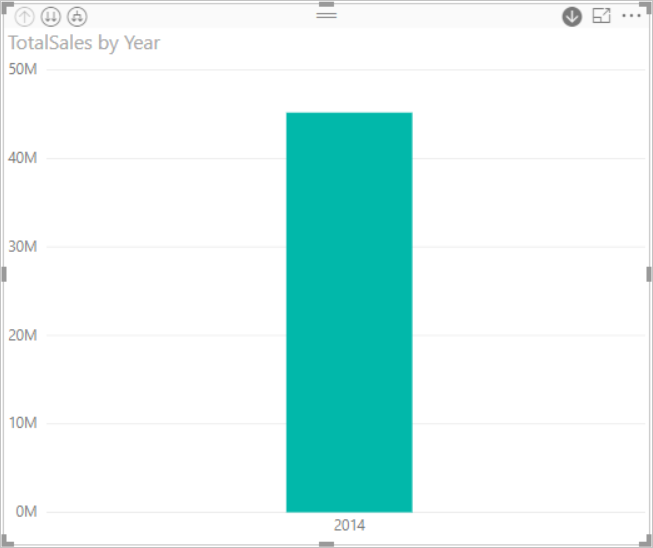

Detaya gitme modu açık olduğunda, hiyerarşide bir düzey kadar detaya gitmek için grafikteki çubuğa tıklayın. Üç aylık dönemlere ait kullanılabilir verilere ilişkin üç çubuk görürsünüz. Daha sonra sol üst taraftaki simgelerden **Expand all down one level of the hierarchy** (Tümünde hiyerarşinin bir düzeyi kadar detaya git) seçeneğini belirleyin. Daha sonra hiyerarşinin, her ayın sonuçlarını gösteren en düşük düzeyine inmek için bu işlemi tekrarlayın.

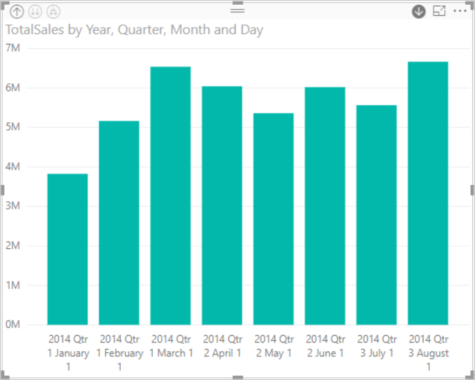

Görselleştirmenin dışında, hiyerarşinin her rapor için oluşturulan verilere yansıdığını görebiliriz. Aşağıdaki tablo, tek bir ayın veya tüm ayların detayına giden bir raporda **Verileri Göster** seçeneğinin sonuçlarını gösterir. 

Verilerin üç aylık ve yıllık raporlar için aynı olduğunu, ancak **Değerler** için belirtilen detay düzeyine gitmenizin ardından tek bir raporun daha ayrıntılı hale geldiğini ve "tüm aylar" raporunda daha fazla veri bulunduğunu görebilirsiniz.

|Genişletme modu|Yıl|Çeyrek|Ay|Gün|
| ---|:---:|:---:|:---:|---|
|Tek|||||
|Tümü|||||

### Hiyerarşik kategori verileri
Koleksiyonlardan ve alt koleksiyonlardan modeli oluşturulan veriler hiyerarşiktir. Konum verileri bunun iyi bir örneğidir. Bir veri kaynağında sütunları Ülke, Bölge, Şehir ve Posta Kutusu olan bir tablo düşünün. Aynı Ülkenin, Bölgenin ve Şehrin bulunduğu veriler hiyerarşiktir.

Bu örnekte, [Perakende Analizi örneğiyle](../sample-datasets.md) birlikte ilerleyin. **Total Units This Year** (Bu Yıla Ait Birimlerin Toplamı) (Değerler) özelliğini **Territory** (Bölge), **City** (Şehir), **Postal Code** (Posta Kodu) ve **Name** (Ad) (Grup) ölçütüne göre gösteren yığılmış bir sütun grafik görselleştirmesi oluşturun.  

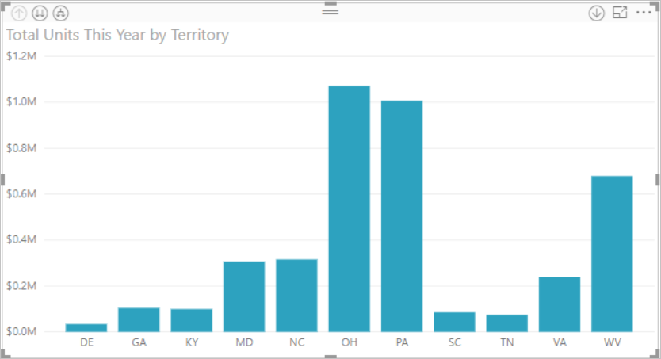

Detaya gitme modu açıkken, sol üst taraftaki simgelerden **Expand all down one level of the hierarchy** (Tümünde hiyerarşinin bir düzeyi kadar detaya git) seçeneğini üç kez belirleyin.
Hiyerarşinin Bölge, Şehir ve Posta Kodu sonuçlarını gösteren en düşük düzeyinde olmanız gerekir.

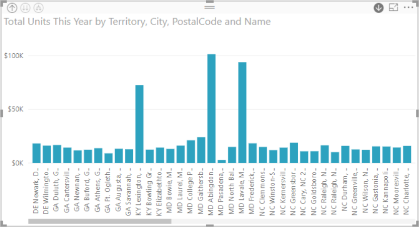

Görselleştirmenin dışında, hiyerarşinin her rapor için oluşturulan verilere yansıdığını görebiliriz. Aşağıdaki tablo, tek bölge veya tüm bölgeler için detaya giden bir raporda **Verileri Göster** seçeneğinin sonuçlarını gösterir. Detaya gittikçe, tek bir raporun daha ayrıntılı hale geldiğini ve "tüm bölgeler" raporunun daha fazla veri içerdiğini görebilirsiniz.

| Genişletme modu|Bölge|Şehir|Posta Kodu|Ad|
| ---|:---:|:---:|:---:|---|
|Tek|||||
|Tümü|||||

## Önemli noktalar ve sınırlamalar
* Bir görselleştirmeye tarih alanı eklenmesi bir hiyerarşi oluşturmuyorsa "tarih" alanı aslında bir tarih olarak kaydedilmemiş olabilir. Veri kümesi size aitse bunu Power BI Desktop'ta *Veri* görünümünde açın, tarihi içeren sütunu seçin ve Modelleme sekmesinde **Veri Türü**'nü **Tarih** veya **Tarih/Saat** olarak değiştirin. Rapor sizinle paylaşıldıysa değişikliği yapmasını istemek için raporun sahibi ile iletişime geçin.  
  
  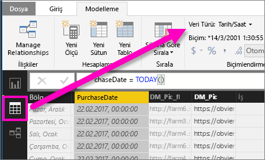

## Sonraki adımlar
[Power BI raporlarındaki görselleştirmeler](../visuals/power-bi-report-visualizations.md)

[Power BI raporları](end-user-reports.md)

[Power BI - Temel Kavramlar](end-user-basic-concepts.md)

Başka bir sorunuz mu var? [Power BI Topluluğu'na başvurun](http://community.powerbi.com/)

