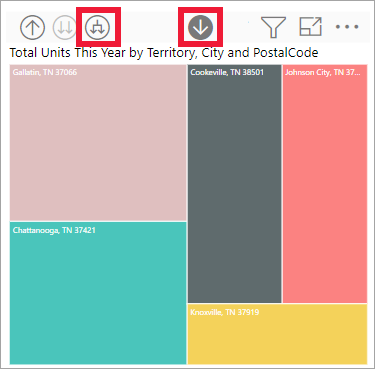

# Power BI’daki görsellerde detay modu

[!INCLUDE[consumer-appliesto-yyny](../includes/consumer-appliesto-yyny.md)]

[!INCLUDE [power-bi-service-new-look-include](../includes/power-bi-service-new-look-include.md)]

Bu makalede, Microsoft Power BI hizmetinde bir görselin detayına nasıl gidileceği gösterilir. Veri noktalarınızda detaya gitmeyi ve detaydan çıkmayı kullanarak verilerinizi çok ayrıntılı keşfedebilirsiniz. 

## Detay bir hiyerarşi gerektirir

Bir görselde hiyerarşi varsa ek ayrıntıları açığa çıkarmak için detaya gidebilirsiniz. Örneğin, Olimpiyat madalyası sayısına spor, disiplin ve etkinlik açısından bakan bir görselimiz olabilir. Görsel varsayılan olarak madalya sayısını sporlara göre (jimnastik, kayak, su sporları vb.) gösterir. Ancak bir hiyerarşiye sahip olduğundan, görsel öğelerden (bir çubuk, çizgi veya kabarcık) biri seçildiğinde giderek daha ayrıntılı hale gelen bir resim görüntülenir. Size yüzme, atlama ve su topu ile ilgili verileri gösterebilecek **su sporları** öğesini seçin.  Tramplen, kule ve senkronize atlama etkinlikleri ile ilgili ayrıntıları görebilmek için **atlama** öğesini seçin.

Tarih, benzersiz bir hiyerarşi türüdür.  Rapor *tasarımcıları* genellikle görsellere tarih hiyerarşileri ekler. Yaygın bir veri hiyerarşisi yıl, çeyrek, ay ve günü içeren hiyerarşidir. 

## Hangi görsellerin detaylandırılabileceğini bulma
Hangi Power BI görsellerinin bir hiyerarşi içerdiğinden emin değil misiniz? Görselin üzerine gelin. En üstte bu detay denetimlerinin bir bileşimini görüyorsanız görselinizin bir hiyerarşisi vardır.

  

## Detaya gitmeyi ve detaydan çıkmayı öğrenin

Bu örnekte bölge, şehir, posta kodu ve mağazadan oluşturulmuş bir hiyerarşisi olan ağaç haritasını kullanıyoruz. Detaylandırmadan önce ağaç haritası bölgeye göre bu yıl satılan toplam birim sayısına bakar. Bölge, hiyerarşinin en üst düzeyidir.

  

### Detay özelliklerine erişmenin iki yolu

Hiyerarşisi olan görseller için detaya gitme, detaydan çıkma ve genişletme özelliklerine erişmek için iki yolunuz vardır. İkisini de deneyin ve en hoşunuza gideni seçin.

- İlk yol: Simgeleri görmek ve kullanmak için bir görselin üzerine gelin. Öncelikle aşağı oku seçerek detaya gitme özelliğini etkinleştirin. Gri arka plan, detaya gitme özelliğinin etkin olduğunu gösterir.   

    

- İkinci yol: Menüyü ortaya çıkarmak ve kullanmak için bir görseli sağ tıklayın.

    

## Detay yolları

### Aynı anda tüm alanlarda detaya gitme

Görselinizi detaylandırmanın birkaç yolu vardır. Çift ok detaya gitme simgesini seçerek hiyerarşideki bir sonraki düzeye geçebilirsiniz. Kentucky ve Tennessee'ye **Territory** (Bölge) düzeyine bakıyorsanız, her iki eyalet için de şehir düzeyine, ardından posta kodu düzeyine ve son olarak da mağaza adı düzeyinde detaya gidebilirsiniz. Yoldaki her bir adım size yeni bilgiler gösterir.

"Total units this year by territory" düzeyine dönene kadar detaydan çıkma simgesini  seçin.

### Aynı anda tüm alanları genişletme

**Genişletme**, geçerli görünüme ilave bir hiyerarşi düzeyi ekler. Örneğin **Bölge** düzeyine bakıyorsanız aynı anda ağaçtaki tüm geçerli yaprakları genişletebilirsiniz.  İlk detay seçiminiz **KY** ve **TN** için şehir verilerini ekler. Bir sonraki detay seçiminiz ise **KY** ve **TN** için posta kodu verilerini ekler ve şehir verilerini korur. Yoldaki her adım size aynı bilgileri gösterir ve bir düzey yeni bilgi ekler.

### Aynı anda tek bir alanda detaya gitme

1. Detaya gitme simgesini seçerek açın .

    Şimdi görsel öğeyi seçerek **aynı anda tek alanda** detaya gitme seçeneği sunulur. Görsel öğesi örnekleri: çubuk, kabarcık ve yaprak.

    

    Detaya gitmeyi açmazsanız, görsel öğesinin (çubuk, kabarcık veya yaprak gibi) seçilmesi detaya gidilmesini sağlamaz. Bunun yerine, rapor sayfasındaki diğer grafiklerde çapraz filtreleme yapar.

1. **TN** için yaprak öğesini seçin. Ağaç haritanızda şimdi Tennessee’de mağazası olan tüm bölgeler ve şehirler gösterilir.

    

1. Bu noktada yapabilecekleriniz:

    1. Tennessee için detaya gitmeye devam edebilirsiniz.

    1. Tennessee'deki belirli bir şehir için detaya gidebilirsiniz.

    1. Bunun yerine genişletin.

    Aynı anda tek bir alanda detaya gitme konusuna devam edelim.  **Knoxville, TN** öğesini seçin. Ağaç haritanız şimdi Knoxville’deki mağazanızın posta kodunu gösterir.

    

    Detaya gittiğinizde ve detaydan çıktığınızda başlığın değiştiğine dikkat edin.

    Bir alanın daha detayına gidin. **37919** posta kodunu seçip mağaza adı detayına gidin. 

        

    Bu veriler için tüm düzeylerde aynı anda detaya gitmek cazip bir seçenek olmayabilir. Bunun yerine genişletmeyi deneyelim.

### Aynı anda tüm alanları ve tek bir alanı genişletme

Yalnızca posta kodu veya mağaza adı gösteren bir ağaç haritası pek bilgi vermez.  Bu nedenle hiyerarşide bir düzey aşağıya *genişletelim*.  

1. Öncelikle posta kodu düzeyine kadar detaydan çıkın.     
1. Ağaç haritası etkinken *aşağıya genişlet* simgesini  seçin. Ağaç haritanız şimdi iki hiyerarşi düzeyi gösterir: posta kodu ve mağaza adı.

    

1. Tennessee’nin dört hiyerarşi düzeyinin tamamını görmek için ikinci düzeye ulaşana kadar detaydan çıkma okunu seçin (**Bölge ve şehre göre bu yılki toplam birim sayısı**).

    

1. Detaya gitme düğmesinin hala açık olduğundan emin olun  ve *aşağıya genişlet* simgesini  seçin. Ağaç haritanız şimdi aynı sayıda yaprak (kutu) gösterir ama her yaprağın ek ayrıntıları vardır. Yalnızca şehir ve eyalet yerine posta kodu da gösterilir.

    

1. Ağaç haritanızda Tennessee’nin dört hiyerarşi düzeyinin tamamını görüntülemek için *aşağıya genişletme* simgesini bir kez daha seçin. Daha fazla ayrıntı görmek için bir yaprağın üzerine gelin.

    

## Detaylandırırken verileri gösterme
Temel alınan verilere göz atmak için **Tablo olarak göster** seçeneğini kullanın. Her detaylandırma veya genişletme işlemi yaptığınızda, **Tablo olarak göster** seçeneği görseli oluştururken kullanılan verileri görüntüler. Bu, görselleri oluşturmak için hiyerarşilerin, detaylandırmanın ve genişletmenin birlikte nasıl çalıştığını anlamanıza yardımcı olabilir. 

Sağ üst köşede **Diğer eylemler** (...) ve sonra **Tablo olarak göster**’i seçin. 

Power BI, ağaç haritasını tuvali kaplayacak şekilde açar. Ağaç haritasını oluşturan veriler, görselin altında görüntülenir. 

Tuvalde yalnızca görsel görüntülenirken detaya gitmeye devam edin. Tablodaki verilerin ağaç haritasını oluşturmak için kullanılan verileri yansıtacak şekilde değiştiğini göreceksiniz. Aşağıdaki tabloda tüm alanlarda aynı anda bölgeden mağaza adına detaya gidilmesinin sonuçları gösterilir. İlk tablo, hiyerarşinin en üst düzeyini, biri **KY**, biri de **TN** için olmak üzere iki yaprağa sahip ağaç haritasını gösterir. Sonraki üç tablo bölgeden posta koduna ve mağaza adına doğru tüm düzeylerde aynı anda detaya gittiğinizde elde edilen ağaç haritası verilerini gösterir.

**City**, **PostalCode** ve **Name** için toplamların aynı olduğuna dikkat edin. Toplamlar her zaman eşit olmayacaktır.  Ama bu veriler için her posta kodunda ve her şehirde tek mağaza vardır.  

## Önemli noktalar ve sınırlamalar
- Varsayılan olarak, detaylandırma özelliği bir rapordaki diğer görselleri filtrelemez. Öte yandan rapor tasarımcısı bu varsayılan davranışı değiştirebilir. Detaylandırırken, sayfadaki diğer görsellerde çapraz filtreleme veya çapraz vurgulama yapılıp yapılmadığına bakın.

- Sizinle paylaşılan bir raporu görüntülemek için Power BI Pro veya Premium lisansına sahip olmanız veya raporun Power BI Premium kapasitesinde depolanması gerekir. [Hangi lisansa sahibim?](end-user-license.md)

## Sonraki adımlar

[Power BI raporlarındaki görseller](../visuals/power-bi-report-visualizations.md)

[Power BI raporları](end-user-reports.md)

[Power BI - Temel Kavramlar](end-user-basic-concepts.md)

Başka bir sorunuz mu var? [Power BI Topluluğu'na başvurun](https://community.powerbi.com/)
