# Hızlı Başlangıç - Power BI hizmetinde dolaşma

[!INCLUDE [power-bi-service-new-look-include](../includes/power-bi-service-new-look-include.md)]

Power BI ile ilgili temel bilgileri öğrendiğinize göre şimdi de **Power BI hizmetine** göz atalım. Daha önce belirtildiği gibi, ekibinizdeki bir kişi verileri birleştirip başkaları için raporlar oluşturarak tüm zamanını **Power BI Desktop**’ta geçirebilir. Ancak siz zamanınızı, Power BI hizmetinde başkaları tarafından oluşturulan içerikleri görüntüleyip bu içeriklerle etkileşim kurarak (**kullanma** deneyimi) geçiriyor olabilirsiniz. Bu hızlı başlangıç kılavuzunda, Power BI hizmetini kullanmayı öğrenmek için örnek verileri içeri aktarıp kullanacaksınız. 
 
## Önkoşullar

- Power BI’ya kaydolmadıysanız başlamadan önce [ücretsiz deneme için kaydolun](https://app.powerbi.com/signupredirect?pbi_source=web).

- [Power BI hizmeti temel kavramlar](end-user-basic-concepts.md) bölümünü okuyun

## Power BI hizmetini açma

Başlamak için Power BI hizmetini (app.powerbi.com) açın ve **Giriş**’e gidin. 
1. Sol gezinti bölmesi daraltılmışsa, bunu genişletmek için gezinti bölmesi simgesi  öğesine tıklayın. 

1. Zaten açık değilse **Giriş** seçeneğini belirleyin. 

1. Örnek verileri alın. Power BI hizmeti turumuzda kullanılacak bazı örnek verileri elde edeceğiz. Keşfetmeniz için tüm örnek veri türlerini size sunarız. Bu örnekte, pazarlama ve satış ile ilgili verileri kullanacağız. 

    Bunu yapmak için [Satış ve pazarlama örneği uygulamasını](end-user-app-marketing.md) yüklemeye yönelik bu yönergeleri izleyin.

1. Uygulama yüklendikten sonra gezinti bölmesinde **Uygulamalar** seçeneğini belirleyin. 

   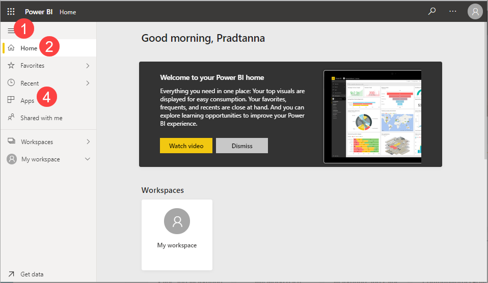

2. **Uygulamalar** ekranında **Satış ve Pazarlama örneği** uygulamasını seçin.

    

2. **Uygulamayı keşfet** seçeneğini belirleyin.

    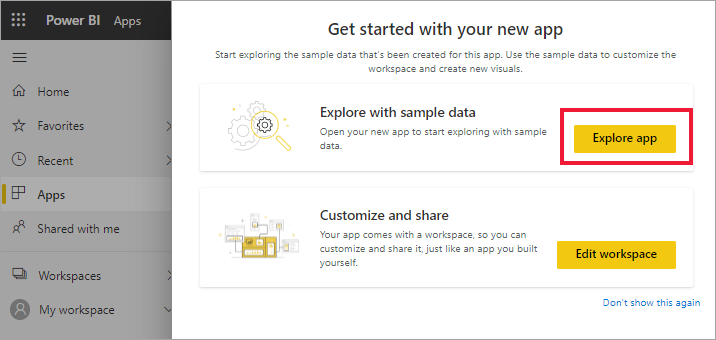

3. Power BI hizmeti uygulamanın panosunu açar. Power BI hizmetini Power BI Desktop’tan ayıran özelliklerden biri panolardır. Örnek, bir raporu ve bir veri kümesini de içerir. 

    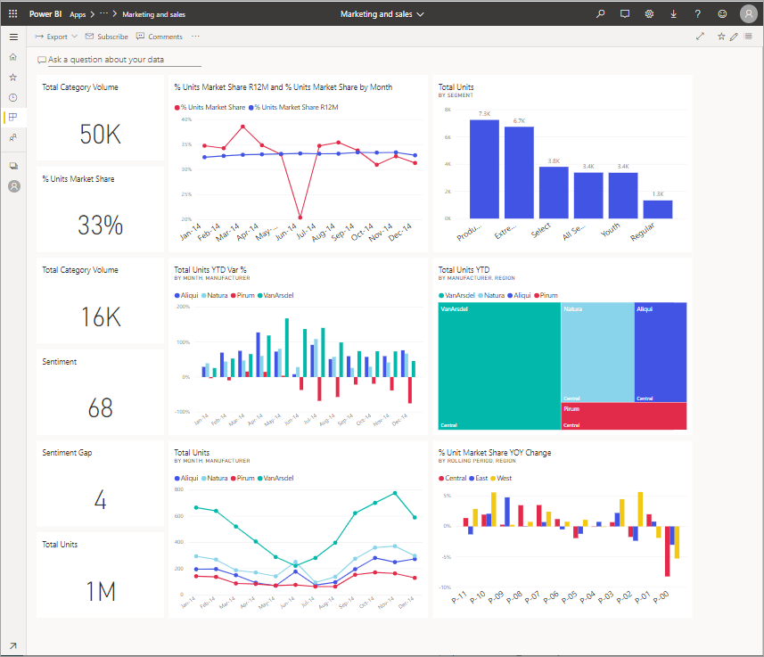

    *Tüketici* olarak, aldığınız çoğu uygulama, temel alınan veri kümelerine doğrudan erişim içermez. Power BI örnekleri tüm Power BI müşterileri için oluşturulduğundan, veri kümeleri bunlara dahildir. *Tasarımcı* iş arkadaşlarınız yeni pano ve rapor oluşturmayı öğrenmek için veri kümelerini kullanır. 

## İçeriği görüntüleme (panolar ve raporlar)
Temel içeriğin (panolar, raporlar ve uygulamalar) nasıl düzenlendiğini inceleyerek başlayalım. İçerik bir çalışma alanı bağlamında görüntülenir. Her tüketiciye en az bir çalışma alanı sunulur ve buna **Çalışma alanım** adı verilir. Her uygulama yüklemesinin ardından bu uygulama için bir çalışma alanı oluşturulur.  Satış ve Pazarlama örneği uygulamasını yüklediğimiz için artık iki çalışma alanımız var. 

Sol gezinti bölmesinde **Çalışma alanları** seçeneğini belirleyerek buna göz atabilirsiniz. 

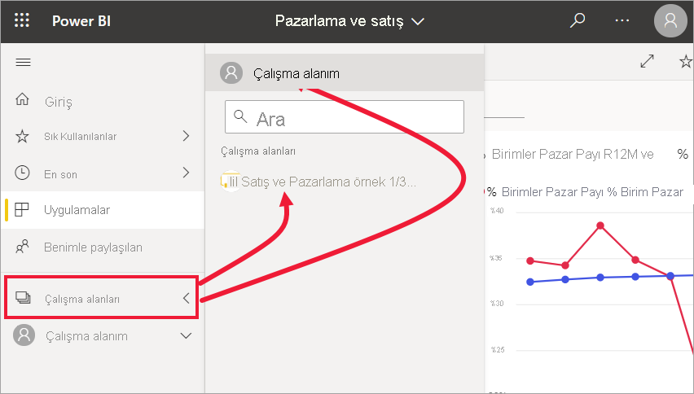

**Çalışma Alanım**, size ait olan ve sizin oluşturduğunuz tüm içeriği depolar. Bunu kişisel koruma alanınız veya kendi içeriğinize yönelik bir çalışma alanı gibi düşünün. Yeni içerik oluşturmak çoğu Power BI *tüketicisinin* işinin bir parçası olmadığından birçok kullanıcının **Çalışma alanım** bölümü boş gözükür.  Tanım gereği *tüketiciler*, diğer kişiler tarafından oluşturulan verileri kullanır ve iş kararları alırken bu verilerden faydalanır. İçerik oluşturuyorsanız, [*rapor oluşturucularına* yönelik Power BI makalelerini](../index.yml) okuyabilirsiniz.

**Uygulama çalışma alanları** belirli bir uygulamaya yönelik tüm içeriği içerir.  Bir *tasarımcı* uygulama oluşturduğunda, uygulamanın kullanılması için gereken tüm içeriği paket haline getirir.  *Tasarımcının* uygulamada neleri paket haline getirdiğini görmek için Satış ve Pazarlama çalışma alanını seçin. 

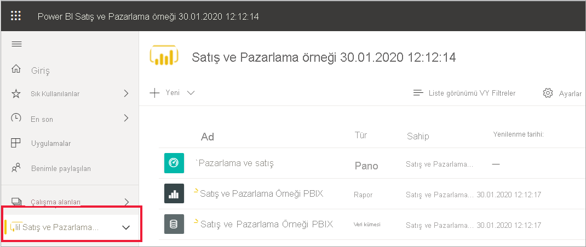

Satış ve Pazarlama uygulaması çalışma alanı bir panoyu, bir raporu ve bir veri kümesini içerir. Her uygulama bu üç içerik türünü içermeyebilir. Bir uygulama yalnızca bir panoyu, her içerik türünden üçer tane öğeyi veya yirmi tane raporu içerebilir. Bu tamamen *tasarımcının* uygulamaya neleri eklediğine bağlıdır. Satış ve pazarlama verileri örnek olduğundan bir veri kümesi içerir. Ancak genelde *tüketicilere* yönelik uygulama çalışma alanları veri kümesi içermez. 

Çalışma alanı, basit bir içerik listesinden çok daha fazlasını sunar. Bu sayfada, çalışma alanının pano ve raporları hakkında birçok bilgiyi bulabilirsiniz. İçerik sahibini, son yenileme tarihini, ilgili içeriği ve onayları belirlemek için birkaç dakikanızı ayırın. Çalışma alanının açıklaması varsa, bu açıklama çalışma alanının amaçlarını ve bunu iş amaçlarınız için nasıl kullanabileceğinizi daha iyi anlamanıza yardımcı olabilir. Çalışma alanında çok fazla içerik varsa, ihtiyacınız olan şeyi hızla bulmak için arama ve sıralama seçeneklerini kullanın.

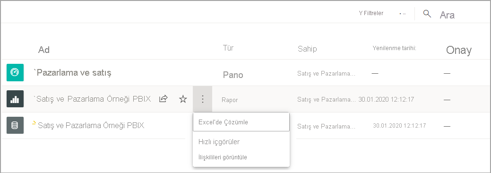

Çalışma alanı aynı zamanda verilerinize giden yollardan biridir. Listeden seçerek bir panoyu veya raporu açın.  Bir pano veya raporu sık kullanılanlara eklemek için yıldızın üzerine gelip bunu seçin. *Tasarımcı* tarafından size [paylaşım izinleri](end-user-shared-with-me.md) verildiyse, öğenin üzerine geldiğinizde bu eylem de görüntülenir. 

Pano adını seçerek panoyu açın.

## Bir panoyu ve raporu sık kullanılanlara ekleme
**Sık Kullanılanlar** sizin için en önemli içeriklere hızlıca erişmenizi sağlar. Çalışma alanındaki bir panoyu sık kullanılanlara eklemeyi öğrendiniz. Sık kullanılanları, bir pano veya rapordan da doğrudan oluşturabilirsiniz.

1. Pano açıkken menü çubuğunda **Sık kullanılanlara ekle** seçeneğini belirleyin.
   
   
   
   **Sık kullanılanlara ekle** seçeneği **Sık kullanılanlardan çıkar** olarak değişir ve yıldız simgesi sarı olur.
   
   

2. Sık kullanılanlara eklediğiniz tüm içeriklerin listesini görüntülemek için gezinti bölmesinde **Sık Kullanılanlar**’ın sağ tarafındaki oku seçin. Gezinti bölmesi Power BI hizmetinin kalıcı bir özelliği olduğu için bu listeye Power BI hizmetindeki herhangi bir konumdan erişebilirsiniz.
   
    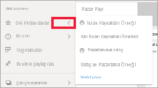
   
    Bu Power BI kullanıcısı şu ana kadar dört tane öğeyi sık kullanılanlara eklemiş. Sık kullanılanlar; panolar, raporlar ve uygulamalar olabilir.  

Daha fazla bilgi edinmek için bkz. [Sık Kullanılanlar](end-user-favorite.md)

## En son içeriğinizi bulma

1. Sık Kullanılanlar bölmesine benzer şekilde, gezinti bölmesinde bulunan **En son** sekmesinin yanındaki oku seçerek Power BI hizmetinde en son eriştiğiniz içeriği hızlıca görebilirsiniz.

   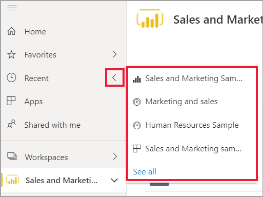

    Açılan menüden içeriği seçip açın.

2. Bazen son içeriği açmaktan ziyade İçgörüleri görüntüleme veya Excel’e dışarı aktarma gibi bilgi görüntülemek veya başka bir işlem uygulamak istersiniz. Bu tür durumlarda **En son** seçeneğini belirleyerek veya gezinti bölmesinden simgesini seçerek **En son** bölmesini açın. Bu örnekte, Power BI kullanıcısının birden fazla çalışma alanı olduğu için bu listede her çalışma alanından içerik bulunabilir.

   

Daha fazla bilgi için bkz. [Power BI'da son görüntülenenler](end-user-recent.md)

### İçerikleri arama ve sıralama
Power BI hizmetini yeni kullanmaya başladığınızda yalnızca birkaç parça içeriğiniz olur. Ancak, siz uygulama indirdikçe ve iş arkadaşlarınız sizinle içerik paylaştıkça çok fazla içerikle karşılaşabilirsiniz. Bu durumda, arama ve sıralama özellikleri son derece yararlı olur.

Arama özelliğini Power BI hizmetinin neredeyse her kısmında kullanabilirsiniz. Arama kutusunu veya aramaya ilişkin büyüteç simgesini bulmanız yeterlidir.    

Arama alanına pano, rapor, çalışma kitabı uygulama veya sahip adının tamamını veya bir bölümünü yazın. Power BI tüm içeriğinizi arar.

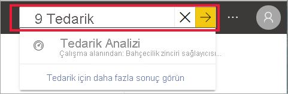

İçeriğinizi sıralamanın da birçok yolu vardır. İmleci sütun üst bilgilerinin üzerine getirin ve sütunun sıralanabileceğini belirten okları bulun. Her sütun sıralanamaz. 

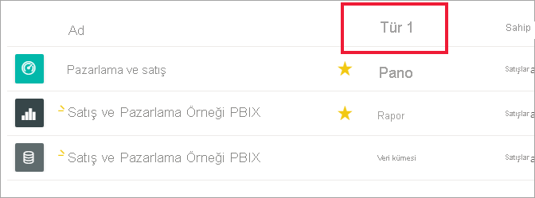

Veya, tuvalinizin sağ üst köşesine yakın olan sıralama denetimini bulun. Tarihe, ada veya sahibe göre artan veya azalan düzende sıralamak için seçim yapın.  

Daha fazla bilgi edinmek için bkz. [Power BI'da gezinti: arama ve sıralama](end-user-search-sort.md)

## Power BI Giriş
Bu hızlı başlangıcı başladığımız yerde yani Power BI **Giriş**’te sonlandıracağız. 

Giriş, arama ve sıralama araçlarını, gezinti bölmesini ve tuvali birleştirir. Tuval, panolarınızı, raporlarınızı ve uygulamalarınızı açmak için seçebileceğiniz *kartları* içerir. İlk aşamada Giriş tuvalinizde kart olmayabilir. Bu durum, iş arkadaşlarınızla birlikte Power BI’ı kullandıkça değişecektir. Giriş tuvaliniz, önerilen içerikler ve öğrenme kaynaklarıyla da güncelleştirilir.

Daha fazla bilgi için bkz. [Power BI Giriş](end-user-home.md)

## Kaynakları temizleme
Bu hızlı başlangıcı tamamladıktan sonra dilerseniz örnek panoyu, raporu ve veri kümesini silebilirsiniz.

1. Power BI hizmeti (app.powerbi.com) sayfasına gidin ve oturum açın.    
2. Power BI Giriş’i açın, aşağı kaydırarak **Çalışma alanları**’na gidin ve *Satış ve pazarlama* seçeneğini belirleyin.      

3. Pano, rapor veya veri kümesinin üzerine gelin ve **Daha fazla seçenek (...)**  > **Sil** seçeneğini belirleyin. Üçü de kaldırılana kadar tekrarlayın.

    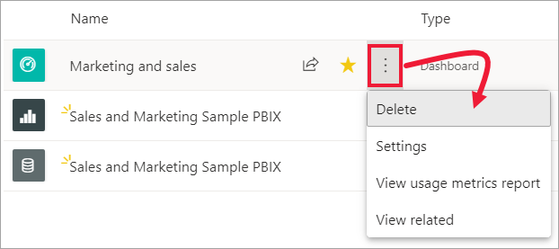

## Sonraki adımlar

> [!div class="nextstepaction"]
> [Power BI hizmetinde Okuma görünümü](end-user-reading-view.md)
