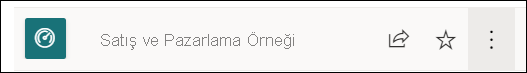

# Hızlı Başlangıç - Power BI hizmetinde dolaşma

[!INCLUDE [power-bi-service-new-look-include](../includes/power-bi-service-new-look-include.md)]

[Power BI ile ilgili temel bilgileri](end-user-basic-concepts.md) öğrendiğinize göre şimdi **Power BI hizmetine** göz atabiliriz. Bir önceki makalede belirtildiği gibi, ekibinizdeki iş arkadaşlarınız verileri birleştirip başkaları için raporlar, panolar ve uygulamalar oluşturarak zamanının tamamını **Power BI Desktop**’ta geçirebilir. Bu kişiler, *tasarımcılardır*. Ancak siz zamanınızı, Power BI hizmetinde başkaları tarafından oluşturulan içerikleri görüntüleyip bu içeriklerle etkileşim kurarak (**kullanma** deneyimi) geçiriyor olabilirsiniz. Bu durumda siz bir *işletme kullanıcısı* olursunuz. Bu hızlı başlangıç, *işletme kullanıcılarına* yöneliktir. 

   
 
## Ön koşullar

- Power BI’ya kaydolmadıysanız başlamadan önce [ücretsiz deneme için kaydolun](https://app.powerbi.com/signupredirect?pbi_source=web).

- [Power BI hizmeti temel kavramlar](end-user-basic-concepts.md) bölümünü okuyun

- *Tasarımcılar* tarafından oluşturulan Power BI içeriğini (raporlar, panolar, uygulamalar) görüntülemek için iki koşuldan birini karşılamanız gerekir:
    - Power BI Pro lisansı
    - Kuruluşunuzun Power BI Premium aboneliğine sahip olması ve içeriğin Premium kapasiteden paylaşılması gerekir.    
    [Lisanslar ve abonelikler hakkında bilgi edinin](end-user-license.md).     

    Bu hızlı başlangıç için bu koşullardan birini karşılamanıza gerek yoktur. Microsoft, örnek içeriği doğrudan Power BI hizmeti arabiriminden kullanıma sunmuştur. Power BI hizmetini keşfetmek için bu örnek içeriği kullanacağız. 

## Power BI hizmetini açma

Başlamak için Power BI hizmetini (app.powerbi.com) açın. 
1. Sol gezinti bölmesi daraltılmışsa, bunu genişletmek için gezinti bölmesi simgesi  öğesine tıklayın. 

1. Sol alt köşeden **Veri al**'ı seçin. Power BI hizmeti turumuzda kullanılacak bazı örnek verileri elde edeceğiz. Keşfetmeniz için farklı örnek veri türleri sunulmuştur. Bu örnekte, pazarlama ve satış ile ilgili verileri kullanacağız. 

   

1. **Veri al** ekranı açıldıktan sonra **Örnekler**'i seçin.

   

1. **Satış ve Pazarlama** > **Bağlan**'ı seçin. 

   

5. Power BI hizmeti, örneği **Çalışma alanım** sayfanıza yükler.  **Çalışma alanım**, öğrenmek ve denemeler yapmak için kullanacağınız özel korumalı alanınızdır.  **Çalışma alanım** sayfasındaki içeriği yalnızca siz görebilirsiniz. Örnekte bir pano, bir rapor ve bir veri kümesi vardır. Genellikle veri kümeleri *işletme kullanıcılarıyla* paylaşılmaz ancak bu örnek tüm kullanıcılara yöneliktir ve içinde veri kümesi de vardır.

    

    *İşletme kullanıcısı* olduğunuz için sizinle paylaşılan içeriğin çoğunda temel alınan veri kümelerine doğrudan erişim imkanı sunulmaz. Power BI örnekleri tüm Power BI müşterileri için oluşturulduğundan, veri kümeleri bunlara dahildir.   

    Örnekler hakkında daha fazla bilgi edinmek için bkz. [Power BI için örnek alma](../create-reports/sample-datasets.md).

## İçeriği görüntüleme (panolar ve raporlar)
İçerik bir çalışma alanı bağlamında düzenlenir. Her işletme kullanıcısına en az bir çalışma alanı sunulur ve buna **Çalışma alanım** adı verilir. *Tasarımcı* iş arkadaşlarınız sizinle içerik paylaştığında farklı çalışma alanları eklenebilir.  Örneğin bir *tasarımcı*, sahip olduğu çalışma alanlarından biri için erişim verirse ilgili çalışma alanı Power BI sitenizde görünür.  

**Çalışma Alanım**, size ait olan ve sizin oluşturduğunuz tüm içeriği depolar. Bunu kişisel koruma alanınız veya kendi içeriğinize yönelik bir çalışma alanı gibi düşünün. Yeni içerik oluşturmak çoğu Power BI *işletme kullanıcısının* işinin bir parçası olmadığından birçok kullanıcının **Çalışma alanım** bölümü boş görünür.  Tanım gereği *işletme kullanıcıları*, diğer kişiler tarafından oluşturulan verileri kullanır ve iş kararları alırken bu verilerden faydalanır. İçerik oluşturuyorsanız, [*rapor oluşturucularına* yönelik Power BI makalelerini](../index.yml) okuyabilirsiniz.

Çalışma alanı, basit bir içerik listesinden çok daha fazlasını sunar. Bu sayfada, çalışma alanının pano ve raporları hakkında birçok bilgiyi bulabilirsiniz. İçerik sahibini, son yenileme tarihini, veri duyarlılığını ve varsa onayları belirlemek için birkaç dakikanızı ayırın. Pano ve rapor üzerinde gerçekleştirebileceğiniz eylemlerin listesini görüntülemek için **Diğer eylemler (...)** öğesini seçin.   

Daha fazla bilgi edinmek için bkz. [Çalışma alanları](end-user-workspaces.md).

Çalışma alanı aynı zamanda verilerinize giden yollardan biridir. Çalışma alanında bulunan listeden seçim yaparak bir panoyu veya raporu açabilirsiniz.  Yıldızı seçerek bir panoyu veya raporu sık kullanılanlara ekleyebilirsiniz. *Tasarımcı* size [paylaşım izni](end-user-shared-with-me.md) vermişse buradan paylaşım da yapabilirsiniz. 

1. Açmak istediğiniz panonun adını seçin. Power BI hizmetini Power BI Desktop’tan ayıran özelliklerden biri panolardır. [Panolar hakkında bilgi edinin](end-user-dashboards.md)

    

2. Panoda gerçekleştirebileceğiniz eylemler üstteki menü çubuğunda görüntülenir.    

    

3. Bir pano kutucuğunun üzerine gelip **Diğer seçenekler (...)** öğesini seçerek ilgili kutucukla etkileşim kurmak için kullanabileceğiniz seçenekleri görebilirsiniz.

    

4. Kutucuğu oluşturmak için kullanılan raporu açmak için bir pano kutucuğunu seçin. Raporun kutucuk üzerindeki görseli içeren sayfası açılır. Burada ağaç haritasının bulunduğu pano kutucuğunu seçtik. Power BI hizmeti, raporun **YTD Category** sayfasını açar.

    

    Raporların farklı bölümleri vardır. Sol tarafta rapor sayfalarının yer aldığı tıklanabilir bir liste bulunur. Üst tarafta raporda gerçekleştirebileceğiniz eylemlerin yer aldığı menü çubuğu vardır.  Kullanılabilir seçenekler, rapor *tasarımcısının* size atamış olduğu role ve izinlere göre değişir. Sağ tarafta **Filtreler** bölmesi vardır. Ortadaki tuvalde ise raporun kendisini görebilirsiniz. Panolara benzer şekilde raporun tamamı, belirli görseller ve tek bir rapor sayfası için gerçekleştirebileceğiniz eylemler vardır. 

    Raporlar hakkında bilgi edinmek için bkz. [Power BI raporları](end-user-reports.md).

## Sol gezinti bölmesini kullanma
İş arkadaşlarınız sizinle içerik paylaştıkça gezinti bölmesi daha kullanışlı hale gelecektir. Hızlı başlangıcın bu bölümünde *Satış ve pazarlama* örneğini bir kenara bırakıp çok fazla paylaşılan içeriğe sahip olan bir Power BI *işletme kullanıcısına* ait olan bir panoya ve rapora göz atacağız.

1. **Giriş**, Power BI hizmetinde oturum açtığınızda varsayılan olarak göreceğiniz sayfadır. Giriş, başlangıç için ideal bir noktadır ve içeriğinizde gezinmeye yönelik alternatifler sunar. Giriş sayfasındaki içerikler sık kullanılanlar, en son kullanılanlar ve öne çıkanlar başlıkları altında düzenlenmiştir. Giriş sayfasında ayrıca en son kullandığınız çalışma alanları ve uygulamalar da görüntülenir. İstediğiniz öğeyi seçerek açabilirsiniz.

    Giriş, arama ve sıralama araçlarını, gezinti bölmesini ve tuvali birleştirir. Tuval, panolarınızı, raporlarınızı ve uygulamalarınızı açmak için seçebileceğiniz *kartları* içerir. İlk aşamada Giriş tuvalinizde kart olmayabilir. Bu durum, iş arkadaşlarınızla birlikte Power BI’ı kullandıkça değişecektir. Giriş tuvaliniz, önerilen içerikler ve öğrenme kaynaklarıyla da güncelleştirilir.

   

    Daha fazla bilgi edinmek için bkz. [Power BI Giriş sayfası](end-user-home.md)

2. **Sık kullanılanlar** ve **En son** bölümlerinde oklar bulunur. Okları seçerek ilk sıradaki beş sık kullanılan içeriği veya en son ziyaret edilen beş içeriği görebilirsiniz. Açılan menüden içeriği seçip açın. 

   

    Sık kullanılanlar veya son görüntülenenler için tam listeyi görmek için sözcüğü veya simgeyi seçin. Bu içerik listelerinde raporlar, uygulamalar ve panolar için ek bilgiler sunulur.

    

    Daha fazla bilgi edinmek için bkz. [Power BI'da son görüntülenenler](end-user-recent.md) ve [Power BI'da sık kullanılanlar](end-user-recent.md).

4. Sizinle paylaşılan veya sizin yüklediğiniz tüm uygulamaları görüntülemek için **Uygulamalar**'ı seçin. **Benimle paylaşılan** sayfasında da sizinle paylaşılan panoları ve raporları görebilirsiniz. Power BI hizmetini kullanmaya yeni başladığınız için içerik alanları boş olacaktır. 

    [Uygulamalar](end-user-apps.md) ve [Benimle paylaşılan](end-user-shared-with-me.md) sayfası hakkında bilgi edinin.

### İçerikleri arama ve sıralama
Power BI hizmetini yeni kullanmaya başladığınızda yalnızca birkaç parça içeriğiniz olur. Ancak, siz uygulama indirdikçe ve iş arkadaşlarınız sizinle içerik paylaştıkça çok fazla içerikle karşılaşabilirsiniz. Bu durumda, arama ve sıralama özellikleri son derece yararlı olur.

Arama özelliğini Power BI hizmetinin neredeyse her kısmında kullanabilirsiniz. Arama kutusunu veya aramaya ilişkin büyüteç simgesini bulmanız yeterlidir.    

Arama alanına pano, rapor, çalışma kitabı uygulama veya sahip adının tamamını veya bir bölümünü yazın. Power BI tüm içeriğinizi arar.

İçeriğinizi sıralamanın da birçok yolu vardır. İmleci sütun üst bilgilerinin üzerine getirin ve sütunun sıralanabileceğini belirten okları bulun. Her sütun sıralanamaz. 

Veya içerik listelerinizin sağ üst köşesine yakın olan **Arama filtrelerini** bulun. İçerik türü, sahip veya diğer alanlar arasından seçim yaparak içeriklere hızlıca ulaşabilirsiniz.

Daha fazla bilgi edinmek için bkz. [Power BI'da gezinti: arama ve sıralama](end-user-search-sort.md)

## Sahibi bulma
Bu hızlı başlangıcı faydalı bir ipucuyla kapatacağız. Bir pano, rapor veya uygulama ile ilgili sorularınız varsa sahibini bulabilirsiniz. İçerik açıkken başlık açılan menüsünü tıklayarak sahibi görüntüleyebilirsiniz. Sahip bir kişi veya bir grup olabilir.

## Kaynakları temizleme
Bu hızlı başlangıcı tamamladıktan sonra dilerseniz örnek panoyu, raporu ve veri kümesini silebilirsiniz.

1. Power BI hizmeti (app.powerbi.com) sayfasına gidin ve oturum açın.    
2. Power BI Giriş sayfasını açın, aşağı kaydırın ve **Çalışma alanım**'ı seçin.      

3. Pano, rapor veya veri kümesinin üzerine gelin ve **Daha fazla seçenek (...)**  > **Sil** seçeneğini belirleyin. Üçü de kaldırılana kadar tekrarlayın.

    

## Sonraki adımlar

> [!div class="nextstepaction"]
> [Power BI hizmetinde Okuma görünümü](end-user-reading-view.md)
