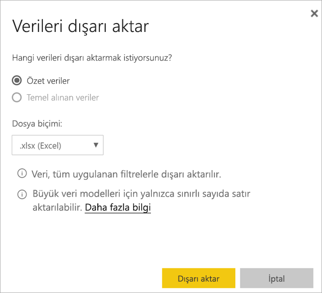

# Bir görseldeki verileri dışarı aktarma
Bir görselin oluşturulması için kullanılan verileri görmek isterseniz [söz konusu verileri Power BI’da görüntüleyebilir](end-user-show-data.md) ya da bir Excel'e aktarabilirsiniz. Verileri dışarı aktarma seçeneği belirli bir tür veya lisansa ek olarak veri kümesi ve rapor için düzenleme izinleri gerektirir. Dışarı aktaramıyorsanız, Power BI yöneticinizle iletişime geçin. 

## Bir Power BI panosunda bulunan görselden

1. Bir Power BI panosu başlatın. Burada ***Pazarlama ve satış örneği*** uygulamasındaki panoyu kullanacağız. Bu uygulamayı [AppSource.com adresinden indirebilirsiniz](https://appsource.microsoft.com/en-us/product/power-bi/microsoft-retail-analysis-sample.salesandmarketingsample-preview?flightCodes=e2b06c7a-a438-4d99-9eb6-4324ce87f282).

    

2. Bir görselin üzerine gelerek üç nokta (...) seçeneğini görüntüleyin ve tıklayarak eylem menüsünü gösterin.

    

3. **Excel'e Aktar**’ı seçin.

4. Bundan sonra ne olacağı, kullandığınız tarayıcıya bağlıdır. Dosyayı kaydetmeniz istenebilir veya tarayıcının altında dışarı aktarılmış dosyanın bir bağlantısını görebilirsiniz. 

    

5. Dosyayı Excel'de açın.  

    

## Bir raporda bulunan görselden
Bir rapordaki görselden verileri .csv veya .xlsx (Excel) biçiminde dışarı aktarabilirsiniz. 

1. Bir panoda, temel alınan raporu açmak için kutucuk seçin.  Bu örnekte, yukarıdakiyle aynı görseli seçiyoruz, *Yılbaşından Bugüne Toplam Birimler Var %* . 

    

    Bu kutucuk *Satış ve Pazarlama Örneği* raporundan oluşturulduğu için bu rapor açılır. Ayrıca, seçili kutucuk görselini içeren sayfada açılır. 

2. Rapordaki kutucuğu seçin. Sağ taraftaki **Filtreler** bölmesine dikkat edin. Bu görsele filtreler uygulanmıştır. Filtreler hakkında daha fazla bilgi için bkz. [Raporda filtre kullanma](end-user-report-filter.md).

    

3. Görselleştirmenin sağ üst köşesinde bulunan üç nokta simgesini seçin. **Verileri dışarı aktar** seçeneğini belirleyin.

    

4. Özetlenen verileri veya Temel alınan verileri dışarı aktarma seçeneklerini görürsünüz. *Satış ve pazarlama örneği* uygulamasını kullanıyorsanız, **Temel alınan veriler** devre dışı olacaktır. Ancak her iki seçeneğin de etkinleştirildiği raporlarla karşılaşabilirsiniz. Farkı hakkında bir açıklama aşağıda verilmiştir.

    **Özetlenmiş veriler**: Görselde gördükleriniz için verileri dışarı aktarmak istiyorsanız bu seçeneği belirtin.  Bu tür bir dışarı aktarma işlemi size yalnızca görseli oluşturmak için kullanılan verileri gösterir. Görselde uygulanmış filtreler varsa, dışarı aktardığınız veriler de filtrelenecektir. Örneğin, bu görsel için dışa aktarma işlemi yalnızca 2014 ve merkezi bölgenin verilerini ve yalnızca dört üreticinin verilerini içerir: VanArsdel, Natura, Aliqui ve Pirum.
  

    **Temel alınan veriler**: Görselde gördüklerinize **ek olarak** temel alınan veri kümesinden ek verileri dışarı aktarmak istiyorsanız bu seçeneği belirleyin.  Buna veri kümesinde bulunmasına karşın görselde kullanılmayan veriler dahil olabilir. 

    

5. Bundan sonra ne olacağı, kullandığınız tarayıcıya bağlıdır. Dosyayı kaydetmeniz istenebilir veya tarayıcının altında dışarı aktarılmış dosyanın bir bağlantısını görebilirsiniz. 

    

6. Dosyayı Excel'de açın. Dışarı aktarılan veri miktarını, panodaki aynı görselden dışarı aktardığımız verilerle karşılaştırın. Fark, bu dışarı aktarmanın **Temel alınan verileri** içermesidir. 

    

## Sonraki adımlar

[Görsel oluşturmak için kullanılan verileri görüntüleme](end-user-show-data.md)