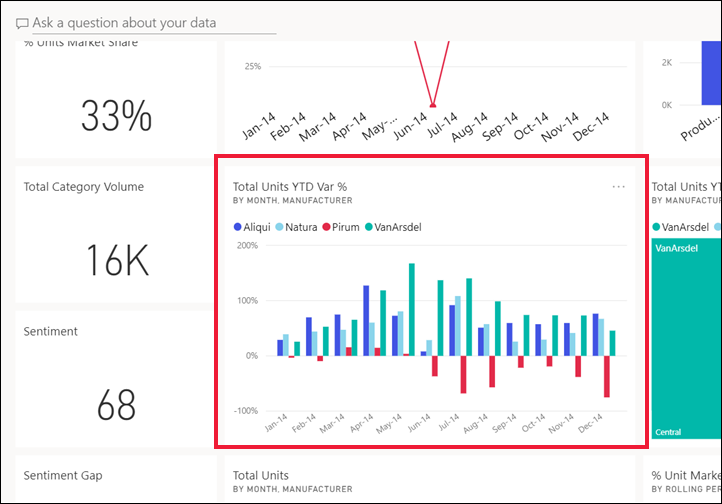
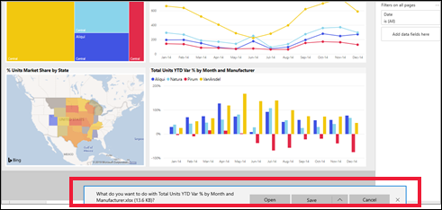

# Bir görseldeki verileri dışarı aktarma

[!INCLUDE[consumer-appliesto-yyny](../includes/consumer-appliesto-yyny.md)]

Bir görselin oluşturulması için kullanılan verileri görmek için [söz konusu verileri Power BI’da görüntüleyebilir](end-user-show-data.md) veya Excel'e aktarabilirsiniz. Verileri dışarı aktarma seçeneği belirli bir tür veya lisansa ek olarak veri kümesi ve rapor için düzenleme izinleri gerektirir. Dışarı aktaramıyorsanız, Power BI yöneticinizle veya BT yardım masanızla iletişime geçin. 

Verileri dışarı aktarmak için Power BI Pro lisansına sahip olmanız veya panonun ya da raporun sizinle Premium kapasite kullanılarak paylaşılmış olması gerekir. Daha fazla bilgi edinmek için bkz. [Hangi lisansa sahibim?](end-user-license.md). Rapor yazarı, ilgili rapor için verileri dışarı aktarma özelliğini kapatmış olabilir. Verileri dışarı aktaramıyorsanız rapor yazarıyla iletişime geçin.

## Bir Power BI panosunda bulunan görselden

1. Bir Power BI panosu başlatın. Burada ***Pazarlama ve satış örneği** _ uygulamasındaki panoyu kullanacağız. Bu uygulamayı [AppSource.com adresinden indirebilirsiniz](https://appsource.microsoft.com/en-us/product/power-bi/microsoft-retail-analysis-sample.salesandmarketingsample
).

    

2. Bir görselin üzerine gelerek _ *Diğer seçenekler** (...) seçeneğini ortaya çıkarın ve tıklayarak eylem menüsünü görüntüleyin.

    

3. **CSV'ye Aktar**’ı seçin.

4. Bundan sonra ne olacağı, kullandığınız tarayıcıya bağlıdır. Dosyayı kaydetmeniz istenebilir veya tarayıcının altında dışarı aktarılmış dosyanın bir bağlantısını görebilirsiniz. Varsayılan olarak dışarı aktardığınız dosya yerel İndirilenler klasörünüze kaydedilir. 

    

5. Dosyayı Excel'de açın. 

    > [!NOTE]
    > Veriler üzerinde izinleriniz yoksa, Excel'e dışarı aktaramaz veya Excel'de açamazsınız.  

    

## Bir raporda bulunan görselden
Bir rapordaki görselden verileri .csv veya .xlsx (Excel) biçiminde dışarı aktarabilirsiniz. 

1. Bir panoda, temel alınan raporu açmak için kutucuk seçin.  Bu örnekte, yukarıdakiyle aynı görseli seçiyoruz, *Yılbaşından Bugüne Toplam Birimler Var %*. 

    

    Bu kutucuk *Satış ve Pazarlama Örneği* raporundan oluşturulduğu için bu rapor açılır. Ayrıca, seçili kutucuk görselini içeren sayfada açılır. 

2. Raporda görseli seçin. Sağ taraftaki **Filtreler** bölmesine dikkat edin. Bu görsele filtreler uygulanmıştır. Filtreler hakkında daha fazla bilgi için bkz. [Raporda filtre kullanma](end-user-report-filter.md).

    

3. Görselleştirmenin sağ üst köşesinde **Diğer seçenekler (...)** öğesini seçin. **Verileri dışarı aktar** seçeneğini belirleyin.

    

4. Özetlenen verileri veya Temel alınan verileri dışarı aktarma seçeneklerini görürsünüz. *Satış ve pazarlama örneği* uygulamasını kullanıyorsanız, **Temel alınan veriler** devre dışı olacaktır. Ancak her iki seçeneğin de etkinleştirildiği raporlarla karşılaşabilirsiniz. Farkı hakkında bir açıklama aşağıda verilmiştir.

    **Özetlenmiş veriler**: Görselde şu anda gördükleriniz için verileri dışarı aktarmak istiyorsanız bu seçeneği belirtin.  Bu tür bir dışarı aktarma işlemi size yalnızca görselin şu anki durumunu oluşturmak için kullanılan verileri gösterir. Görselde uygulanmış filtreler varsa, dışarı aktardığınız veriler de filtrelenecektir. Örneğin, bu görsel için dışa aktarma işlemi yalnızca 2014 ve merkezi bölgenin verilerini ve yalnızca dört üreticinin verilerini içerir: VanArsdel, Natura, Aliqui ve Pirum. Görselinizin toplamaları (toplam, ortalama vb.) varsa, dışarı aktarma da toplanacaktır. 
  

    **Temel alınan veriler**: Görselde gördüklerinize **ek olarak** temel alınan veri kümesinden ek verileri dışarı aktarmak istiyorsanız bu seçeneği belirleyin.  Buna veri kümesinde bulunmasına karşın görselde kullanılmayan veriler dahil olabilir. Görselde uygulanmış filtreler varsa, dışarı aktardığınız veriler de filtrelenecektir.  Görselinizin toplamaları (toplam, ortalama vb.) varsa, dışarı aktarma işlemi toplamayı kaldırır; temelde verileri düzleştirir. 

    

5. Bundan sonra ne olacağı, kullandığınız tarayıcıya bağlıdır. Dosyayı kaydetmeniz istenebilir veya tarayıcının altında dışarı aktarılmış dosyanın bir bağlantısını görebilirsiniz. Microsoft Teams'de Power BI uygulamasını kullanıyorsanız, dışarı aktarılan dosyanız yerel İndirilenler klasörünüze kaydedilir. 

    

    > [!NOTE]
    > Veriler üzerinde izinleriniz yoksa, Excel'e dışarı aktaramaz veya Excel'de açamazsınız.  

6. Dosyayı Excel'de açın. Dışarı aktarılan veri miktarını, panodaki aynı görselden dışarı aktardığımız verilerle karşılaştırın. Fark, bu dışarı aktarmanın **Temel alınan verileri** içermesidir. 

    

## Sonraki adımlar

[Görsel oluşturmak için kullanılan verileri görüntüleme](end-user-show-data.md)