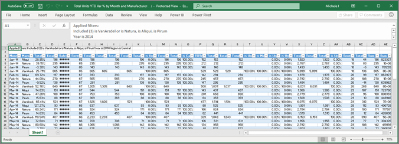

# Visual Studio'dan verileri dışarı aktarma
Bir görseli oluşturmak için kullanılan verileri görmek istiyorsanız, [söz konusu verileri Power BI'da görüntüleyebilir](end-user-show-data.md) veya bu verileri Excel'e aktarabilirsiniz. Verileri dışarı aktarma seçeneği, belirli bir tür veya lisansı gerektirir ve içerik izinlerini düzenleyin. Dışarı aktaramadığınız, Power BI yöneticinizle birlikte denetleyin. 

## Power BI panosunda bir Görselden

1. Power BI panosunda başlatın. Panodan burada kullandığımız ***pazarlama ve satış örnek*** uygulama. Yapabilecekleriniz [bu uygulamayı AppSource.com ' indirin](https://appsource.microsoft.com/en-us/product/power-bi/microsoft-retail-analysis-sample.salesandmarketingsample-preview?flightCodes=e2b06c7a-a438-4d99-9eb6-4324ce87f282).

    

2. Üç nokta (...) açığa çıkarmak için bir görselin üzerine gelin ve Eylem menüsünü görüntülemek için tıklayın.

    

3. Seçin **Excel'e**.

4. Sonraki işlemin ne kullanmakta olduğunuz tarayıcı üzerinde bağlıdır. Dosya ya da, Mayıs kaydetmek için istenebilir tarayıcı alt kısmındaki dışarı aktarılan dosyanın bir bağlantısını bakın. 

    

5. Dosyayı Excel'de açın.  

    

## Bir rapordaki bir Görselden
Verileri bir rapordaki bir görseldeki .csv veya .xlsx (Excel) olarak dışarı aktarabilirsiniz biçimi. 

1. Bir Panoda bağlantılı raporu açmak için bir kutucuk seçin.  Bu örnekte biz aynı görsel olarak yukarıdaki seçeneğini belirliyoruz *toplam birimler YTD Var %* . 

    

    Bu kutucuk oluşturulduktan sonra *satış ve pazarlama örneği* açar raporun oluşturulduğu rapor. Ve seçili döşemeyi görseli içeren sayfa açılır. 

2. Raporda kutucuğu seçin. Bildirim **filtreleri** sağ bölmesinde. Bu görsele uygulanan filtreler sahiptir. Filtreler hakkında daha fazla bilgi edinmek için [rapor filtrelerini kullanma](end-user-report-filter.md).

    

3. Görselleştirmenin sağ üst köşesinde bulunan üç nokta simgesini seçin. Seçin **verileri dışarı aktar**.

    

4. Summarized veya temel verilerini dışarı aktarmak için seçenekler görürsünüz. Kullanıyorsanız *satış ve pazarlama örneği* uygulamayı **temel alınan veriler** devre dışı bırakılır. Ancak, burada iki seçenek de etkin raporları karşılaşabilirsiniz. Fark açıklaması aşağıda verilmiştir.

    **Özetlenmiş veriler**: görselde görmek için verileri dışarı aktarmak istiyorsanız bu seçeneği belirleyin.  Bu tür bir dışarı aktarma, görseli oluşturmak için kullanılan verileri gösterir. Görsel uygulanan filtreler varsa, verdiğiniz veri da filtrelenir. Örneğin, bu görsel için yalnızca 2014 için veri ve orta bölgesinde ve dört üreticileri için yalnızca veri dışa aktarma içerecek: VanArsdel, Natura, Aliqui ve Prirum.
  

    **Temel alınan veriler**: görselde görmek için verileri dışarı aktarmak istiyorsanız bu seçeneği **artı** temel alınan veri kümesine ilişkin ek veriler.  Bu veri kümesinde yer alan ancak görselde kullanılmayan verileri içerebilir. 

    

5. Sonraki işlemin ne kullanmakta olduğunuz tarayıcı üzerinde bağlıdır. Dosya ya da, Mayıs kaydetmek için istenebilir tarayıcı alt kısmındaki dışarı aktarılan dosyanın bir bağlantısını bakın. 

    

7. Dosyayı Excel'de açın. Biz Panoda aynı görseli öğesinden dışarı aktarılan verileri dışarı veri miktarı karşılaştırın. Bu dışarı aktarma içerdiğini fark **temel alınan veriler**. 

    

