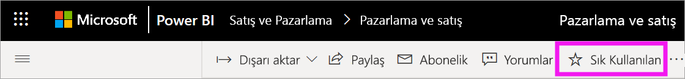
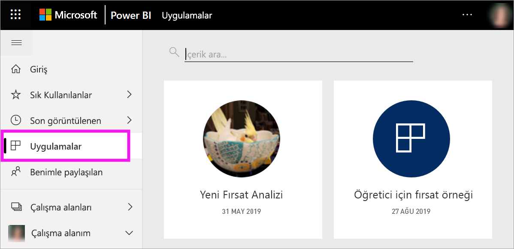
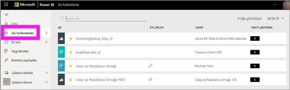
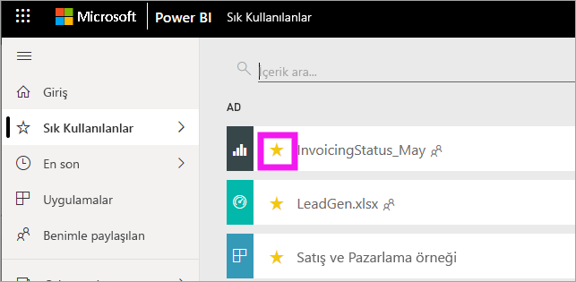

# Power BI hizmetindeki sık kullanılan panolar, raporlar ve uygulamalar
Bir içeriği *sık kullanılanlara eklediğinizde*, buna **Sık kullanılanlar** içerik listesinden ve **Power BI Giriş** > **Sık kullanılanlar ve sık ziyaret edilenler** bölümünden hızla erişebilirsiniz. Sık kullanılanlar, genellikle sık ziyaret ettiğiniz içeriklerdir. Bunlar, sarı bir yıldız ile tanımlanır.

   

   

Power BI hizmetinde, tek bir panoyu [Öne çıkan pano](end-user-featured.md) olarak belirleyebilirsiniz.

## Bir panoyu veya raporu sık kullanılanlara ekleme

1. Sık kullandığınız pano veya raporlardan birini açın. Sizinle paylaşılan içerikleri bile sık kullanılanlara ekleyebilirsiniz.

2. Power BI hizmetinin üst menü çubuğunda **Sık kullanılanlara ekle**’yi veya yıldız  simgesini seçin.
   
   
   
   Giriş, Son kullanılanlar, Uygulamalar ve Benimle paylaşılanlar gibi, yıldız simgesini gördüğünüz her yerde bir pano veya raporu sık kullanılanlara ekleyebilirsiniz. 
   
   

## Bir uygulamayı sık kullanılanlara ekleme

1. Gezinti bölmesinden **Uygulamalar**’ı seçin.

   

2. Daha fazla ayrıntı görüntülemek için bir uygulamanın üzerine gelin. Sık kullanılan olarak ayarlamak için yıldız  simgesini seçin.
   
   

## Sık kullanılanlarla çalışma
1. Sık kullanılanlarınıza erişmek için **Sık Kullanılanlar**’ın sağında bulunan açılır öğe okunu seçin. Burada, sık kullanılanlardan birini seçerek açabilirsiniz. En fazla beş sık kullanılan öğe alfabetik sırayla listelenir. Sık kullanılanlara beşten fazla öğe eklediyseniz sık kullanılanlar içerik listesini açmak için **Tümünü göster**’i seçin. 
   
   
2. Sık kullanılanlara eklediğiniz tüm içeriği görmek için sol taraftaki gezinti bölmesinde bulunan **Sık Kullanılanlar**’ı veya Sık Kullanılanlar  simgesini seçin. 
   
    
   
   Buradan işlem yapabilirsiniz. Bir sık kullanılanı açabilir, sahipleri tanımlayabilir ve hatta iş arkadaşlarınızla paylaşabilirsiniz.

## İçeriği sık kullanılanlardan çıkarma
Bir raporu artık eskisi kadar sık kullanmıyorsanız sık kullanılanlardan çıkarabilirsiniz. Sık kullanılanlardan çıkardığınız içerikler yalnızca Sık Kullanılanlar listenizden kaldırılır, Power BI’dan kaldırılmaz.

1. Sol gezinti bölmesinde **Sık Kullanılanlar**'ı seçerek **Sık Kullanılanlar** ekranını açın.
   
   
2. Sık kullanılanlardan çıkarmak istediğiniz içeriğin yanındaki sarı yıldızı seçin.

> [!NOTE]
> Bir panoyu, raporu veya uygulamayı da sık kullanılanlardan kaldırabilirsiniz. Yalnızca açın ve sarı simgenin seçimini kaldırın. 
> 
> 
## Sınırlamalar ve önemli noktalar
Şu anda, bir uygulamayı sık kullanılanlara eklediğinizde bu uygulamaya yönelik tüm rapor ve panolar da otomatik olarak sık kullanılanlara eklenir. Ayrı uygulama raporlarını veya panolarını sık kullanılanlara eklemek mümkün değildir. 

## Sonraki adımlar
- [Power BI: Temel kavramlar](end-user-basic-concepts.md)
- Başka bir sorunuz mu var? [Power BI Topluluğu](http://community.powerbi.com/)'nu deneyin.

