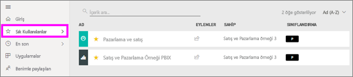
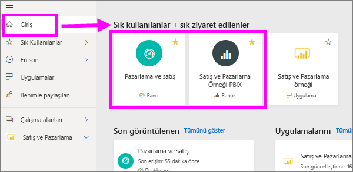
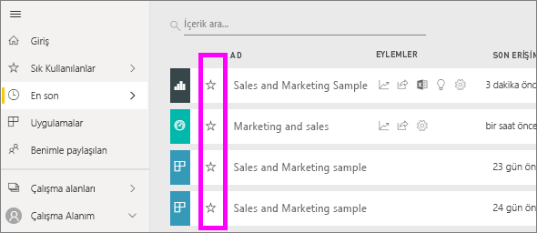
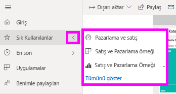

# Power BI hizmetindeki sık kullanılan panolar, raporlar ve uygulamalar
İçerik yaptığınızda bir *sık kullanılan*, hızlı bir şekilde erişmek mümkün olacaktır **Sık Kullanılanlar** içerik listesi ve **Power BI giriş**  >   **Sık Kullanılanlar ve sık ziyaret edilenler**.  Sık Kullanılanlar, genelde içeriği en çok ziyaret ettiğiniz ve sarı bir yıldız ile tanımlanır.

   

   

Ayrıca olarak tek bir Pano seçebilirsiniz bir [öne çıkan Pano](end-user-featured.md) Power BI hizmetinde.

## Bir panoyu veya raporu *sık kullanılanlara* ekleme

1. Sık kullandığınız pano veya raporlardan birini açın. Sizinle paylaşılan içerikleri bile *sık kullanılanlara* ekleyebilirsiniz.

2. Power BI hizmetinde üst şeridinden seçin **sık kullanılan** veya yıldız  simgesi.
   
   
   
   Ayrıca Sık Kullanılanlara ekleyerek bir panonun veya raporun her yerden giriş, son görüntülenen, uygulamaları ve paylaşılan gibi yıldız simgesini benimle görürsünüz. 
   
   

## Bir uygulamayı *sık kullanılanlara* ekleme

1. Gezinti bölmesinde seçin **uygulamaları**.

   

2. Daha fazla ayrıntı görüntülemek için bir uygulamanın üzerine gelin.  Sık kullanılan olarak ayarlamak için yıldız   simgesini seçin.
   
   

## *Sık kullanılanlar*'ı kullanma
1. Sık Kullanılanlara erişmek için sağ tarafındaki oku seçin **Sık Kullanılanlar**.  Burada, sık kullanılanlardan birini seçerek açabilirsiniz. Yalnızca beş sık kullanılan öğe listelenir (alfabetik sırada). Beşten fazla varsa, seçin **tümünü gör** açmak için içerik Sık Kullanılanlar listesine (#2, aşağıya bakın). 
   
   
2. Görmek için **tüm** Gezinti bölmesindeki Sık Kullanılanlar seçerken eklediğiniz içeriği **Sık Kullanılanlar** veya Sık Kullanılanlar  simgesi.  
   
    
   
   Burada şu işlemleri yapabilirsiniz: açma, sahipleri tanımlama ve hatta iş arkadaşlarınızla paylaşma.

## İçeriği sık kullanılanlardan çıkarma
Bir raporu artık eskisi kadar sık kullanmıyor musunuz?  Öyleyse sık kullanılanlardan çıkarabilirsiniz. Sık kullanılanlardan çıkardığınız içerikler yalnızca Sık Kullanılanlar listenizden kaldırılır, Power BI'dan kaldırılmaz.

1. Sol gezinti bölmesinde **Sık Kullanılanlar**'ı seçerek **Sık Kullanılanlar** ekranını açın.
   
   
2. Sık kullanılanlardan çıkarmak istediğiniz içeriğin yanındaki sarı yıldızı seçin.

> [!NOTE]
> Bir panoyu, raporu veya uygulamayı da sık kullanılanlardan kaldırabilirsiniz. Yalnızca açın ve sarı simgenin seçimini kaldırın.   
> 
> 
## Sınırlamalar ve önemli noktalar
Şu anda, uygulamayı sık kullanılanlara ekleme ve bu otomatik olarak Sık Kullanılanlar tüm raporlar ve panolar bu uygulama için kullanabilirsiniz. Sık kullanılan tek tek uygulama raporlar veya panolar için mümkün değildir. 

## Sonraki adımlar
[Power BI - Temel Kavramlar](end-user-basic-concepts.md)

Başka bir sorunuz mu var? [Power BI Topluluğu'na başvurun](http://community.powerbi.com/)

