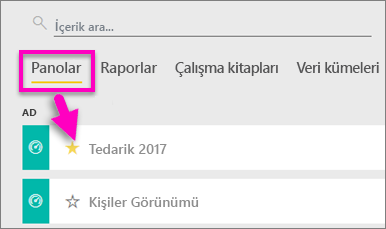
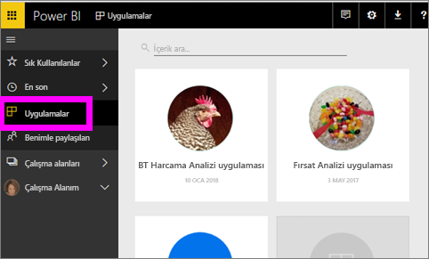
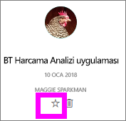
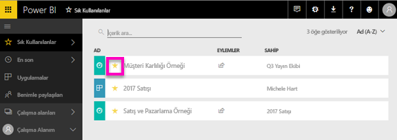

# Power BI hizmetindeki sık kullanılan panolar, raporlar ve uygulamalar
Bir içeriği *sık kullanılanlara* eklediğinizde panoya tüm çalışma alanlarınızdan erişebilirsiniz.  Sık kullanılanlar, genelde en çok ziyaret ettiğiniz içeriklerdir.

> [!NOTE]
> Bu konu başlığı, Power BI Desktop uygulamasına değil Power BI hizmetine yöneliktir.
> 
> 

Power BI hizmetinde tek bir panoyu [öne çıkan pano](end-user-featured.md) olarak belirleyebilirsiniz.

## Bir panoyu veya raporu *sık kullanılanlara* ekleme
En çok ziyaret ettiği öğeleri çalışma alanındaki sık kullanılanlar listesine ekleyen Amanda'yı izledikten sonra kendiniz denemek için videonun altındaki adım adım yönergeleri uygulayın.

<iframe width="560" height="315" src="https://www.youtube.com/embed/G26dr2PsEpk" frameborder="0" allowfullscreen></iframe>

1. Sık kullandığınız pano veya raporlardan birini açın. Sizinle paylaşılan içerikleri bile *sık kullanılanlara* ekleyebilirsiniz.
2. Power BI hizmetinin sağ üst köşesinde bulunan **Sık kullanılanlara ekle**’yi veya yıldız  simgesini seçin.
   
   
   
   Ayrıca, çalışma alanınızın **Panolar** veya **Raporlar** içerik görünümü sekmesinden bir pano veya raporu sık kullanılanlara ekleyebilirsiniz.
   
   

## Bir uygulamayı *sık kullanılanlara* ekleme

1. Sol gezinti bölmesinden **Uygulamalar**’ı seçin.

   

2. Daha fazla ayrıntı görüntülemek için bir uygulamanın üzerine gelin.  Sık kullanılan olarak ayarlamak için yıldız   simgesini seçin.
   
   

## *Sık kullanılanlar*'ı kullanma
1. Sık kullanılanlara erişmek için herhangi bir çalışma alanında **Sık Kullanılanlar**'ın yanındaki oku seçin.  Burada, sık kullanılanlardan birini seçerek açabilirsiniz. Yalnızca beş sık kullanılan öğe listelenir (alfabetik sırada). Sık kullanılanlara beşten fazla öğe eklediyseniz sık kullanılanlar ekranını (aşağıdaki 2. görüntüye bakın) açmak için **Tümünü gör**'ü seçin. 
   
   
2. Sık kullanılanlara eklediğiniz **tüm** içeriği görmek için sol taraftaki gezinti bölmesinde bulunan **Sık Kullanılanlar**’ı veya Sık Kullanılanlar  simgesini seçin.  
   
    
   
   Burada şu işlemleri yapabilirsiniz: açma, sahipleri tanımlama ve hatta iş arkadaşlarınızla paylaşma.

## İçeriği sık kullanılanlardan çıkarma
Bir raporu artık eskisi kadar sık kullanmıyor musunuz?  Öyleyse sık kullanılanlardan çıkarabilirsiniz. Sık kullanılanlardan çıkardığınız içerikler yalnızca Sık Kullanılanlar listenizden kaldırılır, Power BI'dan kaldırılmaz.

1. Sol gezinti bölmesinde **Sık Kullanılanlar**'ı seçerek **Sık Kullanılanlar** ekranını açın.
   
   
2. Sık kullanılanlardan çıkarmak istediğiniz içeriğin yanındaki sarı yıldızı seçin.

> **NOT**: Bir panoyu, raporu veya uygulamayı da sık kullanılanlardan kaldırabilirsiniz. Yalnızca açın ve sarı simgenin seçimini kaldırın.   
> 
> 

## Sonraki adımlar
[Power BI nedir?](../power-bi-overview.md)

[Power BI - Temel Kavramlar](end-user-basic-concepts.md)

Başka bir sorunuz mu var? [Power BI Topluluğu'na başvurun](http://community.powerbi.com/)

