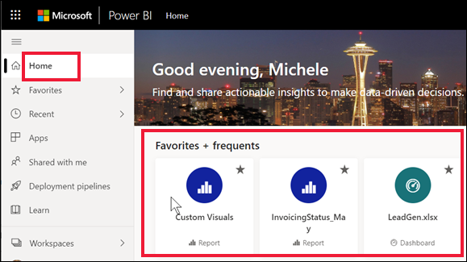
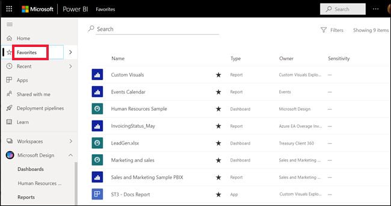

# Power BI hizmetindeki sık kullanılan panolar, raporlar ve uygulamalar

[!INCLUDE[consumer-appliesto-yyny](../includes/consumer-appliesto-yyny.md)]

Bir içeriği *sık kullanılanlara eklediğinizde*, buna **Sık kullanılanlar** içerik listesinden ve **Power BI Giriş** > **Sık kullanılanlar ve sık ziyaret edilenler** bölümünden hızla erişebilirsiniz. Sık kullanılanlar genellikle en sık ziyaret ettiğiniz içeriklerdir ve içi dolu bir yıldızla belirtilir.

   

   

## Bir panoyu veya raporu sık kullanılanlara ekleme

1. Sık kullandığınız pano veya raporlardan birini açın. Sizinle paylaşılan içerikleri bile sık kullanılanlara ekleyebilirsiniz.

2. Power BI hizmetinin üst menü çubuğunda **Sık kullanılanlara ekle**’yi veya yıldız  simgesini seçin.
   
   
   
   Giriş, Son kullanılanlar, Uygulamalar ve Benimle paylaşılanlar gibi, yıldız simgesini gördüğünüz her yerde bir pano veya raporu sık kullanılanlara ekleyebilirsiniz. 
   
   

## Bir uygulamayı sık kullanılanlara ekleme

1. Gezinti bölmesinde **Uygulamalar**’ı seçin.

   

2. Daha fazla ayrıntı görüntülemek için bir uygulamanın üzerine gelin. Sık kullanılan olarak ayarlamak için yıldız  simgesini seçin.
   
   

## Sık kullanılanlarla çalışma
1. Sık kullanılanlarınıza erişmek için **Sık Kullanılanlar**’ın sağında bulunan açılır öğe okunu seçin. Burada, sık kullanılanlardan birini seçerek açabilirsiniz. En fazla beş sık kullanılan öğe alfabetik sırayla listelenir. Sık kullanılanlara beşten fazla öğe eklediyseniz sık kullanılanlar içerik listesini açmak için **Tümünü göster**’i seçin. 
   
   
2. Sık kullanılanlara eklediğiniz tüm içerikleri görmek için gezinti bölmesinde **Sık Kullanılanlar** seçeneğini belirleyin veya Sık Kullanılanlar  simgesini seçin. simgesini seçerek gezinti bölmesini daraltın. 
   
    
   
   Buradan işlem yapabilirsiniz. Bir sık kullanılanı açabilir, sahipleri tanımlayabilir ve hatta iş arkadaşlarınızla paylaşabilirsiniz.

## İçeriği sık kullanılanlardan çıkarma
Bir raporu artık eskisi kadar sık kullanmıyorsanız sık kullanılanlardan çıkarabilirsiniz. Sık kullanılanlardan çıkardığınız içerikler yalnızca Sık Kullanılanlar listenizden kaldırılır, Power BI’dan kaldırılmaz.

1. Gezinti bölmesinde **Sık Kullanılanlar**'ı seçerek **Sık Kullanılanlar** ekranını açın.
   
   
2. Sık kullanılanlardan kaldırmak istediğiniz içeriğin yanındaki siyah yıldızı seçin.

> [!NOTE]
> Bir panoyu, raporu veya uygulamayı da sık kullanılanlardan kaldırabilirsiniz. Öğeyi açın ve siyah yıldızı seçerek yeniden beyaz yıldıza dönüşmesini sağlayın. 
> 
> 
## Sınırlamalar ve önemli noktalar
Şu anda, bir uygulamayı sık kullanılanlara eklediğinizde bu uygulamaya yönelik tüm rapor ve panolar da otomatik olarak sık kullanılanlara eklenir. Ayrı uygulama raporlarını veya panolarını sık kullanılanlara eklemek mümkün değildir. 

## Sonraki adımlar
- [Power BI: Temel kavramlar](end-user-basic-concepts.md)
- Başka bir sorunuz mu var? [Power BI Topluluğu](https://community.powerbi.com/)'nu deneyin.

